# Index 와 Hint

## 데이터베이스 I/O

### 디스크가 느린 이유


데이터를 읽기 위해서는 `헤드`를 움직여 데이터가 저장된 위치(`트랙`)를 찾아야 한다. 이때 소요되는 시간을 `탐색 시간(seek time)`이라고 한다. 그 후 원하는 정보가 있는 `섹터`가 다가올 때까지 기다리는데 이때의 시간을 `회전 대기 시간(rotational latency time)`이라고 한다.

- 헤드 : 상단 이미지에서 디스크 오른쪽에 있는 회색 꺾쇠의 디스크와 닿는 부분
- 트랙 : 디스크(플래터)의 한 면에서 중심으로부터 같은 거리에 있는 섹터들의 집합
- 섹터 : 데이터 저장/판독의 물리적 단위

데이터베이스의 I/O 처리 작업은 이렇게 물리적인 작업을 거치기 때문에 시간이 많이 소모된다.

### 순차 I/O vs 랜덤 I/O

- __순차 I/O__
    - 물리적으로 인접한 페이지를 차례대로 읽는 순차 접근 방식
    - 원하는 데이터를 찾기 위해서 `Full Scan` 방식을 사용해야 함
    - 풀 테이블 스캔에 사용
- __랜덤 I/O__
    - 물리적으로 떨어진 페이지들에 임의로 접근하는 임의 접근 방식
    - 인덱스 레인지 스캔에 사용

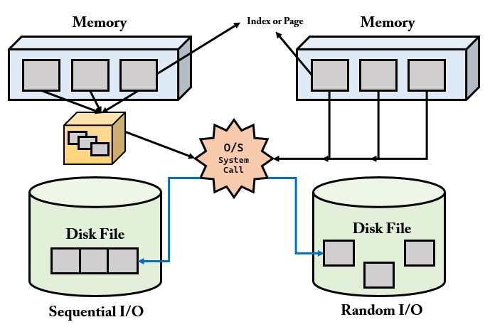

순차 I/O 는 3개의 페이지를 디스크에 기록하기 위해서 시스템 콜을 한 번만 요청한 반면에, 랜덤 I/O 는 세 번을 요청하였다.
즉, 디스크에 기록할 위치를 찾기 위해 순차 I/O 는 `디스크 헤더`를 한 번 움직였고, 랜덤 I/O 는 헤드를 세 번 움직인 것이다.

디스크에 데이터를 쓰고 읽는 데 걸리는 시간은 디스크 헤더를 움직여서 읽고 쓸 위치로 옮기는 단계에서 결정된다. 따라서 위 경우 순차 I/O 가 랜덤 I/O 보다 세 배가량 빠르다고 볼 수 있다.

데이터베이스에서는 대부분 데이터를 빈번하게 읽고 쓰기 때문에, 랜덤 I/O 의 부하를 줄여주고자 MySQL 에서는 InnoDB 버퍼 풀 등의 기능이 내장된 것이다.

> InnoDB 버퍼 풀 : 변경된 데이터를 디스크에 반영하기 전까지 잠시 버퍼링하는 공간
> 참고. 인덱스 레인지 스캔은 데이터를 읽기 위해 주로 `랜덤 I/O` 를 사용하고, 풀 테이블 스캔은 `순차 I/O` 를 사용한다. 그래서 큰 테이블의 레코드를 대부분 읽는 작업에서는 인덱스를 사용하지 않고 풀 테이블 스캔을 사용하도록 유도할 때도 있다. 이는 순차 I/O 가 랜덤 I/O 보다 훨씬 빨리 많은 레코드를 읽어올 수 있기 때문인데, 이런 형태는 OLTP(Online Transaction Processing) 성격의 웹 서비스보다는, OLAP(Online Analytical Processing) 형태의 데이터 웨어하우스나 통계 작업에서 자주 사용된다.

### 쿼리 튜닝의 목적

쿼리를 튜닝하는 목적은 __랜덤 I/O 를 쿼리를 처리하는 데 꼭 필요한 데이터만 읽도록 쿼리를 개선하는 것__ 이다.

## 인덱스란?

인덱스는 데이터베이스 분야에 있어서 테이블에 대한 동작의 속도를 높여주는 자료 구조를 일컫는다. 

책을 예로 들면, 책의 마지막 페이지를 보면 `찾아보기`가 존재하는데, 이게 데이터베이스의 인덱스와 유사하다고 볼 수 있다.
`Key 와 Value 형태`로 이루어져있다. 또한 찾아보기의 내용이 많아지면 원하는 키워드에 대한 페이지를 찾는데 시간이 오래 걸리므로 ㄱ,ㄴ,ㄷ 순으로 `정렬`이 되어있다. DBMS 에서의 인덱스도 마찬가지로 컬럼의 값을 주어진 순서로 미리 정렬해서 보관한다. 프로그래밍 언어의 자료구조로 따지면 `SortedList` 성질을 띄고 있다고 보면된다. SortedList 는 매번 값을 넣을 때 마다 정렬을 해야하므로, 테이블에 인덱스가 많다면 CUD 에 대한 처리 속도가 느려진다. 반면, 읽기 작업에 대한 속도는 빠르다. 즉, 인덱스는 CUD(INSERT), UDPATE, DELETE) 에 대한 성능을 희생하고, 그 대신 데이터의 읽기 속도를 높이는 기능이다.

정리하면 다음과 같다.

- __인덱스(Index)__
    - 책의 찾아보기와 같다.
    - Key 와 Value 형식으로 이루어져 있다.
    - SortedList 로 구현되어있기 때문에 인덱스를 생성할 때 마다, 내부적으로 정렬 되어 저장되어있다.
    - INSERT, UPDATE, DELETE 에 대한 성능을 희생하고, READ 에 대한 성능을 높이는 기능이다.

인덱스는 역할, 중복 값의 허용 여부, 데이터를 관리하는 방식 등에 따라 종류를 구분할 수 있다.

## Primary Key vs Secondary Key

인덱스를 `역할별로 구분`하면 PK 와 SK 로 나눌 수 있다. 

PK 는 우리가 흔히 알고 있는 `식별자`를 의미한다. 테이블에서 PK 를 생성하면 Index 에 PK 에 관한 인덱스가 생긴것을 볼 수 있다. 즉, PK 는 레코드를 대표하는 컬럼의 값으로 만들어진 인덱스를 의미한다.

PK 를 제외한 나머지의 인덱스들을 Secondary Index 라고 한다.

> 참고. PK 접근 시 데이터 접근에 소요되는 비용은 `O(logN)`이고, Secondrary Key 에 소요되는 비용은 `2 * O(logN)` 이다.

## Unique vs Non-Unique

데이터의 `중복 허용 여부로 구분`하면 유니크 인덱스와 유니크 하지 않은 인덱스로 나눌 수 있다. 

인덱스가 유니크한지 아닌지는 DBMS 의 쿼리를 실행해야 하는 옵티마이저한테 중요하다. 값이 유니크 하면 유니크 인덱스에 대해 동등 조건(Equal, =)으로 검색한다는 것을 옵티마이저에게 알려줄 수 있다.

> 동등 조건(Equal, =)으로 검색한다는 것 : 항상 1건의 레코드만 찾으면 더 이상 찾지 않아도 된다는 의미

## B-Tree Index

인덱스를 데이터 저장 방식(알고리즘)별로 구분하면 대표적으로 `B-Tree`, `Hash`, `Fractal-Tree` 가 있다.

B-Tree Index 는 가장 오래전에 도입된 알고리즘이며, 가장 많이 사용되고 있는 인덱스 알고리즘이다. B-Tree Index 는 컬럼의 값을 변경하지 않고, 원래의 값을 이용해 인덱싱하는 알고리즘이다.

> B-Tree 의 B 는 Binary 가 아닌 Balanced 를 의미한다.

__트리의 가장 큰 강점은 데이터 접근 퍼포먼스가 데이터 증가량에 따라서 결코 선형적으로 증가하지 않는다는 점이다.__

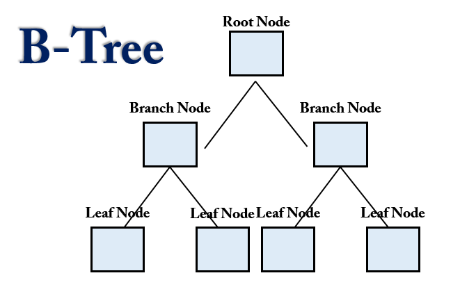

- __B-Tree Index__
    - `컬럼의 값을 변경하지 않고`, 원래의 값을 이용해 인덱싱하는 알고리즘
    - Root Node, Branch Node(중간 노드), Leaf Node 로 구성
    - 각 노드는 `페이지`를 의미한다.
        - InnoDB 에서 페이지(Page)란 디스크에 데이터를 저장하는 기본 단위를 의미한다.
        - 페이지(Page) 또는 블록(Block)이라고 부른다.
        - 디스크의 모든 읽기 및 쓰기 작업의 최소 단위가 된다.
        - InnoDB Buffer Pool 에서 데이터를 버퍼링하는 기본 단위이기도 하다.
        - 인덱스도 페이지 단위로 관리된다.
        - 모든 페이지의 크기는 `16KB` 로 고정되어 있다.
    - Root Node 와 Branch 노드는 `인덱스 레코드`와 `자식 노드 주소`를 가지고 있으며 Leaf Node 는 `인덱스 레코드`와 `레코드 주소`를 가지고 있다.
        - 인덱스 레코드란 First Name 이라는 컬럼에 Index 가 걸려있을 때, 해당 인덱스에 대한 레코드 값들을 의미한다.
    
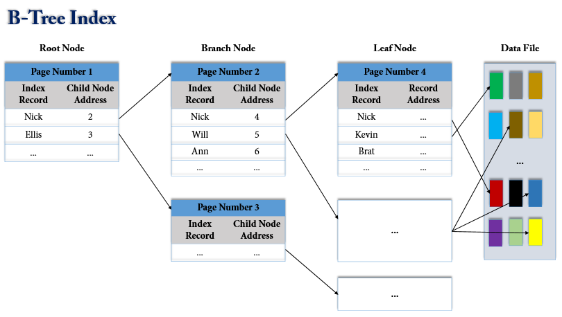

Leaf Node 의 레코드 주소는 실제 테이블에 저장되어 있는 레코드를 가리키게 된다. 레코드 주소는 DBMS 의 종류나 MySQL 의 스토리지 엔진에 따라 달라진다. Oracle 은 물리적인 레코드 주소가 저장되고, MyISAM 은 내부적인 레코드 아이디가 저장되고, InnoDB 는 PK 가 레코드 주소로 사용된다.

```
ID   | FISRT_NAME | LAST NAME | BIRTHDATE ...
1001 | Nick       | Clo       | 19901231  ...
```

그림 처럼 인덱스의 키값은 정렬이 되어있는 반면에 데이터 파일들은 랜덤하게 저장되어있다. 데이터가 삭제가 되지 않는다면 데이터 파일들에 순차적으로 저장되겠지만, 데이터 삭제가 일어나면 DBMS 는 빈 공간에 다음 INSERT 를 통한 데이터를 저장하게 끔 재활용하도록 설계되기 때문에 항상 INSERT 된 순서로 저장되는 것은 아니다.

MySQL InnoDB 에서는 데이터 파일에 레코드들이 클러스터되어(Clustered) 디스크에 저장되므로 기본적으로 PK 순서대로 정렬되어 저장된다. DBMS 에서는 클러스터링 기능이 선택사항이지만 InnoDB 에서는 디폴트로 클러스터링 테이블이 생성된다.

> 클러스터링 : 비슷한 값들 끼리 최대한 모아서 저장하는 방식

### MySQL 에서 B-tree 를 사용하는 이유

트리 종류에는 이진 트리(Binary-Tree), 레드 블랙 트리, B-tree 등 다양한 종류들이 존재하는데 MySQL 에서 B-tree 를 사용하는 이유는 B-tree 자체가 데이터가 디스크에 저장될때 사용하도록 
설계 되어진 트리이다. 디스크에 삽입, 삭제, 읽는 시간은 RAM 보다 훨씬 느리다. 데이터베이스의 I/O 는 디스크를 통해 물리적인 작업을 거치기 때문에 대용량의 데이터를 조회할 때에도 성능이 너무 낮아지지 않도록 하는 것이 중요하다. 

이진 트리는 최악의 경우 O(N) 을 가진다. 레드 블랙 트리 자체는 효율적이지만 대용량 데이터의 경우 트리의 높이를 제어할 수 없다. 데이터를 조회하기 위해서는 트리 노드 루트 -> 리프 -> 데이터 조회 방식으로 조회되기 때문에 트리의 높이가 높다면 그 만큼 데이터를 조회하는데 시간이 많이 소모된다는 의미가 될 수 있다.

따라서, 데이터베이스 I/O 를 효과적으로 하기 위해서 B-tree 를 사용한다고 볼 수 있다.

> [레드 블랙 트리는 매우 효율적임에도, MySQL 에서 사용하지 않는 이유](https://cdmana.com/2021/12/202112240514366766.html)
>
> [MySQL 데이터베이스 인덱스가 B + 트리를 사용하도록 선택하는 이유는 무엇입니까?](https://developpaper.com/why-does-mysql-database-index-choose-to-use-b-tree/)
>
> [B-tree 와 Binary Tree 의 차이점](https://ko.gadget-info.com/difference-between-b-tree)

### 체인지 버퍼링(Change Buffering)

아래의 그림은 Insert Buffer 의 처리 방식을 나타낸다. B-Tree 인덱스에 인덱스 키 추가시 발생하는 동작 과정을 볼 수 있다.

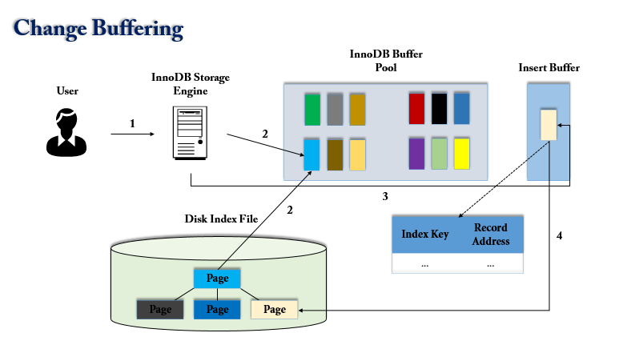

- (1). 사용자의 쿼리 실행
- (2). InnoDB Buffer Pool 에 새로운 키값을 추가해야할 페이지(B-Tree Leaf Node)가 존재한다면, 즉시 키 추가 작업 처리
- (3). InnoDB Buffer Pool 에 페이지가 없다면 Insert Buffer 에 추가할 키값과 레코드의 주소를 임시로 기록 해두고 작업 완료(사용자의 쿼리는 실행 완료 됨)
- (4). 백그라운드 작업으로 인덱스 페이지를 읽을 때마다 Insert Buffer 에 머지해야할 인덱스 키값이 있는지 확인한 후, 있으면 머지(B-Tree 에 인덱스 키와 주소를 지정)
- (5). 데이터베이스 서버 자원의 여유가 생기면 MySQL 서버의 인서트 버퍼 머지 스레드가 조금씩 인서트 버퍼에 임시 저장된 인덱스 키와 주소 값을 머지시킴

> MySQL 5.1 이하 버전에서는 INSERT 에 의한 인덱스 키 추가 작업 및 버퍼링 지연 처리를 할 수 있었는데 MySQL 5.5 이상 버전 부터 INSERT, DELETE 등 에 의한 작업까지 지원하게 되었다. 따라서 이름도 인서트 버퍼링에서 체인지 버퍼링으로 바뀌었다. MySQL 5.5 이상 버전 부터는 DBA 가 innodb_change_buffering 설정 값을 이용해서 키 추가 작업과 삭제 작업 중 어느것을 먼저 지연 처리할지 설정해야 한다.

### 트리 탐색(Tree traversal)

B-Tree Index 를 이용한 인덱스 탐색 작업은 루트 노트부터 시작하여 브랜치 노드를 거쳐 리프 노드까지 이동하면서 비교 작업을 수행한다. 이러한 과정을 트리 탐색(Tree traversal)이라고 한다.

B-Tree 는 컬럼의 값을 변경하지 않고 원래 값을 이용하므로, 함수나 연산에 의한 결괏값을 이용하여 정렬하거나 검색하는 경우에는 B-Tree 를 사용할 수 없다.

### 레코드 단위 잠금

- InnoDB Storage Engine 은 레코드 잠금을 수행하여 인덱스를 잠근 후 해당 테이블 레코드들을 잠그는 방식인 `레코드 단위 잠금` 방식으로 구현되어 있다.
- 따라서, UPDATE 나 DELETE 를 실행할 때 테이블에 적절히 사용할 인덱스가 없다면 많은 레코드들이 잠기게 된다.
    - 경우에 따라서 테이블 풀 스캔을 통해 모든 PK 인덱스가 잠길 수 있다. 
- `Mutex Lock` 이 과도하게 잡히면 적은 데이터 셋에도 불구하고 DB 자원 사용 효율이 떨어지게된다.
    - 이러한 현상을 해결하기 위해서 InnoDB 에서는 `Adaptive Hash Index` 라는 기능이 있다.

> [InnoDB Mutex and Read/Write Lock Implementation](https://dev.mysql.com/doc/internals/en/innodb-mutex-rwlock-implementation.html)

#### Example

```
- User 테이블의 총 레코드 개수는 5000 개
- 성씨 컬럼이 '홍'인 레코드는 300 개 존재
- 성씨 컬럼이 '홍'이고, 이름 컬럼이 '길동'인 레코드는 1개 존재
- 성씨 컬럼에는 idx_성씨 인덱스가 걸려있음
```
```
UPDATE USER SET 취미 = '축구' WHERE 성씨 = '홍' AND 이름 = '길동';
```

여기서는 `idx_성씨` 인덱스를 사용하게 되고, 레코드 자체를 잠그는 것이 아니라 사용된 인덱스 레코드를 잠그는 것이기 때문에 성이 '홍'인 레코드들이 잠기게 된다. 이것을 `인덱스 레인지 스캔`이라고 한다. 
만약에 idx_성씨 인덱스가 없었더라고 하면, 자동으로 생성된 PK 를 사용하는데 이때 `테이블 풀 스캔`을 하게 되어 검색에 사용된 모든 PK 인덱스가 잠기게 된다. 만약, 성씨와 이름에 대한 복합 인덱스를 생성했더라면 성과 이름이 일치하는 1개의 레코드만 잠기게 되었을 것이다.

이렇게 인덱스를 어떻게 설정 하는지에 따라 레코드의 잠금 범위가 달라지게 되니 InnoDB 에서는 인덱스를 신중히 설정하는것이 중요하다.

### 인덱스 레인지 스캔

인덱스 레인지 스캔은 인덱스 풀 스캔 보다 빠르다. __인덱스 레인지 스캔은 검색해야 할 인덱스의 범위가 결정됐을 때 사용하는 방식이다.__

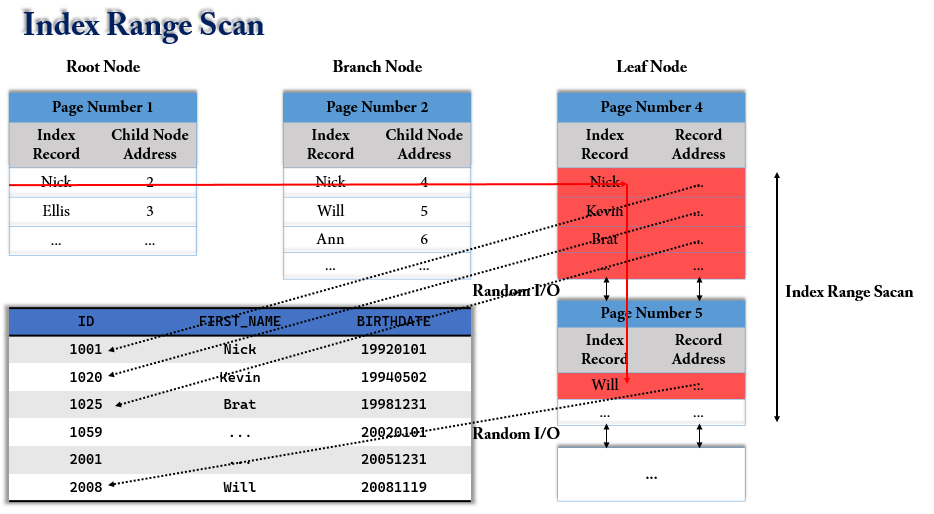

- 루트 노드 -> 브랜치 노드 -> 리프 노드 순으로 탐색
- 리프 노드에서 시작할 지점을 찾으면, 그 다음 부터는 리프 노드의 레코드만 순서대로 읽으면 된다.
- 리프 노드의 끝까지 읽으면 리프 노드간의 링크를 통해 다음 리프 노드를 찾아서 스캔한다.
- 최종적으로 스캔 종료 지점을 찾으면 지금까지 읽은 레코드를 사용자에게 반환하고 쿼리를 종료한다.
    - 데이터 파일에서 레코드를 읽어올 때 레코드 한 건 마다 `랜덤 I/O`가 발생한다.
    - 그래서 인덱스를 통해 데이터를 읽는 작업은 비용이 많이 든다고 하는 것이다.
    - 인덱스를 통해 읽어야 할 데이터가 전체의 20% ~ 25% 를 넘으면 인덱스를 사용하지 않고 테이블 스캔 방식이 더 효율적인 처리 방식이 된다.
- 인덱스 레인지 스캔은 MySQL 에서 `실행 계획`을 볼때 `range` 로 나와있다.
- ```sql
  EXPLAIN SELECT ~~
  ```
- 주로, `<`, `>`, `IS NULL`, `BETWEEN`, `IN`, `LIKE` 등의 연산을 이용하여 인덱스를 검색할 때 사용된다.
- 보통, DBA 랑 얘기할 때 `const, ref, range` 접근 방법을 구분해서 얘기하는 경우는 거의 없고 이 세가지를 통틀어서 인덱스 레인지 스캔 또는 레인지 스캔이라고 말하는 경우가 많다고 한다.

#### 예시

```sql
-- 인덱스 생성
create index member_info_idx on member(lastname, firstname, age);

-- READ
explain select * from member where `LASTNAME` = 'BAEK';
```

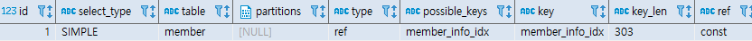

- Index Range Scan 을 사용하려면 선두 컬럼을 가공하지 않은 상태로 조건절에 사용해야 한다.

### 인덱스 풀 스캔

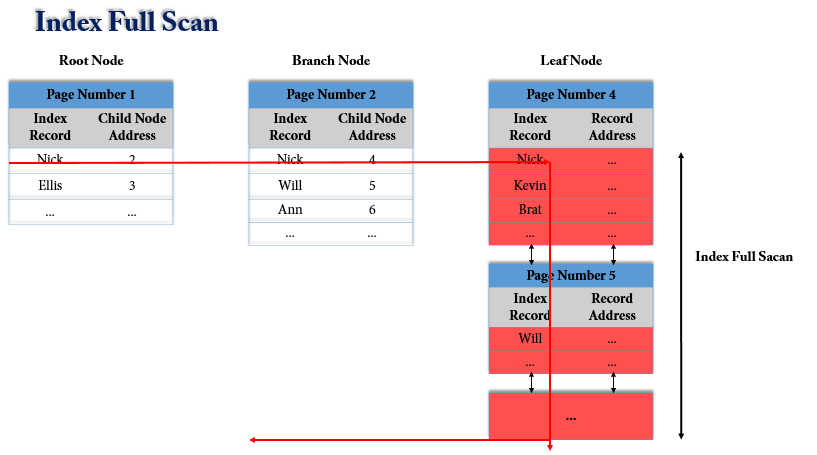

- 인덱스 풀 스캔은 말 그대로 인덱스의 처음부터 끝까지 스캔하는 방식을 말한다.
- 리프 노드의 시작 혹은 끝으로 이동하여 리프 노드를 연결하는 LinkedList 를 따라서 처음 부터 끝까지 탐색하는 방식이다.
- 인덱스의 크기는 테이블의 크기보다 훨씬 작기 때문에 테이블 풀 스캔보다 빠른 방식이다.

#### 예시

```sql
-- 인덱스 생성
create index member_info_idx on member(lastname, firstname, age);

-- READ
SELECT * FROM MEMBER WHERE FISRTNAME = 'JungHo';
```

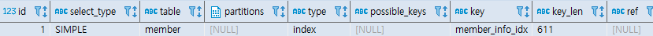

### 다중 컬럼 인덱스

인덱스 레인지 스캔과 인덱스 풀 스캔의 예제에서 생성한 인덱스를 `다중 컬럼 인덱스`라고한다. 실제로 현업에서도 여러 컬럼을 사용하여 인덱스를 생성하는 경우가 많다.

다중 컬럼 인덱스를 사용할 경우 리프 노드에서 인덱스 레코드가 어떻게 정렬이 될까?

```sql
-- 인덱스 생성
create index member_info_idx on member(groupno, lastname, firstname, age);
```

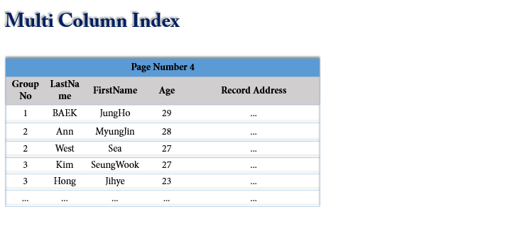

두 번째 컬럼은 첫 번째 컬럼의 정렬에 의존하고, 세 번째 컬럼은 두 번째 컬럼의 정렬에 의존한다. JiHye 의 Age 가 더 빠르더라도(숫자 값이 낮다는 의미) 첫 번째 ~ 세 번째 컬럼의 정렬 순서가 우선순위가 되기 때문에 맨 마지막에 위치하게 된다.

__따라서, 다중 컬럼 인덱스를 생성할때 컬럼의 위치(순서)가 상당히 중요하기 때문에 신중하게 결정해야 한다.__

### 인덱스 정렬 및 스캔 방향

인덱스 키값은 항상 오름차순으로 정렬된다. 그리고 인덱스를 아래 부터 읽을지 위에서 부터 읽을지 정하는 것은, 쿼리에 따라서 옵티마이저가 실행 계획을 만들어 그 계획에 따라 결정된다.

## 해시 인덱스(Hash Index)

해시 인덱스는 InnoDB 에서 `어댑티브 해시 인덱스(Adaptive Hash Index)` 로 사용되기도 하고, 오라클에서는 조인에 사용된다.

해시 인덱스는 B-Tree 인덱스와 달리 버켓으로 구성된다.

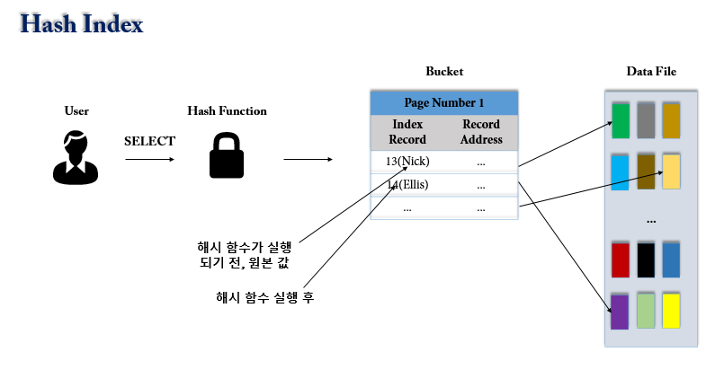

사용자가 검색하고자 하는 값을 주면 해시 함수를 거쳐서 찾고자 하는 키값이 포함된 버켓(Bucket)을 알아낼 수 있다. 그리고 그 버켓 하나만 읽어서 실제 레코드가 저장된 위치를 바로 찾을 수 있다.

따라서, 트리 구조인 B-Tree 보다 빠른 결과를 도출할 수 있다.

### 왜 index 생성 시 b-tree를 사용하는지? hash table이 더 효율적이지 않은지?

- SELECT 질의 조건에는 부등호 연산(`<>`)도 포함
- hash table은 동등 연산에 특화된 자료구조이기 때문에 부등호 연산 사용 시 문제 발생

### InnoDB Adaptive Hash Index

위 `레코드 단위 잠금`에서 잠깐 다룬 내용처럼, InnoDB 는 B-Tree 를 사용하는데, 락으로 인한 자원 사용 효율이 떨어지는 현상을 해결하기 위해서 InnoDB Adative Hash Index 기능을 도입했다고 배웠다.

InnoDB Adative Hash Index 는 이름에서 볼 수 있듯이, Hash Index 로 구현되어있으며, `Adaptive` 라는 단어에서 예상할 수 있듯이, 모든 값들이 해시로 생성되는 것이 아니라, `자주` 사용되는 데이터 값만 내부적으로 판단하여 상황에 맞게 해시 값을 생성한다.

Adative Hash Index에 할당되는 메모리는 전체 `Innodb_Buffer_Pool_Size` 의 `1/64` 만큼으로 초기화된다.

이 기능은 껏다 켰다 할 수 있다.

- 켜기
    - `set global innodb_adaptive_hash_index = 1;`
- 끄기
    - `set global innodb_adaptive_hash_index = 0;`
- 통계 정보 확인하기
    - `show global status like 'Innodb_adaptive_hash%';`

[Adaptive Hash Index 의 효과](https://tech.kakao.com/2016/04/07/innodb-adaptive-hash-index/)가 궁금하면 해당 링크를 통해 확인할 수 있다.

## 클러스터링 인덱스

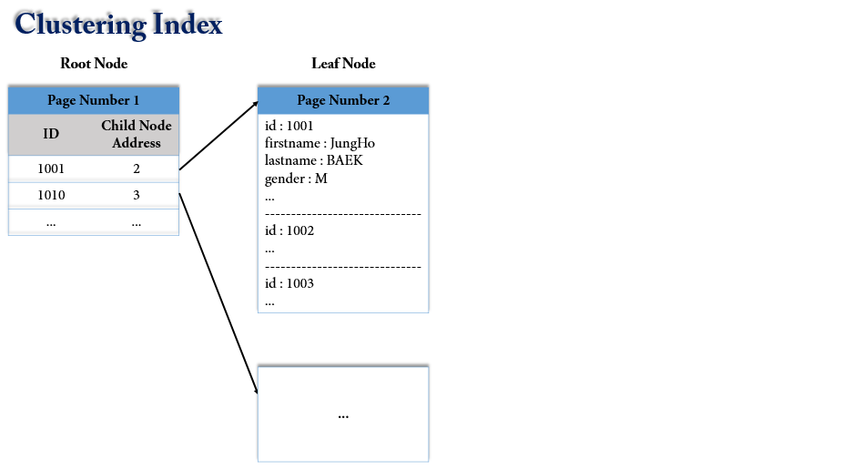

- __클러스터(군집화)__
    - 여러 개를 하나로 묶는다는 의미로 사용
- __클러스터링 인덱스__
    - 값이 비슷한 것들을 묶어서 저장하는 형태
    - `PK 값이 비슷한 레코드끼리 묶어서 저장하는 것`
        - 테이블의 PK 에 대해서만 적용되는 내용이다.
        - MySQL 에서 PK 를 생성하면 자동으로 인덱스가 생성되는데 해당 인덱스를 `클러스터링 인덱스`라고 한다.
        - 테이블당 하나만 생성 가능하다.
        - 따라서, PK 에 의해 레코드의 저장 위치가 결정되며 PK 가 변경되면 저장 위치도 바뀐다.
        - PK 를 클러스터 키라고도 부르며, 클러스터링 인덱스는 테이블 레코드의 저장 방식이라고 볼 수 있다. 
        - 따라서, InnoDB 테이블을 `클러스터 테이블`이라고도 한다.   
    - MySQL 에서 InnoDB 와 ToKuDB 스토리지 엔진에서만 지원
    - `InnoDB 는 항상 클러스터링 인덱스로 저장된다.`
        - 즉, 테이블의 레코드가 PK 값으로 정렬되어 저장된다는 의미이다.
- __장점__
    - `공간 지역성이 좋기 때문에 PK 기반으로 범위 검색이 빠르다.`
    - InnoDB 의 모든 테이블은 클러스터링 인덱스로 구성되어있기 때문에, InnoDB 의 모든 보조 인덱스는 데이터 레코드의 주소 값으로 PK 를 가진다. 아래 그림을 보면 레코드 주소값에 PK 가 저장된 것을 볼 수 있다.
    - 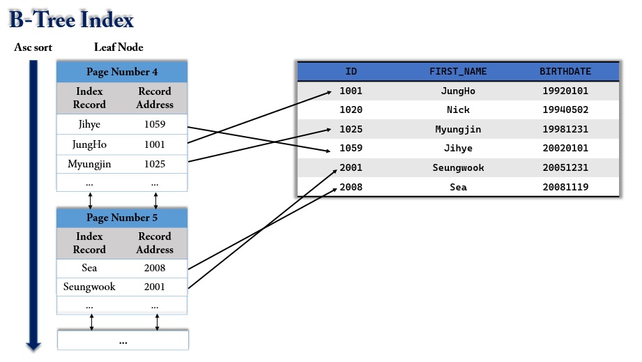
    - InnoDB 테이블에서 FIRST_NAME 컬럼 만으로 인덱스를 만들어도, 그 인덱스에 PK 가 같이 저장되는 효과를 낸다. 이로 인한 장점은 `커버링 인덱스`와 관련이 있는데, 여기서 다루진 않을 것이다. 그냥 이런게 있다라고만 알고 나중에 궁금하면 찾아보길 권한다.
- __단점__
    - `레코드의 저장이나 PK 의 변경이 느리다.`
        - Ex. PK 가 1 ~ 1001 까지 존재하는데 50 번째에 데이터를 INSERT 하려고하면 51 ~ 1001 까지 뒤로 한칸씩 밀어야 하기때문에 레코드의 저장이 느리다.
        - EX. ID 가 50 인 PK 가 800 으로 바뀌었으면 위치를 조정해줘야 할것이다.

B-Tree 와 달리 리프 노드에 레코드의 모든 컬럼들과 값이 저장되어있다. 즉, 리프 노드자체가 데이터이므로, 논 클러스터링 인덱스보다 검색 속도는 빠르다.

### InnoDB 테이블은 어떻게 클러스터 테이블로 구성될까?

1. 프라이머리 키가 있으면 PK 를 클러스터 키로 선택
2. NOT NULL 옵션의 유니크 인덱스 중에서 첫 번째 인덱스를 클러스터 키로 선택
3. 자동으로 유니크한 값을 가지도록 증가되는 컬럼을 내부적으로 추가한 후, 클러스터 키로 선택

따라서, PK 나 Unique Index 가 없으면 내부적으로 생성한 키를 사용하여 클러스터링 되기 때문에 해당 키가 사용자에 노출되지 않으므로, 클러스터링 인덱스의 혜택을 볼 수 없다.

### MySQL 에서 PK 를 인조키로 사용하고 Auto_Increment 를 사용하는 이유

예를들어, PK 가 주민등록번호로 잡혀있다고 해보자.

```java
@Id
private Long jumin;
```

PK 가 주민등록 번호로 잡게되면 `DB 성능 이슈`가 생길 수 있다. 왜 일까?

바로 클러스터링 인덱스의 특징을 떠올리면 되는데, 클러스터링 인덱스는 PK 의 등록, 변경에 있어 느리다고 하였다. 즉, AUTO_INCREMENT 로 되어있지 않으면 회원의 주민등록번호에 따라서 PK 위치 조정이 빈번하게 일어날 것이기 때문에 성능 이슈가 발생할 수 있다.

따라서, jumin 을 유니크 키로 잡고, PK 를 인조키로 생성하는 것이 좋다.

## 논 클러스터링 인덱스

- 논 클러스터링 인덱스는 클러스터링 인덱스에 비해서 검색 속도는 느린 반면에, CUD 속도는 빠르다.
- B-Tree 의 리프 노드 처럼 노드 자체가 데이터가 아니고, 리프 노드에서는 데이터가 위치하는 주소를 가지고 있는 형태.
- 사용자가 등록하는 아래와 같은 인덱스들이 논 클러스터링 인덱스에 속한다.

```sql
-- 인덱스 생성
create index member_info_idx on member(groupno, lastname, firstname, age);
```

> 클러스터 인덱스는 페이지를 알기 때문에 해당 페이지를 바로 펴는 것이고, 넌 클러스터 인덱스는 책 뒤의 찾아보기에서 원하는 내용과 페이지를 찾고 이동하는 것. 테이블 풀 스캔은 책을 처음부터 한장한장 넘기면서 원하는 내용을 찾는 것 이라고 생각하면 된다.
>
> 클러스터링 인덱스에 비해서 빠르다는거지, 인덱스 자체의 특징은 검색 속도를 올리고 CUD 성능을 조금 포기하는 것이라고 위에서 배웠다.

## Hint

Hint 란, SQL 문장에 특별한 키워드를 지정하여 옵티마이저에게 어떻게 데이터를 읽는 것이 효과적인지 알려주는 키워드를 의미한다.

MySQL 에서는 실제로 쿼리의 성능 개선을 위해 자주 사용되는 것이 4 ~ 5개 정도라고 한다. Hint 는 옵티마이저에게 영향을 미친다. 따라서 Hint 를 잘못 사용하면 옵티마이저가 SQL 을 알아서 최적화 해주는 것을 본인이 망치는 셈이 될 수도 있다.

- __사용 방법__
    - `SQL 문장의 일부로 사용하는 방식`
        - SELECT * FROM member USE INDEX (PRIMARY) WHERE id = 1001;
    - `주석 표기 방식`
        - SELECT * FROM member /*! USE INDEX (PRIMARY) */ WHERE id = 1001;

Oracle 과 같은 다른 DBMS 들은 Hint 를 주석으로 해석하는데, MySQL 은 SQL 의 일부로 해석하기 때문에 잘 못 사용하면 에러가 발생한다.

> 몇몇 TECH-INTERVIEW REPO 를 분석한 결과, 면접 질문으로 자주 나오는 녀석은 아닌것같다. 그리고 책의 내용을 봤을때 Index 파트 뒤의 실행 계획처럼 직접 테스트를 해야 효과적인 공부가 되는 부분이라 생각해서. 여느 TECH-INTERVIEW REPO 랑 비슷하게 Hint 의 정의와 사용방법에 대해서만 적었다.

## References

- [Real MySQL](http://www.yes24.com/Product/Goods/6960931)
- https://12bme.tistory.com/138
- https://helloltdcom.wordpress.com/2017/05/14/b-tree/
- [우기의 MySQL 아키텍처](https://www.youtube.com/watch?v=vQFGBZemJLQ&list=PLgXGHBqgT2TvpJ_p9L_yZKPifgdBOzdVH&index=4)
- https://m.blog.naver.com/PostView.naver?isHttpsRedirect=true&blogId=gglee0127&logNo=221336088285
- https://tech.kakao.com/2016/04/07/innodb-adaptive-hash-index/
- https://dev.mysql.com/doc/internals/en/innodb-mutex-rwlock-implementation.html
- https://fierycoding.tistory.com/78
