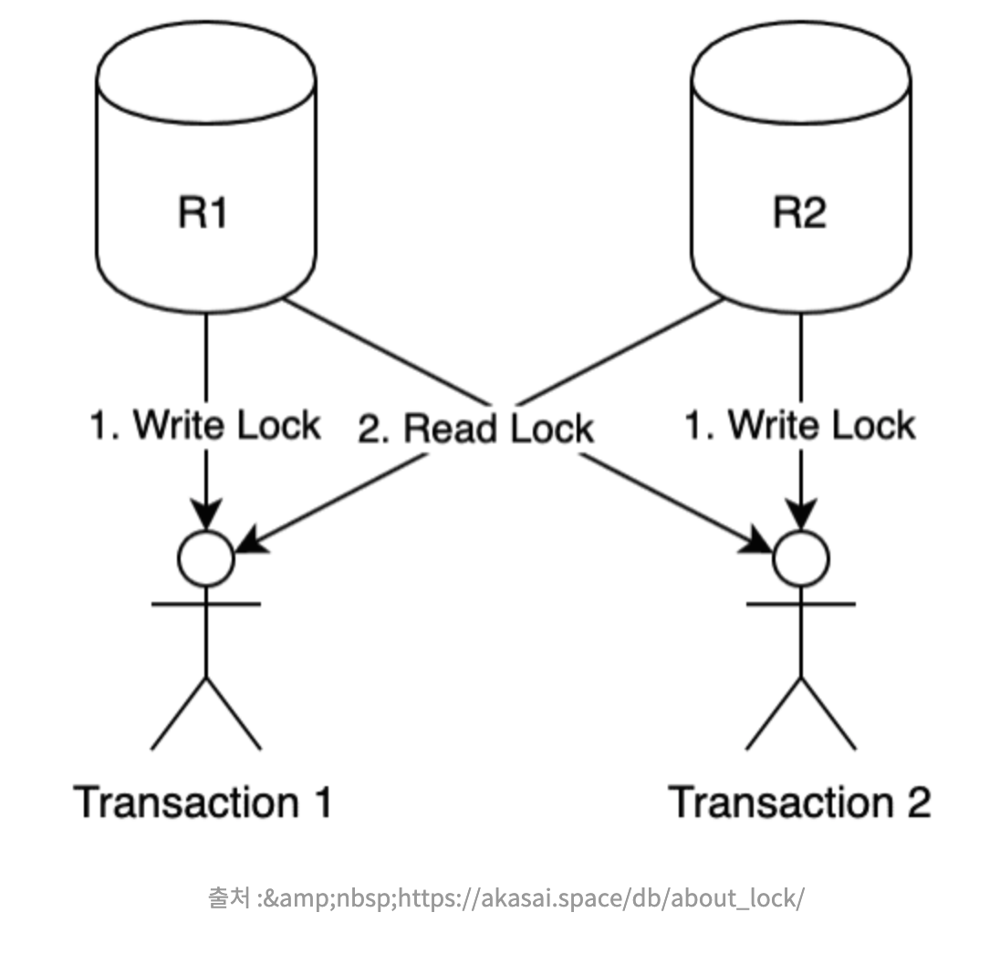
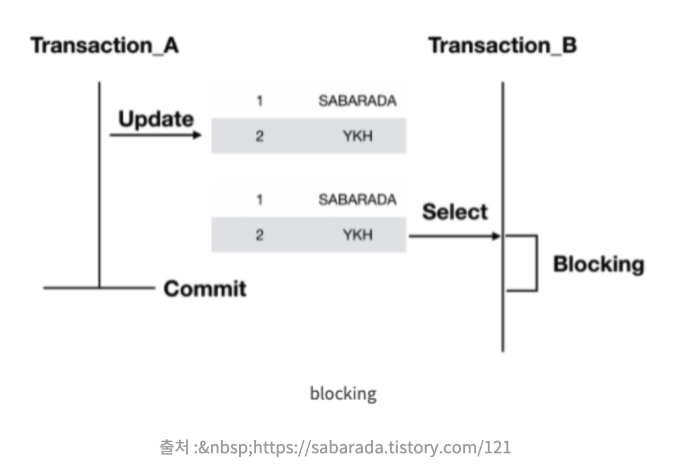
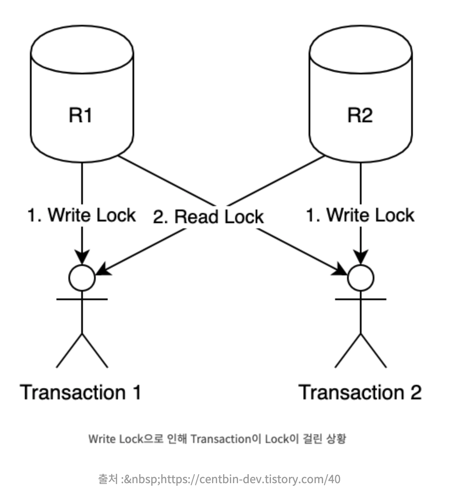

## DB Lock

Database는 여러 곳에서 동시에 접근할 수 밖에 없는 구조이다. 동시에 접근시 데이터가 오염될 가능성이 있기 때문이다. Database는 데이터의 일관성과 무결성을 유지하기 위해 Lock을 사용한다.

> 데이터의 일관성

: 어떤 데이터가 서로 모순 없이 일관되게 일치한다. 트랜잭션이 실행을 성공적으로 완료하면 모순 없이 일관성 있는 데이터베이스 상태를 보존한다.

> 데이터의 무결성

: 어떤 데이터의 값이 정확한 상태로, Database에 저장된 데이터의 일관성과 정확성을 유지하기위한 제약조건이다.

Lock은 트랜잭션 처리의 순차성을 보장해주는 기능을 제공하며, 하나의 트랜잭션이 완벽하게 끝날때까지 다른 요청을 막는다.

## Lock의 종류



#### 1) Shared Lock (=Read Lock)

공유락은 데이터를 읽을때 사용하는 Lock이다. Read Lock 끼리는 데이터의 일관성과 무결성을 해치지 않기 때문에 동시에 접근이 가능하다. 즉, 리소스를 다른 사용자가 동시에 읽을 수 있게 하되 변경은 불가능하다. 만약 특정 데이터에 Shared Locak 이 걸려있다면, 아래 Exclusive Lock을 걸 수 없고, 여러 Shared Lock은 동시에 적용될 수 있다.

#### 2) Exclusive Lock (=Write Lock)

베타락은 데이터를 변경할대 사용하는 Lock이다. 하나의 트랜잭션이 완료될때까지 유지되며, 베타락이 끝날때까지 어떠한 접근도 허용되지 않는다. Exclusive Lock이 걸리면 Shared Lock을 걸 수 없다. Exclusive 상태의 데이터에 대해 다른 트랜잭션이 Exclusive Lock을 걸수 없다.

## Lock 단위

> 1) Row Level

Row에만 락을 설정한다. 가장 많이 사용되는 Lock이다.

> 2) Page Level

Row가 담긴 Page 에만 락을 설정한다. 같은 페이지에 존재하는 모든 Row는 모두 잠긴다.

> page란?  
> SQL Server : 데이터가 8KB 단위의 블럭을 단위로 저장하는데 이를 페이지라고 한다.  
> Oracle : '블록'이라는 명칭이며, 2KB, 4KB, 8KB 등 블록의 크기가 다양하게 존재한다.

> 3) Table Level 

Table 과 Index 모두에 락을 설정한다. 전체 테이블에 대한 데이터 변경이 있을 경우 사용한다. 테이블을 제어하는 DDL 구문을 사용할때 Lock이 걸린다고 하여, DDL Lock 이라고도 한다.

> 4) Database Level

Database의 복구나 스키마 변경시 락을 설정한다. 1개의 세션이 하나의 Database의 데이터에 접근할 수 있다. DB 전체에 영향이 있는 DB 업데이트와 같은 작업에만 사용한다.

> 5) Column Level

컬럼 기준으로 Lock이 걸린다. Lock 설정 및 해제에 리소스가 많이들어 잘 사용하지 않는다.

## 블로킹 (Blocking)

Lock 간의 경합(Race Condition)이 발생하여 특정 Transaction이 작업을 진행하지 못하고 멈춰선 상태를 말한다. 공유락끼리는 블로킹이 발생하지 않지만, 베타락은 블로킹을 발생시킨다.

> 1) Shared Lock + Exclusive Lock
> 2) Exclusive Lock + Exclusive Lock



#### 블로킹을 피하는 방법

1) 한 트랜잭션의 길이를 너무 길게하면 경합의 확률을 올린다.

2) 처음부터 설계할 때 같은 데이터를 갱신하는 트랜잭션이 동시에 수행되지 않도록 해야한다.

3) 트랜잭션 격리성 수준을 불필요하게 상향 조정하지 않는다.

\- 격리성 : 실행중인 트랜잭션의 중간결과를 다른 트랜잭션이 접근할 수 없다. 격리성에는 레벨이 존재한다.

| Level | 내용 |
| --- | --- |
| Dirty Read | 다른 트랜잭션에 의해 수정됬지만 아직 커밋되지 않은 데이터를 읽는 것 |
| Non-Repeatable Read | 한 트랜잭션 내에서 같은 Key를 가진 Row를 두번 읽었는데, 그 사이에 값이 변경되거나 삭제되어 결과가 다르게 나타나는것  |
| Phantom Read | 한 트랜잭션 내에서 같은 쿼리를 두번 수행했는데, 첫번째 쿼리에서 없던 유령(Phantom) 레코드가 두번째 쿼리에서 나타나는것 |

4) 쿼리를 오랜시간 잡아두지 않도록 적절한 튜닝을 진행한다.

#### 블로킹 설정

```
SELECT * FROM TEST

SET LOCK_TIMEOUT 10000
GO

- set lock_timeout 0 : 블로킹이 걸려있으면 곧바로 종료
- set lock_timeout -1 : 블로킹이 걸려있으며 해지될 때까지 무작정 기다림(기본값)
```

## 데드락 (Dead Lock)

두 트랜잭션이 각각 Lock을 설정하고, 서로의 Lock에 접근하여 값을 얻어오려고 할때 서로의 Lock으로 인해 양쪽 트랜잭션이 영원히 처리되지 않는 상태이다. 상대방 Lock이 끝나야 원하는 데이터를 가져오는데 바라보고 있는 서로의 Lock이 같은 상태가 되다보니 영원히 끝나지 않은 상황이 발생하게된다.

> (상황 예시)
> 1) Shared Lock + Exclusive Lock  
     > \= 트랜잭션 A가 Shared Lock을 설정하고 sleep 되었을때, 트랜잭션 B가 해당 데이터에 Exclusive Lock을 걸려고 하면 무기한 기다려야하는 교착상태에 빠지게된다. 
>
> 2) Exclusive Lock + Exclusive Lock  
     > \= 트랜잭션 A에서 Exclusive Lock을 걸었을때 트랜잭션 B에서도 다른 데이터에 Exclusive Lock을 걸었다. 이 경우 서로의 Lock된 데이터에 접근하려고할 때 기존의 Lock이 해제될 때까지 기다리게된다.



#### 교착상태 해결방안

1) Dead Lock이 감지되면 둘 중 하나의 트랜잭션을 강제 종료한다.

실제로, Oracle 에서는 데드락이 감지되면 한쪽 Transaction을 강제로 풀어버린다. 이렇게 되면 하나의 트랜잭션A의 마지막 실행 내용에 오류가 발생되고 커밋이 발생되도록 유지한다. 또다른 트랜잭션 B는 아직 대기중이며, 트랜잭션 A의 커밋을 기다린다.

2) Dead Lock 방지를 위해 접근 순서를 동일하게 하는 것이 중요하다. 접근 순서 규칙을 정할 필요가 있다.

```
SET DEADLOCK_PRIORITY
```

## 블로킹 vs Dead Lock

블로킹은 락이 걸린 상황에서 먼저 자원을 점유한 프로세스가 다른 프로세스의 접근을 막는 행위(Lock들 간의 경합)이고, Dead Lock은 트랜재 서로 점유하기 위한 두 프로세스간의 전쟁이라고 이해하자.

## Reference

[https://centbin-dev.tistory.com/40](https://centbin-dev.tistory.com/40)

[https://sabarada.tistory.com/117](https://sabarada.tistory.com/117)

[https://akasai.space/db/about\_lock/](https://akasai.space/db/about_lock/)

[https://datacodingschool.tistory.com/100](https://datacodingschool.tistory.com/100)