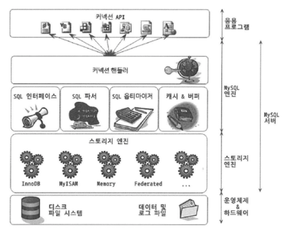
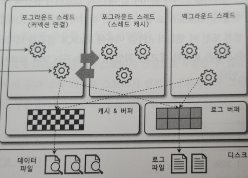

# MySQL 아키텍처

MySQL 서버는 사람의 머리 역할을 담당하는 `MySQL 엔진`과 손발 역할을 담당하는 `스토리지 엔진`으로 구분할 수 있다.

스토리지 엔진은 핸들러 API를 만족하면 누구든지 스토리지 엔진을 구현해서 MySQL 서버에 추가해서 사용할 수 있다.



MySQL 은 C API 부터 JDBC, ODBC, .NET 의 표준 드라이버를 제공한다.

이러한 드라이버를 이용하여 C/C++ ,  자바, 펄, 파이썬, 루비나 .NET, 코볼까지 모든 언어로 MySQL 서버에서 쿼리를 사용할 수 있다.


## 1. MySQL 엔진

MySQL 엔진은 클라이언트로부터 접속 및 쿼리 요청을 처리하는 커넥션 핸들러와 SQL 파서, 옵티마이저가 중심을 이룬다.

또한, MySQL 은 표준 SQL (ANSI SQL) 문법을 지원하기 때문에 표준 문법에 따라 작성된 쿼리는 다른 DBMS 와 호환되어 실행할 수 있다.

<br>
<br>

## 2. 스토리지 엔진

실제 데이터를 디스크 스토리지에 저장하거나 디스크 스토리지로부터 데이터를 읽어오는 부분은 스토리지 엔진이 전담한다.

MySQL 서버에서 MySQL 엔진은 1개이지만, 스토리지 엔진은 여러 개를 동시에 사용할 수 있다.


아래 SQL문은 스토리지 엔진을 InnoDB 엔진을 사용하도록 정의한 것을 말한다.

이후, test_table의 모든 읽기 작업이나 변경 작업은 정의된 스토리지 엔진이 처리한다.

```
CREATE TABLE test_table (fd1 INT, fd2 INT) ENGINE=INNODB;
```

InnoDB 스토리지 엔진은 성능 향상을 위해 InnoDB 버퍼 풀과 같은 기능을 내장하고 있다.

InnoDB는 플러그인이다. 플러그인 형태로 스토리지 엔진을 지원한다.

<br>
<br>

## 3. 핸들러 API

MySQL 엔진 내에 있는 쿼리 실행기에서 데이터를 쓰거나 읽어야 할 때는 MySQL 엔진에서 각 스토리지 엔진에 쓰기 또는 읽기를 요청하는데, 이러한 요청을 핸들러 API 요청이라 하고, 여기서 사용되는 API를 핸들러 API 라고 한다.

InnoDB 스토리지 엔진 또한 이 핸들러 API를 이용해 MySQL 엔진과 데이터를 주고받는다.

이 핸들러 API를 통해 얼마나 많은 작업이 있었는지는 아래의 명령어를 사용해서 알 수 있다.

```
SHOW GLOBAL STATUS LIKE 'Handler%';
```

출력 예시

```
| Variable_name   | Value |
-------------------------
| Handler_write   | 840   |
| Handler_rollback| 12    |
---------------------------
```

스토리지 엔진뿐만 아니라, 다양한 MySQL 서버의 기능을 커스텀 확장하기 위해선 플러그인 API를 사용하거나 완전히 새로운 기능을 플러그인을 이용해 구현할 수 있다. 플러그인에 대한 정보는 MySQL 메뉴얼을 참조하면 된다.

<br>
<br>

## 4. MySQL 스레딩 구조




MySQL 서버는 프로세스 기반이 아니라 스레드 기반으로 작동한다.

크게 포그라운드 스레드와 백그라운드 스레드로 구분할 수 있다.


MySQL 서버에서 실행 중인 스레드의 목록은 performance_schema 데이터베이스의 threads 테이블을 통해 확인할 수 있다.

```
SELECT thread_id, name, type, processlist_user, processlist_host
FROM performance_schema.threads ORDER BY type, thread_id;
```

출력 예시

```
| thread_id| name                            | type       | processlist_user | processlist_host|
| 1        | thread/sql/main                 | BACKGROUND | NULL             | NULL            |
...
| 5        | thread/innodb/io_read_thread    | BACKGROUND | NULL             | NULL            |
| 6        | thread/innodb/io_read_thread    | BACKGROUND | NULL             | NULL            |
...
| 56       | thread/sql/one_connection       | FOREGROUND | root             | localhost       |
```

'thread/sql/one_connection' 스레드만 실제 사용자의 요청을 처리하는 포그라운드 스레드다.

백그라운드 스레드의 개수는 MySQL 서버의 설정내용에 따라 가변적일 수 있다.

동일한 이름의 스레드가 2개 이상씩 보이는 것은 MySQL 서버의 설정 내용에 의해 여러 스레드가 동일 작업을 병렬로 처리하는 경우다.

<br>
<br>

### 4-1. 포그라운드 스레드(클라이언트 스레드)

DBMS의 앞단에서 사용자와 통신하기 때문에 포그라운드 스레드라고 하며, 사용자가 요청한 작업을 처리하기 때문에 사용자 스레드라고도 한다.

포그라운드 스레드는 각 클라이언트 사용자가 요청하는 쿼리 문장을 처리한다. 스레드의 개수는 최소한 MySQL 서버에 접속된 클라이언트의 수만큼 존재한다. 클라이언트가 MySQL에 접속하게 되면 MySQL 서버는 그 클라이언트의 요청을 처리해 줄 스레드를 생성해 그 클라이언트에게 할당한다.

클라이언트 사용자가 작업을 마치고 커넥션을 종료하면, 해당 커넥션을 담당하던 스레드는 다시 스레드 캐시로 되돌아간다. 이때 이미 스레드 캐시에 일정 개수 이상의 대기 중인 스레드가 있으면 스레드 캐시에 넣지 않고, 스레드를 종료시켜 일정 개수의 스레드만 스레드 캐시에 존재하게 한다.

스레드 캐시에 유지할 수 있는 최대 스레드 개수는 thread_cache_size 시스템 변수로 설정한다.


포그라운드 스레드는 우선으로 데이터를 MySQL의 데이터 버퍼나 캐시로부터 가져오며, 버퍼나 캐시에 없는 경우에는 직접 디스크의 데이터나 인덱스 파일로부터 데이터를 읽어온다.

InnoDB 테이블은 데이터 버퍼나 캐시까지만 포그라운드 스레드가 처리하고, 나머지 버퍼로부터 디스크까지 기록하는 작업은 백그라운드 스레드가 처리한다.

<br>
<br>

### 4-2. 백그라운드 스레드
InnoDB 에서는 여러 가지 작업이 백그라운드로 처리된다.

- 인서트 버퍼를 병합하는 스레드
- 로그를 디스크로 기록하는 스레드
- InnoDB 버퍼 풀의 데이터를 디스크에 기록하는 스레드
- 데이터를 버퍼로 읽어오는 스레드
- 잠금이나 데드락을 모니터링하는 스레드

 
가장 중요한 역할은 로그 스레드와 쓰기 스레드이다.

MySQL 5.5 버전부터 쓰기 스레드와 읽기 쓰레드의 개수를 2개 이상 지정할 수 있다.

각각 innodb_write_io_threads 와 innodb_read_io_threads 시스템 변수로 스레드의 개수를 설정한다.


InnoDB에서도 데이터를 읽는 작업은 주로 클라이언트 스레드에서 처리되기 때문에 읽기 스레드는 많이 설정할 필요가 없지만 쓰기 스레드는 아주 많은 작업을 백그라운드로 처리하기 때문에

일반적인 내장 디스크를 사용할 때는 2~4개를 설정하고,  DAS나 SAN 과 같은 스토리지를 사용할 때는 디스크를 최적으로 사용할 수 있을 만큼 충분히 설정하는 것이 좋다.(연동 하게 될 때 테스트해봐야 할 듯하다.)

> SAN(Storage Area Network)    : 대규모 네트워크 사용자들을 위하여 서로 다른 데이터 저장장치를 관련 데이터 서버와 함께 연결해 별도의 네트워크를 구성해 저장 데이터를 관리한다.   
> 관련 설명 : https://waystation.tistory.com/115

> DAS(Direct Attached Storage) : 서버와 전용 케이블로 연결한 외장형 저장 장치, 부족한 저장 공간을 가장 쉽게 확보하는 방법

사용자의 요청을 처리하는 도중 데이터의 쓰기 작업은 지연되어 처리될 수 있지만 읽기 작업은 절대 지연되면 안 된다.

그래서 일반적인 상용 DBMS에는 대부분의 쓰기 작업을 버퍼링해서 일괄 처리하는 기능이 탑재돼 있으며, InnoDB 또한 이 방식으로 처리한다. 그래서 InnoDB에서는 INSERT, UPDATE, DELETE 쿼리로 데이터가 변경되는 경우 데이터가 디스크의 데이터 파일로 완전히 저장될 때 까지 기다리지 않아도 된다.


<br>
<br>

### 4-3. 메모리 할당 및 사용 구조

MySQL에서 사용되는 메모리 공간은 글로벌 메모리 영역과 로컬 메모리 영역으로 구분할 수 있다.


#### 글로벌 메모리 영역

MySQL 서버가 시작되면서 운영체제로부터 할당된다. MySQL 시스템 변수로 설정해 둔 만큼 운영체제로부터 메모리를 할당받는다.

일반적으로 클라이언트 스레드의 수와 무관하게 하나의 메모리 공간만 할당된다. 필요에 따라 2개 이상의 메모리 공간을 할당받을 수도 있지만, 클러이언트의 스레드 수와는 무관하며, 생성된 글로벌 영역이 N개라 하더라도 모든 스레드에 의해 공유된다.
- 테이블 캐시
- InnoDB 버퍼 풀
- InnoDB 어댑티브 해시 인덱스
- InnoDB 리두 로그 버퍼

<br>
<br>

#### 로컬 메모리 영역 

세션 메모리 영역이라고도 표현하며, MySQL 서버상에 존재하는 클라이언트 스레드가 쿼리를 처리하는 데 사용하는 메모리 영역이다.

대표적으로 커넥션 버퍼와 정렬 버퍼 등이 있다. 클라이언트 스레드가 사용하는 메모리 공간이라고 해서 클라이언트 메모리 영역 이라고도 한다.

#### 특징

로컬 메모리는 각 클라이언트 스레드별로 독립적으로 할당되며, 절대 공유되어 사용되지 않는다.

쿼리의 용도별로 필요할 때만 공간이 할당되고 필요하지 않은 경우에는 MySQL이 메모리 공간을 할당조차도 하지 않을 수 있다.(소트 버퍼, 조인 버퍼)

커넥션이 열려 있는 동안 계속 할당된 상태로 남아 있는 공간도 존재한다. (커넥션 버퍼, 결과 버퍼)


- 정렬 버퍼
- 조인 버퍼
- 바이너리 로그 캐시
- 네트워크 버퍼

<br>
<br>

### 5. 컴포넌트
MySQL 8.0 부터는 기존의 플러그인 아키텍처를 대체하기 위해 컴포넌트 아키텍처가 지원된다.

기존 플러그인 아키텍처의 단점

플러그인은 오직 MySQL 서버와 인터페이스할 수 있고, 플러그인 끼리는 통신할 수 없음
플러그인은 MySQL 서버의 변수나 함수를 직접 호출하기 때문에 안전하지 않음
플러그인은 상호 의존관계를 설정할 수 없어서 초기화가 어려움
MySQL 서버에서 기본으로 제공되는 컴포넌트에 대한 설명은 MySQL 메뉴얼을 참조하면 된다.

<br>
<br>

### 6. 쿼리 파서
쿼리 파서는 사용자의 요청으로 들어온 쿼리 문장을 토큰(MySQL이 인식할 수 있는 최소 단위의 어휘나 기호를 의미) 으로 분리해 트리 형태의 구조로 만들어 내는 작업을 의미한다. 쿼리 문장의 기본 오류는 이 과정에서 발견되고, 사용자에게 오류 메세지를 전달한다.

<br>
<br>

### 7. 전처리기
파서 과정에서 만들어진 파서 트리를 기반으로 쿼리 문장에 구조적인 문제점이 있는지 확인한다.
각 토큰을 테이블 이름이나 칼럼 이름, 내장 함수와 같은 개체를 매핑하여 토큰 존재 여부와 접근 권한 등을 확인하는 과정을 수행한다.
실제 존재하지 않거나 권한상 사용할 수 없는 개체의 토큰은 이 단계에서 걸러진다.

<br>
<br>

### 8. 옵티마이저
옵티마이저란 사용자의 요청으로 들어온 쿼리 문장을 저렴한 비용으로 가장 빠르게 처리할지를 결정하는 역할을 담당한다.

<br>
<br>

### 9. 실행 엔진
옵티마이저가 두뇌라면 실행 엔진과 핸들러는 손과 발에 비유할 수 있다.

각 핸들러에게 요청해서 받은 결과를 또 다른 핸들러 요청의 입력으로 연결하는 역할을 수행한다.


옵티마이저가 GROUP BY 를 처리하기 위해 임시 테이블을 사용하기로 결정했다고 가정하자.

그러면, 실행 엔진은 다음과 같은 일들을 처리한다.
- 실행 엔진이 핸들러에게 임시 테이블을 만들라고 요청
- 다시 실행 엔진은 WHERE 절에 일치하는 레코드를 읽어오라고 핸들러에게 요청
- 읽어온 레코드들을 1번에서 준비한 임시 테이블로 저장하라고 핸들러에게 요청
- 데이터가 준비된 임시 테이블에서 필요한 방식으로 데이터를 읽어오라고 핸들러에게 다시 요청
- 최종적으로 실행 엔진은 결과를 사용자나 다른 모듈로 넘김

<br>
<br>

### 10. 핸들러(스토리지 엔진)

핸들러는 MySQl 서버의 가장 밑단에서 MySQL 실행 엔진의 요청에 따라 데이터를 디스크로 저장하고, 디스크로부터 읽어 오는 역할을 담당한다. 핸들러는 결국 스토리지 엔진을 의미하며, InnoDB 테이블을 조작하는 경우에는 핸들러가 InnoDB 스토리지 엔진이 된다.

<br>
<br>

### 11. 쿼리 캐시
MySQL 8.0 으로 올라오면서 쿼리 캐시는 MySQL 서버의 기능에서 완전히 삭제되었다.

<br>
<br>

### 12. 스레드 풀
스레드 풀의 목적은 내부적으로 사용자의 요청을 처리하는 스레드 개수를 줄여서 동시 처리되는 요청이 많다하더라도 MySQL 서버의 CPU가 제한된 개수의 스레드 처리에만 집중할 수 있게 해서 서버의 자원 소모를 줄이는 것이 목적이다.

MySQL 서버 엔터프라이즈 에디션은 스레드 풀 기능을 제공하며, 커뮤니티 에디션에서는 스레드 풀 기능을 제공하지 않는다.

커뮤니티 에디션에서 스레드 풀 기능을 사용하려고 한다면, MySQL 서버와 동일 버전의 Percona Server에서 스레드 풀 플러그인 라이브러리(thread_pool.so 파일)를 MySQL 커뮤니티 에디션 서버에 설치해서 사용하면 된다.

하지만, 실제 서비스에서 스레드 풀을 사용했다고 하더라도 눈에 띄는 성능 향상을 보여준 경우는 드물다고 한다.

스레드 풀은 동시에 실행 중인 스레드들을 CPU가 최대한 잘 처리해낼 수 있는 수준으로 줄여서 빨리 처리하게 하는 기능이기 때문에, 스케줄링 과정에서 CPU 시간을 제대로 확보하지 못하는 경우에는 쿼리 처리가 더 느려질 수 있다.


제한된 수의 스레드만으로 CPU가 처리하도록 적절히 유도한다면 CPU의 프로세서 친화도도 높이고, 운영체제 입장에서 불필요한 컨텍스트 스위치를 줄여서 오버헤드를 낮출 수 있다.

Percona Server 의 스레드 풀은 기본적으로 CPU 코어의 개수만큼 스레드 그룹을 생성하는데, 스레드 그룹의 개수는 thread_pool_size 시스템 변수를 변경하여 조정할 수 있다. 하지만, CPU 코어의 개수와 맞추는 것이 CPU 프로세서 친화도를 높이는 데 좋다.

만약 이미 스레드 풀이 처리 중인 작업이 있는 경우에는 thread_pool_oversubscribe 시스템 변수 (기본값: 3) 에 설정된 개수만큼 추가로 더 받아들여서 처리한다. 이 값이 너무 크면, 스케줄링해야 할 스레드가 많아져서 스레드 풀이 비효율적으로 작동할 수도 있다.

<br>
<br>

### 13. 트랜잭션 지원 메타데이터
MySQL서버는 5.7 버전까지 테이블의 구조를 파일 기반으로 저장하여, 트랜잭션을 지원하지 않았다. 테이블의 생성 또는 변경 도중에 MySQL서버가 비정상적으로 종료되면 일관되지 않은 상태로 남는 문제가 있었다. (데이터 베이스나 테이블이 깨졌다라고 표현함)

MySQL 8.0  버전 부터는 테이블의 구조 정보나 스토어드 프로그램의 코드 관련 정보를 모두 InnoDB의 테이블에 저장하도록 개선했다.

MySQL 서버가 작동하는 데 기본적으로 필요한 테이블들을 묶어서 시스템 테이블이라고 하는데, 대표적으로 사용자의 인증과 권한에 관련된 테이블들이 있다. 이런 시스템 테이블들도 모두 InnoDB 스토리지 엔진을 사용하도록 개선했다.

시스템 테이블과 데이터 딕셔너리 정보를 모두 모아서 mysql DB에 저장하고 있다. mysql DB는 통째로 mysql.ibd라는 이름의 테이블스페이스에 저장된다. 그래서, MySQL 서버의 데이터 디렉터리에 존재하는 mysql.ibd 파일은 특별히 주의해야 한다.