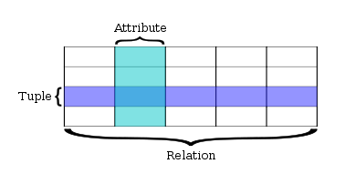

# 배경지식

- Database와 DBMS 정의
  - Database는 사용자가 필요한 정보를 얻기 위해 논리적으로 연관된 데이터를 모아 구조적으로 통합해 놓은 것입니다.
  - DBMS는 Database Management System의 약자로 사용자와 데이터베이스를 연결해주는 소프트웨어입니다. 즉 DB를 관리하기 위한 시스템입니다. (대표적으로 구성, 조작, 제어 등의 기능을 가집니다.)

<br>

- SQL(Structured Query Language)
  - 구조적 질의 언어로 해당 질의 언어를 통해 데이터베이스를 제어하고 관리할 수 있다.
  - SQL 종류
    - DDL(Data Definition Language)
      - 데이터베이스 구조를 정의, 수정, 삭제하는 언어이며 create, alter, drop 등이 있다.
    - DML(Data Manipulation Language)
      - 데이터베이스 내의 자료 검색, 삽입, 갱신, 삭제를 위한 언어로 select, delete, update, insert가 있다.
    - DCL(Data Control Language)
      - 데이터에 대해 무결성을 유지, 병행 수행 제어, 보호와 관리를 위한 언어로 commit, rollback, grant, revoke가 있다.

# **RDBMS와 NoSQL의 차이**


## RDBMS(Relational Database Management System)



- 데이터는 스키마(Schema)로 정의된 2차원 테이블에 저장
- 각 열은 하나의 속성에 대한 정보를 저장
- 각 행은 각 열의 데이터 형식에 맞는 데이터가 저장
- 데이터 관리를 위해 테이블 간의 관계를 **구조화**하는 것이 중요
  - 이러한 관계를 나타내기 위해 외래 키(Foreign Key) 라는 것을 사용한다.
- 데이터의 일관성을 보장한다.


### 단점
- 테이블과 테이블 간 관계가 복잡해질수록(많아질수록) 조인 연산이 많은 복잡한 쿼리가 만들어집니다.
- 데이터베이스 확장 시, scale-up을 주로 이용한다.
- 데이터베이스를 scale-out 할 때 NoSQL에 비해서 번거롭다.
  - 이유
    - ``` post {
      id: 1
      title: 'My post'
      content: 'The content'
      comments: {
        comment: {
          id: 1
        }
        comment: {
          id: 2
        }
        ...

      views: {
        view: {
          user: 1
        }
        view: {
          user: 2
        }
        ...
      }
    - 위와 같은 객체가 있고, DB를 수평적 확장(sharding) 하면, RDBMS에서는  
      - 데이터가 조인을 통해 관계((post와 comment)가 형성된다.
      - comment id 1은 one DB server에
      - 다른 comment id 2 는 another DB server에 저장될 수 있다.
    - 반면, NoSQL에서는
      - 위의 객체는 일종의 독립형 객체로 저장되어 있으므로 다른 테이블의 데이터와 조인이 필요 없다.   
      - 따라서, 단일 서버에 그대로 상주할 수 있다.
    - 따라서, NoSQL에 비해 sharding 시 번거롭다는 단점이 있다.
    


## NoSQL(Not Only SQL)
- 분산형 구조
  - 분산형 구조를 통해 데이터를 여러 대의 서버에 분산해 저장하고, 분산 시에 데이터를 상호 복제해 특정 서버에 장애가 발생했을 때도 데이터 유실이나 서비스 중지가 없는 형태의 구조
- 비 관계형 모델을 이용한 데이터 저장 방식
    - **Key-value** 방식(Riak, Redis, Voldmort)
      - 키를 고유한 식별자로 사용하는 키-값 쌍으로 데이터를 저장한다.
      - 키-값 데이터베이스는 파티셔닝<sup>[2)](#ref2)</sup>이 가능하고, 수평 확장이 가능하다.
    - **Document** 방식(MongoDB, CouchDB)
      - XML이나 JSON, YAML 같은 데이터 타입(document)을 이용해서 레코드를 저장한다.
    - **Big Table** 방식(Hbase, Casandra)
      - key-value와 데이터 저장 방식은 동일
      - 보통의 NoSQL은 order by 같은 정렬 기능을 제공하지 않지만, 이 모델은 내부적으로 key를 정렬
      - 날짜나 선착순으로 보여줄 때 유용
    - **Graph** 방식(Sones, Allegro Graph)
      - 데이터를 노드로 표현하고, 노드 사이의 관계를 화살표로 표현한다.

### 장점
- **분산처리와 병렬처리가 가능**
- **Big Data 처리에 효과적**
- JOIN에 대한 로직이 필요 없어서 쿼리 로직의 복잡도가 낮다.
- Auto Sharding<sup>[1)](#ref1)</sup>을 지원

### 단점
- 복잡한 조인 사용이 어려움
  - 기본적으로 조인을 제공하지 않음
  - 조인해서 데이터를 가지고 오는 로직을 구현하려면, Application에서 각 테이블로부터 데이터를 가져와서 합쳐야 함.
- 데이터의 일관성이 항상 보장되진 않음 (중복 데이터 존재 가능)   
  - 따라서, 중복으로 저장된 데이터를 똑같이 업데이트해 주는 데 시간을 소모
- 인덱스 구조를 메모리에 저장하기 때문에 많은 인덱스를 사용하려면 충분한 메모리가 필요
  <br>

# 둘 중 어떤 것을 선택해야 할까?

### SQL
- 앱의 여러 부분에서 관련된 데이터(ex. join)가 자주 변경되는 경우 (NoSQL이라면 항상 여러 컬렉션을 수정해야 함)
- 명확한 스키마가 중요하며, 데이터구조가 극적으로 변경되지 않을 때 ( 대부분 서비스는 스키마가 유동적인 경우가 거의 없다. )

### NoSQL
- 정확한 데이터 요구사항을 알 수 없을 때
- 읽기(read) 처리를 자주 하지만, 데이터를 자주 변경하지 않는 경우 (즉, 한 번의 변경으로 수십 개의 문서를 수정할 필요가 없는 경우)
- 데이터베이스를 수평으로 확장해야 하는 경우 ( 즉, 막대한 양의 데이터를 다뤄야 하는 경우, 읽기/쓰기 처리량이 큰 경우)

## RDBMS에서 서버 확장하는 방법
- 사용자의 요청들은 일반적으로 read 가 write보다 빈번하게 일어난다.
- Master - slave 구조
  - 하나의 컴퓨터를 Master로 설정한다.
  - 나머지 컴퓨터를 Slave로 지정한다.
  - Slave는 master를 복제한다.
  - slave는 여러 대로 확장이 가능하다. ( scale - out )
  - Write는 master에만, read는 slave에만 이루어지도록 한다. ( 부하를 분산시키는 것 )
  - 만약, master 만으로도 감당하지 못했을 때는 쓰기 작업을 하는 서버도 나누어 준다.
- master db 가 갑자기 에러가 발생한 경우, 데이터 백업 용도로 slave를 사용할 수 있다. ( Failover )
  - Failover
    - 시스템에 장애가 발생 시, 미리 준비했던 다른 시스템으로 대체해서 운영하는 것
- 단점
  - 데이터의 동기화가 제대로 되지 않을 수 있다.
    - 예약 및 결제처럼 정합성이 중요한 요청이나 실시간성이 보장되어야 하는 쿼리는 Master 서버로, 정합성 차이가 어느 정도 허용할 수 있는 캠핑용품 조회와 같은 쿼리는 Slave 서버로 분기시킨다.
    - 그리고 Slave 서버는 Select처럼 데이터 조회만 할 수 있게 read-only 속성을 부여하여 Slave 서버의 데이터가 변경되지 않도록 설정한다.
  - 잘못된 쿼리를 날려서 에러가 발생하면 slave 스레드에서도 에러가 발생
    1. 슬레이브 상태를 멈춘다.
        ```
        stop slave;
        ```
    2. 에러 쿼리 하나 건너뛰자고 알려준다.
         ```
         SET GLOBAL SQL_SLAVE_SKIP_COUNTER=1;
         ```
    3. 다시 슬레이브 시작
        ```
        start slave;
        ```
    - 만약, 다른 에러가 발생하여 데이터 복제가 실행되지 않은 경우
      - 앞으로 특정 에러 코드(ex. 1062) 발생하면 skip 하라는 명령어 입력
        ```aidl
        slave-skip-errors = 1062
        ```
<br>


<br>
<br>

---


#### <a id="ref1"></a>
1) **Sharding** : 하나의 데이터 세트를 다수의 DB에 분산시키는 방법. 주로 데이터 세트가 단일 DB에 저장하기에는 너무 클 때 사용한다.
#### <a id="ref2"></a>
2) **파티셔닝** : 논리적인 데이터 element 들을 다수의 entity로 쪼개는 행위를 뜻하는 일반적인 용어
   즉 큰 table이나 index를, 관리하기 쉬운 partition이라는 작은 단위로 물리적으로 나누는 것을 의미한다.

## Reference
- https://armful-log.tistory.com/56
- https://devuna.tistory.com/25
- https://server-talk.tistory.com/240