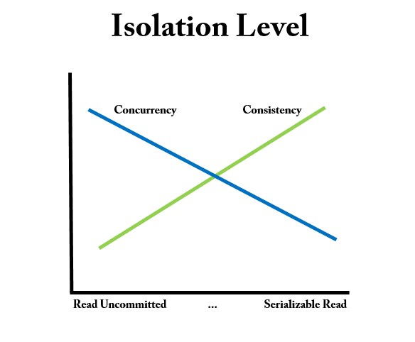
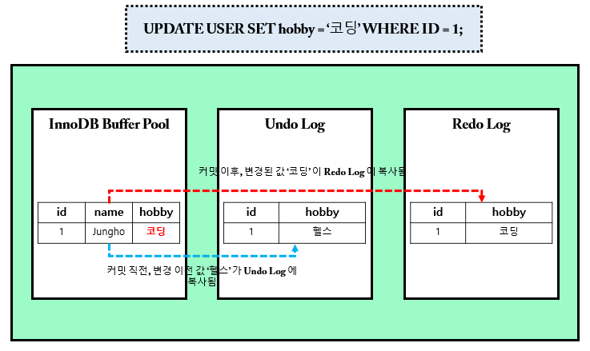

# 트랜잭션(Transacation)

- __정의__
    - 트랜잭션이란 데이터베이스의 상태를 변화시키는 하나의 논리적인 작업 단위라고 할 수 있으며, 트랜잭션에는 여러개의 연산이 수행될 수 있다.
- __특징__
    - 하나의 트랜잭션은 `Commit` 되거나 `Rollback` 된다.

## ACID

트랜잭션의 성질에는 ACID 가 있다.

- __Atomicity(원자성)__
    - 트랜잭션의 연산은 데이터베이스에 모두 반영되든지 아니면 전혀 반영되지 않아야 한다.
        - `All or Nothing`
    - 트랜잭션 내의 모든 명령은 반드시 완벽히 수행되어야 하며, 모두가 완벽히 수 행되지 않고 어느하나라도 오류가 발생하면 데이터베이스 상태를 트랜잭션 작업 이전으로 되돌려서 원자성을 보장
- __Consistency(일관성)__
    - 트랜잭션 수행 전과, 수행 완료 후의 상태가 같아야 한다.
- __Isolation(독립성, 격리성)__
    - 둘 이상의 트랜잭션이 동시에 병행 실행되는 경우 어느 하나의 트랜잭션 실행중에 다른 트랜잭션의 연산이 끼어들 수 없다.
    - 수행중인 트랜잭션은 완전히 완료될 때까지 다른 트랜잭션에서 수행 결과를 참조할 수 없다.
    - __격리성은 `읽기 일관성`과 `동시성`에 영향을 미치는 성질__
- __Durability(영속성, 지속성)__
    - 성공적으로 완료된 트랜잭션의 결과는 시스템이 고장나더라도 영구적으로 반영되어야 한다.

## 트랜잭션 격리 수준

트랜잭션 격리(고립화) 수준이 중요한 이유는, 격리 레벨을 어떻게 설정하느냐에 따라 읽기 일관성이 달라지기 때문이다. 

__즉, 트랜잭션 격리 수준에 따라 데이터 조회 결과가 달라질 수 있다는 말이다.__

이처럼 트랜잭션 격리 수준에 따라 데이터 조회 결과가 달라지게 하는 기술을 `MVCC(Multi Version Concurrency Consistency)` 라고 한다.

### 레벨 0 : Read Uncommitted

- 트랜잭션에서 처리 중인, 아직 커밋 되지 않은 데이터를 다른 트랜잭션에서 읽는 것을 허용
- `Dirty Read, Non-Repeatable Read, Phantom Read 현상 발생`
- Oracle 에서는 이 레벨을 아예 지원하지 않음.
- MySQL 에서는 설정은 가능

### 레벨 1 : Read Committed

- `Dirty Read 방지` : 트랜잭션이 커밋되어 확정된 데이터를 읽는 것을 허용
- 대부분의 DBMS 가 기본 모드로 채택하고 있는 격리수준
    - Ex. Oracle, H2 등
    - 커밋된 정보만 읽는다.
- Non-Repeatable Read, Phantom Read 현상은 여전히 발생
- PostgreSQL, SQL Server 의 경우 `읽기 공유 Lock` 을 사용해서 구현한다. 하나의 레코드를 읽을 때 Lock 을 설정하고 해당 레코드를 빠져 나가는 순간 Lock 을 해제
- MySQL(InnoDB) 과 Oracle 은 Lock 을 사용하지 않고 쿼리 시작 시점의 `Undo` 데이터를 제공하는 방식

> RDBMS 에서 MVCC 는 구현 방식에 따라 2가지로 나뉘는데, Pessimistic Lock 을 사용하는 MGA(Multi Generation Architecture) 방식과 Undo Segment 를 사용하는 방식으로 나눠진다.
>
> 쉽게 말하면, RDBMS 마다 MVCC 기술을 구현하기 위해서 Lock 을 사용하는 방식을 쓸건지, Undo Segment 에서 데이터를 제공할껀지 선택하여 구현한다.

### 레벨 2 : Repeatable Read

- MySQL InnoDB 에서 기본으로 채택하고 있는 격리 수준
- 선행 트랜잭션이 읽은 데이터는 트랜잭션이 종료될 때가지 후행 트랜잭션이 `갱신하거나 삭제하는 것은 불허함`으로써 같은 데이터를 두 번 쿼리했을 때 일관성 있는 결과를 리턴
    - Insert 는 가능
- Phantom Read 현상은 여전히 발생
- PostgreSQL, SQL Server 의 경우 트랜잭션 격리 수준을 Repeatable Read 로 변경하면 읽은 데이터에 걸린 공유 Lock 을 커밋할 때까지 유지하는 방식으로 구현
- Oracle은 이 레벨을 명시적으로 지원하지 않지만 [for update](https://m.blog.naver.com/PostView.naver?isHttpsRedirect=true&blogId=tyboss&logNo=70101836923) 절을 이용해 구현가능.

> [JPA 는 1차 캐시를 통해서 Repeatable Read 를 애플리케이션 레벨에서 지원한다.](JPA 는 과연 1차 캐시를 통해서 Repeatable Read 를 애플리케이션 레벨에서 지원할까?)

### 레벨 3 : Serializable Read

- 선행 트랜잭션이 읽은 데이터를 후행 트랜잭션이 갱신하거나 삭제하지 못할 뿐만 아니라 중간에 새로운 레코드를 삽입하는 것도 막아줌. 완벽하게 읽기 일관성 모드를 제공
    - `INSERT, UPDATE, DELETE 전부 불가능`
    - READ 시에 DML 작업이 동시에 진행될 수 없다.

## 트랜잭션 격리 수준을 설정할 때 발생 하는 문제점들

트랜잭션 격리 수준을 너무 낮게(0 레벨)하면 읽기 일관성을 제대로 보장할 수 없고, 반면 너무 높게하면, 읽기 일관성은 완벽하게 보장하지만 데이터를 처리하는 속도가 느려지게 된다. 

- Read Uncommitted > Read Committed > Repeatable Read > Serializable Read
    - ReadUncommitted 로 갈 수록 동시성은 높아지고, 일관성은 떨어진다.
    - Serializable Read 로 갈 수록 동시성은 떨어지고, 일관성은 높아진다.



따라서, 트랜잭션 격리 수준은 `일관성` 및 `동시성`과도 연관이 있다는 것을 알 수있다.

> 트랜잭션 성질 중 격리성은, 읽기 일관성과 동시성에 영향을 미치는 성질이라고 말할 수 있다.

격리성과 동시성으로부터 파생되는 문제점을 살펴보기 전에, MySQL InnoDB 아키텍처 중 일부에 대해서 배워보자.
지금부터 아래에서 나올 그림들은 MySQL InnoDB 를 기준으로 설명한 그림이다.

### InnoDB 버퍼풀, Undo Log, Redo Log

- __InnoDB 버퍼풀__
    - 변경된 데이터를 디스크에 반영하기 전까지 잠시 버퍼링 하는 공간
- __Undo Log__
    - 변경되기 이전 데이터를 백업 해두는 공간
    - 트랜잭션 보장(Rollback 시 언두 로그에 백업된 데이터 복원)
    - 트랜잭션 격리 수준 보장(트랜잭션 격리 수준에 맞게, 백업된 데이터 반환)
- __Redo Log__
    - 변경된 데이터를 백업(Commit 완료된 데이터)
    - 영속성 보장(서버 비정상 종료 시, 리두 로그에 백업된 데이터 복원)

### Dirty Read

- __Dirty Read(Uncommitted Dependency)__
    - 아직 `커밋되지 않은` 수정 중인 데이터를 다른 트랜잭션에서 읽을 수 있도록 허용할 때 발생한다.
        - 데이터를 수정 중인 트랜잭션이 롤백하는 경우
        - 한 트랜잭션(T1)이 데이터에 접근하여 값을 A 에서 B 로 변경하였고 아직 커밋을 하지 않은 상태에서 다른 트랜잭션(T2)이 해당 데이터를 읽는다. T2가 읽은 데이타는 B가 될 것이다. 하지만 T1이 최종 커밋을 하지 않고 종료된다면, T2가 가진 데이타는 꼬이게 된다.
- __MySQL 과 Oracle 에서는 Undo Segment 를 통해서 Dirty Read 문제 해결__
    - 만약에, 회사에서 PostgreSQL or SQL Server 등 MVCC 기술을 구현하기 위해 Lock 을 사용하는 DBMS 를 사용한다면 이 부분에 대해서도 잘 알고 있어야 한다.



Dirty Read 는 UPDATE 쿼리문이 커밋되기 전에, 다른 트랜잭션에서 데이터를 읽으면, 코딩이 조회가 된다. 하지만 T1 트랜잭션에 문제가 생겨서 롤백이 되면 T2 가 조회한 값을 가지고 CUD 에 사용하였다면 데이터가 꼬이게 될 것이다.

### Non-Repeatable Read

Repeatable Read 의 특징을 반대로 생각하면 된다.

- __Non-Repeatable Read(Inconsistent Read)__
    - T1 이 A 테이블을 SELECT 한 후 T2 에서 A 테이블 내용을 UPDATE 한다고 가정. 
    - T2 가 해당 변경사항(UPDATE)을 COMMIT 한 이후에, T1 이 다시 A 테이블을 SELECT 하면 변경사항을 읽어들일 수 있음

### Phantom Read

- __Phantom Read__
    - T1 이 A 테이블에서 SELECT 한 이후 T2 에서 A 테이블에 내용을 추가(INSERT) 한다고 가정.
    - Repeatable Read 가 보장된 경우, A 테이블에서 SELECT 해왔던 데이터들을 T2 가 UPDATE 하여 COMMIT 한 후 T1 에서 다시 A 테이블을 SELECT 하더라도 T2 의 수정 내용을 읽어들일 수 없음
    - 하지만 T2 가 추가/삭제(INSERT)를 한 경우, 다시 A 테이블에서 SELECT 하게 되면 기존 A 에서 SELECT 했던 데이터에서 row 가 추가될 수 있다.(유령 데이터)


# 스프링과 트랜잭션

## 스프링에서 제공하는 트랜잭션 관리 방법

스프링에서는 프로그래밍을 통한 트랜잭션 관리와, 선언적 트랜잭션을 통한 관리 방법 2가지를 제공한다.

### Programmatic Transcation

- __PlatformTransactionManager 인스턴스 변수 선언__

```java
@Autowired
@Qualifier("txManager")
private PlatformTransactionManager txManager;
```

- __로직 구현__

```java
DefaultTransactionDefinnition def = new DefaultTransactionDefinition();
def.setPropagationBehavior(TransactionDefinition.PROPAGATION_REQUIRED);
TransacationStatus status = txManager.getTranscation(def);

try {
    // 생략
    txManager.commit(status);
} catch(ApplicationException e) {
    txManager.rollback(status);
}
```

- __순수 JPA 사용 시 트랜잭션 처리 방법__

```java
// 순수 JPA 사용 시 정석 코드
EntityManagerFactory emf = Persistence.createEntityManagerFactory(persistenceUnitName);
EntityManager em = emf.createEntityManager();
EntityTransaction tx = em.getTransaction();
tx.begin();
try {
    Member member = new Member();
    member.setId(1L);
    member.setUserName("Jungho");
    em.persist(member);
    tx.commit();
} catch (Exception e) {
    tx.rollback();
} finally {
    em.close();
}
emf.close();
```

### Declarative Transcation

선언적 트랜잭션 방법은 `<tx:advice>` 태그를 사용하는 방법과 `@Transactional` 어노테이션을 사용하는 방법이 있다. 스프링 부트가 아닌 스프링을 사용하면 `<tx:advice>` 로 설정되어있을 가능성이 크다.

```java
@Transcation
public void create(User user) {
    // 생략
}
```

> 스프링 트랜잭션만 해도 거의 한 파트로 뺄 정도로 내용이 많다. 이 부분은 나중에 스프링 할 때 자세하게 다루는 것이 나을 듯 하다.

## QNA

### Q. 트랜잭션 격리 수준에 대해서 설명하여 주세요.

A : 트랜잭션 격리 수준은 트랜잭션의 ACID 성질 중 고립성 레벨에 따른 일관성과 동시성의 트레이드 오프를 조절하는 것을 의미합니다.

- 레벨 0 인 Read Uncommitted 는 커밋되지 않은 내용에 대해서 데이터를 읽을 수 있습니다.
- 레벨 1 인 Read Committed 는 커밋된 내용에 대해서만 데이터를 읽을 수 있습니다.
- 레벨 2 인 Repeatable Read 는 선행 트랜잭션이 읽은 데이터는 트랜잭션이 종료될 때가지 후행 트랜잭션이 `갱신하거나 삭제하는 것은 불허함`으로써 같은 데이터를 두 번 쿼리했을 때 일관성 있는 결과를 리턴합니다.
- 레벨 3 인 Serializable Read 는 선행 트랜잭션이 읽은 데이터를 후행 트랜잭션이 갱신하거나 삭제하지 못할 뿐만 아니라 중간에 새로운 레코드를 삽입하는 것도 막아주기 때문에 완벽하게 읽기 일관성 모드를 제공합니다. 단, 동시성에 대한 성능은 매우 떨어집니다.

> 위 내용 정도의 답변이 Default 이고, 좀 더 인상 깊은 답변을 하려면 각 레벨에 따른 문제점들(Dirty Read 등)까지 언급하면 조금 더 나을 것같다. 좀 더 가면 MVCC 랑 엮어서 대답할 수 도 있겠다.

## References

- https://feco.tistory.com/45
- https://brunch.co.kr/@skeks463/27
- https://coding-factory.tistory.com/226
- http://wiki.gurubee.net/pages/viewpage.action?pageId=21200923
- https://www.datanet.co.kr/news/articleView.html?idxno=116534
- http://haisins.epac.to/wordpress/?p=1083
- https://mysqldba.tistory.com/335
- https://steemit.com/kr/@yjiq150/db-transaction-isolation
