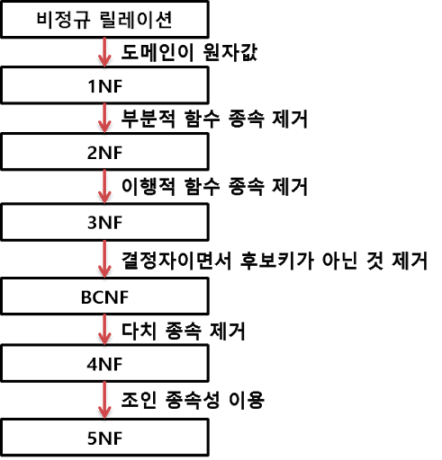
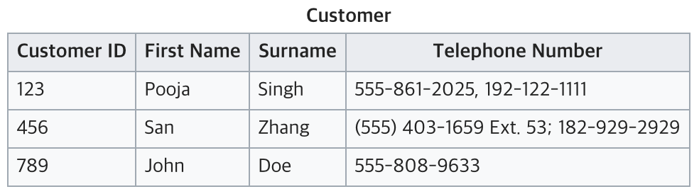
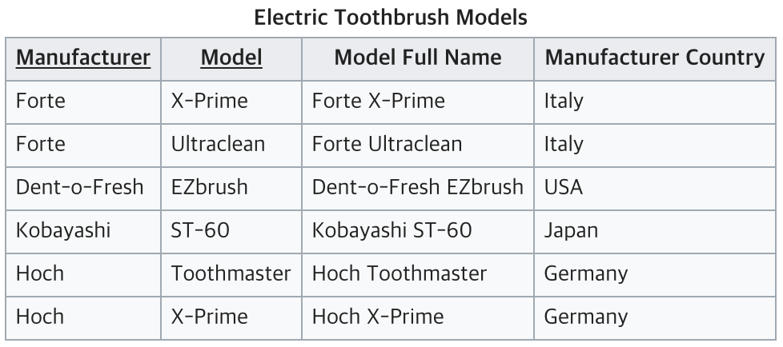
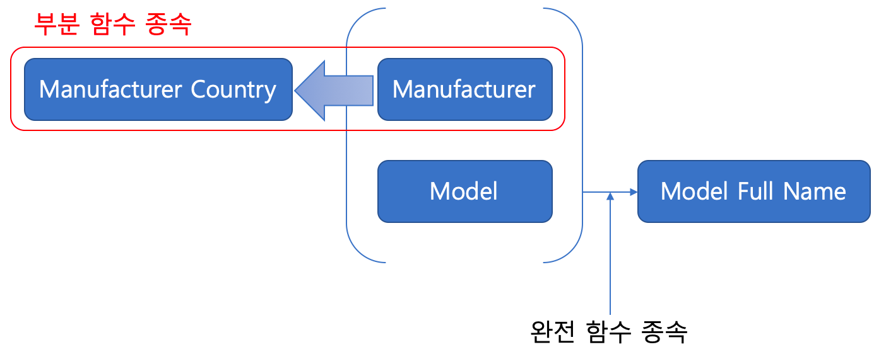
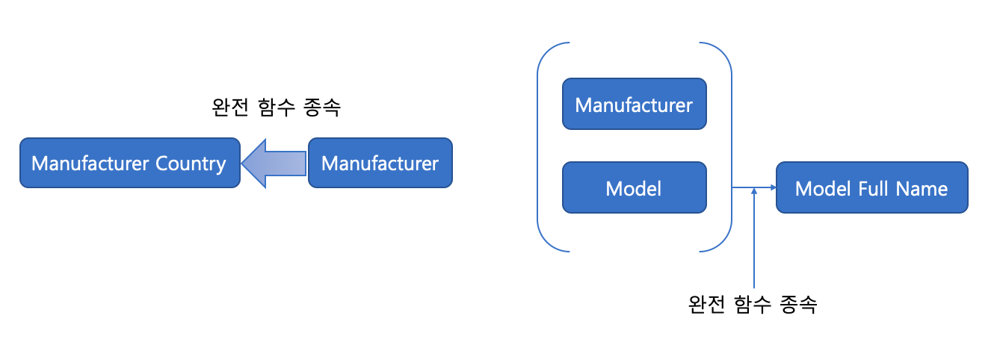
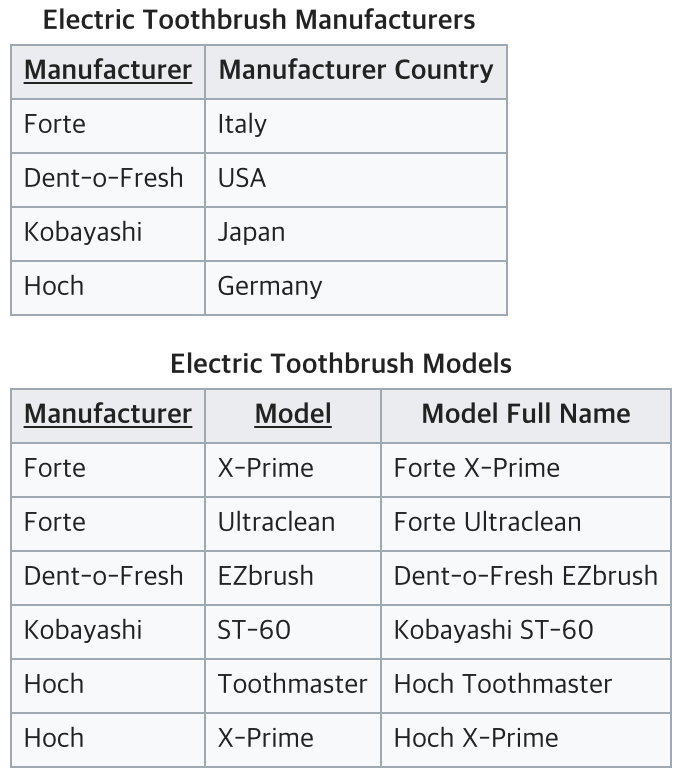
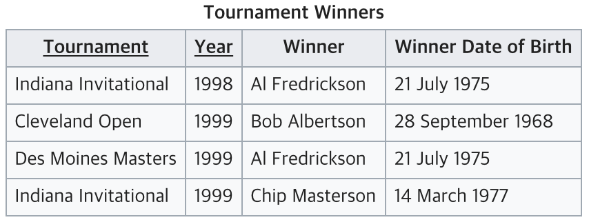
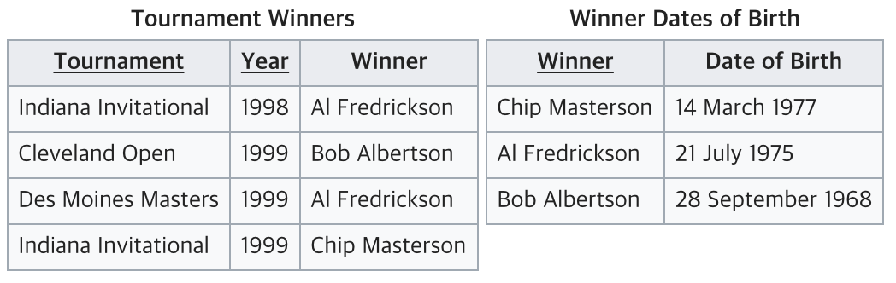
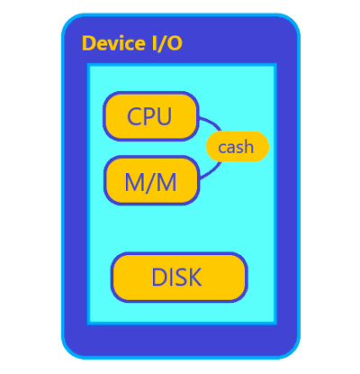

## 정규화
정규화란 이상 문제를 해결하기 위해 속성들 끼리의 종속 관계를 분석하여 여러개의 릴레이션으로 분해하는 과정이다.  
일반적으로 테이블을 여러개로 분해하면 속도는 상대적으로 느려질 수 있지만, 분해하지 않으면 이상 문제들이 발생하게 된다.

 

## 이상(Anomaly)의 종류
정규화를 거치지 않아 데이터베이스내에 데이터들이 불필요하게 중복되어 릴레이션 조작 시 예기치 못하게 발생하는 곤란한 현상

예시)

| 학번 | 과목코드 | 이름 | 연락처 |
| --- | --- | --- | --- |
| 2101 | ST01 | 홍길동 | 010-1234-1234 | 
| 2101 | ST02 | 홍길동 | 010-1234-1234 | 
| 2001 | ST01 | 배석재 | 010-2424-2424 | 
| 1901 | ST03 | 홍길동 | 010-3543-4234 | 

### 삽입 이상(Insertion Anomaly)
릴레이션에 데이터를 삽입할 때 의도와 상관없이 원하지 않은 값들도 함께 삽입되는 현상  
예를 들어 2101 학번 홍길동 학생의 연락처만 추가하고 싶을 때, 과목코드가 비게되므로 NULL 값을 가져 문제가 발생하게 된다.

### 삭제 이상(Deletion Anomaly)
릴레이션에서 한 튜플을 삭제할 때 의도와는 상관없는 값들도 함께 삭제되는 현상  
예를 들어 2101 학번의 홍길동 학생이 ST01 과목을 수강 취소할 경우, 취소 사유를 물을 수 있는 유일한 정보인 연락처마저 잃게 된다.

### 갱신 이상(Update Anomaly)
릴레이션에서 튜플에 있는 속성 값을 갱신할 때 일부 튜플의 정보만 갱신되어 정보에 모순이 생기는 현상  
예를 들어 홍길동 학생이 연락처를 바꿨을 경우에 ST01, ST02 모두 갱신해야 하는데 ST01만 갱신할 경우 발생한다.

 

## 정규화 과정

### 제 1정규화(First Normal Form, 1NF)
테이블(Relation)이 제 1정규형을 만족했다는 것은 아래 세 가지 조건을 만족했다는 것을 의미한다.

1. 어떤 Relation에 속한 모든 Domain이 원자값만으로 되어있다.
2. 모든 attribute에 반복되는 그룹이 나타나지 않는다.
3. 기본키를 사용하여 관련 데이터의 각 집합을 고유하게 식별할수 있어야 한다.

위의 그림을 보면 전화번호가 여러개를 가지고 있기 때문에 위 조건중 1번 조건인 원자값이 아니므로 제 1정규형에 위반된다.

위의 그림은 전화번호 그룹이 반복되어 2번조건을 위반한 사례이다.

### 제 2정규화(Second Normal Form, 2NF)
기본키가 아닌 모든 속성이 기본키에 대해 완전 함수적 종속을 만족하는 정규형 (부분적 함수 종속을 제거한 정규형)

- 함수적 종속 (Functional Dependency)
X의 값에 따라 Y값이 결정될 때 X -> Y로 표현하는데, 이를 Y는 X에 대해 함수적 종속이라고 한다.  
에를 들어 학번을 알면 이름을 알 수 있는데, 이 경우엔 학번이 X가 되고 이름이 Y가 된다.  
X를 결정자라고 하고, Y는 종속자라고 한다.

  - 완전함수종속 : X에 대해 Y값 결정, 기본키가 복합키 일 경우 {X1,X2} -> Y 일 경우 완전함수적 종속이라고한다.
  - 부분함수종속 : 기본키가 단일키 일 경우 부분함수종속은 일어날 수 없다, 기본키가 복합키 일 경우 X1, X2 중 하나만 Y의 값을 결정할 때 부분 함수적 종속이라고 한다.
  - 이행적함수종속 : X -> Y인데, Y -> Z 다. 결국 X -> Z인 것을 알 수 있는 경우

예시)

위의 테이블에 종속 관계를 나타내면

위에서 부분 함수 종속을 제거하게 되면, 아래와 같은 그림이 된다.

따라서 위와 같은 내용을 바탕으로 테이블을 나눠보면

위와 같이 테이블이 나눠져 2NF를 만족하게 된다.

### 제 3정규화(Third Normal Form, 3NF)
기본키가 아닌 모든 속성이 기본키에 대해 이행적 함수 종속 관계를 만족하지 않는 정규형

위 테이블에서 {Tournament, Year } 가 후보키가 된다. 하지만 Winner Date of Birth은 기본키가 아닌 속성인 Winner를 거쳐 
{Tournament, Year}에 의존하고 있어 3NF를 위반한다.  
따라서 테이블을 아래와 같이 둘로 나누어 줄 수 있다.

위와 같이 테이블을 나누면 본래 Winner Date of Birth가 Winner를 거쳐 {Tournament, Year}를 의존하게 되는 이행적 함수 종속 관계가 아닌 
Date of Birth -> Winner가 되고, Winner -> {Tournament, Year}가 되면서 완전 함수적 종속 관계가 된다.

### BCNF (Boyce-Codd 정규형)
모든 결정자는 후보키이어야 한다.

| 학생 | 과목 | 교수 | 학점 |
| --- | --- | --- | --- |
| 1 | AB123 | 김인영 | A |
| 2 | CS123 | Mr.Sim | A |
| 3 | CS123 | Mr.Sim | A |

후보키는 수퍼키중에서 최소성을 만족하는건데 이 경우 {학생, 과목}이 후보키가 된다. 근데 해당 테이블의 경우 교수가 결정자가 된다.  
그 이유는, 교수가 한 과목만 강의 할 수 있다고 가정할 때, 교수가 정해지면 과목이 결정되기 때문이다. 이경우 BCNF를 만족하지 못한다.

이를 해결하기 위해서는 테이블을 분리해야 한다.

| 교수 | 과목 |
| --- | --- |
| 김인영 | AB123 |
| Mr.Sim | CS123 |

| 학생 | 과목 | 학점 |
| --- | --- | --- |
| 1 | AB123 | A |
| 2 | CS123 | A |
| 3 | CS123 | A |

고급 정규화 과정인 4NF, 5NF는 생략하도록 하겠습니다.

> 4NF, 5NF.    
> 참고 : https://zzozzomin08.tistory.com/12

 

## 정규화 단점
Relation의 분리로 인해 Relation 간의 연산(JOIN 연산)이 많아져서 질의에 대한 응답 시간이 느려지게 된다.

 

## 반정규화
데이터의 성능 향상을 위하여, 데이터 중복을 허용하고 조인을 줄여 데이터베이스 성능 향상하는 방법이다.

정규화와 반정규화는 Trade off 관계에 있다.

정규화를 하면 정합성과 데이터무결성이 보장된다. 반면, 테이블이 복잡해지고 성능이 떨어질 수 있다. 그에 따라 입력(Create), 수정(Update), 삭제(Delete)의 성능은 향상되고 조회(Read)의 경우 나빠질수도 있고 좋아질 수도 있다.

반 정규화를 하면 테이블이 단순화되며 성능이 향상되는 반면, 정합성과 데이터무결성이 보장되지 않을 수있다. 반 정규화는 의도적으로 중복을 만들어 검색(Read) 성능을 향상시킨다. 하지만 속성이 각기 다른 테이블에 중복되어 나타나기 때문에 입력(Create), 수정(Update), 삭제(Delete)의 성능은 낮아진다.

본격적인 반 정규화 방식에 대해 이야기 하기 전에 디지털 디바이스(하드웨어)의 성능을 어떤식으로 보장해 주어야하는지 알아보자.

디스크와 메모리(M/M), CPU 큰 속도와 가격 차이를 가지고 있다. 연산을 수행하는 CPU가 가장 빠르고 비싸다. 그리고 디스크는 가장 큰 저장공간을 가지고 있고 느리다. 디스크와 CPU는 1만배 이상의 속도 차이를 가지고 있다. 이를 보완하기 위해 메모리가 중간에 자리잡고 있는데, 디스크가 장기기억장소라면 메모리는 단기기억장소이다. (메모리와 CPU의 속도차이도 커서 캐시라는 비싼 메모리를 그 간극을 보완한다.)

메모리는 한 트랜잭션에 필요한 데이터를 디스크에서 가져와 CPU 연산작업을 하는 기간동안 저장해놓는다. 디스크에서 메모리로 데이터를 퍼오는 횟수를 줄일수록 (속도)를 향상시킬 수 있다.

그렇다면 우리의 데이터베이스(DB)는 어디에 저장될까?

당연히 장기기억매체인 디스크에 저장되며, 디스크에서 메모리로 데이터를 퍼오는 횟수를 줄이려는 노력이 반정규화이다.

### 반정규화를 수행하는 경우
- 정규화에 충실하여 종속성, 활용성은 향상되었지만, 수행속도가 느려진 경우
- 다량의 범위를 자주 처리해야하는 경우
- 특정 범위의 데이터만 자주 처리하는 경우
- 요약/집계 정보가 자주 요구되는 경우

### 반정규화 절차
| 반정규화 절차 | 설명 |
| --- | --- |
| 대상 조사 및 검토 | 데이터 처리 범위, 통계성 등을 확인해서 반정규화 대상을 조사한다. |
| 다른 방법 검토 | 반정규화를 수행하기 전에 다른 방법이 있는지 검토한다.
| 반정규화 수행 | 테이블, 속성, 관계등을 반정규화 한다. |

### 테이블 반정규화 기법

- 테이블 병합
  조인되는 경우가 많아서 테이블을 합치는 것이 성능향상에 효율적일 경우에 사용
  1. 1:1 관계 테이블 병합
  2. 1:M 관계 테이블 병합
  3. 슈퍼/서브 타입 관계 테이블 병합

> Super Type, Sub Type  
> 슈퍼타입과 서브타입의 관계는 배타적 관계와 포괄적 관계가 있는데, 배타적 관계는 고객이 개인 고객이거나 법인 고객인 경우를 의미한다.  
> 포괄적 관계는 고객이 개인고객일 수도 있고 법인고객일 수도 있는 것이다.  
> 참고 : https://dog-foot-story.tistory.com/62

- 테이블 분할
  테이블에서 특정 속성들만 집중적으로 접근할 경우 분할
  1. 수직분할 : 특정 속성들만 접근이 잦을 경우 칼럼을 쪼개서 테이블을 만듦
  2. 수평분할 : 스키마는 동일하지만, 그 데이터 값을 이용하는 방법이 row별로 구분지어지는 경우 (연도별 이력 조회 등)

- 테이블 추가
  1. 중복테이블 추가 : 다른 업무이거나 서버가 다른 경우 동일한 테이블 구조를 중복하여 원격조인을 제거하여 성능 향상
  2. 통계테이블 추가: SUM, AVG등을 미리 수행하여 자동 계산해둠으로써 조회 시 성능 향상
  3. 이력테이블 추가: 마스터 테이블에 존재하는 레코드를 중복하여 이력테이블에 존재하는 방법
  4. 부분테이블 추가: 하나의 테이블의 전체의 칼럼 중 자주 이용하는 집중화된 칼럼들이 있을 때 디스크 I/O를 줄이기 위해 해당 칼럼들을 모아 놓은 별도의 반정규화 된 테이블

 

---

### Reference

https://velog.io/@bsjp400/Database-DB-%EC%A0%95%EA%B7%9C%ED%99%94-%EB%B9%84%EC%A0%95%EA%B7%9C%ED%99%94%EB%9E%80

https://wkdtjsgur100.github.io/database-normalization/

https://velog.io/@yewon-july/De-Normalization

http://www.jidum.com/jidums/view.do?jidumKindCd=Da&jidumId=144

https://allo-ew.tistory.com/25
