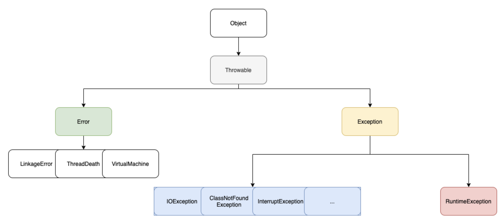

## 자바 Exception 계층 구조



- **Checked Exception**은 컴파일을 할 경우에 예측가능한 예외로 ClassNotFoundException, FileNotFoundException 등이 있다.
- **UnChecked Exception**은 런타임시 발생할 수도 있고 발생하지 않을 수도 있는 예외로 ArithmeticException, NullPointerException 등이 있다.

## 자바에서 에러와 예외

1) 에러는 JVM 실행에 문제가 생기는 것을 말하며, 일반적으로 개발자가 직접 에러를 처리할 수는 없다. 보통 시스템의 리소스 문제로 발생하게 된다.(시스템 충돌, 메모리 부족 등)

- **컴파일 시에 발생할 수 없다.**

- OutOfMemory , StackOverflowError 등이 있다.

- java.lang.error 패키지에 존재

2) 예외는 개발자가 작성한 코드로 발생한다. 컴파일 및 런타임에 발생하는 경우이다. 개발자가 에러를 처리할 수 있다. 즉, 예외처리를 통해서 문제가 발생하더라도 어플리케이션이 종료되지 않고, 프로그램이 정상 동작할 수 있게 처리가 가능하다.

- NullPointerExceoption, SqlException 등이 있다.

- java.lang.Exception 패키지에 존재

## 예외처리 방법 1. try-catch-finally

- try : 예외가 발생할 가능성이 있는 범위를 지정하는 블록이다. try 블록은 최소한 하나의 catch 블록이 있어야 하며, catch 블록은 try 블록 다음에 위치한다.
- catch : 블록의 매개변수는 예외 객체가 발생했을 때 참조하는 변수명으로 반드시 java.lang.Throwable 클래스의 하위 클래스 타입으로 선언되어야 한다.
- finally : 이 블록은 필수 블록은 아니며, finally 블록은 catch 유무와 상관 없이 무조건 수행된다. 주로 IO 또는 Connection을 close() 하는데 사용된다.

## 예외처리 방법 2. throws

```java
public static void main(String[] args) {
        while(true) {
            try {
                A();
            } catch(ArithmeticException e) {
                e.printStackTrace();
            } finally {
                System.out.println("무조건 실행됩니다.");
            }
        }
    }

public static void A() throws ArithmeticException { // 예외 발생시 A() 함수를 호출한 곳에서 처리하도록 함.
    Scanner scan = new Scanner(System.in);
    int value = scan.nextInt();
    System.out.println(9/value);
}
```

A 메서드에서 오류를 던져줘서, A 를 호출한 곳에서 에러처리를 대신 하는 방법이다.

단점 : A() 메서드를 호출하는 부분이 엄청 많다고 생각해보자. A() 가 던진 예외를 어떤 부분에서 처리했던건지 추적하기가 힘들어진다! **throws 를 많이 사용하지 말자.**

대안 : try문 안에서 발생하는 Checked Exception을 catch문 안에서 Unchecked Exception으로 바꿔서 던져주는 방법을 적용해볼 수 있다. 이렇게 하면, 예외가 어디에서 발생했는지 정확하게 알 수가 있다.

```java
// 기존 코드
public static String A(BufferedReader bufferedReader) throws IOException { // throws 사용
        String requestLine = bufferedReader.readLine();
        return requestLine;
}

// 개선한 코드
public class CustomRuntimeException extends RuntimeException {
    public CustomRuntimeException(String message) {
        super(message);
    }
}
public static String A(BufferedReader bufferedReader) {
    try {
        String requestLine = bufferedReader.readLine();
        return requestLine;
    } catch (IOException e) {
        throw new CustomRuntimeException("입력 값이 잘못되었습니다."); // 이제 사용자가 입력값이 잘못되었다는 것을 알고, 유효한 입력을 하게 되어 이 에러를 해결할 수 있다.
    }
}
```

## 예외처리 방법 3. 강제로 예외를 발생시켜서 처리 (throw)

장점 : 예외가 발생하는 곳에서 예외가 던져지기에 예외를 추적하기 좋다.

```java
public static void A() {
        Scanner scan = new Scanner(System.in);
        int value = scan.nextInt();
        if (value == 0) {
            throw new ArithmeticException("0으로 나눌 수 없습니다.");
        }
        System.out.println(9 / value);
}
```

## 자원에 대한 예외처리 방법 :  try-with-resources

개요 : try에 자원 객체를 전달하면, **try 코드 블록이 끝나면 자동으로 자원을 종료**해주는 기능이다.

```java
// try에 전달할 수 있는 자원은 AutoCloseable 인터페이스의 구현체로 한정된다.
try (SomeResource resource = getResource()) {
    use(resource);
} catch(...) {
    ...
}
```

AutoCloseable 인터페이스는 JDK 1.7 부터 추가되는 인터페이스이다.

```java
public interface AutoCloseable {
    void close() throws Exception;
}
```

try-with-resource 는 try( ... ) 안에 AutoCloseable 의 구현체를 넣어주면, try 블록이 종료될때 해당 구현체의 close() 메서드를 호출해주는 기능이라고 보면 된다.

만약 이 기능을 사용하지 않는다면 다음과 같이 코드를 작성했을 것이다.

```java
SomeResource resource = null;
try {
    resource = getResource();
    use(resource);
} catch(...) {
    ...
} finally {
    if (resource != null) {
        try { 
            resource.close(); 
        } catch(...) { 
            /* 아무것도 안 함 */ 
        }
    }
}
```

### 주의사항

변수를 만들지 않은 상태로 사용할 경우 close() 메서드가 호출되지않는다.  아래 예제코드를 보면서 이해하자.

```java
public static void main(String[] args) {
    try(B b = new B(new A())){

    }catch(Exception e){

    }
}

// A, B 는 모두 AutoCloseable 를 상속받았다. 하지만, 이때 A의 close는 호출되지 않는다.
// 여기서는 B의 close 만 호출된다.
// A 도 호출하기위해서는 A 인스턴스 변수를 생성해주어야 한다.

public static void main(String[] args) {
    try(A a = new A();
        B b = new B(a)){

    }catch(Exception e){

    }
}
```

## 예외처리 방법 정리

예외가 발생할 여지가 있는 메서드(A)를 호출하는 메서드(B)가 있다고 하자.

- B 가 A에서 던진 예외를 활용해 무엇인가 의미 있는 작업(에러 상황이나 문제를 해결)을 할 수 있다면 Checked Exception 으로 처리
- B 가 A에서 던진 예외를 활용해서 아무런 작업도 할 수 없다면 Unchecked Exception 으로 처리
- 둘 중 어떤 상황인지 확실하게 결정할 수 없다면 Unchecked Exception 으로 처리

## 자바에서 null을 안전하게 다루는 방법?

1) **메소드의 인자를 받을 때** **Objects.requireNonNull()을 사용하여 방어**할 수 있다.

장점 1 : 코드 상에서 해당 객체가 null이 아니어야 함을 명시적으로 표현할 수 있다.

```java
public class A {
	String name;
}

public class B {
    A a;

    public B(A a) {
        this.a = Objects.requireNonNull(a);
    }
}

// requireNonNull 참고 코드
public static <T> T requireNonNull(T obj) {
      if (obj == null)
          throw new NullPointerException();
      return obj;
}
```

장점 2 : fail-fast(장애가 발생한 시점에서 즉시 파악할 수 있는 것)

```java
public class C{
    A a;

    public C(A a) {
        this.a = a;     //Objects.requireNonNull 사용x
    }
    //...getter
}

A a = null;
C c = new C(a);
c.getA();      // 객체 생성 이후에 늦게 NPE 발생
```

requireNonNull 을 사용하지 않고, 객체 생성 이후에 늦게 예외가 발생한다면, 시스템이 복잡해 질수록 장애를 발견하기 어렵게 만들 수 있다.

2) **Optional을 사용해** **리턴 타입에서 null을 반환하지 않도록 방어**할 수 있다.

- Optional : java 8 에서 추가되었으며, 객체를 Optional 로 감싸면서 NullpointerException 을 해결할 수 있는 방법을 제공해준다.
- Optional 은 주로 리턴타입에 사용되는 것이 권장된다.
- ofNullable, orElse, orElseGet 등 을 직접 사용해보시는 것을 추천합니다.

Optional 참고 사이트

- [https://www.daleseo.com/java8-optional-after/](https://www.daleseo.com/java8-optional-after/)
- [https://www.daleseo.com/java8-optional-effective/](https://www.daleseo.com/java8-optional-effective/)
- [https://engkimbs.tistory.com/646](https://engkimbs.tistory.com/646)

3) 자바 9 부터는 아래 메서드가 추가되면서, Optional 과 비슷하게 사용가능하다.

```java
requireNonNullElseGet(T obj, Supplier<? extends T> supplier)
```

## Reference

- [https://ktko.tistory.com/entry/JAVA-자바의-예외처리Exception-handling](https://ktko.tistory.com/entry/JAVA-%EC%9E%90%EB%B0%94%EC%9D%98-%EC%98%88%EC%99%B8%EC%B2%98%EB%A6%ACException-handling)
- [https://multifrontgarden.tistory.com/192](https://multifrontgarden.tistory.com/192)
- [https://math-coding.tistory.com/170](https://math-coding.tistory.com/170)
- [https://toneyparky.tistory.com/40](https://toneyparky.tistory.com/40)
- [https://velog.io/@rockpago/Objects.requireNonNull](https://velog.io/@rockpago/Objects.requireNonNull)