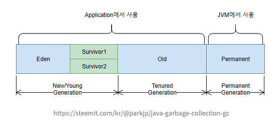
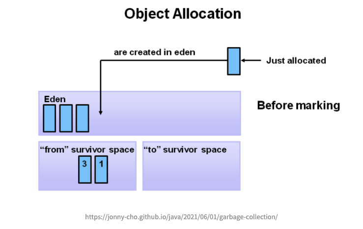
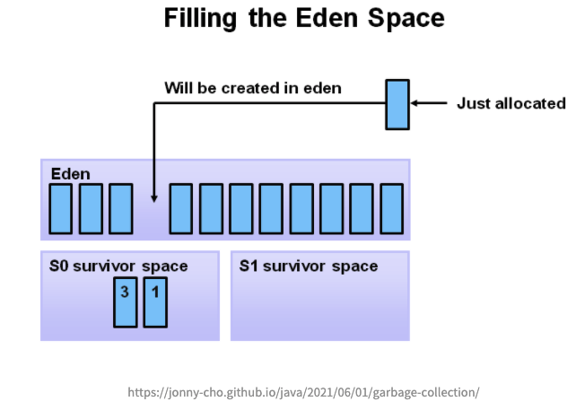
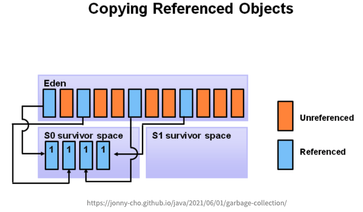
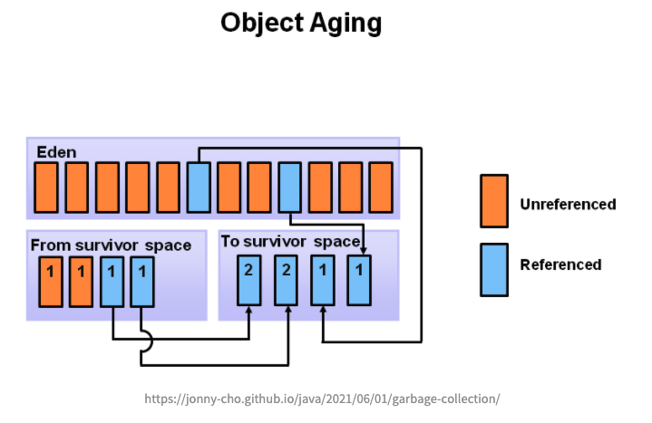
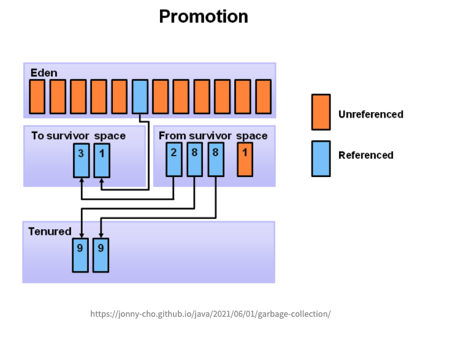

## 가비지 컬렉션 (Garbage Collection)

유효하지 않은 메모리(Garbage)를 자동으로 제거해주는 작업이다. Java Appliation은 JVM(Java Virtual Machine)위에서 구동되는데, JVM의 기능 중 더이상 사용하지 않는 객체를 청소하여  메모리 공간을 확보하는 작업이다.

<br/>

> GC가 필요한 이유는?

Heap 영역에 저장되는 객체들이 계속해서 쌓이게되면 OutOfMemoryException이 발생하여, 이를 방지하기 위해 주기적으로 사용하지 않는 객체를 수집하여 제거해줘야한다.

<br/>

> 예제 

```
Test test = new Test();
test.setId(1L);
test.setName("seohae");

testRepository.save(test);

test = null; // 더이상 참조를 하지 않고 아래 코드에서 사용되지 않으므로 GC의 대상이 된다. 

...
```

<br/>

## 가비지 컬렉터 (Garbage Collector)

메모리가 부족할때 쓰레기를 정리해주는 작업(Garbage Collection)을 수행하는 프로그램이 Garbage Collector 라고 부른다. GC 작업을 하는 가비지 콜렉터는 다음과 같은 일을 한다.

> 1. 메모리 할당  
> 2. 사용중인 메모리 인식  
> 3. 사용하지 않는 메모리 인식

<br/>

## 가비지 컬렉션 용어 정리

> 힙 메모리



#### 1) Stop The World

가비지 컬렉션을 수행하기 위해 JVM이 애플리케이션의 실행을 일시 정지하는 것을 말한다. 가비지 컬렉션이 실행되면 GC 작업을 맡은 스레드를 제외한 나머지 스레드는 모두 멈추게되고 GC 작업이 종료되면 재개된다.

<br/>

#### 2) Mark

애플리케이션이 일시 중지되면 GC는 참조되고 있는 객체와 연결된 객체를 타고 이동하며 접근 가능한 객체를 식별하는 과정

<br/>

#### 3) Sweep

모든 객체 탐색이 끝나면 식별(Mark)되지 않은 객체들을 메모리에서 해제시키는 과정

<br/>

#### 4) Young

- 새롭게 생성된 객체가 할당(Allocation)되는 영역이다.

- 대부분의 객체가 금방 Unreachable 상태가 되기 때문에, 많은 객체가 Young 영역에 생성되었다가 사라진다.

- Young 영역에 대한 가비지 컬렉션을 Minor GC 라고 부른다.

> ** Minor GC  
> Young 영역 중 Eden 영역이 꽉 차게되면 발생한다. 

<br/>

#### 5) Old

- Young 영역에서 Reachable 상태를 유지하여 살아남은 객체가 복사되는 영역이다.

- 복사되는 과정에서 대부분 Young 영역보다 크게 할당되며, 크기가 큰 만큼 가비지는 적게 발생한다.

- Full GC를 통해 사용되지 않는 객체가 제거된다.

<br/>

#### 6) Eden

- 새로 생성된 객체가 할당되는 영역이다.

- Eden 영역이 꽉차면 GC가 발생하면서 Mark(참조 여부 식별), Sweep(메모리 해제) 과정이 일어난다.

- 아직 사용중인 객체는 Survivor 영역으로 이동하며, Eden 영역은 비워진다.

<br/>

#### 7) Survivor

- Eden 영역이 꽉 차게 되면, GC가 발생하면서 제거된 객체 외의 나머지 살아남은 객체는 다른 Survivor 영역으로 이동하게 된다.

(한번의 Minor GC를 경험한 객체들이 저장되는 곳)

<br/>

- Survivor 두 영역중 하나는 반드시 비어있는 상태다. 만약 두 영역에 모두 데이터가 존재하거나, 사용량이 0이라면 정상적인 상황이 아니다.

> ** 어떤 뜻일까?
> 1) Minor GC가 발생하면 Eden과 Survivor1에 살아있는 객체를 Survivor2로 복사한다.
> 2) 그리고 Survivor1과 Eden을 Clear한다.
> 3) 결과적으로 한번의 Minor GC에서 살아남은 객체만 Survivor2영역에 남는다.  
     > 4) 그리고 다음번 Minor GC가 발생하면 같은 방식으로 Eden과  Survivor2영역에서 살아있는 객체를 Survivor1로 복사하고 클리어한다. 결과적으로 Survivor1에만 살아있는 객체가 남게된다.  
     > 4) 이렇게 반복적으로 Survivor1, Survivor2를 왔다갔다하다가, Survivor 영역에서 오래 살아남은 객체는 Old영역으로 옮겨진다. 

<br/>

- promotion 과정이 발생한다.

> ** promotion  
> 계속해서 살아남은 객체들은 2개의 Survivor 영역을 이동하면서, 특정 age 값을 넘어가는 경우 Old Generation으로 이동하게 된다.
>
> ** age  
> 객체들이 살아날때마다 age가 증가한다.

<br/>

#### 8) Permanent

- Permanent 영역은 Java8부터는 사라지고, Mataspace 영역으로 전환되었다.

- 관련 정보 참고 : [https://johngrib.github.io/wiki/java8-why-permgen-removed/](https://johngrib.github.io/wiki/java8-why-permgen-removed/)

> ** 전환 이유는?  
> 최근 Java 8에서 JVM 메모리 구조적인 개선 사항으로 Perm 영역이 Metaspace 영역으로 전환되고 기존 Perm 영역은 사라지게 되었다. Metaspace 영역은 Heap이 아닌 Native 메모리 영역으로 취급하게 된다. (Heap 영역은 JVM에 의해 관리된 영역이며, Native 메모리는 OS 레벨에서 관리하는 영역으로 구분된다) Metaspace가 Native 메모리를 이용함으로서 개발자는 영역 확보의 상한을 크게 의식할 필요가 없어지게 되었다.

<br/>

## GC 종류

#### Minor GC

> 1) 자바 객체가 생성되면 처음에 Eden 영역에 저장된다.
> 2) 생성된 객체는 Minor GC가 발생할때 Survivor 영역으로 이동한다.
> 3) Survivor 영역은 Survivor1, Survivor2 두 영역으로 나뉘어지는데, Minor GC가 발생하면 Eden과 Survivor1에 활성 객체를 Survivor2로 복사한다.  
     > \-> Survivor 두 영역중에 반드시 1개의 영역에만 데이터가 존재할 수 있다. 둘 중 1개의 Survivor 영역은 반드시 빈 상태가 된다. 
> 4) 활성이 아닌 객체(GC 대상)는 Survivor1에 남아있게 되고, Survivor1 과 Eden 영역을 클리어한다. 
> 5) 1)~4)번의 과정을 반복하면서 Survivor 영역에서 오래된 객체는 Old 영역으로 옮기게된다.

- 속도가 매우 빠르다.

- 작은 크기의 메모리를 콜렉팅하는데 아주 효과적이다.

<br/>

#### Full GC

- 대표적으로 Mark & Compact 알고리즘 사용

> 1) 전체 객체들의 참조를 확인하면서 참조가 연결되지 않은 객체를 Mark 한다.
> 2) 1)번의 작업이 끝나면 사용되지 않는 객체를 모두 표시하고 이 표시된 객체를 Sweep 한다.

- 속도가 매우 느리다.

- Full GC가 일어나는 도중에는 순간적으로 자바 애플리케이션이 중지되기 때문에 애플리케이션의 성능과 안정성에 큰 영향을 준다.

<br/>

## GC의 동작 방식

1. 새로운 객체가 Eden 영역에 할당된다.



<br/>

2. Eden 영역이 꽉차면 Minor GC가 발생된다.



<br/>

3. Mark 과정에서 살아남은 객체들은 Survivor0 영역으로 복사하고, Eden 영역에 있는 데이터들을 삭제한다.



<br/>

4. 그 다음 Minor GC가 일어났을 때는, Eden영역과 Survivor0 영역을 모두 mark하고 살아남은 객체들은 Survivor1 영역으로 복사하고, Eden 영역과, Survivor0 영역의 데이터를 삭제한다.



<br/>

5. 특정 age에 도달한 객체들은 Old generation 영역으로 옮겨진다. Young generation에서 Old generation으로 옮겨지는 현상을 promotion 이라한다.



** 그림에서 Tenured 는 위에서 설명한 Old Generation 과 동일하다고 이해하자.

<br/>
<br/>


#### Reference

[https://steemit.com/kr/@parkjp/java-garbage-collection-gc](https://steemit.com/kr/@parkjp/java-garbage-collection-gc)

[https://spurdev.tistory.com/10](https://spurdev.tistory.com/10)

[https://blog.metafor.kr/163](https://blog.metafor.kr/163)

[https://lemonlemon.tistory.com/175](https://lemonlemon.tistory.com/175)

[https://mangkyu.tistory.com/118](https://mangkyu.tistory.com/118)

[https://jonny-cho.github.io/java/2021/06/01/garbage-collection/](https://jonny-cho.github.io/java/2021/06/01/garbage-collection/)

[https://m.blog.naver.com/PostView.naver?isHttpsRedirect=true&blogId=kbh3983&logNo=220967456151](https://m.blog.naver.com/PostView.naver?isHttpsRedirect=true&blogId=kbh3983&logNo=220967456151)
