## 가비지 컬렉션 (Garbage Collection)

유효하지 않은 메모리(Garbage)를 자동으로 제거해주는 작업이다. Java Appliation은 JVM(Java Virtual Machine)위에서 구동되는데, JVM의 기능 중 더이상 사용하지 않는 객체를 청소하여  메모리 공간을 확보하는 작업이다.

> GC가 필요한 이유는?

Heap 영역에 저장되는 객체들이 계속해서 쌓이게되면 OutOfMemoryException이 발생하여, 이를 방지하기 위해 주기적으로 사용하지 않는 객체를 수집하여 제거해줘야한다.

> 예제 

```
Test test = new Test();
test.setId(1L);
test.setName("seohae");

testRepository.save(test);

test = null; // 더이상 참조를 하지 않고 아래 코드에서 사용되지 않으므로 GC의 대상이 된다. 

...
```

<br/>

## 가비지 컬렉터 (Garbage Collector)

메모리가 부족할때 쓰레기를 정리해주는 작업(Garbage Collection)을 수행하는 프로그램이 Garbage Collector 라고 부른다. GC 작업을 하는 가비지 콜렉터는 다음과 같은 일을 한다.

> 1\. 메모리 할당  
> 2\. 사용중인 메모리 인식  
> 3\. 사용하지 않는 메모리 인식

## 가비지 컬렉션 용어 정리

> 힙 메모리

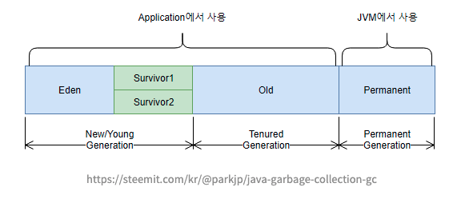

#### 1) Stop The World

가비지 컬렉션을 수행하기 위해 JVM이 애플리케이션의 실행을 일시 정지하는 것을 말한다. 가비지 컬렉션이 실행되면 GC 작업을 맡은 스레드를 제외한 나머지 스레드는 모두 멈추게되고 GC 작업이 종료되면 재개된다.

#### 2) Mark

애플리케이션이 일시 중지되면 GC는 참조되고 있는 객체와 연결된 객체를 타고 이동하며 접근 가능한 객체를 식별하는 과정

#### 3) Sweep

모든 객체 탐색이 끝나면 식별(Mark)되지 않은 객체들을 메모리에서 해제시키는 과정

#### 4) Young

\- 새롭게 생성된 객체가 할당(Allocation)되는 영역이다.

\- 대부분의 객체가 금방 Unreachable 상태가 되기 때문에, 많은 객체가 Young 영역에 생성되었다가 사라진다.

\- Young 영역에 대한 가비지 컬렉션을 Minor GC 라고 부른다.

> \*\* Minor GC  
> Young 영역 중 Eden 영역이 꽉 차게되면 발생한다. 

#### 5) Old

\- Young영역에서 Reachable 상태를 유지하여 살아남은 객체가 복사되는 영역

\- Old 영역은 Young 영역보다 크게 할당되며, 크기가 큰 만큼 가비지는 적게 발생한다.

\- 해당 영역이 가득 차면 Major GC가 발생한다.

#### 6) Eden

\- 새로 생성된 객체가 할당되는 영역이다.

\- Eden 영역이 꽉차면 GC가 발생하면서 Mark(참조 여부 식별), Sweep(메모리 해제) 과정이 일어난다.

\- 아직 사용중인 객체는 Survivor 영역으로 이동하며, Eden 영역은 비워진다.

#### 7) Survivor

\- Eden 영역이 꽉 차게 되면, GC가 발생하면서 제거된 객체 외의 나머지 살아남은 객체는 다른 Survivor 영역으로 이동하게 된다.

(한번의 Minor GC를 경험한 객체들이 저장되는 곳)

\- Survivor 두 영역중 하나는 반드시 비어있는 상태다. 만약 두 영역에 모두 데이터가 존재하거나, 사용량이 0이라면 정상적인 상황이 아니다.

> \*\* 어떤 뜻일까?
> 1) Minor GC가 발생하면 Eden과 Survivor1에 살아있는 객체를 Survivor2로 복사한다.
> 2) 그리고 Survivor1과 Eden을 Clear한다.
> 3) 결과적으로 한번의 Minor GC에서 살아남은 객체만 Survivor2영역에 남는다.  
     > 4) 그리고 다음번 Minor GC가 발생하면 같은 방식으로 Eden과  Survivor2영역에서 살아있는 객체를 Survivor1로 복사하고 클리어한다. 결과적으로 Survivor1에만 살아있는 객체가 남게된다.  
     > 4) 이렇게 반복적으로 Survivor1, Survivor2를 왔다갔다하다가, Survivor 영역에서 오래 살아남은 객체는 Old영역으로 옮겨진다. 

\- promotion 과정이 발생한다.

> \*\* promotion  
> 계속해서 살아남은 객체들은 2개의 Survivor 영역을 이동하면서, 특정 age 값을 넘어가는 경우 Old Generation으로 이동하게 된다.
>
> \*\* age  
> 객체들이 살아날때마다 age가 증가한다.

> Survivor 영역은 왜 2개일까?

메모리의 외부 단편화 발생을 방지한다. 외부 단편화란, 메모리가 할당되고 해제되기를 반복하다보면 메모리 공간은 남지만 파편화되어있어 메모리를 할당할 수 없는 문제가 발생한다. 그래서 두개의 Survivor 끼리 번갈아가며 메모리를 할당하며 이를 방지한다.

#### 8) Permanent

\- Permanent 영역은 Java8부터는 사라지고, Mataspace 영역으로 전환되었다.

\- 관련 정보 참고 : [https://johngrib.github.io/wiki/java8-why-permgen-removed/](https://johngrib.github.io/wiki/java8-why-permgen-removed/)

<br/>

## GC 종류

#### Minor GC

> 1) 자바 객체가 생성되면 처음에 Eden 영역에 저장된다.
> 2) 생성된 객체는 Minor GC가 발생할때 Survivor 영역으로 이동한다.
> 3) Survivor 영역은 Survivor1, Survivor2 두 영역으로 나뉘어지는데, Minor GC가 발생하면 Eden과 Survivor1에 활성 객체를 Survivor2로 복사한다.  
     > \-> Survivor 두 영역중에 반드시 1개의 영역에만 데이터가 존재할 수 있다. 둘 중 1개의 Survivor 영역은 반드시 빈 상태가 된다. 
> 4) 활성이 아닌 객체(GC 대상)는 Survivor1에 남아있게 되고, Survivor1 과 Eden 영역을 클리어한다. 
> 5) 1)~4)번의 과정을 반복하면서 Survivor 영역에서 오래된 객체는 Old 영역으로 옮기게된다.

\- 속도가 매우 빠르다.

\- 작은 크기의 메모리를 콜렉팅하는데 아주 효과적이다.

\- Stop The World 방식이며, Stop The World 시간이 짧다.

#### Major GC

\- Old 영역이 가득차면 발생한다.  
\- Minor GC 과정에서 삭제되지 않고, Old Generation 영역으로 옮겨진 객체 중 미사용된다고 판단되는 객체를 삭제하는 GC다.

\- Stop The World 방식이며, Stop The World 시간이 길다.

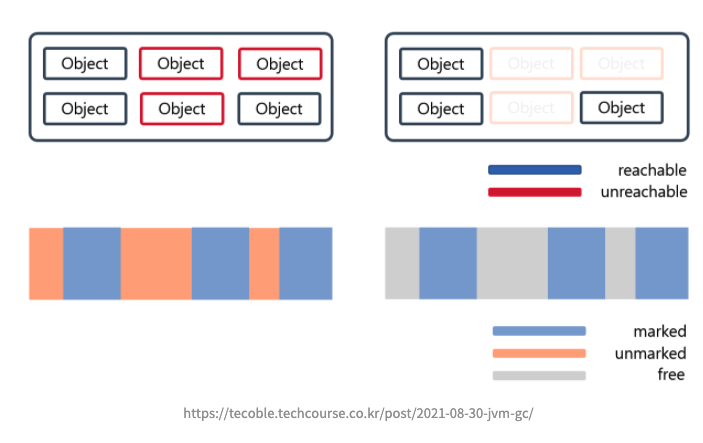

> 대표적으로 Mark & Sweep 알고리즘 사용

> 1) GC Root로부터 모든 객체들의 참조를 확인하면서 참조가 연결되지 않은 객체를 Mark 한다.
> 2) 1)번의 작업이 끝나면 사용되지 않는 객체를 모두 표시하고 이 표시된 객체를 Sweep 한다.

> \*\* GC Root란?  
> Runtime Data Area에서 Method Area, Native Stack(JNI), Java Stack 등에서 Heap 메모리의 Object들을 참조하는 데이터 영역

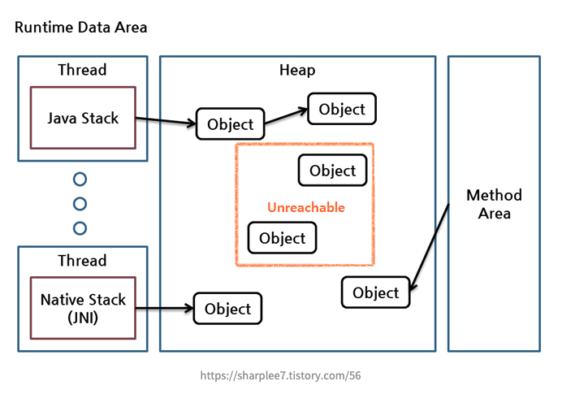

#### Full GC

\- Heap 메모리 전체 영역에서 발생한다.  
\- Old, Young 영역 모두에서 발생하는 GC이다.  
\- Minor GC, Major GC 모두 실패했거나, Young 영역와 Old 영역 모두 가득 찼을때 발생한다.

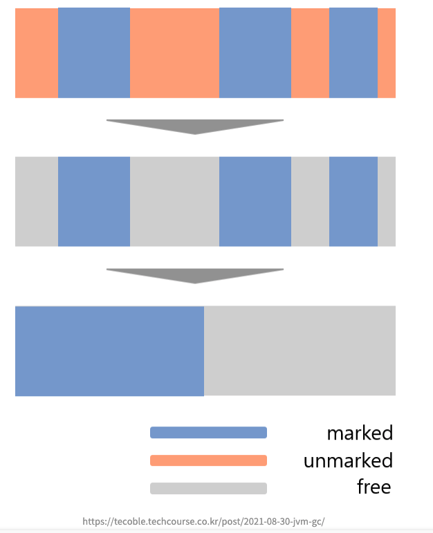

> 대표적으로 Mark & Sweep & Compact 알고리즘 사용

> 1) 전체 객체들의 참조를 확인하면서 참조가 연결되지 않은 객체를 Mark 한다.
> 2) 1)번의 작업이 끝나면 사용되지 않는 객체를 모두 표시하고 이 표시된 객체를 Sweep 한다.
> 3) 메모리를 정리하여, 메모리 단편화를 해결할 수 있도록 한다. 

\- 속도가 매우 느리다.

\- Full GC가 일어나는 도중에는 순간적으로 자바 애플리케이션이 중지되기 때문에 애플리케이션의 성능과 안정성에 큰 영향을 준다.

> MinorGC 와 MajorGC로 구분되는 이유는?

JVM은 Heap 영역을 설계할때 알개 2가지 전제조건으로 설계되었다.

1\. 대부분의 객체가 금방 접근 불가능한 상태가 된다.

2\. 오래된 객체에서 새로운 객체로의 참조는 드물게 존재한다.

객체는 일회성인 경우가 많고, 메모리에 오래 남아있는 경우가 드물기 때문에 young, old 영역으로 분리하여 설계하였다. 따라서 자주 발생하는 MinorGC, Old 영역이 가득 찰때 발생하여 비교적 적게 발생하는 Major GC로 나눠져서 발생한다.

<br/>

## GC 종류

> \- JVM 버전에 따라 여러가지 GC 방식이 추가되고 발전된다.  
> \- 사용자가 JVM 옵션 설정을 통해 GC 방식을 변경할 수 있다.

#### 1) Serial Garbage Collector

\- 가장 단순한 방식의 GC로 싱글 스레드(스레드 1개)로 동작한다.

\- 싱글 스레드로 동작하여 느리고, 그만큼 Stop The World 시간이 다른 GC에 비해 길다.

\- **Mark & Sweep & Compact** 알고리즘을 사용한다.

> \- Mark : Old 영역에서 살아 있는 객체를 식별한다.  
> \- Sweep : 모든 객체 탐색이 끝나면 식별(Mark)되지 않은 객체들을 메모리에서 해제시킨다.  
> \- Compaction : 각 객체들이 연속되게 쌓이도록 Heap의 가장 앞 부분부터 채워서 객체가 존재하는 부분과 객체가 없는 부분으로 나눈다.

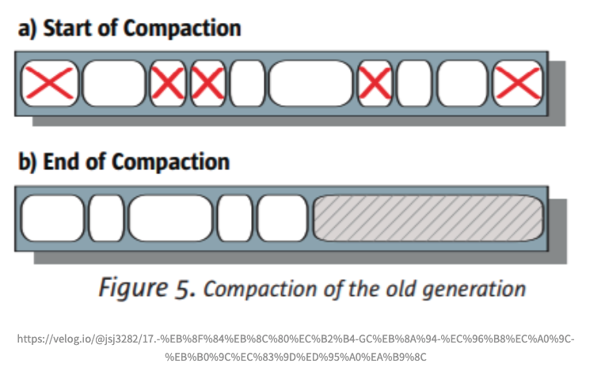

\- Compaction 후의 이미지를 보면, 객체가 존재하는 부분과 객체가 없는 부분으로 나눠져있다.  즉, Compaction은 필요 없는 객체들을 지우고 살아있는 객체들을 한 곳으로 모은다

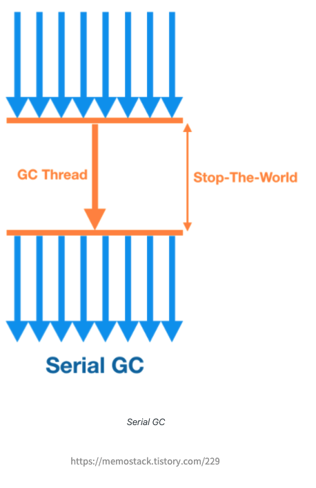

#### 2) Parallel Collector(=Throughput Collector)

\- Java 8의 default GC 이다.

\- Young 영역의 GC를 멀티 스레드 방식을 사용하여, Serial GC에 비해 상대적으로 Stop The World 가 짧다.

\- 그림에 보이듯, GC Thread 가 여러개이다. GC 프로세스가 더 빠르게 동작하고 Stop The World 시간을 좀더 줄일 수 있게되었다.

\- Mark & Sweep & Compact 알고리즘을 사용한다.

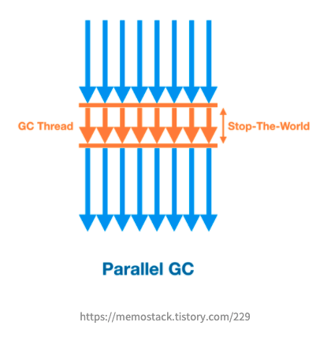

#### 3) Parallel Old GC

\- 위 2) Parallel GC 에서 조금 더 업그레이드된 버전이다. Old GC도 병렬로 수행할 수 있도록 한다.

\- Mark & Summary & Compaction 알고리즘을 사용한다.

> Mark & Summary & Compaction 알고리즘

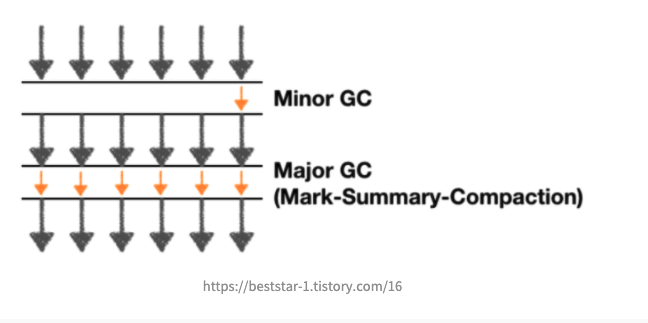

> 1) Mark : Old Generation을 Region이라는 논리적인 단위로 균일하게 나누고, 각 스레드들을 Region 별로 사용되는 객체를 표시한다.
>
> 2) Summary  
     > \- region별 통계정보로 살아남은 객체들의 밀도가 높은 부분이 어디까지인지 dense prefix를 정한다.  
     > \- 오랜 기간 참조된 객체는 앞으로 사용할 확률이 높다는 가정 하에 dense prefix를 기준으로 compact 영역을 줄인다.
>
> 3) Compaction : destination과 source로 나누어, 살아남은 객체는 destination으로 이동시키고 참조되지 않는 객체는 제거한다.

\- Old GC 처리량을 늘려주기위한 Summary 작업을 추가적으로 진행한다.

#### 4) CMS Collector (Concurrent Mark-Sweep)

\- Stop The World로 Java Application이 멈추는 현상을 줄이고자 만든 GC 이다.

\- Young 영역은 위 3) Parallel GC 와 동일하다.

\- Old 영역은 Reacable 한 객체를 한번에 찾지 않고 나눠서 찾는 아래 1)~4)단계의 방식을 사용한다.

Old 영역의 GC 과정

> 1) Initial Mark : GC Root가 참조하는 객체만 마킹한다. (stop-the-world 발생하지만, 탐색 깊이가 얕아서 발생 시간이 매우 짧다.)
> 2) Concurrent Mark : stop-the-world  없이 진행된다. 참조하는 객체를 따라가며, 지속적으로 마킹한다. 
> 3) Remark : Concurrent Mark 과정에서 변경된 사항이 없는지 다시 한번 마킹하며 확정한다. (stop-the-world 발생하는데, 이 지속시간을 줄이기 위해 멀티스레드로 검증 작업을 수행한다.)
> 4) Concurrent Sweep : stop-the-world 없이 진행된다. 접근할 수 없는 객체를 제거한다.

위와 같이 stop-the-world의 발생 시간을 최소한으로 한다.

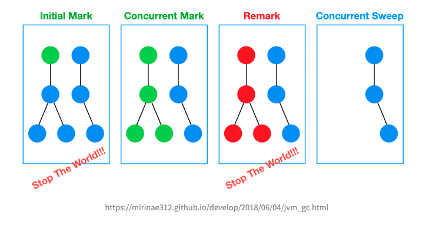

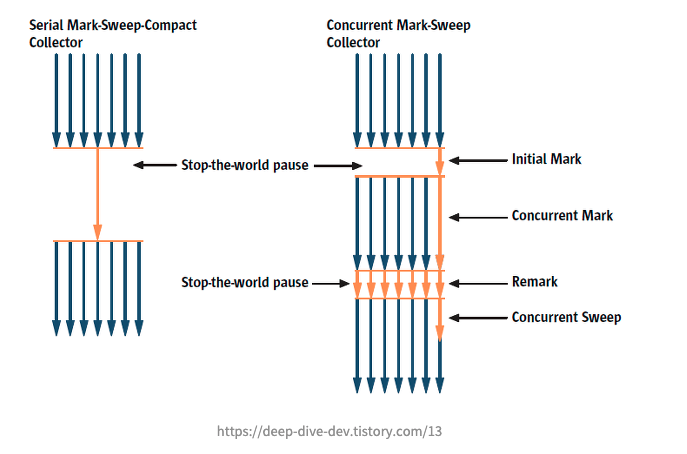

\- Compacting 하지 않는다.

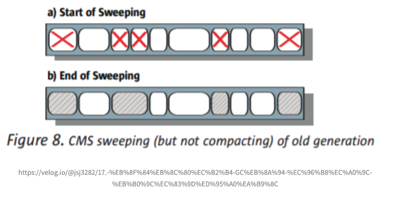

#### 5) G1 Collector (Garbage First)

\- Java9 이상의 default GC 이다.

\- 현재 GC 중 stop-the-world의 시간이 제일 짧다.

\- CMS GC 를 개선하여 만든 GC로 위에서 살펴본 GC와는 다른 구조를 가진다. (아래 그림 참고)

\- Heap을 Region 이라는 일정한 부분으로 나눠서 메모리를 관리한다.

\- 전체 Heap에 대해서 탐색하지 않고 부분적으로 Region 단위로 탐색하여, 각각의 Region에만 GC가 발생한다.

\- Young 영역과 Old 영역이 물리적으로 나뉘어있지 않고, 해당 영역의 객체들을 Region 이라는 구역에 할당한다.

> 각 지역을 역할과 함께 논리적으로 구분(Eden 영역인지, Survivor 영역인지, Old 영역인지)하여, 객체를 할당한다.

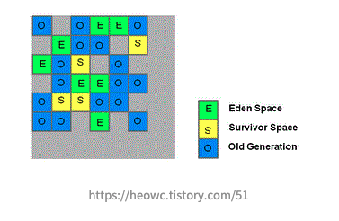

\- 개선하여 만든 GC로 위에서 살펴본 GC와는 다른 구조를 가진다. (아래 그림 참고)

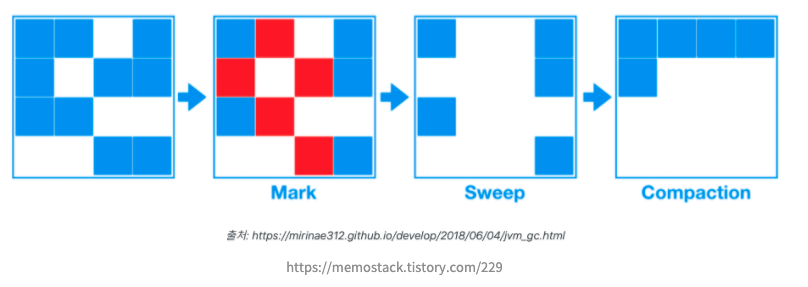

<br/>

## GC의 동작 방식

1. 새로운 객체가 Eden 영역에 할당된다.

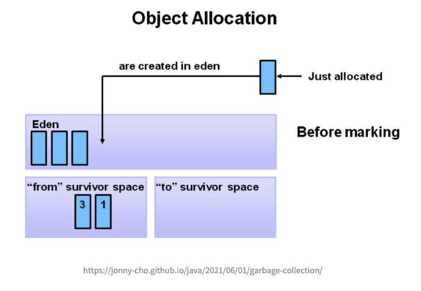

2. Eden 영역이 꽉차면 Minor GC가 발생된다.

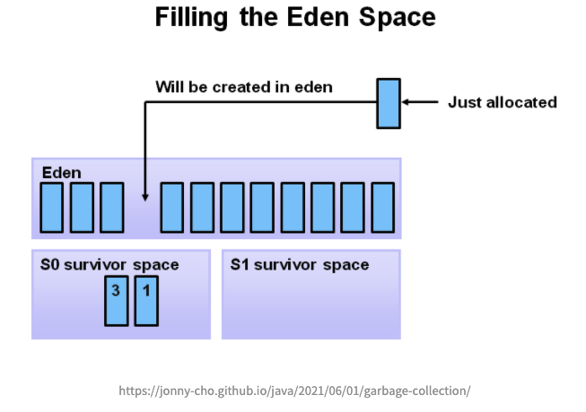

3. Mark 과정에서 살아남은 객체들은 Survivor0 영역으로 복사하고, Eden 영역에 있는 데이터들을 삭제한다.

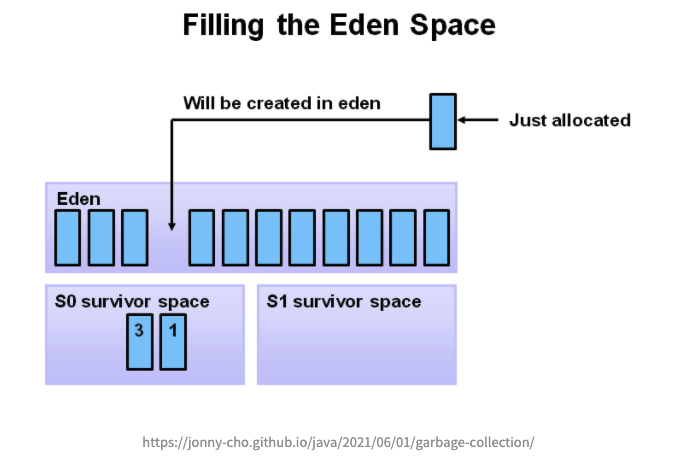

4. 그 다음 Minor GC가 일어났을 때는, Eden영역과 Survivor0 영역을 모두 mark하고 살아남은 객체들은 Survivor1 영역으로 복사하고, Eden 영역과, Survivor0 영역의 데이터를 삭제한다.

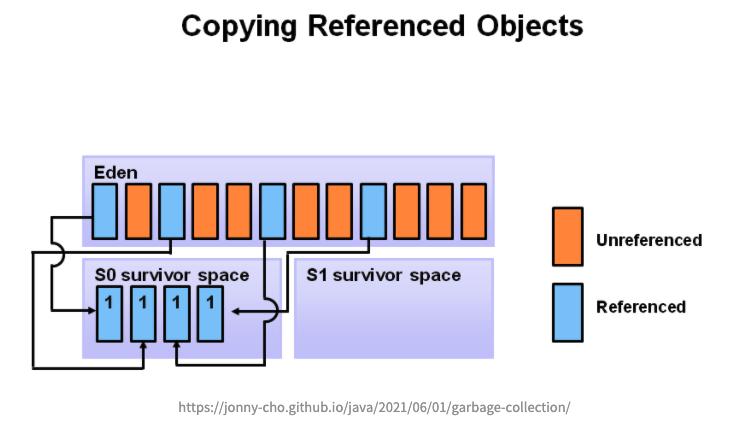

5. 특정 age에 도달한 객체들은 Old generation 영역으로 옮겨진다. Young generation에서 Old generation으로 옮겨지는 현상을 promotion 이라한다.

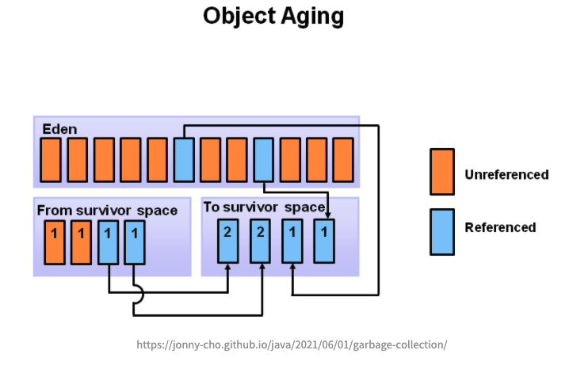

<br/>
<br/>

## Q&A


<br/>

### Major GC와 Full GC를 헷갈렸던 이유는?
- 블로그 글을 보다보면 Major GC (Full GC) 이런식으로 동일하게 써놓은 글이 많은데, 생각해봤을때 이유는 모두 Old 영역에서 발생하는 GC 설명시에 보여지는데, 두개 GC 모두 Old 영역에서 발생할 수 있기 때문인것 같다. 각 특징은 위에 다시 정리한 내용을 참고하면 될것같다.

### Survivor 영역이 2개인 이유?
- 메모리의 외부 단편화 발생을 방지한다. 외부 단편화란, 메모리가 할당되고 해제되기를 반복하다보면 메모리 공간은 남지만 파편화되어있어 메모리를 할당할 수 없는 문제가 발생한다. 그래서 두개의 Survivor 끼리 번갈아가며 메모리를 할당하며 이를 방지한다.

<br/>

### MinorGC 와 MajorGC로 구분되는 이유는?
- JVM은 Heap 영역을 설계할때 알개 2가지 전제조건으로 설계되었다.

1. 대부분의 객체가 금방 접근 불가능한 상태가 된다.
2. 오래된 객체에서 새로운 객체로의 참조는 드물게 존재한다.

객체는 일회성인 경우가 많고, 메모리에 오래 남아있는 경우가 드물기 때문에 young, old 영역으로 분리하여 설계하였다. 따라서 자주 발생하는 MinorGC, Old 영역이 가득 찰때 발생하여 비교적 적게 발생하는 Major GC로 나눠져서 발생한다.

<br/>

#### Reference

[https://steemit.com/kr/@parkjp/java-garbage-collection-gc](https://steemit.com/kr/@parkjp/java-garbage-collection-gc)

[https://spurdev.tistory.com/10](https://spurdev.tistory.com/10)

[https://blog.metafor.kr/163](https://blog.metafor.kr/163)

[https://lemonlemon.tistory.com/175](https://lemonlemon.tistory.com/175)

[https://mangkyu.tistory.com/118](https://mangkyu.tistory.com/118)

[https://jonny-cho.github.io/java/2021/06/01/garbage-collection/](https://jonny-cho.github.io/java/2021/06/01/garbage-collection/)

[https://m.blog.naver.com/PostView.naver?isHttpsRedirect=true&blogId=kbh3983&logNo=220967456151](https://m.blog.naver.com/PostView.naver?isHttpsRedirect=true&blogId=kbh3983&logNo=220967456151)

[https://velog.io/@jsj3282/17.-%EB%8F%84%EB%8C%80%EC%B2%B4-GC%EB%8A%94-%EC%96%B8%EC%A0%9C-%EB%B0%9C%EC%83%9D%ED%95%A0%EA%B9%8C](https://velog.io/@jsj3282/17.-%EB%8F%84%EB%8C%80%EC%B2%B4-GC%EB%8A%94-%EC%96%B8%EC%A0%9C-%EB%B0%9C%EC%83%9D%ED%95%A0%EA%B9%8C)

[https://memostack.tistory.com/229](https://memostack.tistory.com/229)

[https://devhyeon0312.tistory.com/17](https://devhyeon0312.tistory.com/17)