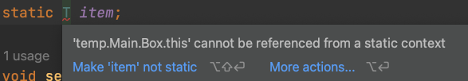
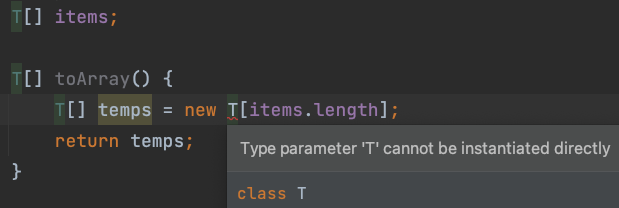
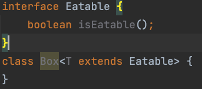
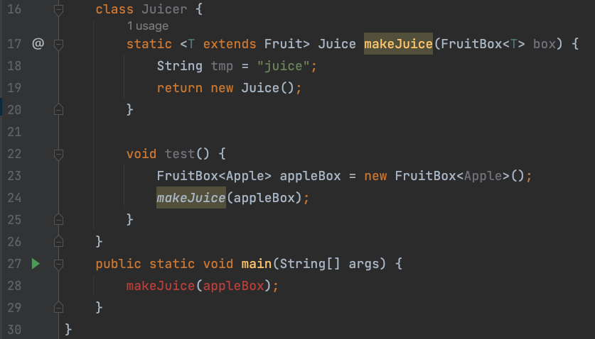

### 의미

객체의 타입을 컴파일 시에 체크해주는 기능

클래스나 메서드에서 사용할 내부 데이터 타입을 컴파일 시에 미리 지정하는 방법

클래스 내부에서 지정하는 것이 아니라 , 외부에서 사용자에 의해 지정된다.

### 장점

타입 안정성을 높인다.

불필요한 형변환을 하지 않도록 도와준다

### 예시 형태

```java
class Box<T> {
    T item;

    void setItem(T item) {
        this.item = item;
    }

    T getItem() {
        return item;
    }
}
```

여기서 T 를 타입 변수라고 한다. T 대신 E, V, K 등 상황에 맞게 의미있는 문자를 선택해서 사용할 수 있다.

Box<T> : 제네릭 클래스, ‘T의 Box’ 또는 ‘T Box’ 라고 읽는다. 의미는 타입 T를 요소로 하는 Box 클래스 이다.

Box : 원시 타입 이라고 읽는다.

### 제네릭 타입 호출

제네릭 클래스가 된 Box 인스턴스를 생성할 때는 실제 타입을 지정해주면 된다.

```java
Box<String> b = new Box<String>();
b.setItem("ABC");
String item = b.getItem();
```

### Q. static 멤버에 타입 변수를 지정할 수 있을까?



static 멤버는 타입의 종류에 관계없이 동일한 변수여야 하므로, 타입이 달라지면 안된다. 즉, 타입 변수를 지정할 수 없다.

### Q. 제네릭 타입의 배열을 선언할 수 있을까?



T 타입의 배열을 위한 참조변수 **선언**은 가능하다.

하지만, 제네릭 배열을 **생성할 수는 없다**. 위와 같이 에러가 발생한다.

이유 : new 연산자는 컴파일 시점에 타입을 정확히 알아야 하는데 제네릭을 사용하게 되면 타입을 알 수 없으니까 에러가 발생한다. instanceof 연산자도 마찬가지로 타입 변수(T)를 사용할 수 없다.

### 타입 생략이 가능하다. (JDK 1.7이후)

```java
Box<Apple> appleBox = new Box<>(); // 가능 : 타입 생략 
Box<Apple> appleBox = new Box<Apple>(); // 가능
```

### Q. T implements XXX 가 맞을까 T extends XXX 이 맞을까?



T implements XXX 로 하면 인식할 수 없다.

만약, 클래스도 상속받고, 인터페이스도 구현해야 한다면 & 기호로 연결하면 된다.

```java
class Box<T extends Fruit & Eatable> // extends 를 이용하여 타입 변수의 타입 종류를 제한할 수 있다.
```

## 제네릭 메서드

메서드의 선언부에 제네릭 타입이 선언된 메서드를 제네릭 메서드라고 한다.

```java
class FruitBox<T> {

/* 
    ? 는 와일드카드라고 읽는다. 
    여기선 , T 또는 T의 super 클래스들만 Comparator < > 의 타입으로 올 수 있다는 의미이다. 
*/

  static <T> void sort(List<T> list, Comparator<? super T> c) 
}
```

FruitBox 의 타입 매개변수 T와, 제네릭 메서드 sort() 에 선언된 타입 매개변수 T는 타입 문자만 같을 뿐, 서로 다른 것이다.

static 메서드에는 제네릭 타입을 선언하고 사용할 수 있다.

```java
class FruitBox<T> {
...
}
static class Juice {
...
}
class Fruit {
...
}
class Juicer {
    static <T extends Fruit> Juice makeJuice(FruitBox<T> box) {
        String tmp = "juice";
        return new Juice();
    }
}

FruitBox<Apple> appleBox = new FruitBox<Apple>();

호출 시,
Juicer.makeJuice(appleBox);  // 가능
Juicer.<Fruit>makeJuice(appleBox);  // 가능 ( T extends Fruit )
Juicer.<Apple>makeJuice(appleBox);  // 가능
```



(line 24) : 같은 클래스 내에 있는 멤버들끼리는 makeJuice 처럼 앞에 클래스이름(Juicer) 를 생략할 수 있지만,

(line 28) : 클래스 외부에서는 반드시 클래스 이름을 써줘야 한다.

## Reference
- Java의 정석 3판