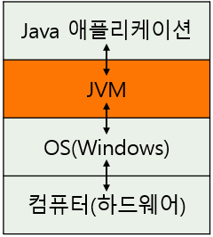
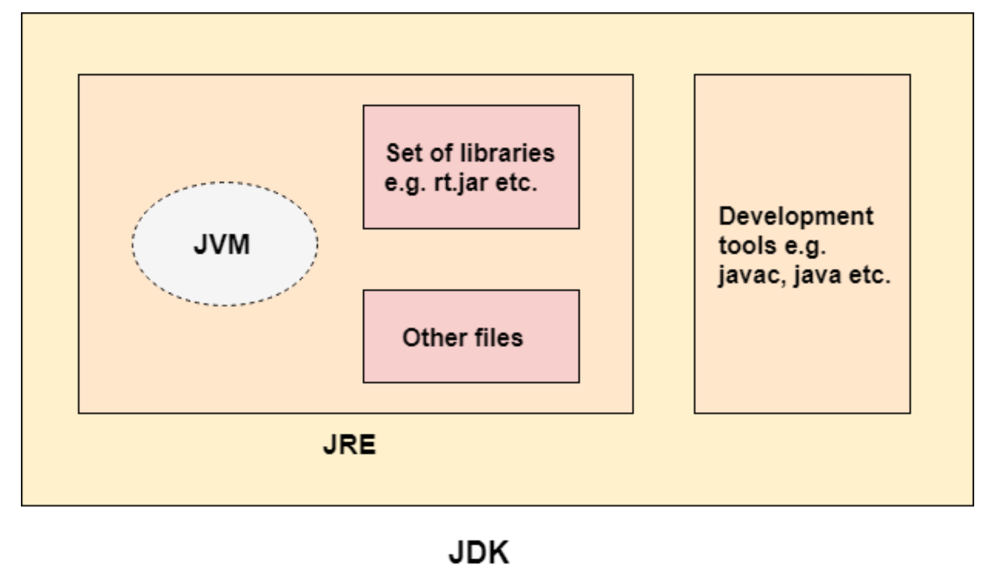
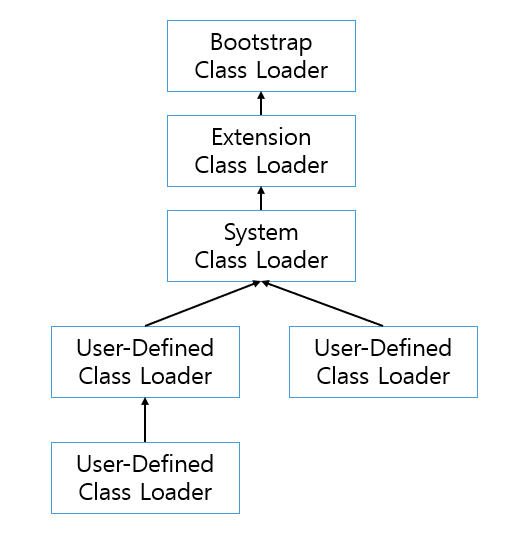
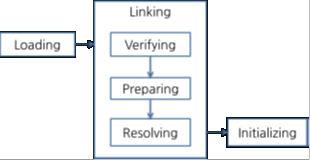

## JVM (Java Virtual Machine)
Java 프로그램이 플랫폼에 의존하지 않고, 어디서든 동작 가능하도록 하기 위한 Java 가상머신이다.

C/C++ 언어는 CPU 아키텍처, 운영체제 등 플랫폼 환경에 의존성을 가지기 때문에, 플랫폼이 바뀌면 제대로 동작하지 않는 문제가 있다. (크로스 컴파일을 통해, 타겟 플랫폼에 맞춰서 컴파일 해줘야함)

Java의 경우 이러한 문제를 해결하기 위해 JVM을 만들었다.

### JVM의 특징
__스택 기반의 가상머신__
- 대표적인 컴퓨터 아키텍처인 인텔 x86아키텍처, ARM 아키텍처와 같은 하드웨어가 레지스터 기반으로 동작하는 데 비해 JVM은 스택 기반으로 동작한다.

__심볼릭 레퍼런스__
- 기본 자료형(primity data type)을 제외한 모든 타입(클래스와 인터페이스)을 명시적인 메모리 주소 기반의 레퍼런스가 아니라 심볼릭 레퍼런스를 통해 참조한다.

__가비지 컬렉션__
- 클래스 인스턴스는 사용자 코드에 의해 명시적으로 생성되고 가비지 컬렉션에 의해 자동으로 파괴된다.

__기본 자료형을 명확하게 정의하여 플랫폼 독립성 보장__
- C/C++등의 전통적인 언어는 플랫폼에 따라 int형의 크기가 변한다. JVM은 기본 자료형을 명확하게 정의하여 호환성을 유지하고 플랫폼 독립성을 보장

> 심볼릭 레퍼런스  
> 참고하는 클래스의 특정 메모리 주소를 참조관계로 구성한 것이 아니라,
> 참조하는 대상의 이름만을 지칭한 것이다. Class 파일이 JVM에 올라가게 되면 
> 심볼릭 레퍼런스는 그 이름에 맞는 객체의 주소를 찾아서 연결하는 작업을 수행한다. 그러므로 실제 메모리 주소가 아니라 이름만을 가진다.

### JDK(Java Development Kit) vs JRE(Java Runtime Environment)
JVM, JRE, JDK는 3대 자바 프로그래밍의 기술 패캐지로 불린다.  
JDK는 자바 기반의 소프트웨어를 개발하기 위한 도구이며, JRE는 자바 코드를 실행하기 위한 환경이다. JDK는 JRE를 가지고 있고 컴파일러도 가지고 있다.

## JVM 아키텍처

클래스로더(Class Loader)가 컴파일된 자바 바이트 코드를 메모리영역에 로드하고, 실행엔진(Execution Engine)이 자바 바이트코드를 실행한다.

> 바이트코드(bytecode)  
> 특정 하드웨어가 아닌 가상 컴퓨터(Virtual Machine)에서 돌아가는 실행 프로그램을 위한 이진 표현법으로 하드웨어가 아닌 소프트웨어에 의해 처리되기에 기계어보다 추상적이다.

### Class Loader
Java 바이트 코드(.class)를 Runtime Memory Area에 적재하는 역할을 함

자바는 런타임에 클래스를 처음으로 참조할 때 해당 클래스를 로드하고 링크하는 특징이 있다.

이 동적 로드를 담당하는 부분이 JVM의 클래스 로더이다.  
클래스 로더의 특징은 다음과 같다.

__계층 구조__  
클래스 로더끼리 부모-자식 관계를 이뤄 계층 구조로 생성된다. 여기서 최상위 클래스 로더는 부트스트랩 클래스 로더(Bootstrap Class Loader)이다.

__위임 모델__  
계층 구조를 바탕으로 클래스 로더끼리 로드를 위임하는 구조로 동작한다. 클래스를 로드할 때 위임하는 구조로 동작한다. 클래스를 로드할 때 먼저 상위 클래스 로더를 확인하여 상위 클래스 로더에 있다면 해당 클래스를 사용하고 없다면 로드를 요청받은 클래스로더가 클래스를 로드한다.

- Bootstrap Class Loader
  - `JAVA_HOME\lib` 에 있는 코어 자바 API를 제공한다. 최상위 우선순위를 가진 클래스 로더
- Extension Class Loader
  - `JAVA_HOME\lib\ext` 폴더 또는 java.ext.dirs 시스템 변수에 해당하는 위치에 있는 클래스를 읽는다.
- Application Class Loader
  - 애플리케이션 클래스 패스 (애플리케이션 실행할 때 주는 `-classpath` 옵션 또는 `java.class.path` 환경 변수에 값에 해당하는 위치)에서 클래스를 읽는다.
- User-Defined Class Loader
  - 애플리케이션 사용자가 직접 코드 상에서 생성해서 사용하는 클래스 로더

__가시성(visibility)제한__  
하위 클래스 로더는 상위 클래스 로더를 찾을 수 있지만 상위 클래스 로더는 하위 클래스로더의 클래스를 찾을 수 없다.

__언로드 불가__  
클래스 로더는 클래스를 로드할 수 있지만 언로드 할 수는 없다. 언로드 대신, 현재 클래스로더를 새로 삭제하고 아예 새로운 클래스 로더를 생성하는 방법을 사용할 수 있다.

### Class Loader 과정

클래스 로더가 아직 로드되지 않은 클래스를 찾으면, 다음 그림과 같은 과정을 거쳐 클래스를 로드하고 링크하고 초기화한다.

__Loading__
Bootstrap, Extension, Application 컴포넌트들에 의해 클래스들이 로드된다.

이 세가지 로더들은 모두 상속관계로 정의되어 있으며 delegate(위임) 방식으로 작업을 진행한다.

__Linking__
- 검증(Verifying)
  - 읽어들인 클래스가 자바 언어 명세 및 JVM 명세에 명시된 대로 잘 구성되어 있는지 검사한다.
- 준비(Preparing)
  - 클래스가 필요로 하는 메모리를 할당하고, 클래스에서 정의된 필드, 메서드, 인터페이스들을 나타내는 데이터 구조를 준비한다.
- 분석(Resolving)
  - 클래스의 상수 풀 내 모든 심볼릭 레퍼런스를 다이렉트 레퍼런스로 변경한다.

__Initializing__
클래스 변수들을 적절한 값으로 초기화 한다. 즉, static initializer들을 수행하고, static 필드들을 설정된 값으로 초기화 한다.

### Runtime Memory Area
JVM 메모리를 Runtime Memory Area라고 부른다.

__Method Area__  
- Class Area, Code Area, Static Area 등으로 불리는 해당 영역은 코드에서 사용되는 클래스 파일을 클래스로더로 읽어 클래스별로 런타임 상수풀, 필드데이터, 메소드 데이터, 메소드 코드, 생성자 코드 등을 분류해서 저장한다.
- 모든 스레드가 공유하는 공간  
- JVM이 실행될 때 생성됨

> Runtime Constant Pool (런타임 상수 풀)  
> 상수 풀은 말 그대로 상수를 저장하는 공간이다. 이외에도 필드나 메소드 등의 Reference 값들을 저장하고 있고 실행중에 중복되는 정보가 필요할 때에 기존의 정보를 사용하도록 도와준다.

__Heap Area__  
- new 연산자를 통해 동적으로 생성되는 객체가 저장되는 공간
- Heap에 저장된 데이터는 메모리 관리가 필요한 GC 대상
- 모든 스레드가 공유하는 공간
- JVM이 실행될 때 생성됨

__Stack__  
- 프레임(Frame)이 저장되는 공간  
    - Frame : 메소드 데이터가 저장되는공간 (메소드 파라미터, 지역변수, 참조 주소값 등)
- 다른 스레드와 공유하지 않고 각각의 스레드마다 가지는 공간
- 프레임은 메소드(method)가 실행될 때, Stack에 push 하여 추가된다.
- 반대로, 메소드가 종료되면 Stack에서 pop 되어 제거된다.

__PC Register__  
쓰레드가 생성될 때마다 생성되는 영역으로 현재 쓰레드가 실행되는 부분의 주소와 명령을 저장하고 있는 영역이다. 이것을 이용해 쓰레드를 돌아가며 수행할 수 있게한다.

__Native Method Stack__  
자바 스레드와 네이티브 코드(C, C++)로 작성된 코드 사이를 매핑하는 역할을 한다.

이 메소드는 네이티브 라이브러리(Native Library)와 연결된다. 이 때의 라이브러리는 자바로 쓰여진 것이 아니라 C와 같은 다른 언어로 작성된 것이다.

이러한 라이브러리는 레거시 데이터 혹은 성능을 위해서 사용되었는데 자바의 라이브러리도 발전을 하면서 점차 쓰이지 않게 되었다.

이러한 네이티브 코드는 프로그래머가 JNI(Java Native Interface)를 통해서 호출할 수 있다.

### Execution Engine
클래스 로더에 의해 메모리에 적재된 클래스(Bytecodes)들을 기계어로 변경해 명령어 단위로 실행하는 역할을 한다.

Execution Engine이 실행하는 두 가지 방식이 존재한다.

__Interpreter__
- 인터프리터 방식은 바이트코드를 한줄씩 해석하고 실행한다. 속도가 느리다는 단점이 있다.

__JIT(Just In Time)__
- 기존 인터프리터 방식의 느리다는 단점을 극복하기 위한 방법
- 컴파일 방식과 인터프리터 방식을 혼합한 방식을 이용함

그리고 더 이상 참조되지 않는 객체를 모아서 정리하는 GC(Garbage Collector)가 있다.

## JMM (Java Memory Model)

자바 메모리 모델은 특정 스레드에서 메모리를 대상으로 취하는 작업이 다른 스레드에게 어떻게 보이는지의 여부를 명시하고 있다.

> 메모리 모델  
> 프로그램이 메모리 구조에서 어느정도의 기능을 사용할 수 있을지에 대한 정보를 제공하고, 
> 메모리의 내용을 서로 공유하고자 할 때 프로세스 간의 작업을 조율하기 위한 특별한 명령어(memory barrier)로는 어떤 것들이 있으며 어떻게 사용해야 하는지에 대한 정보를 제공한다.

---

### Reference
https://memostack.tistory.com/226

https://happy-coding-day.tistory.com/123

https://velog.io/@litien/JVM-%EA%B5%AC%EC%A1%B0

https://catsbi.oopy.io/df0df290-9188-45c1-b056-b8fe032d88ca

https://d2.naver.com/helloworld/1230

https://getchan.github.io/til/java_memory_model/