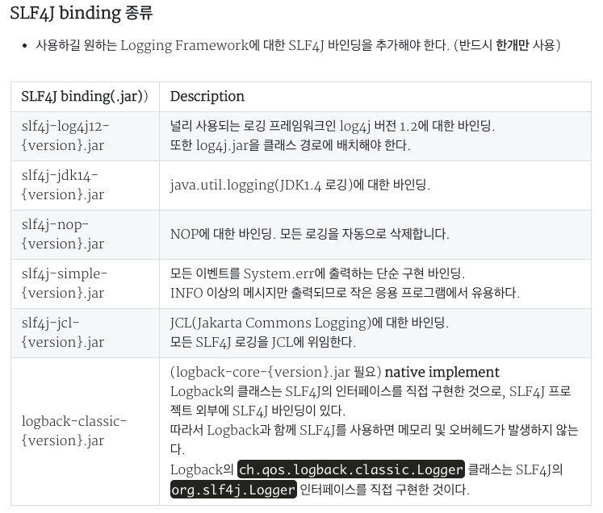
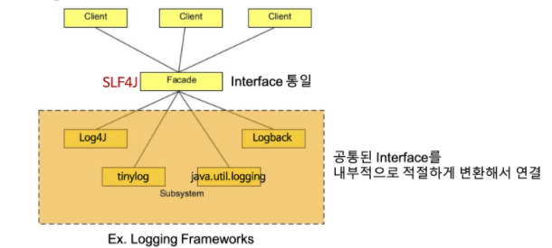

## logging

시스템을 작동할 때 시스템의 작동 상태의 기록과 보존, 이용자의 습성 조사 및 시스템 동작의 분석 등을 하기 위해 작동중의 각종 정보를 기록해둘 필요가 있다. 이 기록을 만드는 것을 로깅이라 한다. 즉 로그 시스템의 사용에 관계된 일련의 사건들을 시간의 경과에 따라 기록하는 것이다.

## 로깅은 왜 필요할까?

1. 개발 할 때, 디버깅 시 사용할 수 있다.
2. 사용자의 이벤트를 추적할 수 있다.

## System.out.println 으로 로깅을 하면 안되는 이유

- 에러 발생 시 추적할 수 있는 최소한의 정보(날짜, 시간, 특정 클래스, 로그 타입(error, info, warn, debug 등))가 없다.
- 출력된 로그 내용을 서버로 전송할 수 없다.
- 로그 필터링을 할 수가 없다. 특정 로그 수준에 속하는 메시지를 비활성화할 수 있는 기능들이 없다.
- 스레드에 안전하지 않다.
- println은 매 실행시마다 스트림을 생성하고, IO 작업을 실행하는 Blocking 방식이다. 이는 성능상에 문제를 야기하여 운영 중인 서버의 실시간 처리량에 큰 영향을 미치게 된다.

## SLF4J(****Simple Logging Facade For Java)****

로깅에 대한 추상 레이어를 제공하는 인터페이스의 모음.

추상 로깅 프레임워크이기 때문에, 구현체가 없이 단독으로 사용하지 않는다.

API , Binding , Bridging 라는 세 가지 모듈을 제공한다.

### 구성요소 1. API 
- slf4j 에서 제공하는 api 들을 의미
### 구성요소 2. Binding
- 로깅 구현체와 연결하는 것, 컴파일 타임에 오직 하나의 로깅 프레임워크를 사용하도록 바인딩 한다.




### 구성요소 3. Bridging
- log4j, JCL, JUL 과 같은 다른 로깅 API 를 사용하더라도 내부에서는 SLF4J API 를 호출하도록(리디렉션) 어댑터 역할을 해주는 라이브러리

### Facade 패턴



- 여러 개의 클래스가 하나의 역할을 수행할 때, 대표적인 인터페이스만을 다루는 클래스를 두어 원하는 기능을 처리할수 있게 도와주는 패턴이다.
- 클라이언트는 Facade에 요청을 전송하여 Subsystem과 통신하며, Facade는 해당 요청을 적절한 Subsystem 객체로 전달한다.
- Subsystem 객체가 실제 작업을 수행하지만 Facade는 인터페이스를 Subsystem 인터페이스로 변환하기 위해 자체 작업을 수행해야 할 수도 있다.   즉, 공통된 Interface를 적절하게 변환해서 연결한다.
- Facade를 사용하는 클라이언트는 Subsystem 객체에 직접 액세스할 필요가 없다.  즉, 클라이언트는 Subsystem을 알 필요 없이 Common Interface에만 접근한다.

### SLF4J 사용 시 주의사항

1. 클래스를 컴파일하고 실행해보자. ( slf4j 라이브러리는 임포트 되어있음 )

```java
import org.slf4j.Logger;
import org.slf4j.LoggerFactory;
public class HelloWorld {   
    public static void main(String[] args) {      
        Logger logger = LoggerFactory.getLogger(HelloWorld.class);  
        logger.info("Hello World");   
    }
}
```

2. 실행 하면, 로그 출력은 제대로 되지 않고, 경고가 발생한다.

```java
SLF4J: Failed to load class "org.slf4j.impl.StaticLoggerBinder". 
SLF4J: Defaulting to no-operation (NOP) logger implementation 
SLF4J: See http://www.slf4j.org/codes.html#StaticLoggerBinder for further details.
```

- 이 경고는 class path에서 slf4j 구현체를 찾을 수 없기 때문에 출력된다.
  즉, class path에 사용하길 원하는 Logging Framework에 대한 slf4j 바인딩(.jar)을 추가해야 한다.
  이때, 둘 이상의 slf4j 바인딩(반드시 하나만)을 두면 안된다.
- Logging Framework를 전환하려면 class path에서 slf4j 바인딩을 변경한다.
    
- Ex) java.util.logging —> log4j로 전환하려면  
  slf4j-**jdk14**-1.7.25.jar —> slf4j-**log4j12**-1.7.25.jar로 변경

## Log4j

Java 기반 로깅 프레임워크

### 구성요소 1. Logger

메세지를 기록하는데 사용한다.

### 구성요소 2. Appender

파일, DB, Console 등과 같은 대상에 로깅 정보를 출력하는 데 사용한다.

### 구성요소 3. Layout

로깅 정보의 스타일을 정하는데에 사용한다.

### 로그 레벨 ( 우측으로 갈수록 심각함 )

Trace < Debug < Info < Warn < Error < Fatal

## LogBack

log4j 를 기반으로 속도, 메모리 사용률 등 성능을 개선하여 개발한 로깅 라이브러리

1. **Automatic Reloading Configuration file**

실행중인 프로그램의 로그 설정을 변경하고 싶을 때, 기존의 다른 라이브러리의 경우 실행중인 프로그램의 재시작이 필요하지만, LogBack의 경우 설정파일을 스캔하는 별도의 쓰레드를 두어 **지정한 시간마다 설정파일을 스캔**해 프로그램의 재시작 없이 설정을 적용시킬 수 있다.

2. **Automatic Compression / Removal**

로그 파일을 생성할 때 별도의 프로그램을 통해 압축이 필요 없도록 **자동 압축**을 지원하며, 시간 또는 갯수를 설정하여 설정한 시간이나 갯수를 초과할 경우 로그 파일이 **자동으로 삭제** 되도록 할 수 있다.

3. **Graceful recovery from I/O failures**

로그파일은 JDBC, Socket 등의 Appender를 통해 원격 서버에 저장시킬 수 있다. 하지만 만약 원격서버 또는 연결에 일시적 장애가 발생하여 로그파일의 I/O Failure이 발생 할 경우, Log4J 와 같은 기존 라이브러리에서는 서버 복구시점까지의 **프로그램 중단 및 재시작**이 필요하지만, LogBack은 서버 중지 없이, 장애 발생시점으로부터의 자동복구를 지원한다.

4. **Prudent mode**

하나의 서버에서 동작하는 여러 JVM의 로그가 하나의 로그파일로 기록되기를 원할 경우 사용할 수 있는 기능

## 참고) Log4j2 vs Logback
- log4j2는 log4j에서 더 성능을 개선한 라이브러리 이다.  
- log4j2 는 멀티 스레드 환경에서 logback 보다 성능이 뛰어나다고 한다.

- 그렇지만, 스프링부트 에서는 **slf4j + logback** 을 기본적으로 채택하고 있다.

출처 : [https://logging.apache.org/log4j/2.x/performance.html](https://logging.apache.org/log4j/2.x/performance.html)

## 권장 로그레벨 ( feat. 넷마블 )

### **Error**

Error(오류) 레벨은 서비스 동작에 이상이 있을 정도로 문제가 발생한 경우이다. DB 커넥션 오류나, 디스크 저장 공간 부족 등의 상황이 이에 해당 한다. Error 로그가 등장하면, 당일 근무시간 내에 운영 담당자가 확인 조치하고 해당 사항에 대해 공유해야 한다. 동일한 Error가 반복해서 발생한다면, 근무시간 외라도 즉시 확인 조치해서 공유해야 한다.

### **Warning**

Warning(경고) 레벨은 서비스 동작에는 이상이 없지만, 추후 장애로 이어질 수 있는 문제가 발생한 경우이다. 커넥션 재시도, 백업 서버로 변경 등의 상황이 이에 해당 한다. Warning 로그가 등장하면, 발생량 추이를 확인해 1~2주 내로 확인 조치를 해야 한다.

### **Info**

Info(알림) 레벨은 시스템 동작 상에서 특정 작업이 정상적으로 수행됐음을 알려주는 경우이다. 이때 단위 작업(Unit of Work)을 같이 알려줘야 한다. 주로 서비스 시작 및 종료나 특정 단위 등록 및 삭제 등의 상황이 이에 해당,  
Info 로그는 정상적으로 완료한 작업양을 측정하거나, 시스템 환경이나 설정 정보를 확인할 때 사용한다.

### **Debug**

Debug(디버그) 레벨은 Info 로그에서 기록된 단위 작업의 상세한 단계를 기록한다. 주로 개발 및 통합 테스트 단계에서 디버깅 용도로 사용하거나, 운영 중 문제 발생시 원인 파악을 위해서 사용한다.

## Reference

- [https://beyondj2ee.wordpress.com/2012/11/09/logback-사용해야-하는-이유-reasons-to-prefer-logback-over-log4j/](https://beyondj2ee.wordpress.com/2012/11/09/logback-%EC%82%AC%EC%9A%A9%ED%95%B4%EC%95%BC-%ED%95%98%EB%8A%94-%EC%9D%B4%EC%9C%A0-reasons-to-prefer-logback-over-log4j/)
- [https://thinkwarelab.wordpress.com/2016/11/11/java에서-logback을-이용한-로깅logging-개요/](https://thinkwarelab.wordpress.com/2016/11/11/java%EC%97%90%EC%84%9C-logback%EC%9D%84-%EC%9D%B4%EC%9A%A9%ED%95%9C-%EB%A1%9C%EA%B9%85logging-%EA%B0%9C%EC%9A%94/)
- [https://gmlwjd9405.github.io/2019/01/04/logging-with-slf4j.html](https://gmlwjd9405.github.io/2019/01/04/logging-with-slf4j.html)