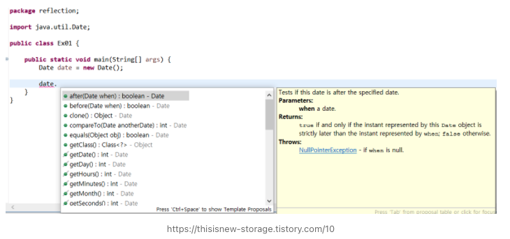
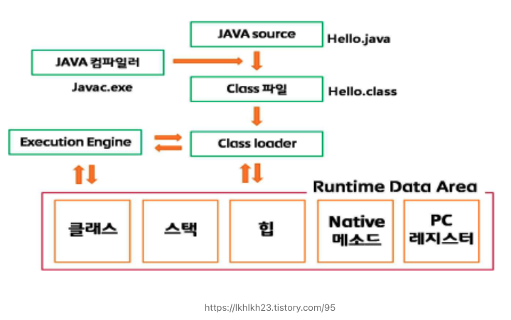

## 리플렉션이란?

이미 로딩이 완료된 클래스에서 **또 다른 클래스를 동적으로 로딩(Dynamic Loading)**하여 생성자(Constructor), 멤버 필드(Member Variables) 그리고 멤버 메서드(Member Method) 등을 사용할 수 있는 자바에서 제공하는 기능이다. 즉, 컴파일 시간(Compile Time)이 아니라 실행 시간(Run Time)에 동적으로 특정 클래스의 정보를 객체화를 통해 분석 및 추출해낼 수 있는 프로그래밍 기법이다.

#### 특징

1) 리플렉션이란 객체를 통해 클래스의 정보를 분석하는 기법이다.

2) 리플렉션은 객체의 구조에 대해 동적 검색을 런타임에서 지원한다.

3) 리플렉션은 클래스 타입을 알지 못해도, 그 클래스의 메소드, 타입, 변들들을 접근할 수 있도록 해주는 Java API 이다.

4) 자바 클래스 파일은 바이트 코드로 컴파일되어 Static 영역에 위치하게 된다. 클래스 이름만 안다면, 바이트 코드를 뒤져 클래스에 대한 정보를 가져올 수 있다.

## 사용 예제

부모클래스 Parent, 자식클래스 Child 생성

> 1) Parent.java

```
public class Parent {
    private String str1 = "1";
    public String str2 = "2";

    public Parent() {
    }

    private void method1() {
        System.out.println("method1");
    }

    public void method2(int n) {
        System.out.println("method2: " + n);
    }

    private void method3() {
        System.out.println("method3");
    }
}
```

> 2) Child.java

```
public class Child extends Parent {
    public String cstr1 = "1";
    private String cstr2 = "2";

    public Child() {
    }

    private Child(String str) {
        cstr1 = str;
    }

    public int method4(int n) {
        System.out.println("method4: " + n);
        return n;
    }

    private int method5(int n) {
        System.out.println("method5: " + n);
        return n;
    }
}
```

#### Class 찾기

> 1) 클래스명 조회

```
Class clazz = Child.class;
System.out.println("Class name: " + clazz.getName()); // Class name: test.Child
```

Class 객체는 Class 또는 Interface 를 가리킨다.

> 2) 클래스 명으로 클래스 정보 조회

\- package 포함 필수

```
Class clazz2 = Class.forName("test.Child");
System.out.println("Class name: " + clazz2.getName()); // Class name: test.Child
```

#### Constructor 찾기

> 1) 인자 없는 생성자 조회

```
Class clazz = Class.forName("test.Child");
Constructor constructor = clazz.getDeclaredConstructor();
System.out.println("Constructor: " + constructor.getName()); // Constructor: test.Child
```

> 2) 인자 있는 생성자 조회

\- getDeclaredConstructor(Param) : Param의 타입과 일치하는 생성자를 조회한다.

```
Class clazz = Class.forName("test.Child");
Constructor constructor2 = clazz.getDeclaredConstructor(String.class);
System.out.println("Constructor(String): " + constructor2.getName()); // Constructor(String): test.Child
```

> 3) 모든 생성자 조회

```
Class clazz = Class.forName("test.Child");
Constructor constructors[] = clazz.getDeclaredConstructors();
for (Constructor cons : constructors) {
    // Get constructors in Child: private test.Child(java.lang.String)
    // Get constructors in Child: public test.Child()
    System.out.println("Get constructors in Child: " + cons);
}
```

> 4) public 생성자만 조회

```
Class clazz = Class.forName("test.Child");
Constructor constructors2[] = clazz.getConstructors();
for (Constructor cons : constructors2) {
    // Get public constructors in both Parent and Child: public test.Child()
    System.out.println("Get public constructors in Child: " + cons);
}
```

> 5) 생성자의 인자 정보들을 가져올 수는 없다.

#### Method 찾기

> 1) 이름으로 메서드 조회

```
Class clazz = Class.forName("test.Child");
Method method1 = clazz.getDeclaredMethod("method4", int.class);
System.out.println("Find out method4 method in Child: " + method1);
// Find out method4 method in Child: public int test.Child.method4(int)
```

\- 인자가 없는 경우는 null로 전달

```
Class clazz = Class.forName("test.Child");
Method method1 = clazz.getDeclaredMethod("method4", null);
```

\- 메소드가 존재하지 않을 경우 에러 발생

```
NoSuchMethodException
```

> 2) 인자가 2개 이상일 경우 배열로 전달

```
Class clazz = Class.forName("test.Child");
Class partypes[] = new Class[1];
partypes[0] = int.class;
Method method = clazz.getDeclaredMethod("method4", partypes);
```

> 3) 모든 메서드 조회

```
Class clazz = Class.forName("test.Child");
Method methods[] = clazz.getDeclaredMethods();
for (Method method : methods) {
    // Get methods in Child: public int test.Child.method4(int)
    // Get methods in Child: private int test.Child.method5(int)
    System.out.println("Get methods in Child: " + method);
}
```

> 4) public 메서드 조회 (상속받은 메서드 포함)

```
Class clazz = Class.forName("test.Child");
Method methods2[] = clazz.getMethods();
for (Method method : methods2) {
/*
    public int test.Child.method4(int)
    public void test.Parent.method2(int)
    public final void java.lang.Object.wait(long,int) throws java.lang.InterruptedException
    public final native void java.lang.Object.wait(long) throws java.lang.InterruptedException
    public final void java.lang.Object.wait() throws java.lang.InterruptedException
    public boolean java.lang.Object.equals(java.lang.Object)
    public java.lang.String java.lang.Object.toString()
    public native int java.lang.Object.hashCode()
    public final native java.lang.Class java.lang.Object.getClass()
    public final native void java.lang.Object.notify()
    public final native void java.lang.Object.notifyAll()
*/
    System.out.println("Get public methods in both Parent and Child: " + method);
}
```

#### Field(변수) 변경

> 1) 이름으로 필드 조회

```
Class clazz = Class.forName("test.Child");
Field field = clazz.getDeclaredField("cstr1");
System.out.println("Find out cstr1 field in Child: " + field);
// Find out cstr1 field in Child: public java.lang.String test.Child.cstr1
```

> 2) 모든 필드 조회

```
Class clazz = Class.forName("test.Child");
Field fields[] = clazz.getDeclaredFields();
for (Field field : fields) {
    // Get fields in Child: public java.lang.String test.Child.cstr1
    // Get fields in Child: private java.lang.String test.Child.cstr2
    System.out.println("Get fields in Child: " + field);
}
```

> 3) public 필드 조회 (상속받은 클래스 포함)

```
Class clazz = Class.forName("test.Child");
Field fields2[] = clazz.getFields();
for (Field field : fields2) {
    // Get public fields in both Parent and Child: public java.lang.String test.Child.cstr1
    // Get public fields in both Parent and Child: public java.lang.String test.Parent.str2
    System.out.println("Get public fields in both Parent and Child: " + field);
}
```

#### Method 호출

> 1) Method.invoke() 로 메서드 호출 

```
Child child = new Child();
Class clazz = Class.forName("test.Child");
Method method = clazz.getDeclaredMethod("method4", int.class);

// 첫번째 인자 : 호출하려는 객체
// 두번째 인자 : 전달할 파라미터
int returnValue = (int) method.invoke(child, 10);

// method4: 10
// return value: 10
System.out.println("return value: " + returnValue);
```

> 2) 부모클래스의 method1() 호출하기

\- 인자가 없기 때문에 getDeclaredMethod()에 인자를 입력하지 않는다.

\- getDeclaredMethod는 상속받은 클래스의 정보를 가져오지 않기 때문에 Parent에 대한 클래스 정보를 가져와야 한다.

```
Child child = new Child();
Class clazz = Class.forName("test.Parent");
Method method = clazz.getDeclaredMethod("method1");
method.invoke(child);
```

\- 에러가 발생한다. 이유는 호출하려는 method1()이 private 이기 때문이다.

```
Exception in thread "main" java.lang.IllegalAccessException: Class test.Test can not access a member of class test.Parent with modifiers "private"
	at sun.reflect.Reflection.ensureMemberAccess(Reflection.java:102)
	at java.lang.reflect.AccessibleObject.slowCheckMemberAccess(AccessibleObject.java:296)
	at java.lang.reflect.AccessibleObject.checkAccess(AccessibleObject.java:288)
	at java.lang.reflect.Method.invoke(Method.java:491)
	at test.Test.main(Test.java:93)
```

\- 해결방법 : setAccessible(true)로 설정하여 private 메서드에 접근가능하도록 한다.

```
Child child = new Child();
Class clazz = Class.forName("test.Parent");
Method method = clazz.getDeclaredMethod("method1");
method.setAccessible(true);
method.invoke(child);
```

#### Field 변경

> 1) 객체의 변수를 변경

```
Child child = new Child();
Class clazz = Class.forName("test.Child");
Field fld = clazz.getField("cstr1");

// child.cstr1: 1
System.out.println("child.cstr1: " + fld.get(child));

fld.set(child, "cstr1"); // 필드 값 변경

// child.cstr1: cstr1
System.out.println("child.cstr1: " + fld.get(child));
```

#### Static 메서드 호출

> 예제 파일 생성

```
public class StaticExample {
    public static String EXAMPLE = "Example";

    public static int getSquare(int num) {
        System.out.println("Get square: " + num * num);
        return num * num;
    }
}
```

> 1) static 메서드 호출

```
Class clazz = Class.forName("test.StaticExample");
Method method = clazz.getDeclaredMethod("getSquare", int.class);
method.invoke(null, 10); //  객체를 전달하는 인자에 null
```

> 2) static 필드 조회

```
Class clazz = Class.forName("test.StaticExample");
Field fld = clazz.getDeclaredField("EXAMPLE");
fld.set(null, "Hello, World"); // 객체로 전달되는 인자에 null
System.out.println("StaticExample.EXAMPLE: " + fld.get(null));
```

## 어떤 경우에 사용할까?

1) 런타임 시점에 지금 실행되고있는 클래스를 가져와서 실행해야 하는 경우

2) IntelliJ의 자동완성 기능
   

현재 사진에서 date 인스턴스에 적합한 메서드를 노출해주고 있다. (자동완성) 이는 date 인스턴스의 타입이 Date 클래스인 것을 IDE가 확인후, 해당 클래스에 해당하는 메서드들을 노출해주기 때문에 가능하다.

코드를 편집할때 코드는 실행되지 않고 JVM에 로드되지 않으므로 리플렉션을 사용하여 검사할 수 없다. Eclipse 에는 자체 컴파일러가 존재하여, 소스 코드를 직접 읽고 이를 사용하여 사용 가능한 클래스, 메서드, 생성자, 필드 및 지역 변수에 대한 자체적인 이해를 구축한다.

3) Spring DI

> 참고 : [https://velog.io/@prayme/DI%EB%A5%BC-%EC%A7%81%EC%A0%91-%ED%95%B4%EB%B3%B4%EC%9E%90-with-%EB%A6%AC%ED%94%8C%EB%A0%89%EC%85%98](https://velog.io/@prayme/DI%EB%A5%BC-%EC%A7%81%EC%A0%91-%ED%95%B4%EB%B3%B4%EC%9E%90-with-%EB%A6%AC%ED%94%8C%EB%A0%89%EC%85%98)

(나만의 DI 프레임워크 문단을 보면, @Inject 사용자 정의 어노테이션으로 리플렉션을 사용하여 빈 주입을 수행한다.)

4) JPA의 Entity는 기본생성자가 필수로 필요하다.

> JPA는 DB 값을 객체 필드에 주입할때 기본 생성자로 객체를 생성한 후 Reflection을 사용하여 값을 매핑한다. Reflection은 생성자의 인자 정보들을 알 수 없다고 했다. 따라서 기본 생성자가 없다면 Reflection은 해당 객체를 생성할 수 없기 때문에 기본 생성자가 있어야한다.

## 리플렉션이 가능한 이유는?


자바는 JVM 위에서 실행된다. 자바코드가 컴파일되면 .java 파일이 .class라는 바이트 코드로 변환된 후 JVM에 로드된다. 그리고 클래스에 대한 정보는 JVM의 Runtime Data Area의 Method Area 메모리 공간에 저장된다. 즉, 런타임 시점에서 로드된 클래스들의 정보를 가져올 수 있다.

\* JVM 참고 : https://github.com/NKLCWDT/cs/blob/main/Java/JVM%20%EC%95%84%ED%82%A4%ED%85%8D%EC%B2%98%EC%99%80%20JMM.md

## 리플렉션 단점

\- 런타임때 정보를 가져오므로, 컴파일 타임에 Type, Execption 등의 검증을 진행할 수 없다.

\- 런타임때 Instance가 선택되므로 해당 로직의 구체적인 동작 흐름을 파악하는 것에 어려움을 가지게된다.

\- Private 접근제어자로 캡슐화된 필드, 메서드에 대해 접근 가능하기 때문에 기존 동작을 무시하고 깨뜨리는 행위가 가능해진다.

#### Reference

[https://geekhub.tistory.com/67](https://geekhub.tistory.com/67)

[https://codechacha.com/ko/reflection/](https://codechacha.com/ko/reflection/)

[https://lkhlkh23.tistory.com/95](https://lkhlkh23.tistory.com/95)