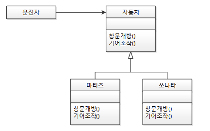
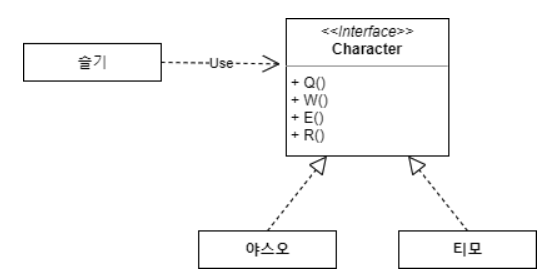
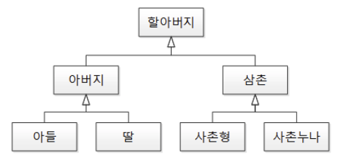
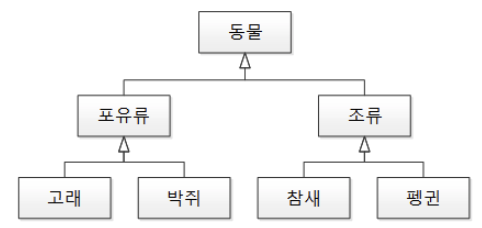
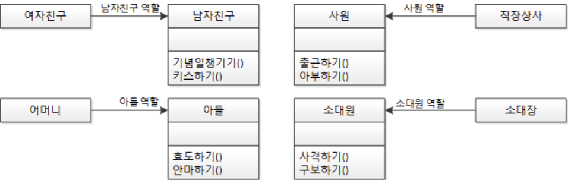
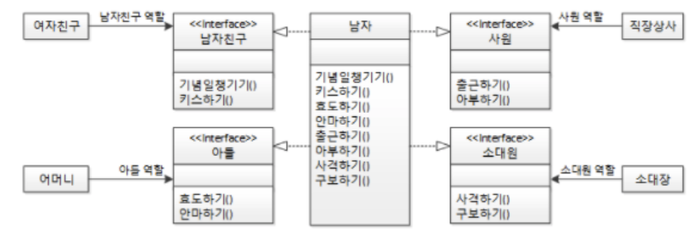
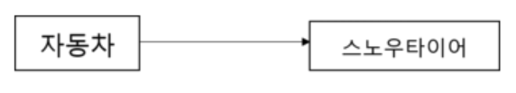
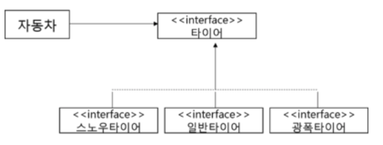

## SOLID 는 왜 중요한가?

프로그래머가 시간이 지나도 유지 보수와 확장이 쉬운 시스템을 만들고자 할 때 이 원칙들을 함께 적용할 수 있다.
SOLID 원칙들은 소프트웨어 작업에서 프로그래머가 소스 코드가 읽기 쉽고 확장하기 쉽게 될 때까지 소프트웨어 소스 코드를 리팩터링하여 코드 냄새를 제거하기 위해 적용할 수 있는 지침이다.

## SRP (Single Responsibility Principle)

**하나의 클래스에는 하나의 책임을 부여해야 한다.** 애플리케이션의 경계를 정하고, 추상화를 하고, 속성과 메서드를 설계할 때 단일 책임의 원칙을 고려하는 습관을 들이는 것이 좋다.

## OCP (Open Closed Principle)

객체 지향 프로그래밍에서 반드시 지켜야 할 원칙이다.

**상위 클래스 또는 인터페이스를 중간에 둠으로써 자신의 확장에는 열려 있고, 변화에 대해서는 닫혀 있어야 한다.**

### 예시 1. 상위 클래스



운전자 입장에서는 마티즈를 타다가, 쏘나타로 변경한다고 하더라도(확장 또는 변화) 에 창문 개방, 기어 조작에 대해서는 아무런 영향이 없다.

창문이 열리는 속도 정도만 다를 뿐이고, 전반적인 동작을 수행하는데 있어서는 아무 문제가 없다는 의미이다.

운전자는 **자동차** 클래스에서 제공하는 메서드들만 알고있으면 된다.

### 예시 2. 인터페이스



스킬을 Q,W,E,R 라는 메서드를 가진 Character 인터페이스로 추상화 시켰다. 새로운 캐릭터가 추가(확장 또는 변화)가 되더라도 슬기의 입장에서는 Q,W,E,R 을 누르는 것은 변함이 없다.(변화에 닫혀있음)

인터페이스의 구현체가 뭐가 되든 상관 없다. 단지, 인터페이스만 알고 있으면 된다.

## LSP (Liskov Substitution Principle)

**하위 클래스의 인스턴스는 상위형 객체 참조 변수에 대입해 상위 클래스의 인스턴스** 역할**을 하는 데 문제가 없어야 한다.**

객체 지향의 상속은 아래 조건을 만족해야 한다.

**하위 클래스 is a kind of 상위 클래스 : 하위 클래스는 상위 클래스의 한 종류다.**

계층도 형태로 생각하고, 상속을 구현했다고 생각해보자.



아버지가 딸을 낳았는데, 딸의 클래스를 아버지라고 하는 코드는 컴파일도 잘 되고 오류가 없는 코드이지만, 의미는 어색하다.

```java
아버지 춘향이 = new 딸(); // 딸은 아버지의 한 종류이다. 딸은 아버지의 역할을 한다.
```

계층 형태가 아닌 분류도 형태로 상속을 구현했다고 생각해보자.



```java
동물 뽀로로 = new 펭귄(); // 펭귄은 동물의 한 종류이다. 펭귄은 동물의 역할을 한다.
```

결국, LSP 는 상속의 특성을 잘 활용하라는 이야기와 같다.

상속을 조직도나 계층도가 아닌 **분류도 형태로 되어야 올바르게 이해하고 사용하는 것**이라고 할 수 있다.

## ISP (Interface Segregation Principle)

**클라이언트는 자신이 사용하지 않는 메서드에 의존 관계를 맺으면 안 된다.**

SRP 와 ISP 는 하나의 클래스에 너무 많은 의존관계를 맺고 있지 않게 하기 위한 두 가지 다른 해결책이다.

요구사항과 설계자의 취향에 따라 둘 중 하나를 선택해서 설계할 수 있다.

1. SRP : 남자 클래스를 단일 책임을 갖는 **클래스**(남자친구 클래스, 아들 클래스, 사원 클래스, 소대장 클래스) 로 나누자.



2. ISP : 남자 클래스에서 남자 친구 **인터페이스**를 구현해서 여자친구를 만날 때는 남자친구 역할만 할 수 있게 제한하고, 어머니와 있을 때는 아들 인터페이스를 구현해서 아들 역할만 할 수 있게 제한하자.



그런데, 위의 남자 객체에는 너무 많은 인터페이스들이 제공되어 있다.

남자는 기념일챙기기도 할 수 있고, 키스도 할 수 있고, 안마도 할 수 있고, 아부도 할 수 있고, 사격도 할 수 있고... 등등 너무 많은 역할이 존재하게 된다.

그래서, ISP 에서 항상 함께 등장하는 원칙 중 하나는 **인터페이스 최소주의 원칙**이라는 것이 있다.

인터페이스를 외부에 제공할 때는 최소한의 메서드만 제공하라는 것이다.

인터페이스는 구현해야할 메서드들이 적을수록 좋다. 는 사실을 기억하자.

## DIP (Dependency Inversion Principle)

자주 변경되는 구체 클래스에 의존하지 마라.

**변하기 쉬운 것의 변화에 영향을 받지 않는 것**이 의존 역전의 원칙이라고 할 수 있다.

주로, OCP 와 함께 활용되는 원칙이다.

자동차가 자신보다 더 자주 변하는 스노우타이어에 의존하고 있는 그림을 보자.



하지만, DIP 를 적용하게 되면 아래와 같이 변한다.



중간에 추상화된 타이어 인터페이스를 추가해 둔다면, 의존 관계가 역전되게 된다.

기존 : 자동차 → 스노우타이어

변경 후 : 자동차 → 타이어 ← 스노우타이어

즉, 중간에 추상화된 인터페이스나 상위 클래스를 두어 자신보다 변하기 쉬운 것에 의존하지 않도록 하는 것이 의존 역전의 원칙이라고 할 수 있다.