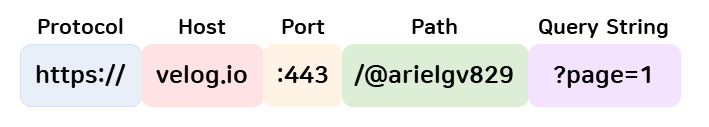
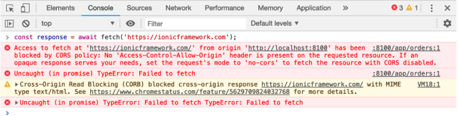
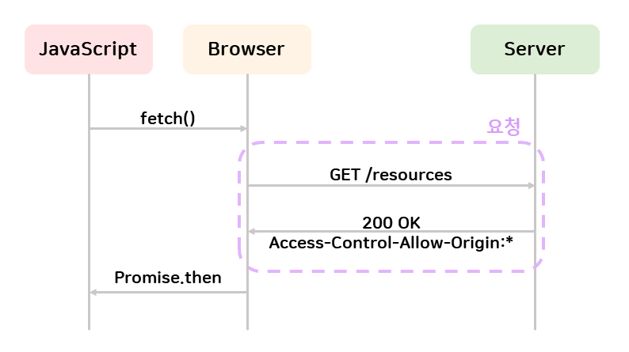
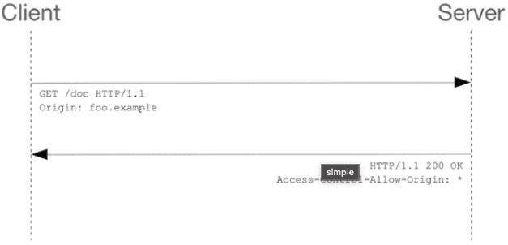
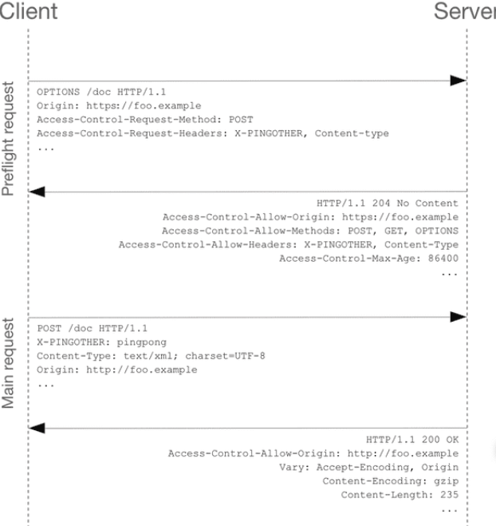

## CORS(Cross Origin Resource Sharing)

CORS는 '교차 출처 리소스 공유'라는 이름으로, HTTP 헤더를 사용하여 한 출처(origin)에서 실행중인 웹 어플리케이션이 다른 출처(cross-origin)의 선택한 자원에 접근할 수 있는 권한을 부여하도록 브라우저에 알려주는 정책이다.


##### origin (=출처)


> https://test-a.com:80/member?idx=1
>
> 1) protocol : https://
> 2) host : test-a.com
> 3) port : 80
> 4) path : /member
> 5) query string : ?idx=1

##### cross-origin (=다른 출처)

> - https://test-a.com:80/**  
> - https://test-b.com:80/**
>
> 1) protocol : https://
> 2) host : test-a.com <-> test-b.com
> 3) port : 80
>
> 위 3가지 요소 중 1개라도 다르다면 cross-origin이다.

## SOP (same origin policy)

SOP 정책은 '동일 출처 정책'이라는 이름으로, 같은 출처에 대한 HTTP 요청만을 허락한다. 웹 어플리케이션에서의 중요한 보안모델이다.

##### same-origin (=같은 출처)

> - https://test-a.com:80/member?idx=1
> - https://test-a.com:80/order?idx=1
>
> 1) protocol : https://
> 2) host : test-a.com
> 3) port : 80
>
> 위 3가지 요소가 동일하므로 두 URL은 same-origin이다.


## Cross-Origin의 예시

> 1) HTTP 요청에 대해서 HTML은 기본적으로 Cross-Origin 요청이 가능하다.

HTML은 Cross-Origin 정책을 따르고 있기 때문에 HTML에서 link 태그를 사용하여 다른 css, js 등의 리소스에 접근하는 것이 가능하다. 또한 HTML에서 img 태그를 사용하여 jpg, png 등의 접근도 가능하다.

> 2) Script 내의 HTTP 요청 (xmlHttpRequest- Ajax) 등은 Same-origin 정책을 따르고 있기 때문에 Cross-Origin 요청이 불가능하다.


## CORS의 등장



Cross-Origin 정책을 허용하지 않는 것은 보안상으로 이점이 있기 때문에, 초기에는 반응이 좋았지만 대규모 웹 서비스가 늘어나게되면서 불편함을 겪기 시작했다. 이에 W3C(월드 와이드 웹을 위한 표준을 개발하고 장려하는 조직) 는 조금 더 안전한 웹 통신을 할 수 있도록 CORS라는 정책을 내놓았다.


## CORS 동작원리

**1) Simple Request**



Simple Request는 서버에게 바로 요청을 보내는 방법이다. 클라이언트가 서버에게 바로 요청을 하면 서버는 Access-Control-Allow-Origin 헤더를 포함한 응답을 브라우저에 보낸다. 브라우저는 Access-Control-Allow-Origin 헤더를 확인해서 CORS 동작을 수행할지 판단한다.

> SImple Request 를 보내기위한 조건

1) 요청 메서드가 GET, HEAD, POST 중 하나여야한다.

2) Accept, Accept-Language, Content-Language, Content-Type, DPR, Downlink, Save-Data, Viewport-Width, Width를 제외한 헤더를 사용하면 안된다.

3) Content-Type 헤더는 application/x-www-form-urlencoded, multipart/form-data, text/plain 중 하나를 사용해야 합니다. 우리가 많이 사용하고있는 application/json은 포함되지 않는다.

(통신 확인)



**2) Preflight Request**


서버에 예비 요청을 보내서 안전한지 판단한 후 본 요청을 보내는 방법이다. 본 요청에 앞서, OPTIONS 메서드로 요청이 보내지고, 해당 메서드를 통해 실제 요청을 전송할지 판단한다. 서버는 OPTIONS의 요청에 대한 응답으로 Access-Control-Allow-Origin 헤더를 포함한 응답을 브라우저에 보내고, 브라우저는 위 Simple Request와 동일하게 Access-Control-Allow-Origin 헤더를 확인해서 CORS 동작을 수행할지 판단한다.

* POST요청이지만 Content-Type이 application/x-www-form-urlencoded, multipart/form-data, text/plain이 아닌 경우도 여기에 해당한다.
(통신 확인)




## CORS 해결방안 (In SpringBoot)

#### 1) javax.servlet.Filters 사용하여 필터링하기

- CorsFilter.java

```
@Component
public class CorsFilter implements Filter {

    @Override
    public void init(FilterConfig filterConfig) throws ServletException {

    }

    @Override
    public void doFilter(ServletRequest req, ServletResponse res, FilterChain chain) throws IOException, ServletException {
        HttpServletRequest request = (HttpServletRequest) req;
        HttpServletResponse response = (HttpServletResponse) res;

        /* Access-Control-Allow-Origin 헤더의 값으로 지정된 도메인으로부터의 요청만 서버의 리소스에 접근할 수 있게 한다. */
        response.setHeader("Access-Control-Allow-Origin", "http://localhost:3000");
        
        /* Request with Credential 방식이 사용될 수 있는지를 지정한다. true가 아닐경우 response가 브라우저에 의해 무시된다. */
        response.setHeader("Access-Control-Allow-Credentials", "true");
        
        /* 예비 요청에 대한 Response Header에 사용되며, 서버의 리소스에 접근할 수 있는 HTTP Method 방식을 지정한다. */
        response.setHeader("Access-Control-Allow-Methods","*");
        
        /* Preflight Request의 결과가 캐쉬에 얼마나 오래동안 남아있는지를 나타낸다. */
        response.setHeader("Access-Control-Max-Age", "3600");
        
        /* 예비 요청에 대한 Response Header에 사용되며, 본 요청에서 사용할 수 있는 HTTP Header를 지정한다 */
        response.setHeader("Access-Control-Allow-Headers",
                "Origin, X-Requested-With, Content-Type, Accept, Authorization");

        if ("OPTIONS".equalsIgnoreCase(request.getMethod())) {
            response.setStatus(HttpServletResponse.SC_OK);
        } else {
            chain.doFilter(req, res);
        }
    }

    @Override
    public void destroy() {

    }
}
```

#### 2) @CrossOrigin 어노테이션 사용

- TestController
```
@RestController
@RequestMapping(value = "/api/test", produces = "application/json")
@CrossOrigin(origins = "http://front-server.com") // 컨트롤러에서 설정
public class TestController {

    private final ThreatService threatService;

    public ThreatController(ThreatService threatService) {
        this.threatService = threatService;
    }

    @GetMapping
    @CrossOrigin(origins = "http://front-server.com") // 메서드에서 설정
    public ResponseEntity<ThreatLogCountResponse> getAllThreatLogs() {
        return ResponseEntity.ok(threatService.getAllThreatLogCount());
    }
}
```

#### 3) WebMvcConfigurer에서 설정하기

- Bean 등록

```
@SpringBootApplication
public class RestServiceCorsApplication {

    public static void main(String[] args) {
        SpringApplication.run(RestServiceCorsApplication.class, args);
    }

    @Bean
    public WebMvcConfigurer corsConfigurer() {
        return new WebMvcConfigurer() {
            @Override
            public void addCorsMappings(CorsRegistry registry) {
                registry.addMapping("/**").allowedOrigins("http://front-server.com");
            }
        };
    }

}
```

- WebConfig.java

```
@Configuration
public class WebConfig implements WebMvcConfigurer {
    @Override
    public void addCorsMappings(CorsRegistry registry) {
        registry.addMapping("/**")
                .allowedOrigins("*")
                .allowedMethods("GET", "POST")
                .maxAge(3000);
}
```


# Reference

- https://beomy.github.io/tech/browser/cors
- https://velog.io/@arielgv829/CS-network-CORS
- https://wonit.tistory.com/572
- https://dev-pengun.tistory.com/entry/Spring-Boot-CORS-%EC%84%A4%EC%A0%95%ED%95%98%EA%B8%B0