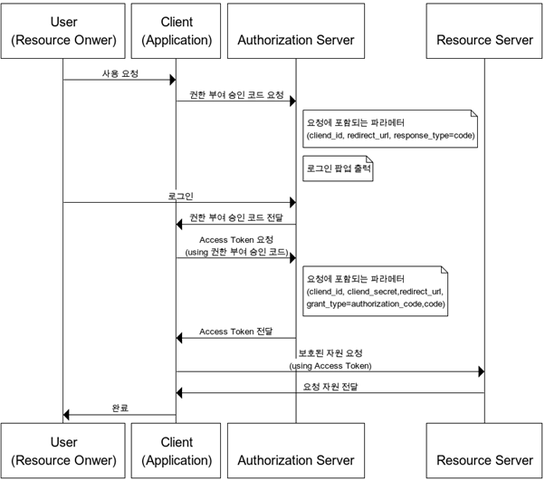
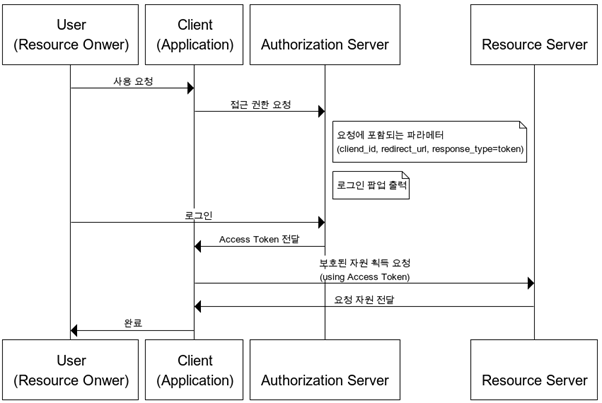
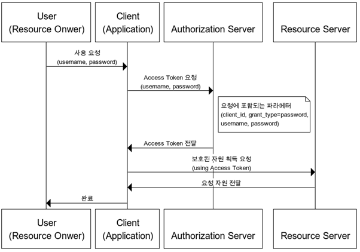
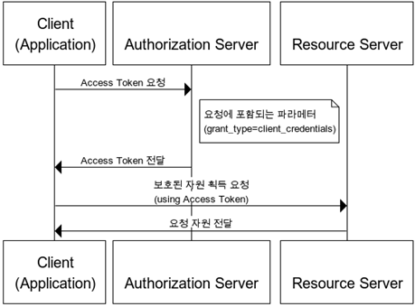

## OAuth(Open Authorization)란?
인터넷 사용자들이 비밀번호를 제공하지 않고 다른 웹사이트 상의 자신들의 정보에 대해 웹사이트나 애플리케이션의
접근 권한을 부여할 수 있는 공통적인 수단으로서 사용되는, 접근 위임을 위한 개방형 표준이다.

### OAuth 탄생 배경

OAuth가 등장하기 전에 A 사이트에서 B 사이트의 리소스를 가져오기 위해서는 다른 사이트의 ID와 Password를
직접 입력받아 저장하여 필요할 때마다 불러와서 사용을 해야했다. 위와 같은 방식을 사용하게 되면
다음과 같은 문제가 발생한다.

- 사용자 : A 사이트에 B 사이트의 ID와 Password를 넘겨주는 것에 대해 신뢰할 수 없다.
- A 사이트 : ID와 Password를 받았기 때문에 보안 문제가 생기는 경우 모든 책임을 져야한다.
- B 사이트 : A 사이트를 신뢰할 수 없다.

위와 같은 문제를 해결하기 위해 2006년 트위터 개발자와 Gnolia의 개발자가 안전한 인증방식에 대한 논의를 하면서
OAuth가 등장했고 2010년에 OAuth1.0이 발표되었다. 현재는 OAuth의 세션 고정 공격을 보완한 OAuth 1.0a를 거쳐, 
OAuth의 구조적인 문제점을 해결하고, 핵심요소만을 차용한 유사 프로토콜 WRAP(Web Resource Access Protocol)을
기반으로 발표한 OAuth 2.0가 많이 사용되고 있다.

### 일반로그인과 OAuth로그인 차이

일반 로그인은 회원가입 할 때 사용했던 아이디와 비밀번호를 통한 인증(Authentication) 이라면
OAuth는 타사 서비스 (Google, facebook)의 이메일 정보에 우리가 만든 서비스의 접근을 인가(Authorization) 하여 사용자를 인증(Authentication) 한다.
> Authentication vs Authorization  
> Authentication(인증) : 유저가 누구인지 확인하는 절차 ex) 회원가입, 로그인  
> Authorization(인가) : 유저에 대한 권한을 허락하는 것 ex) 게시판에서 다른 사람이 쓴 글을 나는 수정할 수 없다.

### OAuth1.0 과 OAuth2.0의 차이

| 비교 | OAuth1.0 | OAuth2.0 |
| ---- | ---- | ---- |
| 역할 (역할 명칭 변경 및 세분화) | 이용자(User)   소비자(Consumer)   서비스 제공자(Service Provider)   | 자원소유자(Resource Owner)   클라이언트(Client)   자원 서버(Resource Server)   권한 서버(Authorization Server)   |
| 토큰 | 요청 토큰 (Request Token)   접근 토큰 (Access Token) | 접근 토큰 (Access Token)   재발급 토큰 (Refresh Token) |
| API 호출 인증 및 보안 | 서명 | HTTPS(SSL/TLS) 기본   서명 : 자원 서버가 별도 서명을 요구하는 경우
| 유효기간 | 접근 토큰의 유효기간 없음 | 접근 토큰 유효기간 부여   만료 시 재발급 토큰 이용
| 클라이언트 | 웹 서비스 | 웹, 앱 등 |

> OAuth2.0은 1.0과 호환되지 않지만 인증 절차가 간략하다.

## OAuth2 용어

| 용어 | 설명 |
| ---- | ---- |
| Resource Server | OAuth2.0 서비스를 제공하고 자원을 관리하는 서버 (google, kakao 등) |
| Resource Owner | Resource Server의 계정을 소유하고 있는 사용자 |
| Client | Resource Server의 API를 사용하여 데이터를 가져오려고 하는 사이트 |
| Authorization Server | Client가 Resource Server의 서비스를 사용할 수 있게 인증하고 토큰을 발급해주는 서버 (google, kakao 등) |
| Access Token | 자원 서버에 자원을 요청할 수 있는 토큰 |
| Refresh Token | 권한 서버에 접근 토큰을 요청할 수 있는 토큰 |

> 인증 프로세스를 이해할 때 쉽게 이해하기 위해 예를 들면  
Resource Server : 카카오 서버로 정보를 담고있는 자원 서버  
Authorization Server : 카카오 서버로 권한을 부여하는 서버  
Resource Owner : 사용자(나)  
Client : 어떤 취준생이 만든 사이트

## 인증절차 종류

| 종류 | 설명 |
| ---- | ---- |
| Authorization Code Grant | 리소스 접근을 위해, Authorization Server에서 받은 권한 코드로 리소스에 대한 액세스 토큰을 받는 방식   다른 인증 절차에 비해 보안성이 높기에 주로 사용한다. |
| Implicit Grant | 액세스 토큰을 즉시 반환받아 이를 인증에 이용하는 방식 |
| Resource Owner Password Credentials Grant | Resource Owner에서 ID, Password를 전달 받아 Resource Server에 인증하는 방식으로 신뢰할 수 있는 Client일 때 사용가능 |
| Client Credentials Grant | Client가 컨텍스트 외부에서 엑세스 토큰을 얻어 특정 리소스에 접근을 요청할 때 사용하는 방식 |

> Client는 Resource Server의 API를 사용한다고 Resource Server에 등록하고 Client ID와 Client Secret을 발급받는다.  
> Client ID : 우리가 만든 서비스의 식별자 (노출되도 됨)  
> Client Secret : Client ID에 대한 비밀번호 (노출되면 안됨)

### Authorization Code
권한 부여 승인을 위해 자체 생성한 Authorization Code를 전달하는 방식으로 많이 쓰이고 기본이 되는 방식이다.

1. Client에서 Authrization Server로 권한 부여 요청을 보낸다.
2. 로그인 정보가 맞다면 권한 부여 승인 코드를 Client에 전달한다.
3. Client는 Authorization code를 통해 access token 발급을 요청한다.
4. Authorization Server는 자기가 가지고 있는 Client ID, Client Secret, Authorization Code를 전달받은 정보와 비교하여 동일할 때 Access token 전달한다.
5. Client는 Resource Server에게 인증을 위한 Access token을 전달하면서 필요한 자원을 요청한다.
6. Resource Server는 Access token이 유효하면 해당 자원을 제공한다.

- redirect_uri : 인증 승인 이후 리다이렉트 될 URL
- response_type : 사용을 원하는 grant type을 지정
  - code : Authorization Code
  - token : Implicit

### Implicit
브라우저 기반의 JS 애플리케이션(SPA)에 가장 적합하도록 설계되었다.
암시적 승인 방식에서는 권한 부여 승인 코드 없이 바로 access token이 발급된다.  
Access Token을 획득하기 위한 절차가 간소화되기에 응답성과 효율성은 높아지지만 Access Token이 URL로 전달된다는 단점이 있다.  
그러므로 Refresh Token 사용이 불가능한 방식이며, 이 방식에서 권한 서버는 client_secret을 사용해 클라이언트를 인증하지 않는다.

> ex) {Redirect_URL}#token={ACCESS_TOKEN}

1. Client가 인증서버에게 사용자 로그인 및 권한 동의 웹 페이지를 요청한다.
2. 권한 동의 이후 Redirect URL로 Authorization Code가 아니라 Access token을 전달한다.
3. 획득한 Access token으로 Resource Server에 API 요청을 보낸다.

### Resource Owner Password Credentials
간단하게 username, password로 access token을 받는 방식이다.
refresh Token의 사용도 가능하다.

1. Resource Owner는 인증정보(아이디, 패스워드)를 Client에게 직접 전달한다.
2. Client 앞서 받은 인증 정보를 Authorization Server로 전송하여 Access token을 발급받는다.
3. 획득한 Access token으로 Resource Server에 API 요청을 보낸다.
이 방식은 Resource Owner의 아이디, 패스워드가 Client에게 그대로 노출되므로 Client와 Oauth Provider가 같은 도메인/솔루션 내에 존재하여 서로 신뢰할 수 있는 경우 사용한다.

### Client Credentials
클라이언트의 자격증면만으로 Access token을 획득하는 방식이다.

이 방식은 Client 자신이 애플리케이션을 사용할 목적으로 사용하는 것이 일반적이다.
OAuth2의 권한 부여 방식 중 가장 간단하고 자격증명을 안전하게 보관할 수 있는 Client에서만 사용되며, Refresh token은 사용할 수 없다.

---

### Reference

https://sunow.tistory.com/entry/OAuth2%EB%9E%80

https://doqtqu.tistory.com/295

https://baked-corn.tistory.com/29

https://velog.io/@mu1616/OAuth2.0-%EC%9D%B8%EC%A6%9D-%EA%B3%BC%EC%A0%95

https://blog.naver.com/mds_datasecurity/222182943542

