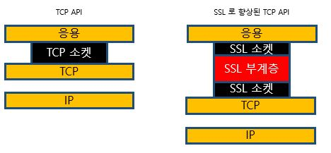
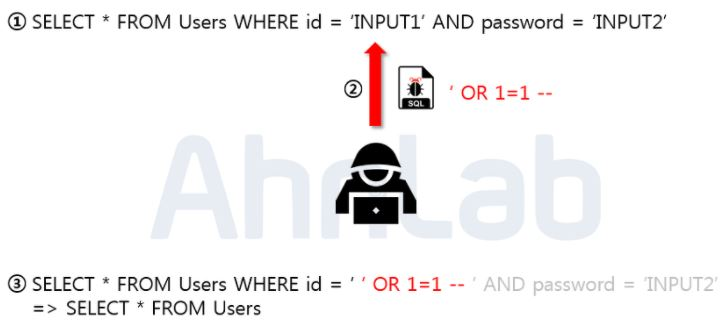
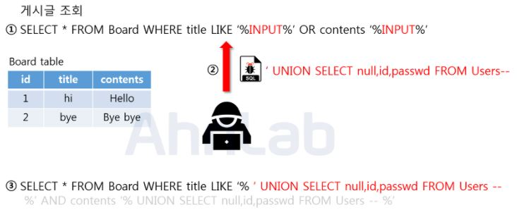
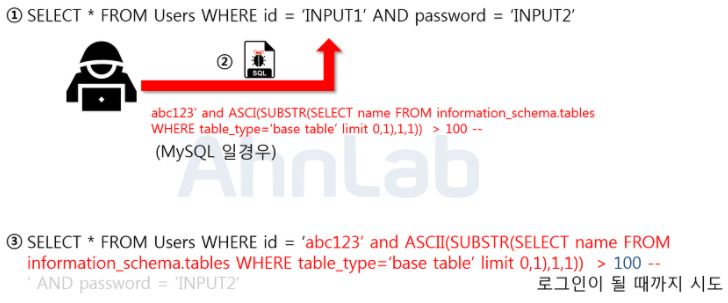
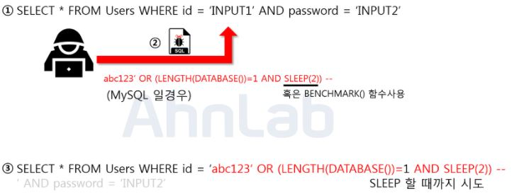
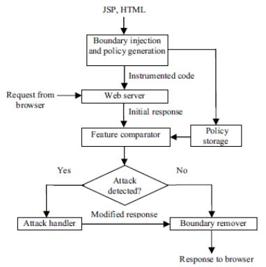
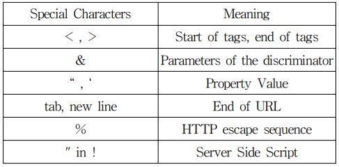
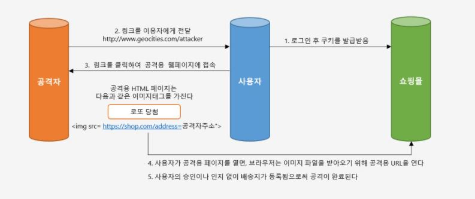

# 네크워크 보안(Network Security)

## 보안과 해킹(Security And Hacking)

네트워크 보안이라는 주제를 선택했을때 `보안(Security)`이라는 단어에 대해서 먼저 생각해볼 필요가 있을 것 같았습니다. 보안이라는 것은 `비밀성`에 초점을 맞추어 개인정보나 기업의 대외비 등을 보호하기 위한 것을 의미합니다. 보호라는 것은 외부의 위협이 있어야 존재하는 단어라고 생각합니다.

따라서 외부에서 위협을 가하는 주체를 `공격자(Hacker)`라고 할 수 있고, 보안은 공격자로부터 소중한 것들(Ex. 개인정보, 기업의 대외비 등)을 지키는 것을 의미한다고 볼 수 있습니다. `보안이 좋다`라는 말은, 공격자로부터 얼마나 안전하게 내가 지키고 싶은 것들(Ex. 개인정보 등)을 얼마나 안전하게 지킬 수 있냐라고 생각할 수 있습니다. 

외부의 위협(공격자)에 의해 나의 소중한 것들을 뺏기거나, 데이터의 변조가 일어나는 악의적인 행위들을 `해킹(Hacking)` 이라고 할 수 있습니다. 해킹이 웹 애플리케이션상에서 이루어진다면 `웹 해킹(Web Hacking)` 이라고 할 수 있습니다.

## 보안의 3대 요소

- __기밀성__
    - 통신하는 당사자만이 아는 비밀을 의미한다.
    - 기밀성 취약점을 이용한 대표적인 네트워크 공격 : [스니핑(Sniffing)](https://www.ahnlab.com/kr/site/securityinfo/secunews/secuNewsView.do?menu_dist=3&seq=5185)
    - 스니핑은 네트워크 상에서 자신이 아닌 다른 상대방들의 패킷 교환을 엿듣는 것을 의미한다. 즉, `네트워크 트래픽을 도청(eavesdropping)`하는 과정을 말한다. (인증되지 않은 사람이 볼수 있다. -> 기밀성을 지키지 못함)
    - 기밀성을 지키기 위해 `암호화`하는 방법이 있다.
- __무결성__
    - 변경이 허락된 사람에게서 인가된 메커니즘을 통해서만 이뤄져야하는 것을 의미한다.
    - 무결성 취약점을 이용한 대표적인 네트워크 공격 : [스푸핑(Spoofing)](https://ko.wikipedia.org/wiki/%EC%8A%A4%ED%91%B8%ED%95%91)
    - 스푸핑은 공격 대상의 패킷을 변조하거나 악의적인 코드를 삽입하는 공격을 의미한다.(정보가 변경되어서 전달된다 -> 무결성을 지키지 못함)
- __가용성__
    - 정보가 사용 가능해야한다라는 것을 의미한다.
    - 가용성 취약점을 이용한 대표적인 네트워크 공격 : [DoS(Denial Of Service)](https://www.paloaltonetworks.com/cyberpedia/what-is-a-denial-of-service-attack-dos)
    - DoS 는 공격 대상의 자원을 소모시켜 정상적인 서비스를 하지 못하도록 만드는 공격을 의미한다. (사용자가 필요할 때 정보를 받을 수 없다. -> 가용성을 지키지 못함)

## 웹 해킹(Web Hacking)

웹 해킹이란 웹 애플리케이션에서 발생될 수 있는 모든 보안 허점(Security Hole)을 이용해 악의적인 행위를 하는 것을 의미한다.

### 해킹의 목적(Purpose of hacking)

- 과거 : 과시
- 현재 : 돈 

과거에는 `과시`가 목적이었다면, 현재는 `돈`을 목적으로하는 해킹이 대다수이다. 개인정보를 노리거나, 시스템 권한을 획득하는 것을 목적으로 할 수 있다.

해킹 사고 중에서는 `웹 해킹`이 압도적으로 높은 비율을 차지한다. 해커들이 웹 서버 공격을 노리는 이유는 다양한 정보 유출이 가능하고, 공격이 용이하기 때문이다.
공격자가 웹 서버에 악성코드를 삼고 실행시키면 DB 서버를 장악할 수도 있다.

해킹을 당했을때 가장큰 피해는 `개인정보유출`과 `기업 영업정보, 대외비 유출` 등일 것이다.
이러한 정보를 탈취하기 위해 해커들은 다음과 같은 공격을 시도할 수 있다.

- __DMZ__
    - 웹 서버, 이메일 서버, 데이터베이스 등이 존재하는 DMZ 구간을 침투
- __사내망__
    - 기업 데이터베이스, FTP(파일 서버) 내의 대외비 정보 등 
    - Tunneling 이라는 기술을 사용하여 내부 침투 가능
- __오피스망__
    - 직원 PC
    - 랜섬웨어
        - 이메일 열람시 악성코드가 실행되는 경우 등

### 웹 해킹 방어를 위한 실천 사항

웹 해킹 방어를 위한 실천 사항 중 쉽게 실천할 수 있는 부분들에 대해서 배워보자.

- __서버 검증__
    - 개발자라면 당연하게 클라이언트 검증과 서버 검증을 해야하는데, 서버에서 입력 값에 대한 검증을 하지 않는다면, 웹 해킹의 원인이 될 수 있다.
    - Ex. SQL Injection 등
- __인증 검증__
    - 권한이 없는 사용자가 특정 페이지나 기능에 접근하는 것을 막기
    - Ex. 인가 되지 않은 사용자가 인증을 통해 관리자 페이지 접근하는 것을 막기
- __중요 정보 노출 막기__
    - Ex. 세션에 중요한 정보를 담아서 세션 하이재킹으로 인해 중요 정보를 탈취 가능하게 하는 경우
    - Ex. 개인정보가 들어있는 파일을 암호화 하지 않아서 개인정보가 노출 되는 경우

## IPSec(Internet Protocol Security)

Network Layer 에서는 IPSec 이라는 보안 프로토콜을 사용하여 보안을 유지한다. IPSec 은 호스트 또는 라우터와 같은 네트워크 계층의 어떤 두 개체 사이에서 IP 데이터그램을 보호한다. 많은 기관(회사, 정부, 비영리기관 등)들이 가상 사설망(VPN, Virtual Private Network)을 구축하기 위해 IPSec 을 사용한다.

IPSec 은 두 가지 프로토콜을 포함한다.

- __AH(Authentication Header) 프로토콜__
    - 출발지 인증과 데이터 무결성을 제공
    - 기밀성 제공 X
    - `IP Header - AH - Payload` 모습 처럼 IP 패킷에 AH 를 붙여서 무결성을 제공
- __ESP(Encapsulation Security Protocol) 프로토콜__
    - 출발지 인증과 데이터 무결성, 암호화를 통한 기밀성 제공
    - `IP Header - ESP Header - Payload - ESP Trailer - ESP Auth` 모습 처럼 IP 패킷에 ESP 관련 헤더를 붙여서 무결성을 제공
    - 기밀성이 VPN 과 다른 IPSec 응용 프로그램들에 필수적이라서 ESP 가 더 많이 사용된다.

## SSL(Secure Sockets Layer) 과 TLS(Transport Layer Security)

__암호화 기술__ 은 기밀성, 데이터 무결성, 종단점 인증을 제공해준다. 암호학이 기밀성, 데이터 무결성, 종단점 인증 등의 보안 서비스를 이용하여 어떻게 TCP 를 향상시킬 수 있는지 살펴보겠다.

암호학을 이용하여 TCP 를 향상 시킨 버전을 `SSL` 이라고 부른다. SSL 버전 3(SSL 3.0)의 약간 변형된 버전이 TLS 라고한다. SSL 3.0 의 웹 암호화 기술에서 보안 취약점이 발견됐다. 데이터 보안을 위해 전송 데이터를 암호화하는 이 기술이 오히려 암호화가 풀려 해커에게 노출되는 취약점이다. 구글 연구자들은 SSL 3.0 취약점 사고를 막기 위해선 SSL 3.0 기술을 서버나 브라우저에서 비활성화하는 한편, 보다 강력한 암호화 방식인 `TLS 을 사용하도록 권고`했다.
SSL 2.0 및 3.0 모두 IETF(Internet Engineering Task Force, 국제 인터넷 표준화 기구) 에 의해 사용 중지되었다. (각각 2011년 및 2015년)

> Apache 2.4.x Version 이상 부터는 TLS 1.2 랑 TLS 1.3 만 권장 사용하도록 되어있다.
>
> 모든 주요 웹 브라우저는 2020 년 TLS 1.0 및 TLS 1.1 지원을 제거한다. 원래는 상반기에 지원을 중지할 예정이었으나, COVID-19 여파로 인해서 일정이 변경되었다고 한다. 자세한 내용은 아래 링크를 참고하자.
>
> [코로나19 여파로 웹브라우저들 TLS 1.0 TLS 1.1 지원중단 일정연기](https://cert.crosscert.com/%EA%B3%B5%EC%A7%80%EC%BD%94%EB%A1%9C%EB%82%9819-%EC%97%AC%ED%8C%8C%EB%A1%9C-%EC%9B%B9%EB%B8%8C%EB%9D%BC%EC%9A%B0%EC%A0%80%EB%93%A4-tls-1-0-tls-1-1-%EC%A7%80%EC%9B%90%EC%A4%91%EB%8B%A8-%EC%9D%BC/)

SSL 의 필요성에 대해서 이해하기 위해 인터넷 상거래 시나리오를 예시로 들어보겠다.

```
- JungHo 는 웹을 검색하다가 키보드를 판매하는 사이트를 발견하여 들어간다.
- 해당 사이트에서 키보드를 구매하기위한 양식을 제공한다.(종류, 수량, 주소, 카드번호 등)
- JungHo 는 정보를 입력하고 구매완료를 클릭하여 배송이 올 때까지 기다린다.
```

- __기밀성이 없다면__
    - 침입자가 JungHo 의 주문 내용을 가로채서 지불 카드 정보를 얻을 수 있다.
- __데이터 무결성이 없다면__
    - 침입자는 JungHo 의 주문을 수정해서 더 많은 키보드를 구입하게 할 수 있다.
- __서버 인증이 없다면__
    - 키보드 판매 사이트로 가장한 악성 사이트를 만들어서 주문을 받게 할 수 있다.
    - 돈, 카드번호, 개인정보 등을 탈취할 수 있다.

SSL 은 기밀성, 데이터 무결성, 서버 인증과 클라이언트 인증을 통해 TCP 를 향상시킴으로써 이러한 문제를 해결한다.  

- __SSL 로 향상된 TCP API__
    - 

[HTTP 와 HTTPS](https://github.com/NKLCWDT/cs/blob/main/Network/http%EC%99%80%20https.md) 에서 배웠듯이 HTTPS 는 SSL 과 TLS 기술을 사용한다는 것을 알 것이다. SSL 과 TLS 단어의 원어에서 알 수 있듯이, TCP, UDP 와 같은 일반적인 인터넷 통신에 `안전한 계층(Secure Layer)` 을 추가하는 방식이다. 그리고 이 기술을 구현하기 위해 웹 서버에 설치하는 것이 `SSL/TLS 인증서`이다. 위에서 SSL 과 TLS 차이점에 대해서 설명 했듯이, 우리가 흔히 현업에서 사용하는 SSL 인증서는 TLS 1.2 와 1.3 을 사용하는 인증서를 의미한다.

### TLS Handshake

구글에 검색해보면 아래의 과정을 SSL HandShake 라고 표현한 '[브런치 글](https://brunch.co.kr/@sangjinkang/38)'도 있으며, 우아한테크코스에서 발표에서는 TLS HandShake 라고 표현하고 있습니다. 엄밀하게는 SSL HandShake 와 TLS HandShake 간의 차이가 조금씩 있으며, TLS 버전마다 HandShake 과정이 조금씩 차이가 납니다. 그 이유가 구현체마다 다양한 옵션을 가지고 있어서 그렇다고 합니다. 핵심적인 원리는 아래와 같은 것이라고 합니다.

1. __클라이언트에서 서버로 다음과 같은 내용 전송__
    - 클라이언트의 랜덤 데이터 전송
        - 랜덤 데이터 : 말 그대로 랜덤 데이터(RFC 에서 28Byte 의 랜덤 데이터라고 소개 함)
    - 클라이언트가 지원하는 암호화 방식 전송
        - 암호화 방식 : 암호화 알고리즘 리스트
    - Handshaking 통해 세션 아이디가 있다면 세션 아이디 전송
    - ```javascript
        const clientHello = {
            data : 1234,
            cipherSuites : ['SHA', 'SHA256', 'DES']
        };
        ```
    > [Cipher Suite](https://en.wikipedia.org/wiki/Cipher_suite)
2. __서버는 클라이언트의 암호화 방식 중 하나를 선택__
    - 서버의 랜덤 데이터(임의의 난수) 전송
    - 서버가 선택한 암호화 방식 전송
    - CA(Certificate Authority, 인증 기관) 에서 받은 인증서 전송
        - `CA 의 역할은 크게 2가지`
            - 클라이언트가 접속한 서버가 신뢰할 수 있는 서버임을 보증
            - SSL 통신에 사용할 공개키 제공
    - ```javascript
        class ServerHello {
            long data = 5678;
            String cipherSuite = "SHA";
            Certification certification = fromCA();
        }
        ```
3. __클라이언트는 브라우저에 내장된 공개키로, 인증서가 CA 에서 받은 것인지 사설 기관에서 받은 것인지 검증__
    - 인증서가 CA 에서 받은 것인지 검증
    - 클라이언트와 서버의 랜덤 데이터를 조합하여 `pre-master secret` 라는 대칭키 생성
    - 인증서 안에 있는 공캐키를 통해서 pre-master secret 를 암호화하여 서버에 전송
    - ```javascript
        validateCertification(certification);
        const key = makePreMasterKey(clientRandomData, serverRandomData);
        const data = encrypt(key);
        api.get(data);
        ```
4. __서버는 클라이언트에서 받은 pre-master secret 을 자신의 비공개키(개인키)를 사용하여 복호화 하고, pre-master secret 으로 세션키 생성__
5. __클라이언트와 서버는 세션키(대칭키)를 사용하여 데이터를 암/복호화해서 HTTPS 프로토콜을 통해 주고 받음__

SSL 인증서 과정에는 대칭키 방식과 공개키 방식 두 개 모두 사용되었다. 모든 웹 콘텐츠의 전달을 공개키 방식으로 한다면 웹 서버와, 브라우저에 많은 부담이 되기 때문에 `SSL Handshake 단계까지는 공개키 방식, 그 이후의 HTTPS 통신은 대칭키 방식을 사용`하는 것이다.

> [CA(Certificate Authority)](http://www.terms.co.kr/CA.htm)
>
> 인증기관은 보안적격 여부와 그리고 메시지의 암호화와 복원을 위한 공개키들을 발급하고 관리하는 네트웍 상의 기관이다. 공개키 기반구조의 일부로서, 인증기관은 디지털 인증서 요구자에 의해 제공되는 정보를 검증하기 위한 등록기관(RA)과 함께 안전성 등을 검사한다. 만약 등록기관이 요구자의 정보를 입증하면, 인증기관은 인증서를 발급할 수 있다.
공개키 기반구조 구현에 따라 조금씩 다르지만, 인증서는 대개 소유자의 공개키, 인증서의 유효기간, 소유자의 이름 및 기타 공개키 소유자에 관한 다른 정보들을 포함한다.

### TLS 특징

- Transport Layer 의 보안 프로토콜
- 공개키를 사용해서 대칭키 암호화
    - 인증서 안에 있는 공개키를 통해 세션키라는 대칭키를 암호화
- 대칭키를 사용해 데이터 암호화
    - 세션키를 사용해 데이터를 암호화해 클라이언트와 서버가 주고 받음

## 방화벽(Firewall, F/W)

미리 정의된 보안 규칙에 기반한, 네트워크 트래픽을 모니터링하고 제어하는 보안 시스템을 의미한다. 

"방화벽 자체만 해도 종류가 5개 정도가 되며 너무 깊게 들어갈 주제는 아니라서 살짝만 다루고 가겠습니다."

방화벽 중에서 가장 기초적인 방화벽은 `패킷 필터링(Packet Filtering)` 방식이다.

"이 패킷(Packet)이라는 단어를 보자마자 OSI 7 계층 중에서 어느 곳에 속할지 감이 잡히실겁니다."

패킷 필터링 방식은 네트워크 계층과 전송 계층에서 동작하며(즉, TCP/IP 레벨에서 동작한다고 볼 수 있음) `IP 와 PORT` 를 기준으로 필터링 해주는 방식이다.

방화벽의 주요 기능은 다음과 같다.

- __접근 제어(Access Control)__
    - 가장 기본적이고 중요한 기능
    - 방화벽이 입력된 데이터를 통해 접근의 통과 허용 여부를 수행
- __로깅 및 감사 추적(Logging And Auditing)__
    - 관리자의 접근, 네트워크 트래픽의 허용 여부 관련 사항 기록
    - 사고가 났을 때 출입자를 확인하고 추적
- __인증(Authentication)__
    - 메시지 인증, 사용자 인증, 클라이언트 인증 등
- __데이터의 암호화__
    - 한 방화벽에서 다른 방화벽으로 데이터를 암호화해서 전송하는 것

### 인 바운드 정책(In-bound Policy)과 아웃 바운드 정책(Out-bound Policy)

- __인 바운드 정책(In-bound Policy)__
    - 내부를 향함
    - 서버 내부로 들어오는 것(Ex. 패킷, IP 등)
    - Windows 방화벽 기본 설정 : 모든 접속 차단
        - 자신의 컴퓨터로 들어오기 시작하는 네트워크 데이터
    - HTTP(80) / HTTPS(443) 등 특정 포트 IP 허용 가능
- __아웃 바운드 정책(Out-bound Policy)__
    - 외부를 향함
    - 서버 외부로 나가는 것(Ex. 패킷, IP 등)
        - Windows 방화벽 기본 설정 : 모든 접속 허용
        - 자신의 컴퓨터에서 나가기 시작하는 네트워크 데이터
    - Ex. 디아블로 우버디아 이벤트 
        - 디아블로 우버디아 이벤트에 참가하기 위해, 주최자가 방 IP 를 뿌리면
        - 참가자들은 그냥 서버로 들어가선, 해당 IP 를 맞추기 어려우므로
        - 아웃바운드 규칙에 제외할 IP 를 설정함으로써 확률을 높일 수 있다.

근데 방화벽만 존재해서는 웹 해킹에 취약하다. 웹 해킹 공격은 애플리케이션 계층(응용, 7계층)에서 이루어진다. 따라서, 웹 사이트 해킹 등 응용 계층의 웹 공격 방어를 위한 별도의 솔루션이 필요하다. 따라서 등장한 것이 `웹 방화벽(WAF)` 이다.

> 지금까지 설명한 방화벽은 그냥 '방화벽'이라고도 하고, '네트워크 방화벽'이라고도 불린다.

## 웹 방화벽(Web Application Firewall, WAF)

웹 방화벽은 일반적인 네트워크 방화벽과는 달리 웹 애플리케이션 보안에 특화된 솔루션이다. 
애플리케이션 계층(응용, 7계층)에서 동작한다.

애플리케이션 계층에서 동작하기 때문에 `HTTP 트래픽`을 검사하여 해킹을 차단한다. HTTP 프로토콜을 문자열 비교 방식으로 감시하여 침입 시도를 탐지 및 차단한다.

SQL Injection, XSS(Cross-Site Scripting) 등과 같은 웹 공격을 탐지하고 차단하는 것이 주 목적이고, 그 외에도 정보유출방지솔루션, 부정로그인방지솔루션, 웹사이트위변조방지솔루션 등으로 활용이 가능하다.

- __직접적인 웹 공격 대응__
    - SQL Injection, XSS(Cross-Site Scripting) 등과 같은 웹 공격을 탐지하고 차단
- __정보유출방지솔루션으로 웹 방화벽을 이용할 경우__
    - 개인정보가 웹 게시판에 게시되거나 개인 정보가 포함된 파일 등이 웹을 통해 업로드 및 다운로드 되는 경우에 대해서 탐지하고 이에 대응하는 것이 가능하다.
- __부정로그인방지솔루션으로 웹 방화벽을 이용할 경우__
    - 추정 가능한 모든 경우의 수를 대입하여 웹사이트에 로그인을 시도하는 경우와 같은 비정상적인 접근에 대한 접근 제어 기능을 한다.
- __웹사이트위변조방지솔루션으로 웹 방화벽을 이용할 경우__
    - 주로 해커가 해킹을 한 후에 과시하는 것이 목적인 웹사이트 위변조가 발생했을 경우, 이에 대해 탐지하고 대응한다.

주로 개인정보가 많은 대기업/금융기관 인터넷 서비스에 이용된다.

웹 방화벽의 주요 기능 몇가지를 더 알아보자.

- __URL 단위 탐지__
    - 서비스를 제공할 URL 을 설정하여 등록되지 않은 URL 로의 접속 요청을 거부
    - 악의적인 사용자의 비정상적 URL 접근을 원천적으로 봉쇄
- __파일 업로드 제어 기능, 파일 검사 기능__
    - 사용자가 웹서버로 업로드하는 파일 종류에 따라 업로드 허용 여부 지정 가능
    - 파일 내용을 검사하여 악의적인 공격 형태의 파일은 필터를 통해 업로드 차단
- __웹 서버의 에러 또는 오류 정보 차단__
    - 사용자 주민등록 번호, 휴대전화번호, 집 주소, E-Mail 등 개인정보 노출 방지

# 보안을 위협하는 다양한 공격 기법

"지금까지 네트워크 보안을 이해하기 위한 기본 지식 몇 가지를 배웠습니다. 아래에서는 보안을 위협하는 다양한 공격 기법들에 대해서 배워보겠습니다."

## SQL Injection

SQL(Structured Query Language) Injection 은 구조화된 질의언어인 SQL 을 주입하는 공격을 의미한다.

### Error based SQL Injection

논리적 에러를 이용한 SQL Injection 은 가장 대중적인 공격 기법이다.



첫 SQL 구문에서 해커가 입력값에 대한 검증이 존재하지 않음을 확인하고, 두 번째 와 같은 SQL 주입을 시도한다.

해커가 `' OR 1=1 --` 구문을 삽입하여 WHERE  절에 있는 싱글쿼터를 닫으면서, 조건을 모두 참으로 만들고 `--` 으로 인해 뒷 부분을 모두 주석처리 하였다. 따라서 해커는 Users 테이블에 있는 모든 정보를 조회하게 된다.

### Union based SQL Injection

Union 명령어를 이용한 SQL Injection 에 성공하기 위해서는 두 가지 조건이 필요하다.

- Union 하는 두 테이블의 컬럼 수가 동일해야 한다.
- 데이터 타입이 같아야 한다.



입력값을 title 과 contents 컬럼의 데이터랑 비교한 뒤 비슷한 글자가 있는 게시글을 출력한다.
여기서 입력값으로 Union 키워드와 함께 컬럼 수를 맞춰서 SELECT 구문을 넣어주게 되면 두 쿼리문이 합쳐서서 하나의 테이블로 보여지게 된다. 따라서, 인젝션에 성공하면 위 쿼리 기준으로 사용자의 개인정보가 게시글과 함께 화면에 보여지게 된다.

### Blind SQL Injection

#### Boolean based SQL Injection

Boolean based SQL Injection 은 데이터베이스로부터 특정한 값이나 데이터를 전달받지 않고, 단순히 참과 거짓의 정보만 알 수 있을 때 사용한다. 로그인 폼에 SQL Injection 이 가능하다고 가정 했을 때, 서버가 응답하는 로그인 성공, 실패 메시지를 이용하여, DB의 테이블 정보 등을 추출해 낼 수 있다.



위의 그림은 Blind Injection 을 이용하여 데이터베이스의 테이블 명을 알아내는 방법이다. (MySQL) 인젝션이 가능한 로그인 폼을 통하여 악의적인 사용자는 임의로 가입한 abc123 이라는 아이디와 함께 `abc123’ and ASCII(SUBSTR(SELECT name From information_schema.tables WHERE table_type=’base table’ limit 0,1)1,1)) > 100 --` 이라는 구문을 주입한다.

해당구문은 MySQL 에서 테이블 명을 조회하는 구문으로 limit 키워드를 통해 하나의 테이블만 조회하고, SUBSTR 함수로 첫 글자만, 그리고 마지막으로 ASCII 를 통해서 ascii 값으로 변환해준다. 만약에 조회되는 테이블 명이 Users 라면 ‘U’ 자가 ascii 값으로 조회가 될 것이고, 뒤의 100 이라는 숫자 값과 비교를 하게 된다.  거짓이면 로그인 실패가 될 것이고, 참이 될 때까지 뒤의 100이라는 숫자를 변경해 가면서 비교를 하면 된다.  공격자는 이 프로세스를 자동화 스크립트를 통하여 단기간 내에 테이블 명을 알아 낼 수 있다.

#### Time based SQL Injection

Time Based SQL Injection 도 마찬가지로 서버로부터 특정한 응답 대신에 참 혹은 거짓의 응답을 통해서 데이터베이스의 정보를 유추하는 기법입니다. 사용되는 함수는 MySQL 기준으로 SLEEP 과 BENCHMARK 가 있다.

- SLEEP

```sql
-- 컬럼 A 조회 후 3초간 멈췄다가 컬럼 B 조회
SELECT 컬럼A, SLEEP(3), 컬럼B FROM 테이블;
```

- BENCHMARK

```sql
-- count 횟수 반큼, expr 을 실행하는 함수로서, MySQL 이 expr 을 얼마나 빨리 실행하는 지 시간을 측정한다.
SELECT BENCHMARK(count, expr);
```



위의 그림은 Time based SQL Injection을 사용하여 현재 사용하고 있는 데이터베이스의 길이를 알아내는 방법이다. 로그인 폼에 주입이 되었으며 임의로 abc123 이라는 계정을 생성해 두었다. 악의적인 사용자가 `abc123’ OR (LENGTH(DATABASE())=1 AND SLEEP(2)) --` 이라는 구문을 주입하였다. 여기서 LENGTH 함수는 문자열의 길이를 반환하고, DATABASE 함수는 데이터베이스의 이름을 반환한다.

주입된 구문에서, LENGTH(DATABASE()) = 1 가 참이면 SLEEP(2) 가 동작하고, 거짓이면 동작하지 않는다. 이를 통해서 숫자 1 부분을 조작하여 데이터베이스의 길이를 알아 낼 수 있다. 만약에 SLEEP 이라는 단어가 치환처리 되어있다면, 또 다른 방법으로 BENCHMARK 나 WAIT 함수를 사용 할 수 있다.

### Stored Procedure SQL Injection

저장된 프로시저에서의 SQL Injection 은 일련의 쿼리들을 모아 하나의 함수처럼 사용하기 위한 것이다. 공격에 사용되는 대표적인 저장 프로시저는 MS-SQL 에 있는 xp_cmdshell 로 윈도우 명령어를 사용할 수 있게 된다. 단, 공격자가 시스템 권한을 획득 해야 하므로 공격난이도가 높으나 공격에 성공한다면, 서버에 직접적인 피해를 입힐 수 있는 공격이다.

### Mass SQL Injection

Mass SQL Injection 은 다량의 SQL Injection 공격을 의미한다. 기존 SQL Injection 과 달리 한번의 공격으로 다량의 데이터베이스가 조작되어 큰 피해를 입히는 것을 의미한다. 보통 MS-SQL 을 사용하는 ASP 기반 웹 애플리케이션에서 많이 사용되며, 쿼리문은 HEX 인코딩 방식으로 인코딩 하여 공격한다. 보통 데이터베이스 값을 변조하여 데이터베이스에 악성스크립트를 삽입하고, 사용자들이 변조된 사이트에 접속 시 좀비PC로 감염되게 한다. 이렇게 감염된 좀비 PC 들은 DDoS 공격에 사용된다.

### 대응 방안

- __입력 값 검증__
    - [화이트리스트(whitelist)](https://river.ecplaza.net/archives/325)기반으로 검증
- __Prepared Statement 구문 사용__
    - Prepared Statement 구문을 사용하게 되면, 사용자의 입력 값이 데이터베이스의 파라미터로 들어가기 전에 DBMS 가 미리 컴파일 하여 실행하지 않고 대기한다. 그 후 사용자의 입력 값을 `문자열로 인식`하게 하여 공격 쿼리가 들어가더라도, 이 입력 값은 단순 문자열이라서 아무 의미 없게된다.
    - 즉, 사용자의 입력값을 쿼리문에 그대로 넣는 것이 아닌, 문자열로 변환한 뒤 넣는다.
    - Ex. Hibernate 를 사용하는 경우 : 안전하지 않은 코드
        - ```java
            // 외부로부터 입력 받은 값을 검증 없이 사용하면 안전하지 않다.
            String id = request.getParameter("id");
            // Hibernate 는 기본으로 PreparedStatement 를 사용하지만, 파라미터 바인딩 없이 사용할 경우 안전하지 않다.
            Query query = session.createQuery("from Users where id = '" + id + "'");
            ```
    - Ex. Hibernate 를 사용하는 경우 : 안전한 코드
        - ```java
            String id = request.getParameter("id");
            // 바인드 변수(`?`)를 사용하여 외부 입력 값에 의해 쿼리 구조를 변경하지 못하게 함
            Query query = session.createQuery("from Users where id = ? ");
            query.setString(0, id);
            ```
    - 자바의 PreparedStatement 특징 살펴보기
        - `java.sql.PreparedStatement` interface
        - Statement 클래스를 상속 받고 있다.
        - bind 변수를 사용하여 DB 서버에서 파싱된 SQL 을 재사용하게 만들어, 반복적인 다량의 SQL 수행 시 성능상 이점이 있다.
        - SQL Injection 예방 방법 중 하나이다.
    - Sample
        - ```java
            String sql = "INSERT INTO users VALUES(?, ?, ?)";
            stmt = conn.prepareStatement(sql); // 데이터가 들어가지 않은 sql 문 전송
            // 바인드 변수에 대한 데이터 설정
            stmt.setInt(1, 1);
            stmt.setId(2, "Jugnho");
            stmt.setPw(3, "JH");
            rs = stmt.executeUpdate(); 
            ...
            ```
- __Error Message 노출 금지__
    - 해커가 SQL Injection 을 수행하기 위해서는 DB 의 정보가 필요하다. 따로 에러처리를 해주지 않은 경우에는 에러가 발생한 쿼리문과 함께 에러 내용을 반환하기 때문이다. 이 정보안에 테이블명, 쿼리문 등이 노출될 수 있다. 따라서, DB 에러 발생 시 사용자게에 보여줄 수 있는 페이지를 제작하거나 메시지 박스를 띄우도록 해야 한다.
- __웹 방화벽 사용__
    - 웹 공격 방어에 특화되어있는 웹 방화벽을 사용하는 것도 하나의 방법입니다. 웹 방화벽은 소프트웨어 형, 하드웨어 형, 프록시 형 이렇게 세가지 종류로 나눌 수 있는데 소프트웨어 형은 서버 내에 직접 설치하는 방법이고, 하드웨어 형은 네트워크 상에서 서버 앞 단에 직접 하드웨어 장비로 구성하는 것이며 마지막으로 프록시 형은 DNS 서버 주소를 웹 방화벽으로 바꾸고 서버로 가는 트래픽이 웹 방화벽을 먼저 거치도록 하는 방법입니다.

> 화이트리스트(whitelist) : 허용 가능한 입력 값에 대한 리스트
> 
> 블랙리스트(blacklist) : 허용 되지 않는 입력 값에 대한 리스트

## OS Command Injection

OS Command Injection 이란 운영체제 명령어 주입을 의미한다. OS 명령 주입은 승인되지 않은 운영 체제 명령을 실행할 수 있는 웹 보안 취약점이다. 

__OS 명령 주입 취약점은 웹 애플리케이션이 실행될 정제되지 않고 필터링되지 않은 시스템 명령을 보낼 때 발생한다.__ `불충분한 입력 유효성 검사`로 인해 공격자는 쉘 수준에서 작동하도록 자신의 명령을 주입할 수 있다. 공격자는 쿠키, 양식 또는 HTTP 헤더와 같은 사용자 제공 데이터를 통해 운영 체제 명령을 도입한다.

일반적인 웹 애플리케이션에서는 대부분 CRUD 기능만 있으면 된다. 시스템 명령을 실행시키도록 하는 기능 자체는 필요가 없다. 그럼에도 OS 명령 주입을 통한 공격이 존재하는 이유는 관리자 콘솔(페이지) 기능을 제공하는 웹 애플리케이션에서 시스템 명령을 실행 가능하도록 하는 기능이 존재하는 경우가 있기 때문이다.

### 대응 방안

- __입력 값에 대한 검증__

## XXE Injection

XXE(XML External Entity) Injection 은 XML 외부 개체 주입을 의미한다. 

쉽게 이해하자면, SQL Injection 은 SQL 을 주입하여 공격하는 것이라면, XXE Injection 은 XML 을 주입하여 공격하는 것으로 이해하면 된다. HTTP Message Body 에 XML 로 데이터를 보내는 곳이 있는 웹 애플리케이션에서 공격자가 쉽게 XXE 인젝션을 시도할 수 있다. 

> 최근에는 Ajax 같은 곳에서 대부분 JSON 을 사용하여 이러한 공격이 드문 편인데, 오래된 레거시 프로젝트들에서 XML 을 사용하고 있다면 XXE Injetion 취약점에 대한 대응을 해야할 것이다.

XXE 인젝션은 `DOCTYPE` 를 사용하여 공격을 수행한다. 이것을 [DTD(Document Type Definition, 문서 타입 정의)](http://www.tcpschool.com/xml/xml_dtd_intro) 를 이용한 공격이라고도 표현한다. DTD 는 엔티티를 정의 할 수 있다. DTD 에서 엔티티를 정의할 때 두 가지로 정의할 수 있다.

- __내부 엔티티(Internal Entity)__
- __외부 엔티티(External Entity)__
    - XXE Injection 이름에서 알 수 있듯이 XXE Injection 은 `외부 엔티티`를 이용한다.
    - 외부에 파일 형태로 선언되는 외부 엔티티는 다른 DTD 문서에서 재사용할 수 있다.
    - 문법 : `<!ENTITY 엔티티이름 SYSTEM "URI또는URL">`
    > DTD 와 외부 엔티티가 더 궁금하면 [TCP School](http://www.tcpschool.com/xml/xml_dtd_entityDeclaration) 에서 배워보도록 하자.

공격방법은 다음과 같다. 

정상적인 XML Parser 의 경우에는 단순히 XML 문서만 참조한다고하면, 비 정상적인 경우는 XML 문서에서 `외부 파일(외부 개체, External Entity)`을 참조하게끔 하는 주입을 시도하여, XML Parser 를 통해 웹 애플리케이션으로 응답하는 경우를 말한다.

### 대응 방안

- __XML Parser 에서 DOCTYPE 태그를 사용하지 않도록 설정하고나, 코드 상 DOCTYPE 태그를 포함하는 입력을 차단하도록 입력값에 대한 검증__

## XSS(Cross Site Scripting)

XSS(Cross Site Scripting) 이란 공격자가 상대방의 브라우저에 Script 를 싱행할 수 있게 하여 사용자의 Session 을 가로채거나(세션 하이재킹, Session Hijacking) 웹 사이트 변조, 악의적인 컨텐츠 삽입 등의 공격을 할 수 있다.
XSS 공격은 스크립트 언어 그리고 취약한 코드들이 공격 대상이 된다.

- __XSS Attack Framework__
    - 

XSS 공격은 `돔 기반(Dom based XSS) XSS`, `저장(Stored) XSS`, `반사(Reflected) XSS` 이렇게 세 가지 공격이 있다.

### Dom based XSS

Dom based XSS 는 피해자의 브라우저에서 DOM 환경을 수정하여 클라이언트 측 코드가 예상치 못한 방식으로 공격 구문이 실행되는 XSS(Cross Site Scripting) 공격이다. 즉, 페이지 자체(HTTP 응답)는 변경되지 않지만, 페이지에 포함된 클라이언트 측 코드는 DOM 환경에서 발생한 악의적인 변조로 인해 공격 구문이 실행된다.

> DOM(Document Object Model)은 HTML 및 XML 문서에 접근하는 방법을 표준으로 정의하는 문서 객체 모델이다. 즉, 구조화된 문서를 표현하는 방식으로 W3C의 공식 표준이다.

### Stored XSS 

Stored XSS 의 기본 방식은 공격자가 게시물에 악성 Script 를 삽입한다. 사용자는 게시물을 클릭하고, 공격자의 JavaScript 가 포함된 응답이 전송된다. 브라우저에서
스크립트가 실행이 되고 공격자는 사용자의 쿠키, 세션 등 원하는 정보를 획득 하게 된다. 즉, Stored XSS 를 통해서 `세션 하이재킹(Session Hijacking)` 을 할 수 있다.

### 세션 하이재킹(Session Hijacking)

세션 하이재킹(Session Hijacking)은 말 그대로 세션을 탈취한다라는 의미이다. 세션을 탈취하게 되면 로그인 된 상태를 가로챌 수도 있고, 세션에 담긴 정보들도 확인할 수 있으며, 세션을 활용한 다양한 공격이 가능해진다. 세션 하이재킹을 하기 위해서는 `document.cookie` 객체에 접근이 가능해야 한다.

> [document.cookie](https://developer.mozilla.org/ko/docs/Web/API/Document/cookie) 는 document와 연관된 cookies 를 읽고 쓸 수 있게 해준다. 쿠키의 실제값에 대한 getter 와 setter로 작동한다.

세션 하이재킹(Session Hijacking) 대응 방법에 대해서 알아보자.

- __XSS 대응__
    - 아래에서 다룰 것이다.
- __보안 설정에서 HttpOnly 헤더 적용__
    - document.cookie 를 통해 객체 접근이 불가능하여 빈 값이 출력된다.
- __세션 발급 시 인증 IP 설정(IP 검증)__
    - 세션 발급 시 인증된 사용자의 IP 를 설정한다.
    - IP 가 다르다고하면 세션을 파기시키거나, 페이지에 접근을 못하게 하는 등의 작업들을 해주면 된다.

### Reflected XSS

Reflected XSS 는 URL 의 CGI(Common Gateway Interface) 인자에 Script Code 를 삽입하는 것이다.
공격자가 이메일을 이용해 어떤 웹 페이지 링크를 보내고 사용자가 링크를 클릭하면
그 링크에 대한 웹 페이지가 화면에 나오게 된다. 그때 웹페이지에 대한 링크 URL에 삽입된 스크립트 코드가 실행되면서 웹 페이지의 내용이 변경된다.

> [CGI(Common Gateway Interface, 공통 게이트웨이 인터페이스)](https://docs.python.org/3.0/howto/webservers.html#common-gateway-interface) 란, 웹서버와 외부 프로그램 사이에서 정보를 주고 받는 방법이나 규약들을 의미한다.

Reflected XSS 공격은 스크립트를 저장하기 위한 웹 사이트는 필요하지 않다. 사용자가 조작된 링크 주소를 클릭하면 링크에 대한 웹페이지가 로드 되면서 그 스크립트 코드가 실행되기 때문이다.
따라서, 공격자에게는 가장 편하고 최상의 XSS 공격 방법이다.

### 대응 방법

- __입력 값에 대한 검증__
    - XSS 취약점은 웹 개발자가 사용자가 입력을 하는 부분에서 사용자에 대한 입력을 검증을 하지 않았기 때문에 발생한다.
- __중요한 정보를 쿠키나 세션에 저장하지 않기__
- __Script Code 에 사용 되는 특수문자에 대한 필터링__
    - XSS Attack Special Characters
    - 
- __자신의 받은 이메일에 링크가 걸려있다면 바로 클릭하지 말고 주소창에 URL 을 직접 입력하여 들어가기__

## CSRF(Cross site request forgery, XSRF)

CSRF(Cross site request forgery, XSRF) 는 사이트 간 요청 위조라는 의미이며, 사용자가 자신의 의지와는 무관하게 공격자가 의도한 행위(수정, 삭제, 등록 등)를 특정 웹사이트에 요청하게 하는 공격을 말한다.

사이트 간 스크립팅(XSS)을 이용한 공격이 사용자가 특정 웹사이트를 신용하는 점을 노린 것이라면, 사이트간 요청 위조는 특정 웹사이트가 사용자의 웹 브라우저를 신용하는 상태를 노린 것이다. 일단 사용자가 웹사이트에 로그인한 상태에서 사이트간 요청 위조 공격 코드가 삽입된 페이지를 열면, 공격 대상이 되는 웹사이트는 위조된 공격 명령이 믿을 수 있는 사용자로부터 발송된 것으로 판단하게 되어 공격에 노출된다.

### 공격 과정



- 이용자는 웹 사이트에 로그인하여 정상적인 쿠키를 발급 받는다.
- 공격자는 다음과 같은 링크를 이메일이나 게시판 등의 경로를 통해 이용자에게 전달한다.
    - http://www.geocities.com/attacker
- 공격용 HTML 페이지는 다음과 같은 이미지 태그를 가진다.
    - ``
- 이용자가 공격용 페이지를 열면, 브라우저는 이미지 파일을 받아오기 위해 공격용 URL 을 연다.
- 사용자의 승인이나 인지 없이 배송지가 등록됨으로써 공격이 완료된다.

스프링 시큐리티(Spring Security)에서는 `CsrfFilter` 를 사용한다.

- __CsrfFilter__
    - 임의의 난수로 생성된 CSRF Token 은 세션에 저장된다.
    - 사용자의 매 요청마다 해당 난수 값을 포함시켜서 전송시킨다.
    - 클라이언트에서 HTTP 파라미터로 전달되는 토큰 값과 서버에 저장된 실제 값과 비교한 후 만약 일치하지 않으면 요청은 실패한다.
- __Spring Security__
    - http.csrf() 가 기본으로 활성화 되어있다.

## References

> [컴퓨터 네트워킹 하향식 접근 제 7판](http://www.kyobobook.co.kr/product/detailViewKor.laf?mallGb=KOR&ejkGb=KOR&barcode=9791185475318)
>
> https://prinha.tistory.com/entry/%EB%B0%A9%ED%99%94%EB%B2%BD
>
> https://handreamnet.tistory.com/331
>
> https://peemangit.tistory.com/312
>
> https://noirstar.tistory.com/264
>
> [터틀의 네트워크 보안](https://www.youtube.com/watch?v=_0p72JJ9iM8&list=PLgXGHBqgT2TvpJ_p9L_yZKPifgdBOzdVH&index=116)
>
> [Statement vs PreparedStatement](https://fora.tistory.com/74)
>
> https://www.whitehatsec.com/glossary/content/os-command-injection
>
> https://dailylearn.tistory.com/113
>
> https://www.koreascience.or.kr/article/JAKO201306464554241.pdf
>
> https://ddungkill.tistory.com/135
>
> https://owasp.org/www-community/attacks/csrf
>
> https://ko.wikipedia.org/wiki/%EC%82%AC%EC%9D%B4%ED%8A%B8_%EA%B0%84_%EC%9A%94%EC%B2%AD_%EC%9C%84%EC%A1%B0 
>
> [인프런 스프링 부트 시큐리티](https://www.inflearn.com/course/%EC%BD%94%EC%96%B4-%EC%8A%A4%ED%94%84%EB%A7%81-%EC%8B%9C%ED%81%90%EB%A6%AC%ED%8B%B0)
>
> https://siamdaarc.tistory.com/258
>
> https://aws-hyoh.tistory.com/entry/HTTPS-%ED%86%B5%EC%8B%A0%EA%B3%BC%EC%A0%95-%EC%89%BD%EA%B2%8C-%EC%9D%B4%ED%95%B4%ED%95%98%EA%B8%B0-3SSL-Handshake
>
> https://brunch.co.kr/@sangjinkang/38
