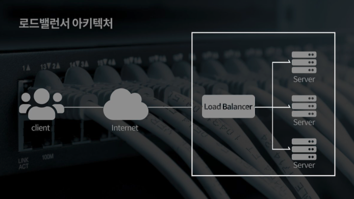
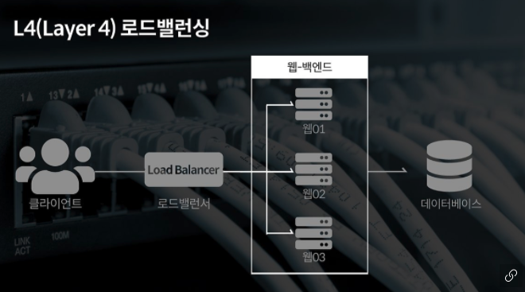
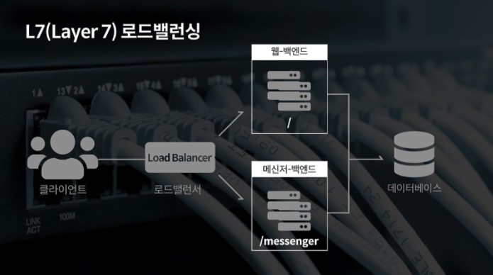

## 로드밸런서 (Load Balancer)

로드밸런싱(Load Balancing) 기술을 제공하는 서비스 또는 컴퓨터 네트워크 기술의 일종이다. 클라이언트와 서버 또는 네트워크 허브 사이에 위치한다.

즉, 위의 표와같이, **클라이언트로부터의 여러 요청들로 인해 서버에 가해지는 부하를 분산시켜주는 장치**다. 네트워크 로드밸런서를 알기 전, '스위치'에 대한 개념부터 알아보자.

## 스위치 (기본 스위치 L2)

스위치는 데이터 링크 계층에서 동작하는 '스위칭 허브'라고도 부른다. 스위치 내부에 있는 MAC 주소 테이블(MAC address table)가 스위치의 포트 번호와 해당 포트에 연결되어 있는 컴퓨터의 MAC 주소를 저장하고있어, 브리지 테이블(bridge table)이라고도 한다.

> Mac Address    
> 컴퓨터간 데이터를 전송하기 위해 존재하는 컴퓨터의 물리적 주소

IP 주소로 통신을 하지만 실제적으로는 IP 주소를 MAC Address로 변환하여 사용한다. 즉, IP 통신 내부에 Mac Address 통신이 포함되어있다.

스위치는 프레임이라는 데이터가 전송되면 MAC 주소 테이블을 확인하고 등록되어있지 않으면 MAC 주소를 포트와 함께 등록한다. 스위치는 허브와 다르게 전송 중 패킷의 충돌이 일어나지 않도록 패킷의 목적지로 지정할 포트를 직접 전송한다.

참고로 로드밸런싱은 L4, L7에서 가능하다는 점을 유의하며 각 계층 별 스위치에 대해 알아보자.

## 허브

OSI 1계층 '물리계층'에서 작동하는 L1스위치라고 하며, 허브라고 부른다.

> 허브란?  
> 허브는 단순히 중계기 역할을 하며, 허브에 3대의 컴퓨터가 연결되어있고, 컴퓨터 A -> 컴퓨터 C로 신호를 보내면 그 신호는 허브에 연결된 모든 컴퓨터로 전송된다. 이는 허브가 들어오는 신호의 송신지와 수신지를 구별하지 못하기 때문에 모든 컴퓨터에게 신호를 전달하는 것으로, 충돌이 발생할 수 있다. 

## L2 (Mac Address Load Balancing)

OSI 2계층 '데이터 링크 계층' 에서 작동하는 L2 스위치다. 가장 흔히 볼 수 있는 스위칭 방식으로, 패킷의 MAC 주소를 읽어 어떤 Port로 보낼지를 판단하여 전송한다. MAC 주소 테이블에 목적지 정보가 없을 경우 LAN 전체에 브로드 캐스트한 후, 응답이 있는 포트로 데이터를 전송하기 때문에 성능 저하가 발생할 수 있다.

IP Address 단위 서비스인 라우팅이 불가능하다.

> 브로드캐스트  
> 송신 호스트가 전송한 데이터가 네트워크에 연결된 모든 호스트에 전송되는 방식

> Switching  
> 스위치에서 패킷의 목적지 주소를 기준으로 보내는 곳과 받는 곳을 계산하여 해당 포트로 1:1 연결하는것

## L3 (IP Address Load Balancing)

OSI 3계층 '네트워크 계층' 에서 작동하는 L3 스위치로, IP 스위칭이 가능하다. L2 스위칭에서 라우팅(Routing) 기능이 추가된 스위치다. 브로드캐스트 트래픽으로 인한 성능 저하를 막을 수 있다.

> 라우팅  
> IP 정보로 데이터의 출발지에서 목적지까지의 경로를 결정하는것

## L4 (Ip And Port Load Balancing)

서버나 네트워크의 트래픽을 로드밸런싱(Load Balancing) 하는 스위치로, OSI 4계층 '전송 계층'의 L4 스위치다. L3 스위치와 구조가 유사하지만, 추가로 가상 랜 기능과 그룹화 및 부하분산 등의 고급 기술을 설정할 수 있다. TCP/IP 프로토콜을 기반으로 대부분 동작한다. Port 단위의 로드 밸런싱을 수행한다. TCP와 UDP의 헤더(포트)를 보고 적절한 서버로 스위칭한다.

## L7 (Application Layer Load Balancing)

OSI 7계층 '어플리케이션 계층'의 생략된 L5, L6을 포함하는 L7 스위치로, URL정보, 쿠키 등을 확인하는 등 패킷을 분석하여 어떤 데이터인지 알 수 있는 스위치다. Port 단위의 로드밸런싱을 수행하는 L4를 극복하기 위해 Port 정보와 패킷의 페이로드 내용까지 분석하여 로드밸런싱을 수행한다.

> 페이로드  
> 보내고자 하는 데이터 자체를 의미로, Message 의 Body 부분에 해당한다.

## 로드밸런싱 L4

위에서 L1, L2, L3, L4, L7 스위치에 대해 간단히 알아보았다. 이 중 로드밸런싱을 처리하는 대표적인 스위치는 L4 스위치이다. 외부에서 들어오는 모든 요청은 L4 스위치를 거쳐 서버로 간다. L4 스위치는 이 많은 요청들을 여러 서버들에게 적절하게 나눠준다.

상황으로 예를 들어보자.

서버 A 1대가 존재하는 상황이다. 수많은 요청들이 모두 서버 A로 가게되고, 서버 A는 부하가 발생한다. 이에 서버 B, 서버 C, 서버 D 총 3대를 추가하였다. 여기서 클라이언트가 자신이 어떤 서버를 호출할지를 결정하는 것은 의미가 없다. 특정 서버에 요청이 몰릴 수 있으니, 어떤 서버를 호출할지 결정하는건 L4 스위치가 한다.

> Virtual Server  
> 53.11.88.184 (VIP: 대표 IP)
>
> L4 스위치 -> 192.168.1.11  
>                -> 192.168.1.12

L4 스위치는 주로 Round Robin 방식을 사용한다. Round Robin은 요청을 순서대로 각 서버에 균등하게 분배하는 방식이다.

## 로드밸런싱 L7

> URL 스위칭 방식  
> http://localhost:80/user -> 서버 A  
> http://localhost:80/member -> 서버 B

특정 하위 URL들은 특정 서버로 처리한다.

> 컨텍스트 스위칭 방식

클라이언트가 요청한 특정 리소스에 대해 특정 서버로 연결해준다.

쿠키 정보, HTTP의 URL, FTP의 파일명 등과 같은 정교한 다양한 조건으로 로드 밸런싱이 가능하다.

## 로드밸런싱 알고리즘

> 1) Round Robin : 라운드로빈 방식

서버에 들어온 요청을 순서대로 돌아가며 각 서버에 균등하게 분배하는 방식이다. 따라서 여러대의 서버가 동일한 스펙을 갖고있을때 사용하기 적합하다.

> 2) IP Hash : IP 해시 방식

클라이언트의 IP 주소를 특정 서버로 매핑하여 요청을 처리하는 방식이다. 사용자의 IP를 해싱(Hashing)해 로드를 분배하기 때문에 사용자가 항상 동일한 서버로 연결되는 것을 보장한다.

> 3) Least Connection : 최소 연결 방식

요청이 들어온 시점에 가장 적은 연결 상태를 보이는 서버에 우선적으로 트래픽을 배분하는 방식이다. 여기서 적은 연결 상태는 가장 접속이 적은 서버가 기준이다.

> 4) Least Response Time : 최소 리스폰 타임

서버의 현재 연결 상태와 응답 시간을 모두 고려해여 트래픽을 분배하는 방식이다.

## References

> https://post.naver.com/viewer/postView.nhn?volumeNo=27046347&memberNo=2521903