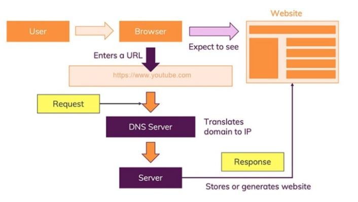
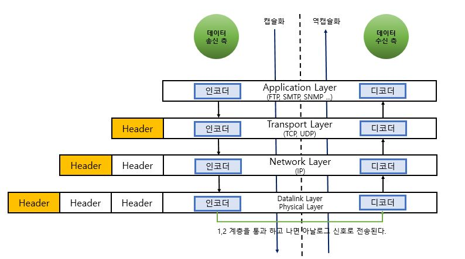
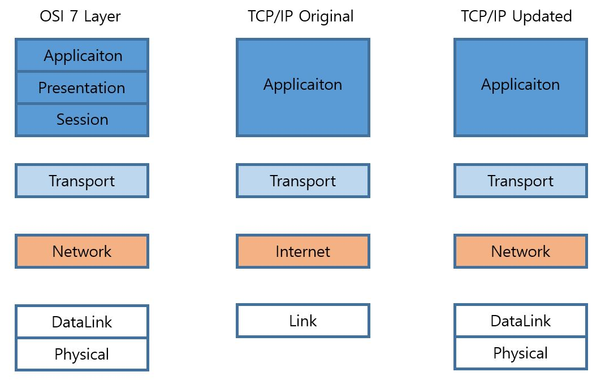
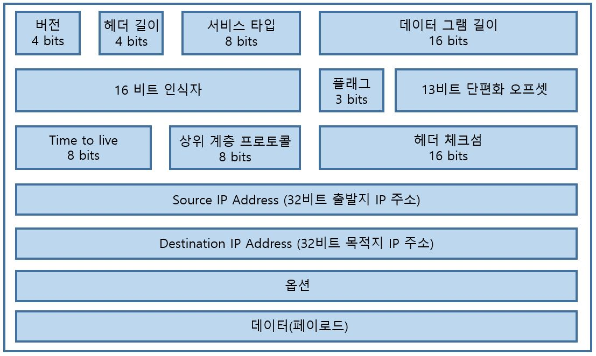
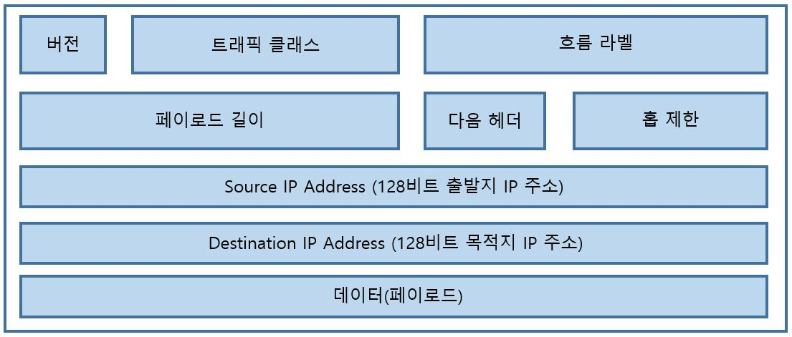
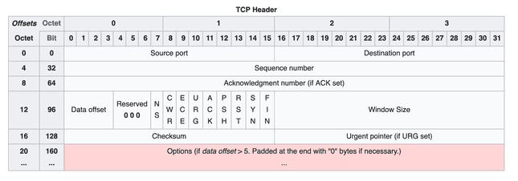
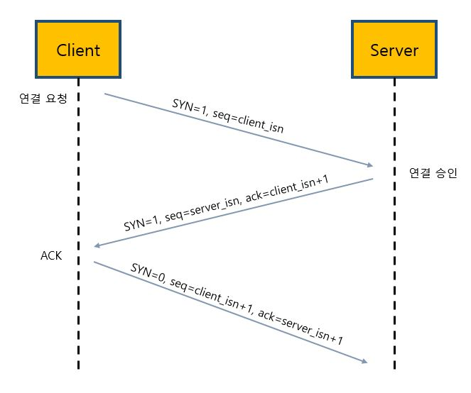
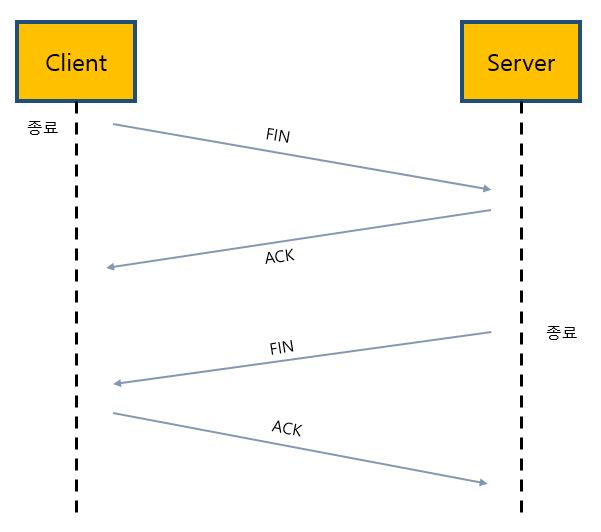

# 인터넷 프로토콜 스택 5 Layer

- __Protocol Stack__
    - 다양한 계층의 `프로토콜`을 모두 합하여 프로토콜 스택이라고 한다.
- __Protocol__
    - 프로토콜은 둘 이상의 통신 개체 간에 교환되는 메시지 포맷과 순서뿐 아니라, 메시지의 송수신과 다른 이벤트에 따른 행동들을 정의한다.
    - Ex. 발표자(A)와 발표를 듣는 스터디원 분(O)들 사이에는 어떠한 프로토콜이 존재할까?
        - 발표자 : (프로토콜 설명 중) 질문 있습니까? 
        - Others : 네 or 손을 드는 행위 (발표자에게 암시적인 메시지를 전송)
        - 발표자 : 네 말씀하세요. (질문해도 좋다라는 메시지를 전송)
        - Others : 발표자에게 질문 (발표자에게 메시지를 전송)
        - 발표자 : 질문을 듣고 (질문 메시지를 수신) -> 대답 (응답 메시지 전송)
        - 메시지의 송수신과 이들 메시지를 송수신할 때 취하는 행동에는 "`질문과 응답 프로토콜`"이 중심에 있다.
    - `네트워크 프로토콜(Network Protocol)`
        - 메시지를 교환하고 행동을 취하는 개체(Entity)가 하드웨어나 소프트웨어인 것을 제외하면 사람 간의 프로토콜과 매우 비슷하다.
        - 
            - 사용자는 인터넷에 연결된 노트북을 열고 브라우저를 연다.
            - 브라우저에서 유튜브 도메인(www.youtube.com)을 입력한다.
            - 브라우저는 DNS 서버로 이동하여 IP 주소로 교환한다.
            - 브라우저는 IP 주소를 사용하여 웹 사이트에 액세스하기 위해 유튜브 서버에 HTTP 요청을 보낸다.
            - 유튜브 서버는 HTTP 요청을 보고 데이터를 패킷 및 TCP 번호로 준비한다.
            - 유튜브 서버는 사용자 브라우저에 200 OK 상태 코드를 응답 시작 줄에 담아 응답한다.
            - TCP 는 패킷을 다시 데이터 전체로 조합하고 asset(자산)을 파싱하여 웹 페이지에 표시한다.
- __인터넷 프로토콜 스택 5 계층 구조__
    - `애플리케이션 계층(응용)`
        - HTTP(웹 문서와 요청 전송), SMTP(전자메일 전송), FTP(파일전송)
        - 애플리케이션끼리 정보 패킷을 교환할 때 이 계층을 사용, 이 계층에서 패킷을 `메시지(message)`라고 한다.
        - `TCP/IP 소켓 프로그래밍`
            - 운영체제의 Transport Layer 에서 제공하는 API 를 활용해서 통신 가능한 프로그램을 만드는 것을 의미한다.
            - 소켓 프로그래밍만으로도 클라이언트, 서버 프로그램을 따로 만들어서 동작시킬 수 있다.
            - TCP/IP 소켓 프로그래밍을 통해서 누구나 자신만의 Application Layer Encoder 와 Decoder 를 구현할 수 있다.
    - `트랜스포트 계층(전송)`
        - TCP, UDP 
        - 클라이언트와 서버 간에 애플리케이션 계층 메시지를 전송하는 서비스를 제공. 트랜스포트 계층 패킷을 `세그먼트(segment)`라고 한다.
            - 엄밀히 말하자면 인터넷 문서(RFC)에서는 TCP 에 대한 패킷을 `세그먼트(segment)`라고 정의하고 있고, UDP 에 대한 패킷을 `데이터그램(datagram)` 이라고 표현하고 있다.
        - __전송 계층을 한마디로 정의하자면 EndPoint 간 `신뢰성` 있는 데이터 `전송`을 담당하는 계층이라고 생각하면 된다.__
            - 신뢰성 : 데이터를 순차적, 안정적으로 전달
            - 전송 : 포트 번호에 해당하는 프로세스에 데이터를 전달
            - 따라서, 데이터를 받고자 하는 프로세스들은 `포트 번호(Port Number)`를 가져야 한다.
            > 포트 번호(Port Number)란 하나의 컴퓨터에서 동시에 실행되고 있는 프로세스들이 서로 겹치지 않게 가져야 하는 정수 값을 의미한다.
    - `네트워크 계층(IP)`
        - IP
        - 인터넷 네트워크 계층의 패킷을 `데이터그램(datagram)` 이라고 한다.
            - 작은 데이터그램 각각을 조각(fragment)라고 한다.
        - 한 호스트에서 다른 호스트로 데이터그램(datagram)을 `라우팅`하는 책임을 진다. 
        - `라우팅(routing)과 포워딩(forwarding)`
            - 수 많은 네트워크들의 연결로 이루어지는 인터넷 네트워크 속에서
            - 어딘가에 있는 목적지 컴퓨터로 데이터를 전송하기 위해
            - IP 주소를 이용해 길을 찾고(routing)
            - 자신 다음의 라우터에게 데이터를 넘겨주는 것(forwarding)
            > Wikipedia. 라우터(router 혹은 라우팅 기능을 갖는 공유기)는 컴퓨터 네트워크 간에 데이터 패킷을 전송하는 네트워크 장치다.
    - `데이터 링크 계층(링크)`
        - 이더넷, 와이파이 등
        - 경로상 한 노드에서 다른 노드로 패킷을 이동하기 위해, 네트워크 계층은 링크 계층 서비스에 의존해야 한다. 네트워크 계층은 데이터그램을 아래 링크 계층으로 보내고 링크 계층은 그 데이터그램을 경로상의 다음 노드에 전달한다. 링크 계층의 패킷을 `프레임(frame)`이라고 한다.
        - __같은 네트워크에 있는 여러 대의 컴퓨터들이 데이터를 주고 받기 위해서 필요한 모듈__
    - `물리 계층`
        - 네트워크 어댑터, 리피터, 네트워크 허브, 모뎀
        - 링크 계층의 기능이 전체 프레임을 한 네트워크 요소에서 이웃 네트워크 요소로 이동하는 것이라면, 물리 계층의 기능은 프레임 내부의 `각 비트(물리 계층에서 사용되는 통신 단위)`를 한 노드에서 다음 노드로 이동하는 것이다. 이 계층의 프로토콜은 링크에 의존하고 더 나아가 링크의 실제 전송 매체(Ex. 꼬임쌍선, 단일 모드 광케이블)에 의존한다.
        - `비트를 이용한 통신`
            - 비트는 0과 1로 나타내지는 전기적 온 오프 상태를 의미
            - 비트의 나열을 아날로그 신호로 바꾸어 전선으로 흘려보내고(`encoding`)
            - 아날로그 신호가 들어오면 비트의 나열로 해석하여(`decoding`)
            - `물리적으로 연결된(전선)` 두 대의 컴퓨터가 비트의 나열을 주고 받을 수 있게 해주는 모듈을 의미

- __OSI 7 Layer 와의 차이점__
    - 인터넷 프로토콜 스택은 프레젠테이션 계층(표현)과 세션 계층을 애플리케이션 계층에 포함시켰다.

## PDU(Protocol Data Unit) : 각 계층의 데이터 단위

- 세션, 표현, 어플리케이션 계층: Message(Data)
- 전송 계층: Segment
- 네트워크 계층: Packets(Datagram 이라고도 함)
- 데이터링크 계층: Frame
- 물리 계층 : Bit

### 데이터 캡슐화



- __동작 방식__
    - 송신자 쪽에서 상위 계층에서 하위 계층으로 데이터를 보낼 때, 각 계층의 encoder 를 통해 데이터를 캡슐화 하며, 1-2 계층을 통과하면 아날로그 신호로 바뀌어 전선을 타고 수신자 측의 하위 계층 디코더로 진입한다. 송신자 쪽에서 데이터를 보내면서 헤더가 추가되는 과정을 캡슐화라고하며, 수신자 쪽에서 캡슐화된 헤더를 벗겨내는 과정이 역캡슐화라고 한다.

- __PDU(Protocol Data Unit)__
    - SDU(Service Data Unit)
    - PCI(Protocol Control Information)

PDU는 SDU(Service Data Unit) 와 PCI(Protocol Control Information)로 구성되어 있다. SDU 는 전송하려는 데이터고, PCI 는 제어 정보다. PCI 에는 송신자와 수신자 주소, 오류 검출 코드, 프로토콜 제어 정보 등이 있다. 데이터에 제어 정보를 덧붙이는 것을 캡슐화(Encapsulation)라 한다.

다시 말해, 캡슐화는 어떤 네트워크를 통과하기 위해 전송하려는 데이터를 다른 무언가로 감싸서 보내고 해당 네트워크를 통과하면 감싼 부분을 다시 벗겨내어 전송하는 기능을 말한다.

## 계층을 구조화하는 이유(Layered Architecture)

네트워크는 상당히 복잡한 구조를 가지기 때문에 이를 효과적으로 분업하기 위해서 `기능별로 나누어 계층적 구조화`를 시키는 것이다. 

Layered Architecture 를 사용하면 `복잡한 시스템을 명확하고 구체적으로 구분`할 수 있고, 각 계층이 자신의 역할에 집중할 수 있게 되고, 모듈로써 제공할 수 있다.

> MVC 패턴은 소프트웨어 아키텍처 중 하나인데, Layered Architecture 로 구성되어있다. 네트워크 시스템도 마찬가지이다.

# OSI 7 Layer

OSI 7 Layer 는 인터넷 프로토콜 스택과 비슷하지만, 프레젠테이션 계층과 세션 계층이 추가되었다는 점이다.

- __Application Layer__
- __Presentation Layer__
    - 표현 계층은 코드 간의 번역을 담당하여 사용자 시스템에서 데이터의 형식상 차이를 다루는 부담을 응용 계층으로부터 덜어준다. 
    - MIME 인코딩이나 암호화 등이 이 계층에서 이루어진다.
    - 해당 데이터가 text 인지, gif, jpg 인지 구분하는 역할을 담당한다.
- __Session Layer__
    - 데이터가 통신하기 위한 논리적인 연결을 담당
    - TCP/IP 세션을 만들고 없애는 책임을 진다.
    - 통신하는 사용자들을 동기화하고 오류복구 명령들을 일괄적으로 다룬다.
- __Transport Layer__
- __Network Layer__
- __Datalink Layer__
- __Physical Layer__

사실 현재의 인터넷은 OSI 모델이 아니라 `TCP/IP` 모델을 따르고 있다. TCP/IP 모델도 OSI 모델과 마찬가지로 네트워크 시스템에 대한 모델이다. 현대의 인터넷이 TCP/IP 모델을 따르는 이유는 OSI 모델이 TCP/IP 모델과의 시장 점유 싸움에서 졌기 때문이다. 그럼에도 `OSI 7 Layer` 를 배우는 이유는 네트워크 구조를 이해하는데 도움이 되기 때문이다.

# TCP/IP Layer

TCP/IP Layer 는 사실 두 가지 버전이 있다.

- TCP/IP Original(4 Layer)
- TCP/IP Updated(5 Layer)

아래 그림을 보면서 비교해보자.



OSI 7 Layer 의 5,6,7 계층이 Application Layer 하나로 통합되었다. 1,2 게층이 Network Interface 로 통합되었다.

오늘날에는 `TCP/IP Updated` 모델이 더 많이 사용된다.

TCP/IP Updated 모델을 자세히 보면 맨 위에서 배운 `인터넷 프로토콜 스택`과 구조가 동일하다. 

"그렇습니다. 지금 바로 여러분들이 생각하고 있는 그게 맞는 생각입니다."

'컴퓨터 네트워킹 하향식 접근 제 7판' 이라는 책에서 인터넷 프로토콜 스택 5 Layer 라고 설명이 되어있고 목차가 저렇게 구성되어있는 이유는 바로 인터넷 프로토콜 스택 5 Layer 가 현대에서 사용 중인 TCP/IP Updated 을 따르기 때문이다.

"현대에서 클라이언트와 서버간의 통신을 하기위한 프로토콜로 `TCP/IP 프로토콜`을 많이 사용합니다. 아래에서는 네트워크의 통신 방식을 디테일하게 알아보기 위해 IP 와 TCP/IP 통신 방식에 대해서 배워보겠습니다."

# IP

- __IP(Internet Protocol)__
    - 네트워크에 연결된 장치들(Ex. 서버, 라우터 등)이 서로 통신하기 위한 `고유 주소`를 의미
    - `패킷(Packet)` 이라는 통신 단위로 데이터를 전달
- __IP 주소(Internet Protocol Address) : 전화번호__
    - IP 주소란 인터넷에서만 사용되는 전화번호라고 생각할 수 있다.
    - 특정 사이트를 접속하기 위해서 IP 주소를 전부 입력하라고 하면 매우 불편하고 힘들기 때문에 등장한 것이 `DNS(Domain Name System)` 즉, 인터넷 전화번호부가 등장했다.
- __DNS(Domain Name System) : 전화번호부__
    - DNS 는 도메인 이름을 IP 주소로 변환합니다.
    - 구글에 접속하기 위해 google.com 을 입력하면 DNS 를 통해 구글의 IP 주소를 찾아 이동하게 되는 것입니다. 좀 더 디테일하게 설명하자면 전화번호부 안에서도 또 다른 전화번호부를 가지고 있습니다. google.com 을 치면 가장 상위 전화번호부로 이동한 다음, 해당 전화번호부에서 goole.com 을 아는 하위 전화번호부를 알려주게 된다. 이러한 하위 전화번호부를 `registry` 라고 한다. registry 는 사기업들에 의해서 운영되며, .com registry 의 경우 미국의 Verisign 이라는 기업이 운영하고 있다.
    - 전화번호부에는 웹사이트 주소 = IP 주소 형태로 적혀있다.
    - 전화번호부는 계층형 형태로 구성되어 있으며, 하위 전화번호부를 `registry`라고 한다.
- __특징__
    - `비연결성`
        - 패킷을 받을 대상이 없거나 서비스 불능 상태여도 패킷을 전송
    - `비신뢰성`
        - 중간에 패킷이 사라지면 ? 
        - 패킷이 순서대로 안오면 ?
        - 따라서, IP 는 신뢰할 수 없는 서비스를 제공한다.

TCP/IP 5 Layer 의 Network 계층 패킷을 `데이터그램(datagram)`이라고 부른다라는 것을 배웠다. IPv4, IPv6 는 데이터그램(패킷)으로 데이터를 전송한다.

## IPv4

- __특징__
    - 32비트 방식을 사용
    - Ex. 192.168.10.1
    - `.(점)`으로 구분하며 십진 표기법(dotted-decimal notation)을 사용한다.
- __IPv4 의 데이터그램 포맷__
    - 

"되게 많은 부분들로 구성이 되어있는데 가장 중요한 부분에 대해서만 소개하겠습니다."

- __데이터(페이로드)__
    - 데이터 그램이 존재하는 이유이자 가장 중요한 마지막 필드다.

"페이로드가 중요한 이유는 `IPv4의 단편화와 재결합`의 개념을 공부하면 알 수 있습니다."

### 단편화와 재결합

링크 계층에서 네트워크 계층으로 패킷을 전달할 때 항상 같은 크기로 전달 할 순 없다.
어떤 프로토콜은 큰 데이터그램을 전달하는 반면, 다른 프로토콜은 작은 데이터그램만을 전달할 수 있다. 링크 계층 프레임이 전달할 수 있는 최대 데이터 양을 `MTU(maximum transmission unit)` 라고 부른다. MTU 는 조각(fragment, 단편)를 나누는 기준이 된다.

"단편화와 재결합을 이해하기 위해서 예시를 들어 설명하겠습니다."

- Ex. 서로 다른 A, B 라우터가 있고  A -> B 로 데이터그램을 보낸다고 가정
    - 전제. B 의 MTU 가 A 보다 작다.
    - 그러면 A 에서 데이터그램을 자신의 MTU 최대로 해서 보내게되면 B 에서는 어떻게 받아서 짜맞추고 처리해야할지 난감하다.
    - 이러한 문제를 해결하고자 IP 데이터그램의 페이로드를 작게 `분할`하고 -> 분할된 데이터그램을 캡슐화하여 출력 링크로 보낸다.
    - 이렇게 분할되어 작아진 데이터그램 각각을 `조각(fragment, 단편)`이라고 한다.

"이렇게 잘린 단편(fragment)들은 전송 계층(Transport Layer)에 도달하기 전에 재결합 되어야 합니다."

목적지 호스트(Destination Host)에서 `재결합`을 잘 수행하기 위해 내부적으로 `식별자, 플래그, 단편화 오프셋` 필드를 IP 데이터그램 헤더에 찍어 넣었다. IP 자체는 신뢰할 수 없는 서비스를 제공하기 때문에 패킷이 중간에 사라지거나 제대로 오지 않을 수 있다. 이러한 이유로 목적지 호스트가 원본 데이터그램의 마지막 조각을 수신했음을 확신하기 위해 마지막 데이터그램 조각의 플래그 비트는 0으로, 다른 조각들의 플래그 비트는 1로 설정한다.

__프래그먼트(fragment, 단편)을 이용하는 곳에서는 단편화가 발생한다. TCP 는 세그먼트(segment)라는 것을 이용해서 단편화가 발생하지 않는다. 반면 UDP 는 를 사용하기 때문에 단편화가 발생한다.__

## IPv6

- __특징__
    - 128비트 방식(16비트씩 8자리로 구성)
    - Ex. 2001:0DB8:1000:0000:0000:0000:1111:2222
    - 32비트에서 128비트로 확장이되어, 행성의 모든 모래알 마저도 IP 주소로 표현할 수 있다.
    - IPv6 는 `애니캐스트 주소(anycast address)`가 도입되었는데, 애니캐스트 주소로 명시된 데이터그램은 호스트 그룹의 어떤 이에게도 전달될 수 있다고 한다.
        - Ex. 주어진 문서를 포함한 수 많은 미러 사이트 중에서 가장 근접한 HTTP GET 을 보내는 데 사용
- __IPv6 의 데이터그램 포맷__
    - 

# TCP, UDP

TCP 와 UDP 는 전송 계층(Transport Layer)에 속하며, 네트워크 애플리케이션을 설계할 때 둘 중 하나를 선택해야 한다. UDP(User Datagram Protocol)은 비 신뢰적이고 비 연결형인 서비스를 제공하며 TCP(Transmission Control Protocol)는 `신뢰적`이며 `연결지향형` 서비스를 제공한다.

## TCP 

- __TCP 특징__
    - `전이중(full-duplex)` 서비스 제공
        - 전송이 양방향으로 동시에 일어날 수 있다.
        - Ex. A, B 프로세스 사이에 TCP 연결이 있다면, 데이터는 A->B, B->A 로 동시에 흐를 수 있다. 이러한 특징을 전이중 서비스라고한다.
    - `점대점(point-to-point)` 
        - 각 연결이 정확히 2개의 종단점을 가지고 있다.
        - Ex. 단일 송신 동작으로 한 송신자가 여러 수신자에게 데이터를 전송하는 `멀티캐스팅`은 TCP 에서 불가능하다.
    - `TCP 3 way handshake` 사용
        - TCP 연결 절차를 '세 방향' 핸드셰이크라고 부른다.
    - `세그먼트(segment)` 사용
        - 세그먼트의 크기는 `최대 세그먼트 크기(maximum segment size, MSS)`로 제한된다.
            - 즉, MSS 가 세그먼트를 나누는 기준이된다.
        - MSS 는 MTU 에 의해 결정된다.
    - `흐름제어` 제공
        - 데이터를 송신하는 곳과 수신하는 곳의 데이터 처리 속도를 조절하여 수신자의 버퍼 오버플로우를 방지하는 것
        - 송신하는 곳에서 감당이 안되게 많은 데이터를 빠르게 보내 수신하는 곳에서 문제가 일어나는 것을 막는다.
    - `혼잡제어` 제공
        - 네트워크 내의 패킷 수가 넘치게 증가하지 않도록 방지하는 것
        - 정보의 소통량이 과다하면 패킷을 조금만 전송하여 혼잡 붕괴 현상이 일어나는 것을 막는다.
    - 데이터 전달 보증
    - 순서 보장
    - 신뢰할 수 있는 프로토콜
    - TCP 3 way handshake 로 연결하고, TCP 4 way handshake 로 연결 해제
- __주로 사용 되는 애플리케이션__
    - 속도보다 `신뢰성이 중요`하다고 판단되는 곳에서는 대부분 TCP 가 사용된다고 생각하면 된다.
    - SMTP(전자메일)
    - Telnet(원격 터미널 접속)
    - HTTP(웹)
    - FTP(파일 전송)

### TCP 세그먼트 구조

"아래 그림은 TCP Header" 구조라고도 합니다.



"TCP 에서 패킷 전송 단위를 세그먼트(segment)라고 배웠는데, 세그먼트란 `TCP-Header + Data` 라고 생각하면 됩니다." 

"중요하게 볼 부분은 출발지 포트번호와, 목적지 포트번호를 가진다는 점과 `ACK, SYN, FIN` 정도 입니다."

### TCP 3 way handshake

TCP 는 IP 가 처리할 수 있도록 데이터를 여러 개의 패킷으로 나누고 도착지에서는 완전전한 데이터로 패킷들을 재조립 해야 한다.

- SYN : 접속 요청(패킷 송신)
- ACK : 요청 수락(패킷을 받았다고 응답)
- FIN : 접속이 연결되었을 때, 끊어야 할 때 사용하는 FLAG BIT



```
# 클라이언트와 서버의 대화
- C to S : 야!! 나 너랑 연결하고 싶어(SYN 1 로 설정하고 송신)
- S : 어? 그래 나도 너랑 연결하고 싶어 : SYN 과 ACK(클라이언트가 처음에 요청한 것에 대한 응답)을 1로 설정하여 송신
- C : 그래 좋아(응답 ACK 을 송신), 야 데이터 보내줄게 받아라(데이터도 같이 송신)
```

1. 클라이언트가 서버에 연결 요청을 할 때 SYN 이라는 플래그 비트와 최초의 순서번호(client_isn)를 선택한다. 그리고 최초의 TCP SYN 세그먼트의 순서번호 필드에 이 번호를 넣는다. 이 세그먼트는 IP 데이터그램 안에서 캡슐화되고 서버로 송신된다.
2. TCP SYN 세그먼트를 포함하는 IP 데이터그램이 서버에 도착하면, 서버는 데이터그램으로부터 TCP SYN 세그먼트를 뽑아낸다. 그리고 TCP 버퍼와 변수들을 할당한다음 TCP 로 연결 승인 세그먼트를 송신한다. 확인 응답 필드인 ACK 에 client_isn 을 +1 하여 보낸다. 이러한 연결 승인 세그먼트는 `SYNACK 세그먼트`라고도 불린다. 여기서 클라이언트가 ACK 을 수신하지 못하면 클라이언트가 패킷을 다시 서버로 재전송한다.
3. 클라이언트가 서버로 연결이 설정되었다는 것을 응답하기 위해 SYN 을 0 으로 바꿔 보낸다. 이때 데이터까지 같이 보낼 수 있다.

이렇게 연결이 완료되면(SYN 과 ACK 을 수신하고 ACK 을 전송) 상태 값은 `ESTABLISHED`가 된다.

TCP 연결이 있다면 연결 종료도 있어야 한다. 연결 종료는 `TCP 4 way handshake`라고 불리며 ESTABLISHED 상태에서 시작된다.

### TCP 4 way handshake



1. 데이터를 전부 송신한 클라이언트가 서버로 FIN 을 송신
2. 서버가 ACK 을 송신
3. 서버에서 남은 패킷 송신(일정 시간 대기)
5. 서버가 FIN 송신
6. 클라이언트가 ACK 송신

#### TCP의 연결 설정 과정(3단계)과 연결 종료 과정(4단계)이 단계가 차이나는 이유?

클라이언트에서 데이터 전송이 끝났을지라도, 서버에서는 보내야할 데이터가 남아 있을 수 있기 때문이다.

### TCP 의 문제점

- 매번 커넥션을 연결해서 시간 손실 발생(3 way handshake)
- 패킷을 조금만 손실해도 재전송

## UDP

TCP 와는 다르게 데이터를 패킷([datagram](http://www.ktword.co.kr/test/view/view.php?m_temp1=634&id=418))으로 나누고 반대편에서 재조립하는 과정을 거치지 않으며 수신지에서 제대로 받던 받지 않던 상관 안하고 데이터를 보내기만 한다. 

- __장점__
    - TCP 보다 신뢰성은 떨어지지만 전송 속도는 빠르다.
- __특징__
    - 사용자 데이터그램 프로토콜(User Datagram Protocol)
    - 하얀 도화지에 비유(기능이 거의 없음)
    - 단방향 연결
    - 비연결성(No Handshaking)
    - 비신뢰성
    - 데이터 전달 보증 X
    - 순서 보장 X
    - 재결합 X
    - `데이터 전달 및 순서가 보장되지 않지만, 단순하고 빠름`
    - `IP와 거의 같다. + PORT + 체크섬 정도만 추가`
    - 애플리케이션에서 추가 작업 필요
    - 영상 스트리밍 같은 곳에서 주로 사용
- __주로 사용 되는 애플리케이션__
    - NFS(원격 파일 서버) -> 주로 UDP
    - DNS -> 주로 UDP
        - DNS 가 UDP 로 주로 사용되는 이유 ?
            - TCP 의 연결 설정 지연을 피하기 위해
            - 연결 상태를 유지할 필요가 없음
            - 신뢰성보단 속도가 중요하기 때문
           
# PORT

포트는 같은 IP 내에서 `프로세스를 구분`하기 위한 것입니다.

- 192.168.10.1
  - Ex. 게임 : 8090
  - Ex. 화상통화 : 21000
  - Ex. 웹브라우저 : 10010

포트는 일반 적으로 세 가지로 나눌 수 있습니다.

- 0 ~ 1023 : 잘 알려진 포트(Well Known Port)
- 1024 ~ 49151 : 등록된 포트(Registered Port)
- 49152 ~ 65535 : 동적 포트(Dynamic Port)

유닉스 체제의 경우 잘 알려진 포트에 대해 방화벽을 해제하려면 루트 권한이 필요합니다.

## QNA

### Q : TCP/IP 와 TCP 는 같은 의미인지 ?

A : 같습니다. TCP/IP 라는 이름이 붙게된 이유는 인터넷 프로토콜 슈트중 TCP 와 IP 가 가장 많이 사용되기 때문에 붙었다고 합니다. TCP/IP Layer 또한 HTTP, FTP, SMTP 등 TCP 를 기반으로 한 수많은 애플리케이션이 IP 프로토콜 위에서 동작하기 때문에 붙여진 이름이라고 합니다.

> [Wikepedia. 인터넷 프로토콜 스위트](https://ko.wikipedia.org/wiki/%EC%9D%B8%ED%84%B0%EB%84%B7_%ED%94%84%EB%A1%9C%ED%86%A0%EC%BD%9C_%EC%8A%A4%EC%9C%84%ED%8A%B8)

### Q : TCP/IP 5 계층이, OSI 7 계층에 비해 갖는 이점과, 표준이된 이유 ?

A : TCP/IP 가 산업계의 표준이 될 수 있던 결정적인 이유는 TCP/IP Model 이 OSI 7 Layer 보다 빨리 발표되었기 때문입니다. 이기종간 통신 프로토콜이 최대한 빨리 필요했던 미국방성에서 TCP/IP를 공식적으로 사용했고 이를 근간으로 네트워크가 발전되어왔습니다. 즉, TCP/IP Model 이 OSI Model 보다 먼저 개발되었습니다. TCP/IP 모델이 갖는 장점은 인터넷 개발 이후 쭉 채택되어온 아키텍처이기 때문에 계속 표준화가되어 신뢰성이 우수합니다.

> [TCP-Updated-Model](https://velog.io/@osk3856/TCP-Updated-Model)

### Q : IPv4 랑 IPv6 의 차이점에 대해서 말해주세요.

A : 둘다 IP 계층에서 동작합니다. IPv6 가 IPv4 에 비해 갖는 이점은 패킷을 단편화하지 않으면서 보다 효율적인 라우팅이 가능하다는 점입니다. 또한 IPv6 는 보안을 염두에 두고 구축이 되어서 기밀성, 인증 및 데이터 무결성을 제공합니다.

> [IPv4 와 IPv6 의 차이](https://nordvpn.com/ko/blog/ipv4-ipv6-bigyo/)

### Q : 네트워트 애플리케이션을 설계해야하는데 TCP, UDP 중에서 하나를 선택해야 한다고하면 어떠한 기준으로 선택할 것인지 ?

A : 설계하고자 하는 애플리케이션이 신뢰성이 중요한지 혹은 속도가 중요한지를 먼저 판단할 것 같습니다. 속도보다 신뢰성이 더 중요하다고 판단되면 TCP 를 사용할 것 같습니다. 반면 스트리밍 서비스와 같이 속도가 중요하고 신뢰성보다는 연속성이 중요한 서비스라고 판단되면 UDP 를 사용할 것 같습니다.

이런 질문을 받는다면, 의도는 하나일 것이다. TCP 와 UDP 의 특징에 대해 이해하고 있는지에 대해 판단하기 위해 질문했을 가능성이 크다. 단, 위 질문(Q)에 대한 대답(A)은 추가 질문이 들어오기 좋을 수 있다. 추가 질문에 대한 포인트는 바로 `스트리밍 서비스`인데, 바로 아래 질문으로 넘어가보자.

### Q : 스트리밍 서비스 처럼 속도가 더 중요하다고 생각되는 곳에서 UDP 를 사용하겠다고 답변 하셨는데, 그럼 Youtube 나 Netflix 등 대부분 비디오 스트리밍 애플리케이션들은 UDP 를 사용하고 있는 건가요 ?

A : 아닙니다. UDP 스트리밍 자체에는 크게 세 가지 단점이 존재한다고 알고 있습니다.

- 첫째. 서버와 클라이언트 간의 예측하기 어려운 가용 대역폭 변화로 인해 UDP 스트리밍은 연속적인 재생을 제공하는 데 실패할 수 있습니다.
- 둘째. UDP 스트리밍이 클라이언트와 서버 간의 대화식 요구 및 상태 추적을 위해 [RTSP(Real Time Streaming Protocol)](https://ko.wikipedia.org/wiki/%EC%8B%A4%EC%8B%9C%EA%B0%84_%EC%8A%A4%ED%8A%B8%EB%A6%AC%EB%B0%8D_%ED%94%84%EB%A1%9C%ED%86%A0%EC%BD%9C) 서버와 같은 미디어 제어 서버를 필요로 한다는 점입니다.
- 셋째. 많은 방화벽 시스템이 UDP 트래픽을 차단하도록 설정되어 있어, 방화벽 안쪽의 사용자가 UDP 비디오를 수신하지 못한다는 점입니다.

이러한 세 가지 이유로 Youtube, Netflix 등 대부분의 비디오 스트리밍 애플리케이션들은 `HTTP 스트리밍` 방식을 사용하고 있습니다.

HTTP 스트리밍 방식의 특징에 대해서 간략히 설명드리자면, HTTP 스트리밍에서 비디오는 HTTP 서버 내의 특정 URL 을 갖는 일반적인 파일로 저장됩니다. 사용자가 비디오 시청을 원하면 클라이언트는 서버에게 TCP 연결을 설립하고 해당 URL 에 대한 HTTP GET 요청을 발생시킵니다. 이때 서버는 HTTP 응답 메시지를 통해 파일을 전송하며, TCP 혼잡제어(패킷 오버플로우 방지) 및 흐름제어(데이터의 처리 속도 조절)가 허용하는 한도에서 최대한 빠른 시간에 응답하게 됩니다.

TCP 상의 HTTP 를 이용하면 비디오가 방화벽이나 주소변환기(NAT)를 쉽게 통과할 수 있습니다. 대부분의 장비들이 UDP 트래픽은 차단하지만 HTTP 트래픽은 통과시키도록 설정되어 있기 때문입니다.

또한 HTTP 를 이용한 스트리밍은 RTSP 서버와 같은 미디어 제어 서버를 생략하게 함으로써 많은 비용을 절감할 수 있게 해줍니다. 따라서 이러한 장점으로 인해 많은 비디오 스트리밍 서비스를 운영하고 있는 회사들이 UDP 대신 `HTTP 스트리밍 기반 프로토콜`을 채택하여 사용 중입니다.

## References

> [How Does The Web Work](https://webdevtechblog.com/%EC%9B%B9%EC%9D%80-%EC%96%B4%EB%96%BB%EA%B2%8C-%EB%8F%99%EC%9E%91%ED%95%A0%EA%B9%8C-how-does-the-web-work-90c2286c9f4)
>
> [컴퓨터 네트워킹 하향식 접근 제 7판](http://www.kyobobook.co.kr/product/detailViewKor.laf?mallGb=KOR&ejkGb=KOR&barcode=9791185475318)
>
> https://jhnyang.tistory.com/373
>
> https://hwan-shell.tistory.com/271
>
> https://bnzn2426.tistory.com/64
>
> [히히의 OSI 7 Layer](https://www.youtube.com/watch?v=1pfTxp25MA8&list=PLgXGHBqgT2TvpJ_p9L_yZKPifgdBOzdVH&index=120)
>
> [르윈의 TCP, UDP](https://www.youtube.com/watch?v=ikDVGYp5dhg&list=PLgXGHBqgT2TvpJ_p9L_yZKPifgdBOzdVH&index=165)
>
> http://www.ktword.co.kr/test/view/view.php?m_temp1=323
>
> https://github.com/WeareSoft/tech-interview/blob/master/contents/network.md#frame-packet-segment-datagram
