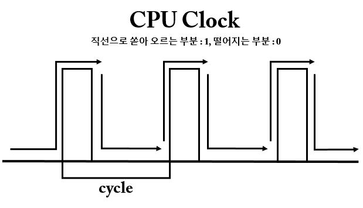

# CPU Clock

해당 내용은 면접에서 나올 내용은 아니라 가볍게 읽으시면 되겠습니다.

CPU 의 `클럭(Clock)`은 전기신호를 의미한다. 컴퓨터는 0과 1로 움직인다라는 말을 많이 들어봤을 것이다. 쉽게 말해 전기가 들어오면 1, 들어오지 않으면 0이라는 신호를 만들어서 데이터를 처리하게된다.

CPU는 메인보드에서 공급받는 전기를 신호로 받아서 연산 작업을 하게 된다.

CPU의 클럭이 높다는 것은 그만큼 한번 움직이는 타이밍에(1초) 더 많은 양의 데이터를 처리한다는 의미이다. 단위는 `Hz` 라고 표기한다. (Hz 는 `1초에 몇번`이라는 개념으로 진동이나 클럭, 주파수 등에 쓰이는 개념이다.)

즉, CPU 클럭 속도는 CPU 성능의 주요 사항 중 하나가 되겠다.

- 1Hz = 1초에 1개의 전기 신호 처리
- 1MHz = 1초에 100만 개의 전기 신호 처리
- 4GHz = 1초에 40억 개의 전기 신호 처리

따라서, `CPU : 3.2 GHz` 는 1초에 32억번의 데이터 연산을 수행한다는 의미이다. 이러한 CPU 두 개를 집적하면 dual cpu, 4개면 quad cpu 라고 부른다.
