# CPU 스케줄링

## 개념

프로세스들의 **실행 순서**를 정해주는 것이다. **준비** 상태에 있는 프로세스 중에서 **어느 프로세스에게 CPU를 할당**할 것인지 결정한다.

 

## 필요성
계산을 할 때는 CPU가 필요하지만, I/O를 할 때는 필요 없다. 이때 CPU를 다른 프로세스가 이용하면 전체적인 시스템의 효율은 올라간다.
즉, CPU 를 여러 프로세스가 번갈아 가면서 사용하면 효율적일 수 있다.

  

## 스케줄링의 분류
‧ 단기 스케줄링 (short-term scheduling) : **메모리 내부**에 있는, **실행 준비(Ready) 상태 프로세스** 중에서 한 프로세스를 선택하여 CPU를 할당하는 것을 의미한다.
**일반적인 스케줄러라 함은 단기 스케줄러**를 의미한다.

‧ 중기 스케줄링 (medium-term scheduling) : 메모리에 프로세스가 너무 너무 많은 경우,
**메모리에 있는 프로세스를 선정하여 디스크로 보낸다.** ( Swap - out)  
시간이 흘러 메모리에 여유가 생기게 되면 메모리에 다시 적재한다. ( Swap - in )

‧ 장기 스케줄링 (long-term scheduling) : `스케줄러 알고리즘`에 따라 **어떤 프로그램을 하드디스크로부터 메모리로 적재할지를 결정하는 것**을 의미한다.
생성(상태)에 있는 프로그램들 중에서 필요한 프로세스를 생성하여 준비에 넣는다. 디스크와 같은 저장장치에 작업들을 저장해 놓고 필요할때마다 실행할 작업을 Ready Queue에서 꺼내서 메모리에 적재한다.

- 요약  
  단기 스케줄러는 CPU 와 메모리 사이의 스케줄링을 담당하고, 장기 스케줄러는 메모리와 디스크 사이의 스케줄링을 담당한다.
- 중기 스케줄러는 스와핑(Swapping)을 통해 프로세스들이 CPU 경쟁이 심해지는 것을 방지하는 역할을 한다.

  

## 용어 정리
- **Throughput** : 단위 시간당 완료되는 작업 수
- **Turnaround Time** : `Turnaround Time = Completion Time - Arrival Time`
    - 프로세스가 완료된 시간에서 프로세스가 시스템에 도착한 시간을 뺀 시간입니다. 즉, 어떤 프로세스가 완료될 때까지 걸린 시간이라고 보면 됩니다.
- **Response Time (응답 시간)** : `Response Time = FirstRun Time - Arrival Time`
    - 응답 시간은 프로세스가 처음 실행되는 시간에서 프로세스가 도착한 시간을 뺀 시간입니다. 예를 들어 P1 프로세스가 0초에 도착하여 5초에 처음 실행되었다면 응답 시간은 5초가 됩니다.
- **Waiting time (대기시간)** : 준비 큐에서 기다린 시간
- 스케줄링 정책을 비교하는 방법에 Turnaround Time, Response Time 이 있다.

  

## 스케줄링 알고리즘
### 1. FIFO (First In, First Out) : non-preemptive 스케줄러

처음 들어온 프로세스가 처음으로 실행된다. 들어온 작업이 무엇이든 먼저 들어온 작업이 있다면, 
그 작업이 수행된 뒤에 새로 들어온 작업이 수행된다.

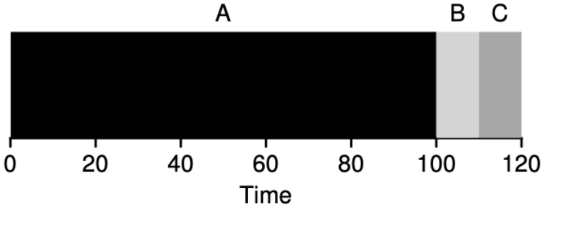

위의 예는 A, B, C가 모두 0초에 도착했다고 하면,

A는 0초에 도착해서 0초에 시작했고 100초에 완료되었습니다.   
따라서 Turnaround Time은 100초, Response Time은 0초입니다.

B는 0초에 도착해서 100초에 시작했고 110초에 완료되었습니다.   
따라서 Turnaround Time은 110초, Response Time은 100초입니다.

C는 0초에 도착해서 110초에 시작했고 120초에 완료되었습니다.   
따라서 Turnaround Time은 120초, Response Time은 110초입니다.

평균을 구해보면 Turnaround Time의 평균은 110초, Response Time의 평균은 70초입니다.

 
 

#### Convoy effect 발생 문제

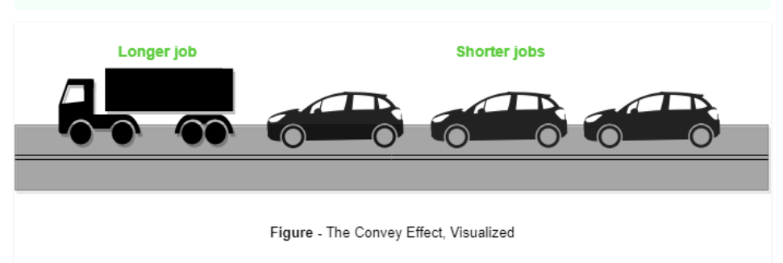

> 위의 예처럼 시간이 많이 필요한 작업이 먼저 수행된다면 뒤에 도착하는 빨리 끝날 수 있는 작업들이 수행되지 못하게 됩니다. 이러한 단점을 convoy effect라고 합니다.

  

### 2. SJF ( Shortest Job First) : non-preemptive 스케줄러
의미 : 수행시간이 짧게 걸리는 프로세스부터 순서대로 실행하는 스케줄러  
  FIFO에서 발생한 convoy effect를 해결하는 방법으로 수행시간이 짧은 애들부터 수행하려고 합니다

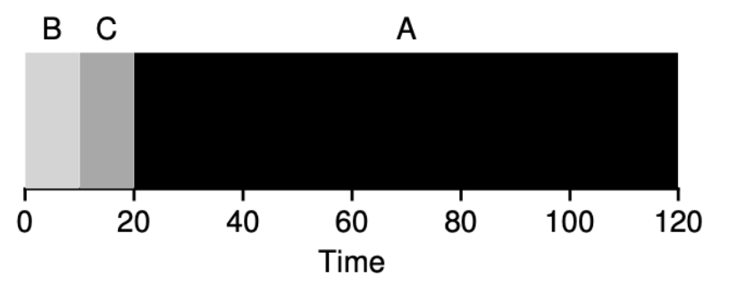

A,B, C는 모두 0초에 도착했고 A는 100초, B,C는 10초의 시간이 필요합니다. 아까와 다른 점은 동시에 도착했을 때 알파벳 순으로 수행하는 것이 아닌 수행 시간이 짧은 애들을 먼저 실행할 거예요. 이번에도 Turnaround Time, Response Time을 구해보겠습니다!

A는 0초에 도착해서 20초에 시작했고 120초에 완료되었습니다.   
따라서 Turnaround Time은 120초, Response Time은 20초입니다.

B는 0초에 도착해서 0초에 시작했고 10초에 완료되었습니다.   
따라서 Turnaround Time은 10초, Response Time은 0초입니다.

C는 0초에 도착해서 10초에 시작했고 20초에 완료되었습니다.   
따라서 Turnaround Time은 20초, Response Time은 10초입니다.

평균을 구해보면 Turnaround Time의 평균은 50초, Response Time의 평균은 10초입니다.

> Turnaround Time의 평균이 줄어들게 된 것을 볼 수 있습니다. 
> 이렇게 SJF는 항상 가장 짧은 프로세스를 먼저 실행하기 때문에 **항상 최적의 Turnaround TIme을 가져다줄 수 있습니다.**

`하지만 단점은 이를 바로 없애 버릴 정도로 큽니다. 
`
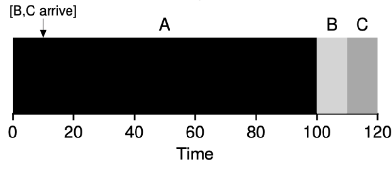

달라진 점은 B, C의 도착시간이 0초가 아니고 10초라는 점입니다.     

즉, A는 0초에 도착한 100초짜리 작업, B, C는 10초에 도착한 10초짜리 작업입니다.
0초에서 SJF로 프로세스들을 스케줄링 하려고 봤더니 A 프로세스만 존재합니다. 그래서 A를 수행합니다. 
10초에 B,C가 도착하지만 작업은 한 번 실행되면 멈출 수 없습니다. 
그래서 결국 B,C는 겨우 10초를 늦은 이유로 A가 모두 수행되기를 기다려야 합니다. 

A는 0초에 도착해서 0초에 시작했고 100초에 완료되었습니다.   
따라서 Turnaround Time은 100초, Response Time은 0초입니다.

B는 10초에 도착해서 100초에 시작했고 110초에 완료되었습니다.   
따라서 Turnaround Time은 100초, Response Time은 90초입니다.

C는 10초에 도착해서 110초에 시작했고 120초에 완료되었습니다.   
따라서 Turnaround Time은 110초, Response Time은 100초입니다.

평균을 구해보면 Turnaround Time의 평균은 약 103.3초, Response Time의 평균은 60.3초입니다.

어떤 작업이 현재 수행되고 있는 작업보다 짧아도 늦게 도착하면 수행되기 위해 기다려야 합니다.  
이러한 문제를 어떻게 해결할 수 있을까요?

  

### 3. STCF (Shortest Time-to-Completion First) : preemptive 스케줄러
- 의미 : 특정 시점에서 가장 빨리 수행될 수 있는 프로세스를 먼저 실행하는 스케줄러
- preemptive(선점) 스케줄러라는 것은 어떤 작업을 수행하는 도중에 다른 작업을 수행할 수 있도록 스케줄링할 수 있는 스케줄러를 말합니다.

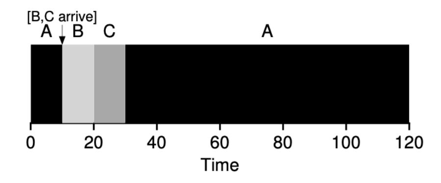

STCF는 10초에서 A를 계속 수행하는 것이 아닌 그 시점에서 가장 빨리 수행될 수 있는 B,C가 먼저 수행되는 것을 볼 수 있습니다.   

A는 0초에 도착해서 0초에 시작했고 120초에 완료되었습니다.   
따라서 Turnaround Time은 120초, Response Time은 0초입니다.

B는 10초에 도착해서 10초에 시작했고 20초에 완료되었습니다.   
따라서 Turnaround Time은 10초, Response Time은 0초입니다.

C는 10초에 도착해서 20초에 시작했고 30초에 완료되었습니다.  
따라서 Turnaround Time은 20초, Response Time은 10초입니다.

평균을 구해보면 Turnaround Time의 평균은 50초, Response Time의 평균은 3.3초입니다.

아까 SJF를 사용할 때 보다 더 효율적으로 동작하는 것을 볼 수 있습니다.

> 지금까지 배운 스케줄링 방법 중 STCF는 만약 모든 작업의 수행 시간을 알고 있고,
작업이 CPU에서만 사용되며 측정 항목 중 Turnaround Time 이 가장 중요하다면 훌륭한 방법이 될 것입니다.
하지만, 요즘의 사용자는 컴퓨터를 통해 여러 개의 프로그램을 한 번에 동작시킬 수 있게 되었고, 사용자 상호작용도 중요하게 생각합니다.  
이런 시스템을 Interactive System 이라고 합니다. 그래서, Turnaround Time 만이 가장 중요하다고 볼 수는 없게 되었습니다.
즉 Response Time도 고려를 해줘야 하는 것이죠!

  

### 4. SJF 에서의 Response Time 구하기

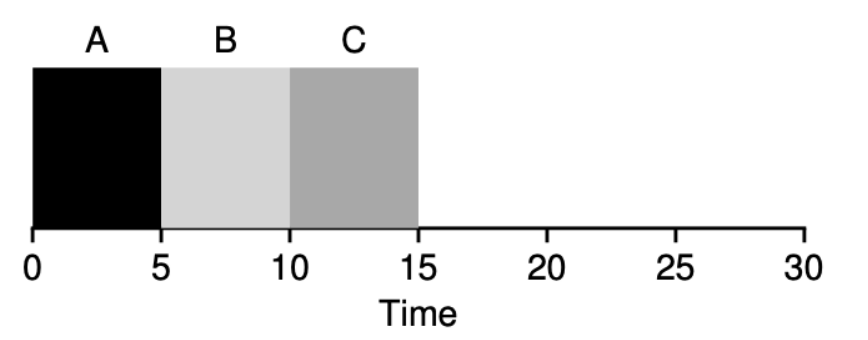

위의 예는 A, B, C가 0초에 동시에 도착했으며 모두 5초의 실행시간을 가진 작업입니다. 이러한 작업을 SJF로 실행하게 되었을 때 Response Time을 한 번 구해보겠습니다.

A는 0초에 도착해서 0초에 시작했기 때문에 Response Time은 0초입니다.

B는 0초에 도착해서 5초에 시작했기 때문에 Response Time은 5초입니다.

C는 0초에 도착해서 10초에 시작했기 때문에 Response Time은 10초입니다.

평균 Response Time은 5초입니다.

> 만약 B, C작업이 마우스, 키보드 동작이었다면 어떻게 될까요? 
> 사용자가 마우스를 움직인 지 5초 만에 움직이고 키보드로 입력한 지 10초 뒤에 입력이 된다면...?  
> 그럼 어떻게 해야 이런 문제를 해결할 수 있을까요?

  

### 5. Round Robin : preemptive 스케줄러
RR은 어떤 작업이 수행될 때 끝날 때까지 수행하는 것이 아닌 정해진 시간(time slice, scheduling quantum)만큼만 수행하는 스케줄러    
**정해진 시간을 수행한 뒤에는 다른 작업을 수행하게 됩니다.**

 
 

A, B, C가 0초에 동시에 도착했으며 모두 5초의 실행시간을 가진 작업입니다.   
이를 time slice가 1초로 설정된 RR로 처리하면 아래와 같이 결과가 나타나게 됩니다.

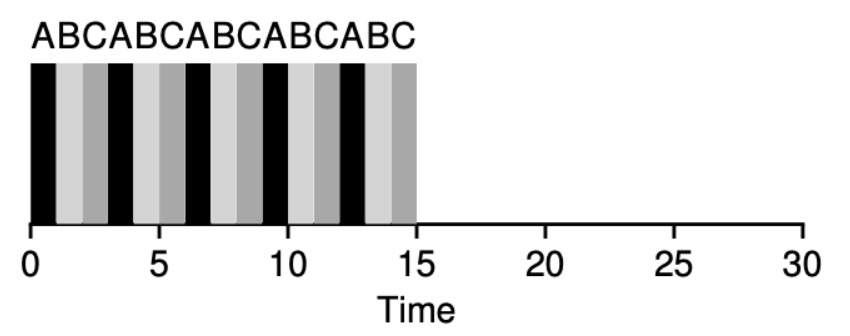

A는 0초에 도착해서 13초에 완료되었기 때문에 Turnaround Time은 13초입니다.

B는 0초에 도착해서 14초에 완료되었기 때문에 Turnaround Time은 14초입니다.

C는 0초에 도착해서 15초에 완료되었기 때문에 Turnaround Time은 15초입니다.

평균 Turnaround Time은 14초가 됩니다.

> 아까 SJF를 수행했을 때 평균 Turnaround Time은 참고로 10초였습니다.   
**RR을 사용하니 Turnaround Time은 더 나빠졌습니다.**   
즉, RR이 모든 기준에서 가장 좋은 방법이 아니라는 것을 알 수 있습니다. 사실 Turnaround Time만 보게 되면 아주 간단한 FIFO보다도 성능이 나빠질 수 있습니다.

반면, Response TIme 은 개선이 되었습니다.

A는 0초에 도착해서 0초에 시작했기 때문에 Response Time은 0초입니다.

B는 0초에 도착해서 1초에 시작했기 때문에 Response Time은 1초입니다.

C는 0초에 도착해서 2초에 시작했기 때문에 Response Time은 2초입니다.

평균 Response Time은 1초입니다.

 

 참고로 아까 SJF로 동일한 예를 작동했을 때는 평균 Response Time 이 5초였습니다.
 하지만 마우스를 움직이는데 1초나 걸린다면 아직도 만족스럽지는 않습니다. 
 더 줄이고 싶다면 어떻게 해야 할까요? 바로 time slice를 줄이면 됩니다.   
 만약 time slice가 0.01ms라고 해보겠습니다. 
 그럼 마우스를 움직이면 0.01초 만에 움직이게 될 겁니다!

> time slice를 최대한으로 줄이는 게 마냥 좋은 건 아닙니다!
> 
> **Time slice가 너무 작게 되면 context switch가 너무 자주 발생하게 되고,**
> context switch을 하는데 필요한 비용이 **전체 성능에 큰 영향**을 끼칠 수 있게 됩니다. 
> 즉 정말 간단한 작업인데도 불구하고 time slice가 너무 작아서 작업 수행에 필요한 비용보다 context switch 비용 때문에 성능이 크게 저하될 수 있습니다.
> 따라서 적당한 time slice를 설정해 주는 것이 중요합니다.

첫 번째 유형인 SJF, STCF는 Turnaround Time을 최적화하지만 Response Time은 좋지 않습니다. 
두 번째 유형인 RR은 Response Time은 좋지만 Turnaround Time이 좋지 않습니다.   
`"You can't have your cake and eat it too"`   
즉 둘 중 하나는 어느 정도 포기해야 한다는 뜻. ( Trade - off 관계 )

  

### 6. Busy Waiting
I/O 작업이 수행되는 동안에는 CPU를 차단해야 합니다.  
이렇게 I/O를 수행 중일 때 CPU를 **차단**하는 방식을 Busy Waiting 이라고 합니다.  
 
 

예를 들어 하드디스크에 어떤 데이터를 저장하려고 할 때 데이터의 크기가 커서 오래 걸리게 된다면 
CPU 가 오랜 시간 일을 하지 않는 상태가 될 수 있습니다.  
**따라서 I/O 작업이 수행되는 동안 CPU 에서는 다른 작업을 수행해야 합니다.**   
이렇게 I/O 작업이 수행되는 동안 CPU가 다른 작업을 수행하도록 하는 것을 **Blocked** 라고 합니다. 
스케줄러는 I/O가 완료되는 시기도 결정해야 합니다. 

 
 

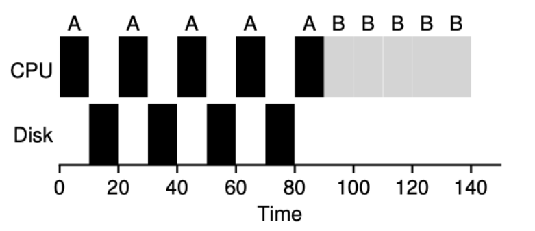

위의 예에서는 A, B 두 개의 작업이 존재합니다.
A 작업과 B 작업은 모두 50초의 수행 시간을 가지고 있습니다. 
그리고 A 작업은 10초마다 I/O를 발생시킵니다. (I/O는 모두 10초씩 걸린다고 가정)  
이때, 만약 스케줄러가 I/O가 발생하는 동안 A 작업이 계속 CPU 를 차지하고 있고 다른 작업이 접근하는 것을 차단한다면 위의 그림과 같은 결과가 발생합니다. 
이러한 방법을 Busy Waiting 방법이라고 합니다.   
이는 **CPU 가 I/O 작업을 수행하는 동안 놀게 되는 문제가 발생**합니다.

 
 

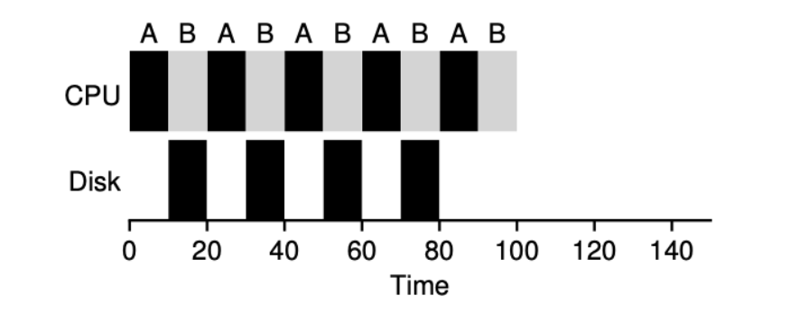

위에서 본 예와 동일한 작업에서 I/O를 수행하는 동안 A 작업이 CPU를 포기하고,
B에게 CPU를 할당해주는 방식을 택한 경우입니다. 
이런 방법을 **Blocked** 방법이라고 하며 이렇게 하면 아까 Busy Waiting 방법보다 훨씬 빠르고 효율적으로 작업을 수행할 수 있게 됩니다.

---
#### 정리

Busy Waiting 방법에서는 A 작업이 Running 상태에서 실행을 하다가 I/O를 발생시키면 상태가 변하지 않고 계속 Running 상태를 유지합니다.
따라서 B 작업이 수행될 수가 없게 됩니다.

Blocked 방법에서는 A 작업은 실행이 되다가 I/O를 발생시키면 Blocked 상태가 되는 것입니다. 
따라서 I/O가 수행 중일 때 B는 Ready 상태에서 Running 상태가 되고 I/O를 완료하면 A가 Ready가 되고 다시 스케줄링될 수 있는 상태가 됩니다.

 
 

### 7. Multi-Level Feedback Queue : Preemptive 스케줄러
SJF, STCF는 Turnaround Time이 좋지만 이를 사용하기 위해서는 프로세스의 수행 시간을 알고 있어야 했지만 알 수 없었습니다. 
RR과 같은 경우에는 Response Time 은 좋지만 Turnaround Time은 아주 나쁜 성능을 보였습니다. 
이런 문제들을 해결하기 위한 스케줄링 방법이 MLFQ(Multi Level Feedback Queue) 입니다.  

실행할 프로세스에 대해 아무 정보도 없는 경우에도 스케줄링을 효율적으로 할 수 있도록 하고 프로세스가 과거에 수행된 적이 있다면 그러한 정보를 토대로 더 나은 스케줄링을 할 수 있는 방법

---

### 적용되는 규칙

- 규칙 1 : 우선순위가 높은 프로세스들을 먼저 수행한다.
- 규칙 2 : 작업들이 같은 우선순위를 갖는다면 RR로 수행한다.
- 규칙 3 : 새로운 프로세스가 시스템에 들어가면 가장 높은 우선순위를 부여한다.
- 규칙 4 : 작업은 모든 우선순위에서 주어진 time slice를 모두 사용하면 우선순위가 감소한다.
- 규칙 5 : 일정 시간 후 시스템의 모든 작업을 우선순위가 가장 높은 큐로 이동한다. ( Priority Boost )

 
 

> 이러한 규칙들은 어떻게 만들어졌을까요?

### 규칙 1 , 규칙 2

---

#### 우선순위를 변경해주지 않으면 발생하는 문제

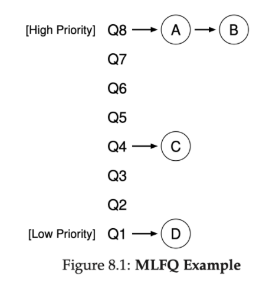

MLFQ는 우선순위에 따라 스케줄링한다고 했으니 A, B가 가장 먼저 RR 방식으로 수행될겁니다.   
그렇다는 것은 **A, B가 완료 될 때 까지는 C, D는 스케줄링이 되지 않는다**는 말입니다.
만약 A,B가 아주 오래 걸리는 작업이라면 C, D의 Response Time은 급격히 나빠질거에요. 
저희가 MLFQ를 사용하는 이유가 사라지는 것이죠. 
그럼 이런 문제를 해결하기 위해 우선순위를 상황에 따라 변경해줘야 할까요?

`새로운 규칙이 생기게 됩니다.`

### 규칙 3, 규칙 4의 등장

---
> 우선순위를 어떻게 바꿔주는 것이 좋을까요?

위의 그림에서 가장 먼저 A, B가 RR 로 수행되는데 **A, B가 설정한 time slice 를 모두 사용했다면 우선순위를 감소**시킵니다.   
**만약, Time slice를 모두 사용하지 않고 CPU를 포기한다면 그대로 Q8에 위치시킵니다.**   
이렇게 CPU를 포기하는 작업들은 주로 I/O 작업을 포함한 프로세스입니다.

 
 

MLFQ는 작업에게 **한 번 우선순위를 설정하는 것**이 아닌 **과거의 실행에 따라 작업의 우선순위를 바꿔줍니다.**
예를 들어 어떤 작업이 I/O 작업을 계속 발생한다고 가정하겠습니다.
이 때는 MLFQ 스케줄러가 이 작업이 대화형 프로그램이라고 판단하면, **우선순위를 높게 설정**합니다.
그러다 잠시 후 이 작업이 더 이상 I/O를 발생하지 않고 CPU만 계속 사용한다면 MLFQ는 다시 우선순위를 낮게 설정해줍니다.
즉, Batch 작업이냐 Interactive 작업이냐에 따라 우선순위를 변경할 수 있게 됩니다!

`그러나, 이 방법에도 문제가 존재합니다.`

 
 
 
 

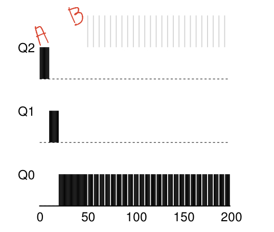

A : 엄청 긴 작업  
B : 1초 마다 I/O 를 수행하는 작업
  

B작업은 10초의 time slice를 수행하기 전에 I/O를 요청하기 때문에 **우선순위가 변하지 않고, 계속 최상위에 위치한 상태** 그대로 인 것을 볼 수 있습니다.
이렇게 되면, 발생한 문제는 크게 2가지로 볼 수 있습니다.
 

1. starvation(기아) 문제 :  **어떤 작업이 오랫동안 수행이 안 되는 상태**를 말합니다.   
 아까 예에서는 A, B의 두 작업만 있었고 B작업만 I/O를 발생했습니다. 만약 B작업과 같은 대화형 작업이 엄청나게 많다면 어떻게 될까요? A는 아마 그런 작업들이 모두 수행되기 전까지는 수행될 수 없을 것입니다.
2. 프로세스가 스케줄러를 속여가며 계속 우선순위를 높게 유지하는 것입니다. 아까의 예도 비슷한 부분을 보이는데 더욱 극단적으로 10초의 time slice로 설정된 스케줄러에서 9.9초 동안 수행되고 I/O 작업을 발생시킨다고 생각해보겠습니다. 그럼 정말 너무 얄밉게도 계속해서 높은 우선순위를 유지할 수 있습니다. 정말 필요로 해서 I/O를 실행하는 것이 아닌 CPU 점유를 위해서 이를 악용한다면 문제를 발생할 수 있습니다.

`그래서, 이를 해결하기 위해 규칙 5가 등장했습니다.`

 
 
 

### 기아 문제 해결하기 : 규칙 5. Priority Boost

---

기아 문제를 해결하려고 이런 규칙을 만들었지만
사실 프로그램이 수행되던 중 특성이 변하는 문제도 해결할 수 있습니다. 
프로그램이 CPU 만 사용하길래 최하위 우선순위에 두었는데 갑자기 I/O를 사용할 때 이 규칙을 적용하면 일정 시간 뒤에 우선순위가 높아지기 때문에 특성이 변하는 문제를 해결할 수 있습니다!

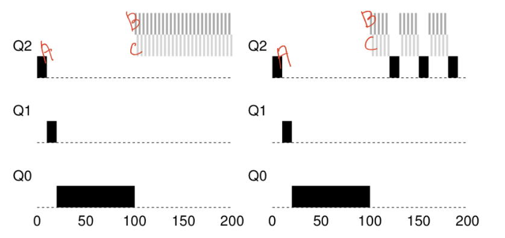

**A : 100 초까지는 CPU 를 사용하다가, 100초 이후부터는 I/O 를 사용하는 작업**

왼쪽이 priority boost를 적용하지 않은 상황  
오른쪽이 50초마다 prioirty boost를 적용한 상황  
왼쪽 그림에서는 A 작업이 100초부터 실행되지 않는 것을 볼 수 있습니다.    

이와 반대로 priority boost를 적용한 오른쪽에서는 50초마다 모든 작업의 우선순위를 우선순위가 가장 높은 큐인 Q2로 이동시키며 A도 수행할 수 있도록 만들어주는 것을 볼 수 있습니다.

 
 

### gaming of our schedular 문제 해결하기 : 규칙 4 

---
원래 규칙 4는 아래와 같이 두 가지 규칙으로 존재했었습니다.
- 규칙 4a : 작업이 실행될 때 time slice를 모두 사용하면 우선순위를 감소시킵니다.
- 규칙 4b : 작업이 실행 될 때 time slice를 모두 사용하지 않고 CPU를 포기하면 우선순위를 그대로 유지합니다.

> 예를 들어 10초의 time slice를 가진 스케줄러에서 의도적으로 9.9초마다 CPU를 포기하는 작업이 들어온다면 해당 작업은 계속해서 높은 우선순위를 유지하게 될 것입니다.  
> 
>   프로세스가 스케줄러를 속일 수 있는 문제를 gaming of our schedular 라 합니다.

이 문제를 해결하기 위해 규칙 4는 이 둘을 통합하여 만들어졌습니다.

- 규칙 4 : 작업은 모든 우선순위에서 주어진 time slice를 모두 사용하면 우선순위가 감소한다.

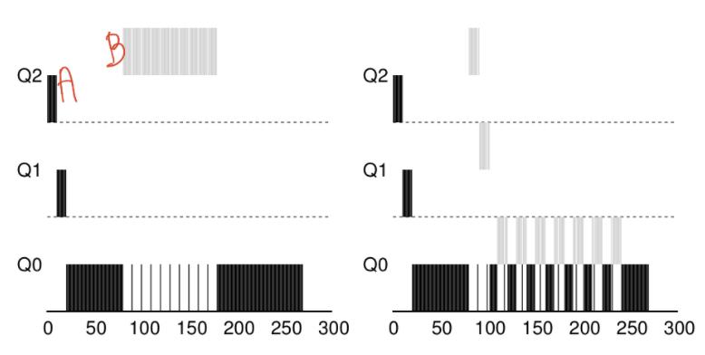

위의 그림에서 왼쪽이 기존의 규칙을 적용한 상황이고 오른쪽이 새로운 규칙을 정의한 상황입니다.   

왼쪽 그림에서는 B가 아주 교묘하게 time slice 보다 적은 시간 동안 실행하다 CPU를 포기하며 우선순위를 유지하는 것을 볼 수 있습니다.   
따라서 **B가 모두 수행될 때까지 A 작업은 공평하게 수행될 수 없습니다.**

 

오른쪽 그림에서는 B가 치사하게 또 CPU 를 time slice보다 적게 사용하고 포기했지만,  
이후에 수행될 때 전에 사용한 시간이 **누적되었기 때문에 결국 우선순위가 낮아지는 것**을 볼 수 있습니다.   
그러다 결국 가장 우선순위가 낮은 Q0 까지 내려와서 A, B는 동일한 우선순위를 갖게 됩니다.

`이렇게 해서, gaming of our schedular 문제도 해결!`

## Reference
- https://cocoon1787.tistory.com/125
- https://icksw.tistory.com/123 

