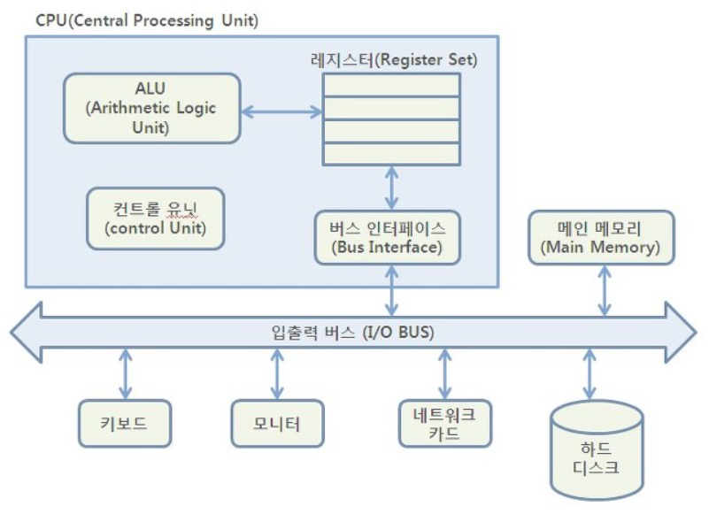

# CPU

### Central Processing Unit  
**중앙처리장치**라고 불리며, 컴퓨터의 두뇌 역할을 담당한다.  
사용자들이 입력한 명령어를 해석하고, 연산한 후 그 결과를 제어하는 장치라고 볼 수 있다.  
아래 그림 - 좌측 상단 에 위치한 박스가 CPU 에 해당한다.

- __CPU의 구성 요소__
  - ALU ( Arithmetic Logic Unit )  
    산술 논리 연산 장치 라고 부른다.   
    제어 장치의 명령에 따라 실제로 연산을 수행하는 장치이다.  
       
    - 참고   
      연산에는 산술연산, 논리연산, 관계연산, 이동이 있다.  
      연산장치에는 가산기, 누산기, 보수기, 데이터 레지스터, 오버플로 검출기, 시프트 레지스터 등이 있다.  
       
       
  - CU ( Control Unit )  
    프로그램 명령어 ( 코드 ) 를 해석하고, 그것을 실행하기 위한 제어 신호를 **순차적으로** ( 신호가 꼬이면 안됨 ) 발생시키는 장치이다.  
    명령 레지스터에서 읽어들인 명령어를 해독하여 해당하는 장치에게 제어 신호를 보내는 역할을 한다.    
     
     
  - 레지스터 ( register )  
    CPU 에서 처리할 명령어나 연산의 중간 결과값 등을 일시적으로 기억하는 **임시 기억 장소** 이다.   
    CPU 기억 장치들 중에서 속도가 가장 빠르다.  
    그래서, 연산 속도를 향상하기 위해서 사용한다.  
    레지스터에 새로운 데이터가 전송되면, 기존에 있던 내용은 지워지고 새로운 내용만 기억한다.  
    - 내부 레지스터들   
      - PC ( Program Counter )  
        - 다음에 인출할 명령어의 주소를 가지고 있는 레지스터
        - 각 명령어가 인출된 후에는 자동적으로 일정 크기 ( +1 또는 한 명령어 길이) 만큼 증가  
      - AC ( Accumulator )
        - 연산된 결과 데이터를 일시적으로 저장하는 레지스터
        - word ( CPU 가 한 번에 처리할 수 있는 비트 ) 의 크기와 동일한 크기이다.
      - IR ( Instruction Register )
        - 가장 최근에 인출된 명령어 코드가 저장되어 있는 레지스터
        - 또는, 현재 실행중인 명령의 내용을 기억하는 레지스터
      - MAR ( Memory Address Register )
        - 기억장치를 출입하는 데이터의 주소를 기억하는 레지스터
      - MBR ( Memory Buffer Register )
        - 기억장치를 출입하는 데이터를 기억하는 레지스터
      - 이외에도 많은 레지스터들이 존재한다.  
     
     
  - 내부 CPU 버스
    - ALU 와 레지스터들 간의 데이터 이동을 위한 데이터 선들
    - 외부 시스템 버스와는 직접 연결되지 않음.
    - 외부와 연동하기 위해서는 인터페이스 회로를 통하여 시스템 버스와 접속
    - 버스를 사용하는 목적은 결선 수를 줄이기 위해서 사용  
     
    - 참고   
      - 버스의 종류
        - 주소 버스 ( Address Bus ) : CPU 가 메모리나 I/O 기기의 주소를 지정할 때 사용하는 단방향 전송선
        - 자료 버스 ( Data Bus ) : 데이터를 전송하는 양방향 전송선
        - 제어 버스 ( Control Bus ) : CPU 의 현재 상태나, 상태 변경을 메모리나 I/O 장치에 알리는 제어 신호를 전송하는데 사용하는 양방향 전송선
      - 버스의 분류
        - 내부 버스 : CPU 및 메모리 내에 구성된 버스
        - 외부 버스 : 주변 I/O 장치에 구성된 버스

## Reference
- https://coding-factory.tistory.com/351
- https://mindstation.tistory.com/151
- https://cozy-dandelion.tistory.com/7
