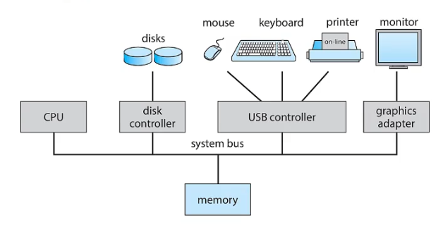
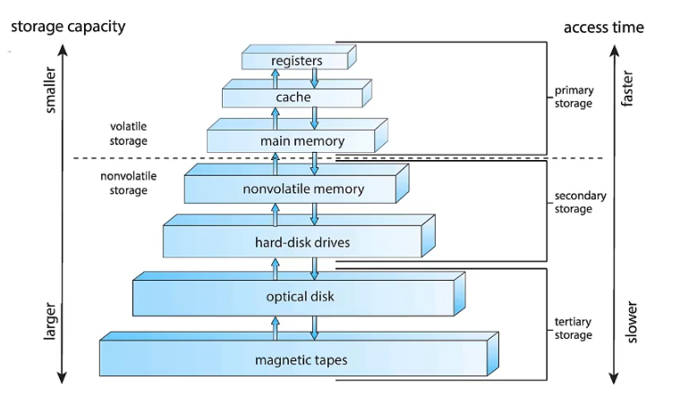
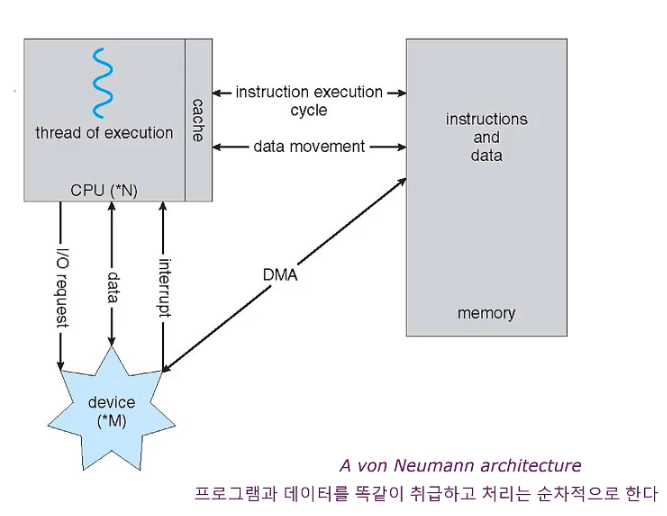

# 운영체제

운영체제는 `정부(government)`와 같다. 그 자체로는 유용한 기능을 수행하지 못한다. 운영 체제는 단순히 다른 프로그램이 유용한 작업을 할 수 있는 `환경`을 제공한다. 운영체제의 종류에는 Windows 10, UNIX, LINUX, MS-DOS 등이 있다.

- __컴퓨터의 요소__
    - `하드웨어` : 눈에 보이는 여러가지 장치(CPU - 중앙 처리 장치, 메모리, 입출력 장치 - I/O)로 구성되어 기본 계산용 자원을 제공
    - `운영체제` - 사용자를 위해 응용 프로그램간의 하드웨어 사용을 제어하고 자원을 할당하는 역할을 담당
        - 즉, 컴퓨터 하드웨어와 응용프로그램 사이에 위치한다고 볼 수 있음
    - `응용프로그램` - 컴파일러, 데이터베이스, 오피스 등의 비즈니스 프로그램
    - `유저` - 사용하는 사람, 기계, 또 다른 컴퓨터

- __운영체제의 성능을 평가하는 기준__
    - `처리능력(Throughput)` : 일정 시간 내에 시스템이 처리하는 일의 양
    - `반환시간(Turn Around Time)` : 시스템에 작업을 의뢰한 시간부터 처리가 완료될 때까지 걸린시간
    - `사용가능도(Availability)` : 시스템을 사용할 필요가 있을 때 즉시 사용 가능한 정도
    - `신뢰도(Reliability)` : 시스템이 주어진 문제를 정확하게 해결하는 정도

- __운영체제의 주요 자원 관리__
    - `프로세스 관리`
        - 프로세스 스케줄링 및 동기화 관리 담당
        - 프로세스 생성과 제거, 시작과 정지, 메시지 전달 등의 기능 담당
    - `기억장치 관리`
        - 프로세스에게 메모리 할당 및 회수 관리 담당
    - `주변장치 관리`
        - 입 출력 장치 스케줄링 및 전반적인 관리 담당
    - `파일 관리`
        - 파일의 생성과 삭제, 변경, 유지 등의 관리 담당

# 컴퓨터 시스템 구조

- __컴퓨터 시스템 구조__
    - `공유 메모리`
    - 공유 메모리에 대한 접근을 제공하는 여러개의 `장치 제어기`
        - `system bus` 로 연결되어있음
            - 컴퓨터의 구성요소를 서로 연결하고 데이터 전달을 위한 경로
            - 주소 버스, 데이터 버스, 제어 버스로 구성
    - 하나 이상의 `CPU`

- __부트스트랩 프로그램(Bootstrap Program)__
    - 컴퓨터가 구동을 시작하기 위해 가져야하는 프로그램을 의미한다.
    - ROM(Read Only Memory) 이나 EEPROM(Electrically Erasable PROM) 에 저장된다.
    > EEPROM 은 불휘발성 메모리이며,NVRAM, Non-Volatile RAM이라고 부르기도 한다. 따라서 EEPROM은 실시간으로 사용되는 변수를 저장하는 메모리나 스택 메모리로는 사용될 수 없으며, 한번 내용을 저장하면 비교적 오랫동안 이를 기억하고 있으면서 주로 이를 읽어 사용하기만 하거나 전원을 꺼도 지워져서는 안되는 중요한 데이터를 백업하여 두어야 하는 설정값 저장용 메모리로 적합하다.
    - CPU 레지스터로부터, 장치 제어기, 메모리 내용 등을 포함한 시스템의 모든 면을 초기화한다.
    - 운영체제의 커널을 찾아 메모리에 적재한다.
        - 커널이 적재되고 수행이 시작되면 시스템과 사용자에게 서비스를 제공할 수 있다.

- __저장장치__
    - 운영체제는 저장장치가 꼭 필요함
        - 하드웨어와 응용프로그램간에서 자원을 할당하고 사용을 제어해야하는 역할을 해야하기 때문이라고 위에서 배웠다.
    - `Main memory(RAM) `
        - 휘발성 메모리(전원이 없어지면 내용도 없어짐), 용량대비 가격이 저렴하고 속도가 빠르기 때문
    - `Hard Disk Drives(HDD)` 
        - 마그네틱(자석) 디스크를 이용해서 데이터를 읽어냄, 비휘발성 메모리, 용량대비 단가가 가장 저렴
    - `SSD(Solid State Drive) `
        - HDD 와 다르게 데이터 유지 및 액세스에 비휘발성(플래시) 메모리를 사용하는 저장 매체
        - HDD 보다 내구성이 좋다.
            - 열은 하드 드라이브 고장의 주요 원인이며 HDD의 움직이는 부품의 지속적인 움직임에 의해 생성되는 열은 시간이 경과함에 따라 고장을 유발하기에 충분하다. SSD 에는 그러한 부품(움직이는 기계 부품)이 없기 때문에 `훨씬 높은 성능과 낮은 온도를 유지`할 수 있다. 또한 SSD 는 떨어뜨림, 흔들림, 충격 및 일상적인 마모를 견디기에 더 적합하므로 데이터 손실이 발생하는 경우가 적다.
    - `단위`
        - bit : 전자적인 방법의 컴퓨터들 중에는 가장 작은 단위
        - word : 시스템마다 값이 다름, 시스템에 맞춰서 편하게 다룰 수 있도록 맞춤
        - Byte -> KB -> MB -> GB -> TB -> PB : 1024배씩 차이가 남
        - 속도, 비용, 휘발성 등을 기준으로 계층을 설명할 수 있음
        - 

- __현대 컴퓨터 시스템의 동작__
    - 
    - A von Neumann(폰 노이만형 방식) : 명령과 데이터를 메모리에 넣고 하나씩 가지고 와서 처리하는 방식
    - 비 노이만형 방식 : 데이터의 처리를 고속, 고도화 하기위해 병렬화를 함, 명령과 데이터 버스를 분리하여 처리하여 빠르게 처리 가능

> DMA(Direct memory Access, 직접 메모리 접근)가 있는 이유 : 인터럽트 구동 방식의 입출력은 적은 양의 데이터를 전송하는 데는 문제가 없으나 디스크 입출력과 같은 대량의 데이터를 전송하는 데에는 높은 오버헤드를 초래한다. 이 문제를 해결하기 위해 DMA 가 존재하는 것이다. 장치 제어기가 메모리로 데이터 블록 전체를 전송한다고 한다. 그리고 블록 전송이 완료될 때마다 인터럽트가 발생한다고 한다. 따라서 데이터를 전송하고 있는 동안에는 CPU 가 다른 작업을 수행할 수 있다.

## References

> [운영체제 9th edition](http://www.kyobobook.co.kr/product/detailViewKor.laf?mallGb=KOR&ejkGb=KOR&barcode=9788998886813)
>
> https://coding-factory.tistory.com/300
>
> https://velog.io/@minjaec/%EC%9A%B4%EC%98%81%EC%B2%B4%EC%A0%9C2-%EC%BB%B4%ED%93%A8%ED%84%B0-%EC%8B%9C%EC%8A%A4%ED%85%9C%EC%9D%98-%EA%B5%AC%EC%84%B1-%EB%B0%8F-%EA%B5%AC%EC%A1%B0
>
> https://treeroad.tistory.com/entry/Flash-Memory와-EEPROM-차이점 
>
> https://giantpark197cm.tistory.com/158
