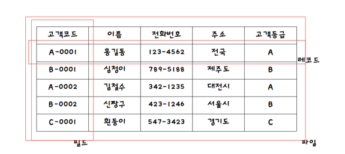
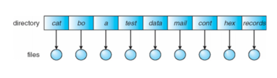
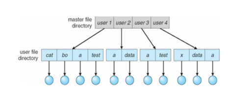
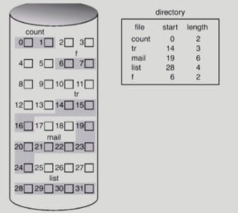
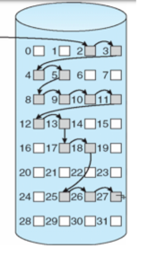
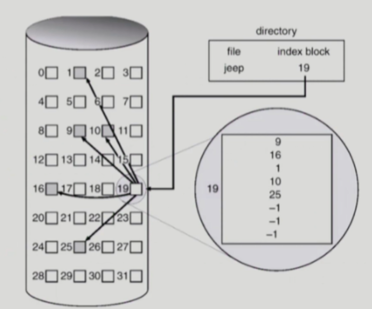

## 파일의 기본 구성
- 필드 : 특정한 의미를 지닌 하나 이상의 바이트, 레코드를 구성하는 기본 구성 단위 항목(item)
- 레코드 : 여러개의 필드가 모여 레코드를 이룸
- 파일 : 여러개의 레코드가 모여 파일을 이룸
  - 논리적인 저장 단위로 관련된 정보 자료들의 집합

## 디렉토리
- 파일 시스템 내부에 있으며, 디스크에 존재하는 파일에 대한 정보를 가지고 있는 테이블
- 각 파일의 위치, 크기, 할당 방식, 형태, 소유자 등의 정보를 가짐.

### 1단계 디렉토리
- 모든 파일이 같은 디렉토리에서 관리되는 가장 간단한 구조
  

### 2단계 디렉토리
- 각 사용자에게 서로 다른 디렉토리를 할당
  

### 트리 구조 디렉토리
- 하나의 루트 디렉토리와 다수의 서브 디렉토리로 구성
- 서로 다른 디렉토리 내에서도 동일한 이름의 파일이나 디렉토리 생성가능
- 파일 및 디렉토리 탐색은 절대 경로, 상대 경로를 이용함.
    - 절대 경로 : 루트 디렉토리 기준에서 해당 파일이나 디렉토리 까지의 경로
    - 상대 경로 : 현재 디렉토리 기준에서 해당 파일이나 디렉토리 까지의 경로
- Windows, Unix 운영체제에서 사용하는 구조
  

## 파일 시스템
- 파일이나 자료를 쉽게 접근 할 수 있도록 보관 또는 조직하는 체제

### 파일 시스템은 왜 필요한가?
- 파일은 디스크라는 곳에 정보가 저장된다. 이 때, 디스크 곳곳에 저장되는데 디스크는 블록단위로 데이터를 저장하게 된다.
  하지만, 메모리는 바이트 단위로 되어 있기 때문에 블록을 바이트 단위로 변환하기 위해 연결 작업을 해주어야 한다.

## 파일 접근 방식
1. 순차 접근 방식
2. 직접 접근 방식
3. 색인 접근 방식

#### 순차 접근 방식
- 파일의 정보가 레코드 순서대로 처리된다. 카세트 테이프를 사용한는 방식과 동일
- 현재 위치에서 읽거나 쓰면 offset 이 자동으로 증가하고, 뒤로 돌아가려면 다시 되돌려야함.

#### 직접 접근 방식
- 파일의 레코드를 임의의 순서로 접근할 수 있다.
- 읽기 / 쓰기의 순서에 제약이 없다.

#### 색인 접근
- 파일에서 레코드를 찾기 위해 색인을 먼저 찾고, 대응하는 포인터를 통해 접근 한다.
- 크기가 큰 파일에서 유용하다.

## 파일을 디스크에 할당하는 방법
### 연속 할당
- 파일을 디스크에 연속되게 저장하는 방식
- 연속적으로 저장되어 있으므로 한 번의 탐색으로 많은 양을 전송할 수 있다.
- 이미 정해진 파일의 크기를 키우기가 어렵다.

  

 
 

### 연결 할당 (Linked Allocation)
- 연속적으로 할당하지 않고 빈 위치면 자유롭게 할당할 수 있다.
- 다음 읽어야 할 위치를 연결 리스트처럼 포인터로 가리킨다.
  
  

 

 

### 색인 할당 (Indexed Allocation)
- 한 블록에 하나의 파일에 대한 데이터의 index 를 모두 저장하는 방식
- 작은 파일인 경우 공간 낭비가 생김
- 너무 큰 파일의 경우엔 하나의 블록으로 index 를 저장하기에 부족함
  

 

 

### 파일 시스템 관련 작업
- 파일 단위 작업
  1. open : 파일을 사용할 수 있는 상태로 준비
  2. close
  3. copy
  4. destroy
  5. rename
  6. list : 디스크에 저장되어 있는 파일 목록 출력

- 레코드 단위 작업
  1. read
  2. write
  3. update
  4. insert
  5. delete
  6. search

## Reference
- https://security-nanglam.tistory.com/454
- 