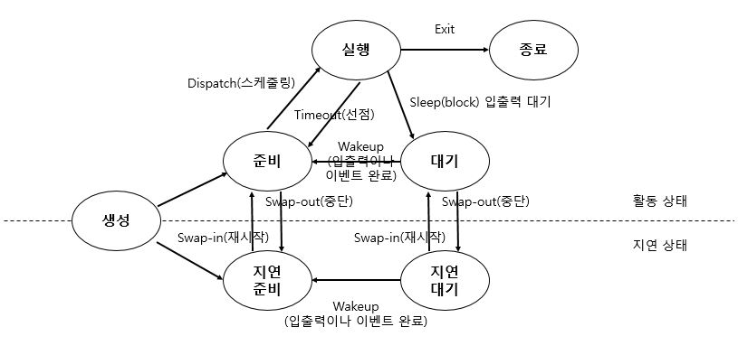

# 프로세스(Process)와 쓰레드(Thread)

프로세스와 쓰레드는 정말 중요한 개념이다. 프로세스와 쓰레드를 정확히 이해해야 스프링의 멀티 쓰레드 환경에서 왜 상태값을 갖도록 설계하면 안되는지에 대해 알 수 있다. 특히 __프로세스의 메모리 영역(Stack, Heap, Data, Text)과 쓰레드가 프로세스와 공유하지 않는 영역(Stack)__ 에 대해서 제대로 알아야 한다.

- __프로그램__
    - 명령어, 코드 및 정적인 데이터의 묶음이며 아직 실행되지 않은 상태를 의미
- __프로세스__
    - 실행 중인 프로그램
    - 운영체제로부터 시스템 자원을 할당 받는 작업의 단위

자, 먼저 Operating System 에서의 프로세스와 쓰레드가 어떤 것인지에 대해서 배우고, 그 개념을 자바와 스프링에 접목시켜서 현업에서 동시성 이슈를 어떤식으로 피하는지에 대해서 다뤄보도록 하겠다.

## 프로세스(Process)

- __프로세스 메모리 영역__
    - `Stack` : 매개변수, 지역변수 등 임시적인 자료
    - `Heap` : 동적으로 할당되는 메모리
    - `Data` : 전역 변수
    - `Text` : Program 의 코드

프로세스는 운영 체제(OS) 안에서 여러개가 존재하며 동작한다.

### 멀티 프로세스(Multi Process)

- 하나의 작업을 여러 개의 프로세스가 처리
- 프로세스는 실행될 때마다 각각에 고유한 메모리 영역을 할당해주어야 하기 때문에 프로세스가 많아질 수록 더 많은 메모리 공간을 차지하게 된다.
- 프로세스간 통신(IPC, Interprocess communication)
- `Context switching 비용이 큼`
- 자식 프로세스 중 하나가 문제가 생겨도 다른 프로세스에 영향이 없음
- Ex. Google Chrome
    - 구글 크롬 브라우저를 열면 Browser Process, Renderer Process, GPU Process, Plugin Process 등이 동작하게 된다.

### 프로세스 상태

- __생성(Create)__
    - 사용자에 의해 프로세스가 생성된 상태
- __준비(Ready)__
    - CPU 를 할당 받을 수 있는 상태
    - 준비 리스트 : 각각 우선순위를 부여해서 우선순위가 높은 프로세스가 다음 순서에 CPU 를 할당 받는다.
- __실행(Running)__
    - 프로세스가 CPU 를 할당받아 동작 중인 상태
- __대기(Waiting)__
    - 프로세스 실행 중 입출력 처리 등으로 인해 CPU 를 양도하고 입출력 처리가 완료되기 까지 대기 리스트에서 기다리는 상태
    - 대기 리스트 : 우선순위가 존재하지 않음
- __완료(Complete)__
    - 프로세스가 CPU 를 할당 받아 수행을 종료한 상태

### 프로세스 상태 전이



- __디스패치(Dispatch)__
    - 준비 상태에 있는 여러 프로세스(준비 리스트)중 실행될 프로세스를 선정(Scheduling)하여 CPU를 할당(Dispatching) -> `문맥 교환(Context Switching)` 발생
    - 실행 상태로 전이
- __타임아웃(Timeout)__
    - CPU 를 할당 받은 프로세스는 지정된 시간이 초과되면 스케줄러에 의해 PCB 저장, CPU 반납 후에 다시 준비 상태로 전이
    - 타임 슬라이스(Time Slice) 만료, 선점(Preemption) 시 타임아웃 발생
        - 라운드 로빈 스케줄링 알고리즘에서 실행의 최소 단위시간을 타임 슬라이스라고 함
        - 타임 슬라이스가 너무 짧으면 `문맥 교환(Context Switching)`이 자주 발생하여 성능 저하가 일어날 수 있음. 너무 길면 반응이 늦게오기 때문에, 빠른 반응을 요구하는 시스템에서 문제가 생길 수 있음.
- __블록(Block)__
    - 실행 상태에 있는 프로세스가 지정된 시간 내에 입출력이나 기타 사건이 `발생(block)`하면 CPU 를 스스로 반납하고 입출력이 완료될 때까지 대기 상태로 전이
    - I/O 작업, 프로세스간 통신 시 Block 발생
- __Wake-Up__
    - 어느 순간에 입출력이 종료되면 대기 상태의 프로세스에게 입출력 종료 사실을 알려주고, 준비 상태로 전이
- __Swap-In__
    - 프로세스에게 다시 기억 장치가 할당될 경우
- __Swap-Out__
    - 프로세스가 기억 장치를 잃은 경우

## Interrupt

__인터럽트는 CPU 가 프로그램을 실행하고 있을 때, I/O 장치 등에 의해 예외 상황이 발생하여 처리가 필요한 경우에 CPU 에게 처리하도록 알려주는 것을 의미한다.__

- __인터럽트 종류__
    - 하드웨어
        - 하드웨어가 발생시키는 인터럽트로 보통 CPU 서비스를 요청해야할 경우 발생시킨다.
    - 소프트웨어
        - 소프트웨어가 발생시키는 인터럽트로 예외상황 등이 있다.
- __인터럽트 서비스 루틴(Interrupt Service Routine, ISR)__
    - 인터럽트 핸들러(Interrupt Handler)라고도 한다.
    - 인터럽트를 처리하기 위한 코드 루틴
    - 운영체제의 코드 영역에는 인터럽트별로 처리해야할 내용이 존재한다.
- __인터럽트 벡터(Interrupt Vector)__
    - 인터럽트 서비스 루틴(ISR) 보관 공간 
    - 인터럽트 벡터 안에 ISR 을 보관하고 있다.
- __인터럽트 과정__
  1. 저장 경로 확인 로직 실행
  2. 키보드 입력 인터럽트 발생
  3. 현재 실행중인 프로세스 정보(문맥)를 저장
  4. 인터럽트 벡터에서 해당 ISR 을 찾음
  5. 키보드 처리를 위한 ISR 주소로 변경
  6. 키보드 인터럽트 처리
  7. 저장된 저장 경로 확인 로직 주소로 돌아감

인터럽트 발생 시 프로세스 제어 블록(PCB, Process Control Block)에 프로세스의 어느 부분이 수행중이었는지를 저장한다.

### PCB(Process Control Block)

- __프로세스 제어 블록(PCB, Process Control Block)__
    - 각 프로세스는 운영체제에서 PCB 로 표현
    - 특정 프로세스와 연관된 여러 정보를 포함
        - PID : 프로세스 식별자
        - 프로세스 상태 : new, ready, running, waiting, halted 등
        - 프로그램 카운터(Program Counter, PC) : 다음 실행할 명령어의 주소
        - CPU 레지스터들 : 레지스터는 누산기(accumulator), 인덱스 레지스터, 스택 레지스터 등
        - CPU 스케줄링 정보 : 프로세스 우선순위 등
        - 메모리 관리 정보 : 페이지 테이블 또는 세그먼트 테이블 등
        - 회계 정보 : CPU 사용 시간과 경과된 시간 등
        - 입출력 상태 정보 : 프로세스에게 할당 된 입출력 장치들과 연린 파일의 목록 등

정리하자면, 프로세스 제어 블록은 `프로세스마다 달라지는 모든 정보를 저장하는 저장소`라고 생각하면 된다.

## 쓰레드(Thread)

프로세스 내에서 실행되는 흐름의 단위를 의미한다.

- CPU 이용의 기본 단위
- 프로세스의 `text, data, heap` 영역을 공유
- 각 스레드는 별도의 `stack` 영역을 가진다.

### 멀티 쓰레드(Multi Thread) : 동시 요청

프로세스안에 스레드가 두 개 이상이 있으면 멀티 스레드라고 한다.

- 프로세스의 자원을 공유
    - 하나의 프로세스 내에서 메모리 공간을 공유하기 때문에, 멀티 프로세스에 비해서 메모리 공간을 적게 차지한다. 따라서 CPU 성능을 올릴 수 있다.
- 향상된 응답성
    - 쓰레드는 프로세스의 text, data, heap 영역을 공유하기 때문에 해당 영역을 통해서 데이터를 주고 받을 수 있다. 따라서 그만큼 비용이 절약된다.
- `Context switching 비용이 적음`
- 공유 자원에 대한 동기화
    - `동시성 이슈`가 발생할 수 있다.
        - 여러 쓰레드가 공유 자원을 서로 사용하면서 값을 변경하여 발생하는 문제
    - `Thread Safe` 하게 설계해야 한다.
    	- Thread Safe 란 동시성 이슈가 발생하지 않도록 설계하는 것을 의미한다.
- 독립적이지 않은 구조
    - 하나의 쓰레드에 오류가 발생해서 종료되면 같은 메모리를 공유하고 있는 다른 쓰레드에게도 영향을 미칠 수 있다.
- Ex. Web Server

## Context Switching

문맥 교환(Context Switching)에 대해서 이해하려면 프로세스의 특징, 멀티 프로세스의 특징, 쓰레드의 특징, 멀티 쓰레드의 특징에 대해서 알고 있어야 한다. 

일반적으로 CS 에서 Context Switching 이라 하면 프로세스의 문맥 교환을 의미한다. 하지만 문맥 교환을 배울 때에는 프로세스의 문맥 교환과, 쓰레드의 문맥 교환을 둘 다 공부해야 한다. 프로세스의 문맥 교환에 대해서 깊게 공부하고나면 쓰레드의 문맥 교환은 비교적 간단하고 쉽게 이해할 수 있다.

### Process Context Swithcing

문맥 교환(Context Switching)은 하나의 프로세스가 CPU 를 사용 중인 상태에서 다른 프로세스가 CPU 를 사용하도록 하기 위해, 이전의 프로세스의 상태(문맥)를 보관하고 새로운 프로세스의 상태(문맥)를 적재하는 작업을 말한다. 

한 프로세스의 문맥은 그 __프로세스의 프로세스 제어 블록(PCB)__ 에 기록되어있다.

프로세스가 증가하게되면 문맥 교환이 많아져서 오버헤드가 증가하므로 시스템 성능에 악영향을 끼칠 수 있다. `오버헤드(overhead)`란 CPU 가 메모리에 적재하는 동안 아무것도 안하게되는 현상을 의미한다.

즉, 멀티 프로세스에서 문맥 교환이 너무 자주 일어나게 되면 기존 프로세스의 상태를 저장하고, 새로운 프로세스의 상태를 적재하는 동안 CPU 가 아무것도 하지 않기 때문에 CPU 성능 저하의 원인이 될 수 있다. 

오버헤드 해결 방안은 다음과 같다.

- 문맥 교환이 자주 발생하지 않도록 다중 프로그래밍의 정도를 낮춘다.
- 스택 중심의 장비에서는 Stack 포인터 레지스터를 변경하여 프로세스 간 문맥 교환을 수행한다.
- 스레드(Thread)를 이용하여 문맥 교환 부하를 최소화시킨다.

따라서, 이러한 멀티 프로세스의 단점(잦은 문맥 교환, 많은 메모리 공간 차지) 때문에 `멀티 쓰레드 환경을 선호`하는 것이다.

### Thread Context Switcing

쓰레드의 문맥 교환은 프로세스의 문맥교환과 달리 `Cache Memory 를 비울 필요가 없기 때문`(프로세스의 자원들을 공유하기 때문)에 속도면에서 훨씬 더 빠르고 CPU 의 부담도 훨씬 덜 가게 된다. 이러한 점 때문에 시스템의 처리율이 향상되고 프로그램의 응답시간이 단축되어 진다.

## 자바에서의 쓰레드

- 서블릿 객체를 호출하는 것은 쓰레드(Thead)
- 애플리케이션 코드를 하나하나 순차적으로 실행하는 것은 쓰레드(Thead)
- 자바 메인 메서드를 처음 실행하면 main 이라는 이름의 쓰레드가 실행
- 쓰레드가 없다면 자바 애플리케이션 실행이 불가능
- 동시 처리가 필요하면 쓰레드를 추가로 생성

### 요청 마다 쓰레드 생성

- 장점
  - 동시 요청 처리 가능
  - 리소스(CPU, 메모리)가 허용할 때까지 처리가능
  - 하나의 쓰레드가 지연 되어도, 나머지 쓰레드는 정상 동작
- 단점
  - 쓰레드 생성 비용이 매우 비싸다.
    - 고객의 요청이 올 때마다 쓰레드를 생성하면, 응답 속도가 늦어진다.
  - 쓰레드는 컨텍스트 스위칭(Context Switching) 비용이 발생한다.
  - 쓰레드 생성에 제한이 없다.
    - 고객 요청이 너무 많이 오면, CPU, 메모리 임계점을 넘어서 서버가 죽을 수 있다.

프로세스가 증가하게되면 컨텍스트 스위칭이 많아져서 오버헤드가 증가하므로 시스템 성능에 악영향을 끼칠 수 있다.

> 오버헤드(overhead) : CPU 가 메모리에 적재하는 동안 아무것도 안하게되는 현상

### 쓰레드 풀(Thread Pool)

요청 마다 쓰레드 생성하는 경우의 단점을 보완하고자 대부분의 `WAS(Web Application Server)` 는 쓰레드 풀을 가지고 있다.

WAS 의 쓰레드 풀은 다음과 같이 동작한다.

- 풀(Pool)안에 미리 쓰레드를 만들어 놓는다.
- 사용자 요청이 오면 쓰레드 풀에게 놀고 있는 쓰레드를 달라고 요청한다.
- 쓰레드 풀에서 쓰레드를 가져다 쓴다.
- 쓰레드 사용이 끝나면 다시 쓰레드 풀에게 반납을 한다.

즉, 쓰레드를 쓰레드 풀에서 빌려 쓰고, 다시 반납하는 식이다. 쓰레드 풀안에 쓰레드가 500 개이며, 500 개를 넘는 요청이 오면, `쓰레드 대기, 거절`등을 할 수 있다.

- __특징__
  - 필요한 쓰레드를 쓰레드 풀에 보관하고 관리
  - 쓰레드 풀에 생성가능한 쓰레드의 최대치를 관리한다. 톰캣은 최대 200개 기본 설정(변경 가능)
- __사용__
  - 쓰레드가 필요하면, 이미 생성되어 있는 쓰레드를 쓰레드 풀에서 꺼내서 사용한다.
  - 사용을 종료하면 쓰레드 풀에 해당 쓰레드를 반납한다.
  - 최대 쓰레드가 모두 사용중이어서 쓰레드 풀에 쓰레드가 없으면?
    - 기다리는 요청은 거절하거나 특정 숫자만큼만 대기하도록 설정할 수 있다.
- __장점__
  - 쓰레드가 미리 생성되어 있으므로, 쓰레드를 생성하고 종료하는 비용(CPU)이 절약되고, 응답시간이 빠르다.
  - 생성 가능한 쓰레드의 최대치가 있으므로 너무 많은 요청이 들어와도 기존 요청은 안전하게 처리할 수 있다.

## WAS 와 멀티 쓰레드

멀티 쓰레드에 대한 부분은 WAS 가 알아서 처리해준다. 즉, 톰캣과 같은 서블릿을 지원하는 WAS 는 `서블릿 컨테이너(Servlet Container)` 이므로 서블릿 컨테이너는 동시 요청을 위한 멀티 쓰레드 처리를 지원한다고 볼 수 있다. 따라서, 개발자가 멀티 쓰레드 관련 코드를 신경 쓰지 않으며, 마치 싱글 쓰레드 프로그래밍을 하듯이 코드를 짜면 된다. 우리가 자바와 스프링을 이용하여 웹 개발을 하는 환경은 `멀티 쓰레드 환경`이기 때문에 싱글톤 객체(서블릿, 스프링 빈 등)는 주의 해서 사용해야 한다. 여기서 코드를 잘 못짜거나 잘못 사용하게되면 무시무시한 `동시성 이슈`라는 것이 발생하게 된다.

## 동시성 이슈

__동시성 이슈란 여러 쓰레드가 동시에 같은 인스턴스의 필드 값을 변경하면서 발생하는 문제를 의미한다.__

`WAS 와 멀티 쓰레드`에서 말했듯이, 싱글톤 객체는 조심히 사용해야한다고 했다. 어떤 부분을 조심해야할까?

바로, `상태 값이 유지되지 않게 설계`해야 한다는 것이다. 아래 코드를 보자.

```java
@Service
public class UserService {

    private UserId userId; // 상태 값

    public void createUser(User user) {
        // 여기서 userId 값을 변경하는 코드가 존재
    }
}
```

UserService 는 싱글톤 객체로 등록되는 빈이다. 위 코드에서 UserId 라는 객체가 상태 값인데, 회원 가입 100건이 동시에 이루어졌다고 하면 userId 라는 `상태값은 안전할까? 안전하지 않을까?` 이 부분에 대한 답을 명확하게 할 수 있다면 `프로세스와 쓰레드`에 대한 개념을 잘 이해하고 있다고 볼 수 있고, 답을 내리지 못한다면 프로세스와 쓰레드에 대한 개념을 다시 공부해야 할 것이다.

위로 올라가서 프로세스와 쓰레드를 다시 한 번 살펴보자.

쓰레드는 프로세스의 Stack, Heap, Data, Text 영역 중 Stack 부분을 제외한 나머지를 공유한다. 그리고 userId 의 상태 값은 전역변수이며 Process 의 Data 영역에 적재된다. 즉, 우리가 개발하는 멀티 쓰레드 환경에서 수 많은 쓰레드들이 userId 라는 상태 값(전역 변수)을 공유하게 되는 것이다. 그렇게되면, 회원 가입후에 서로 다른 사람의 개인정보가 보인다는 등, 심각한 오류가 발생한다.

따라서, 위와 같은 코드는 절대 짜면 안된다. 비록 트래픽이 낮은 애플리케이션일지라도 말이다.

그러면 동시성 이슈를 피하기 위해서 어떻게 해야할까? 이것에 대한 해답도 역시 `프로세스와 쓰레드`에 있다. 쓰레드의 Stack 영역은 공유하지 않으며, 지역 변수가 저장된다. 따라서, 전역 변수대신 지역 변수를 쓰게끔 하면 적은 노력으로 동시성 문제를 피할 수 있다.

동시성 문제가 발생하는 곳은 같은 인스턴스의 필드(주로 싱글톤에서 자주 발생), 또는 static 같은 공용 필드에 접근할 때 발생한다. 동시성 문제는 값을 읽기만 하는 경우에는 발생하지 않고, 어디선가 값을 변경하기 때문에 발생하는 문제이다.

그런데, 싱글톤 객체에서 상태 값을 가져야하는 경우가 있을 수 있는데, 이때는 어떻게 동시성 이슈를 피할까? 

## ThreadLocal

싱글톤 빈에서 상태값을 유지해야하는 경우에 동시성 이슈를 해결하기 위해서 `ThreadLocal`을 지원한다. 

ThreadLocal 은 해당 쓰레드만 접근할 수 있는 특별한 저장소(별도의 내부 저장소를 제공)를 의미한다. 따라서, 여러 쓰레드가 동시에 상태 값에 접근해도 동시성 이슈가 발생하지 않는다.

위 코드에 ThreadLocal 을 적용해보자.

```java
@Service
public class UserService {

    private ThreadLocal<UserId> userIdStore = new ThreadLocal<>(); 

    public void createUser(User user) {
        userIdStore.set(user.createUserId());
        UserId userId = userIdStore.get();
    }
}
```

위 처럼 ThreadLocal 을 적용하여 사용하면, 각 쓰레드는 UserId 를 가져오기 위해 자신만의 별도의 내부 저장소에서 꺼내기 때문에 동시성 이슈로부터 안전하다.

### ThreadLocal 사용 시 주의할 점

ThreadLocal 을 사용할 때의 주의점은 해당 쓰레드가 쓰레드 로컬을 모두 사용하고 나면 `ThreadLocal.remove()` 를 호출해서 쓰레드 로컬에 저장된 값을 제거해주어야 한다. 제거하지 않으면 특정 상황에서 메모리 누수, 개인정보 등의 문제가 발생할 수 있다.

ThreadLocal 의 값을 사용 후 제거하지 않고 그냥 두면 WAS 처럼 쓰레드 풀을 사용하는 경우에 심각한 문제가 발생할 수 있다.

쓰레드 풀은 요청 마다 쓰레드를 생성했을 경우의 단점을 보완하기 위해 만들어졌다고 위에서 배웠다. 따라서, WAS 는 쓰레드 사용이 끝나면 해당 쓰레드를 다시 반납한다.

A 사용자가 회원 가입 요청을 하여 `thread-A` 가 할당되었다. thread-A 가 사용자의 A 의 데이터(User)를 자신의 전용 보관소인 `thread-A-privacy-storage` 에 저장한다.

A 의 요청이 끝나고나면 WAS 는 사용이 끝난 thread-A 를 재사용하기 위해서 쓰레드 풀에 반환한다.
따라서, thread-A 가 제거되지 않았으므로 thread-A-privacy-storage 도 살아있게된다.

B 사용자가 자신의 정보를 조회하기 위한 요청을 한다. WAS 는 쓰레드 풀에서 남는 쓰레드를 할당해주는데, 이때 어떤 쓰레드가 할당될지는 모른다. thread-A 가 할당될 수도 있고, 다른 쓰레드가 할당될 수 도 있다. thread-A 가 할당되면 thread-A-privacy-storage 에 들어있던 사용자 A 에 대한 개인정보가 조회된다. 따라서, 다른 사람의 개인정보가노출 되는 심각한 문제가 발생할 수 있다.

그렇게 때문에 ThreadLocal 을 사용하고 나서 `ThreadLocal.remove()` 를 통해 자신의 전용 보관소에 저장되어 있던 값들을 모두 제거해주어야 한다.

## Thread Safe 하게 설계하는 방법

Thread Safe 란 쉽게 말하면 동시성 이슈가 발생하지 않도록 설계하는 것을 말하고, OS 지식과 섞어서 풀어 설명하면, 쓰레드가 경쟁 상태(race condition)일 때 임계 구역에 있는 공유 변수의 일관성을 유지시키도록 설계하는 것을 말한다.

- java.util.concurrent 패키지 하위의 클래스사용하기
    - Ex. ConcurrentHashMap 등
- 인스턴스 변수를 두지 않습니다. = 상태 값 두지 않기
- Singleton 패턴을 사용
    - 일반적으로 구현하는 Singleton Pattern 은 Thread-safe 하지 않는다.
    - 인스턴스가 1개만 생성되는 특징을 가진 싱글턴 패턴을 이용하면, 하나의 인스턴스를 메모리에 등록해서 여러 스레드가 동시에 해당 인스턴스를 공유하여 사용하게끔 할 수 있으므로, 요청이 많은 곳에서 사용하면 효율을 높일 수 있다.
    - 보통은 `LazyHolder` 방식을 주로 사용한다.
        - JVM 의 Class loader 매커니즘을 이용한 방법
- 동기화 블럭(synchronized) 지정

## References

- [수제비](https://www.aladin.co.kr/shop/wproduct.aspx?ItemId=258036320)
- [운영체제 9th edition](http://www.kyobobook.co.kr/product/detailViewKor.laf?mallGb=KOR&ejkGb=KOR&barcode=9788998886813)
- [인프런, 스프링 핵심원리 고급편](https://www.inflearn.com/course/%EC%8A%A4%ED%94%84%EB%A7%81-%ED%95%B5%EC%8B%AC-%EC%9B%90%EB%A6%AC-%EA%B3%A0%EA%B8%89%ED%8E%B8/dashboard)
- [10분 테코톡, 김고래 Process & Thread](https://www.youtube.com/watch?v=LLiV5Yz1AWg&list=PLgXGHBqgT2TvpJ_p9L_yZKPifgdBOzdVH&index=162)
- [10분 테코톡, 코맥 Interrupt 와 Context Switching](https://www.youtube.com/watch?v=-4HKhwlH3FQ&list=PLgXGHBqgT2TvpJ_p9L_yZKPifgdBOzdVH&index=160)
- https://yabmoons.tistory.com/61
