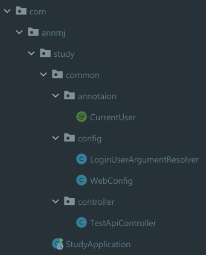
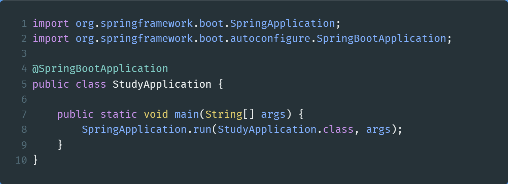
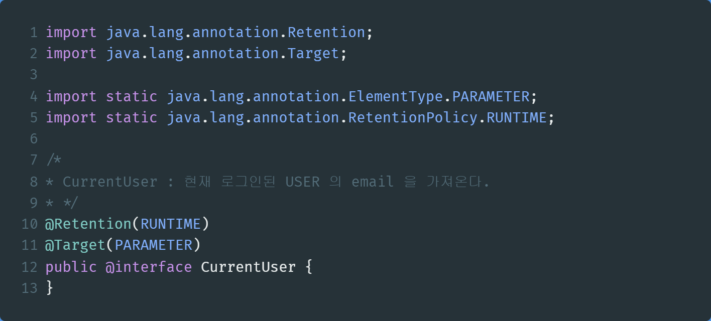
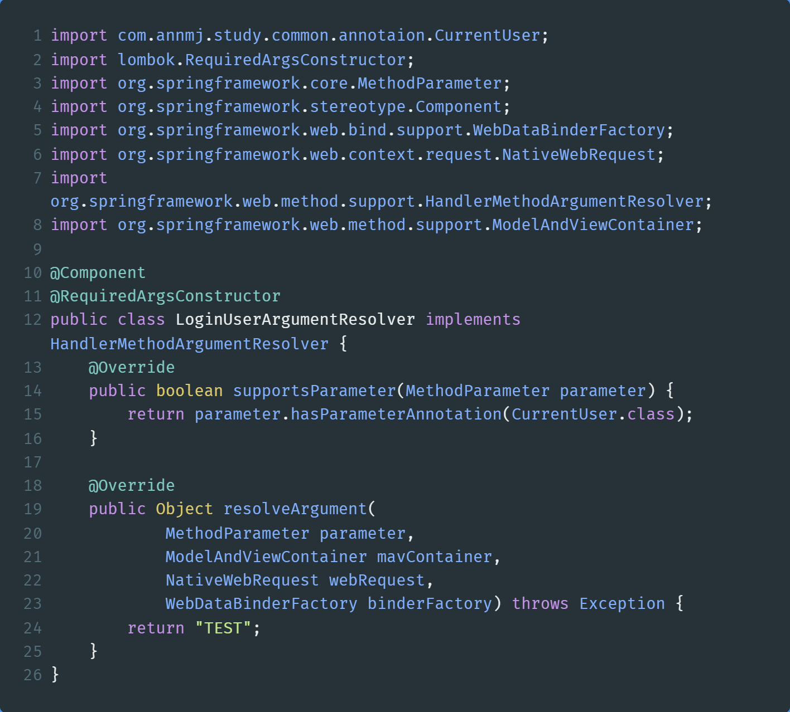
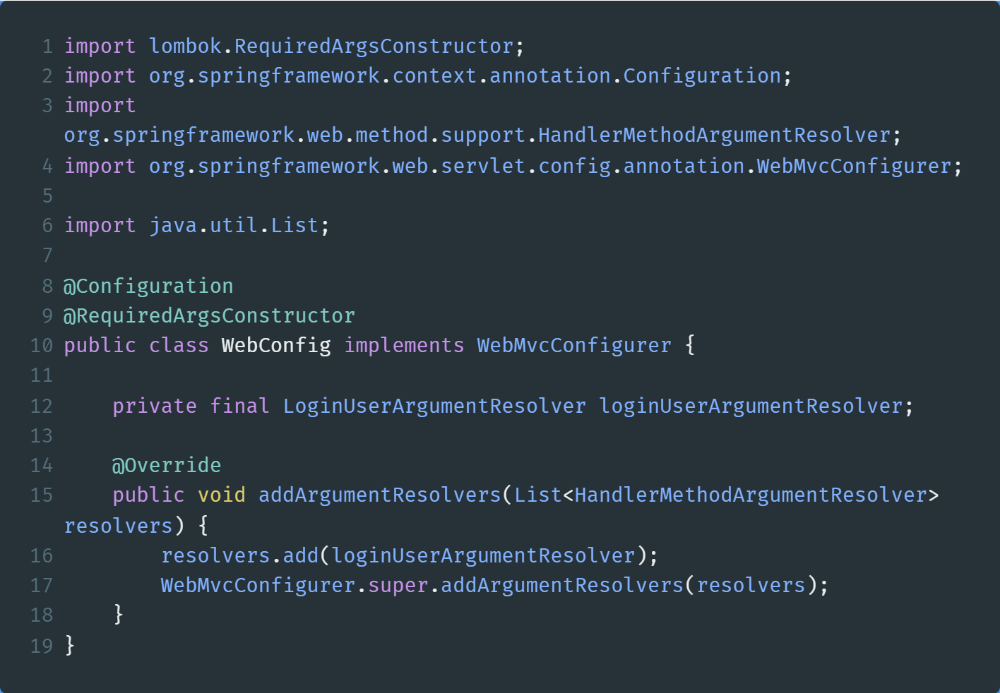
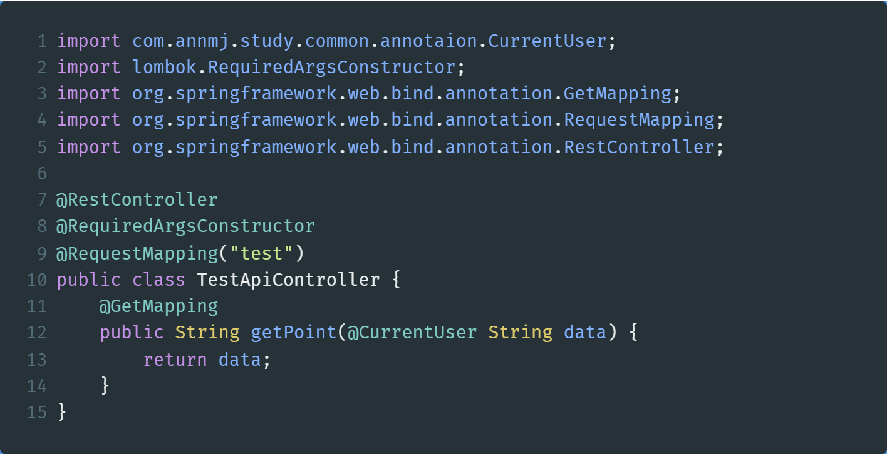

## HandlerMethodArgumentResolver

Strategy interface for resolving method parameters into argument values in the context of a given request.

- 주어진 요청을 처리할 때, 메서드 파라미터를 인자값들에 주입해주는 전략 인터페이스이다.
- 컨트롤러에 들어오는 파라미터를 가공해줄 때 사용한다.
- 줄여서, Argument Resolver 라고 부른다.
- 메서드 파라미터의 종류는 공식 문서를 참고 하자
    - 링크 : [https://docs.spring.io/spring-framework/docs/current/reference/html/web.html#mvc-ann-arguments](https://docs.spring.io/spring-framework/docs/current/reference/html/web.html#mvc-ann-arguments)

## Argument Resolver 의 동작 순서

### 1)Client Request

### 2)Dispatcher Servlet 에서 해당 요청을 처리

### 3)Client Request 에 대한 Handler Mapping

- RequestMapping 에 대한 매칭
- Interceptor 처리
- `Argument Resolver 처리`
- Message Converter 처리

### 4)Controller Method Invoke

## 구현해야 할 메서드

- resolveArgument : 공통작업 수행 후 실제로 바인딩 할 객체를 리턴한다.
- supportsParameter : parameter가 해당 resolver에 의해 수행될 수 있는 타입인지 true/false로 리턴. 이 메소드가 먼저 수행되고 true일 시 resolveArgument를 수행한다.

## 언제 사용하는가 ?

- 컨트롤러에 들어오는 파라미터를 커스텀할 때 사용할 수 있는 인터페이스이다.
- 클라이언트의 요청이 담긴 파라미터를 컨트롤러 보다 먼저 받아서 작업을 수행한다.

## 장점

- 여러 메서드에 공통적으로 수행해야 하는 작업을 수행함으로써 코드의 반복을 줄일 수 있다.
- 사용자 정보를 가져오는 로직에 대한 역할과 책임을 분리시켜, 명확하게 코드를 작성할 수 있다.

## 실습

### 프로젝트 구조

### StudyApplication.java

- 기본 스프링부트 실행과 동일

### CurrentUser.java

- 어노테이션에 대한 설명은 아래 링크를 참조하자.
    - [https://sanghye.tistory.com/39](https://sanghye.tistory.com/39)

### LoginUserArgumentResolver

- CurrentUser 어노테이션이 붙은 컨트롤러의 인자에 값을 넣어주기 전에, resolveArgument 함수를 실행한다. 여기서는 단순히,  “TEST” 라는 문자열만 리턴하게 해준다.
- 이렇게 해주면, CurrentUser 어노테이션이 붙은 인자가 “TEST” 로 변환된다.

### WebConfig

- WebMvcConfigurer 를 상속받아, addArgumentResolvers 라는 함수를 override 하여 argumentresolver 를 추가해주자.

### TestApiController

- /test 로 요청이 들어오게 되면, method argument 로 String data 를 받게 되는데, data 가 주입되기 이전에 argument resolver 가 작동하여 data 를 “TEST” 로 바꿔준다.
- [GET] /test API 의 응답값은 “TEST” 가 나온다.

## Reference

- [https://docs.spring.io/spring-framework/docs/current/javadoc-api/org/springframework/web/method/support/HandlerMethodArgumentResolver.html](https://docs.spring.io/spring-framework/docs/current/javadoc-api/org/springframework/web/method/support/HandlerMethodArgumentResolver.html)
- [https://a1010100z.tistory.com/127](https://a1010100z.tistory.com/127)
- [https://sanghye.tistory.com/41](https://sanghye.tistory.com/41)