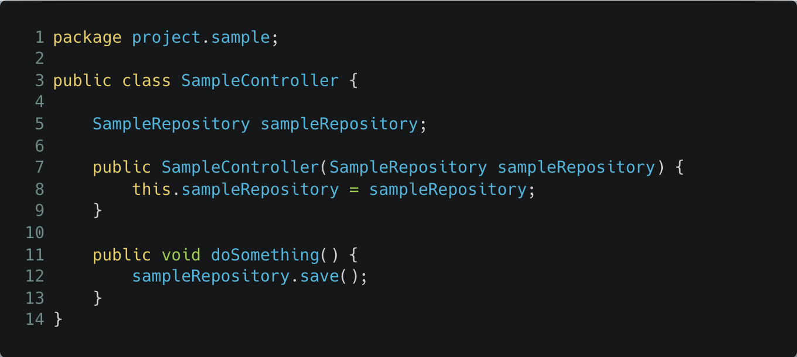
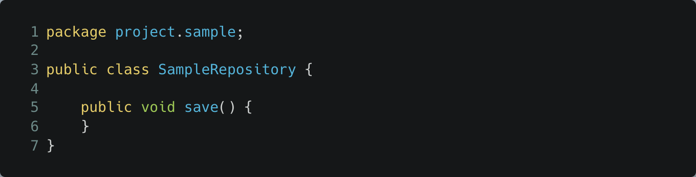
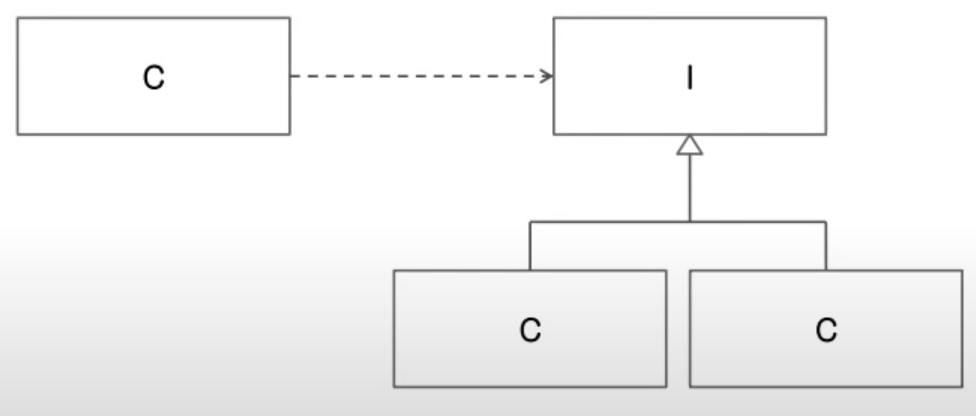
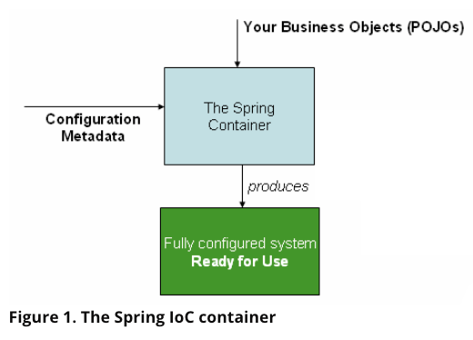
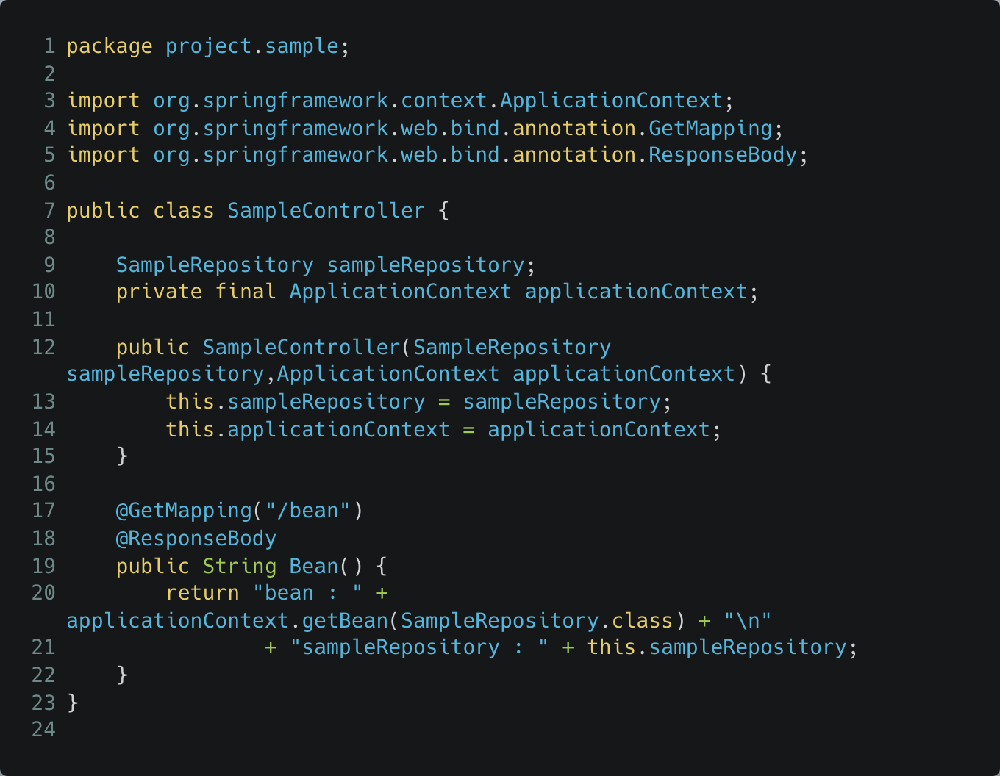
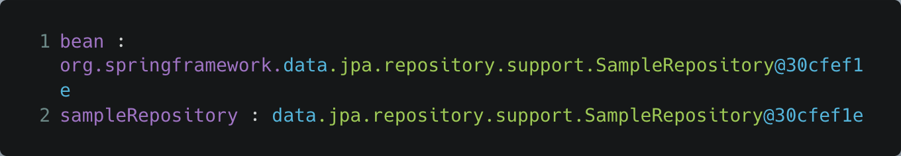
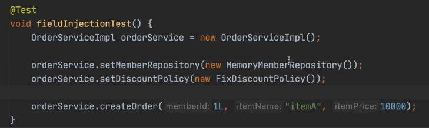

# IoC, DI?

- Ioc 는 DI 라고도 부른다.
- IoC 는 일종의 프로세스 인데, 객체와 다른 객체(함께 작동하는 객체, collaborators) 의 의존관계를 외부에서 주입받는 프로세스를 의미한다.
- 즉, 내가 사용할 의존성을 관리해주는 일을 외부에 맡기는 것을 의미한다.
    - 의존성은 무엇인가 ? 컴파일 타임이 아니라 런타임시에 결정/구성되는 오브젝트와 오브젝트 사이의 의존 관계를 말한다.
- 의존성을 외부에서 주입해주는 것을 의미한다. (주의 사항 : Bean 끼리만 주입을 한다.)
- IoC Container 가 Bean 을 생성할 때, 필요한 의존관계를 주입해준다.
    - 이 프로세스는 Bean 의 입장에선 근본적으로 뒤집힌 것이다.
    - 클래스를 인스턴스로 만들거나 특정 클래스의 생성자를 직접 호출하는 등의 이러한 제어들이 뒤집힌 것을 말한다.
    - 그래서 IoC 라는 이름을 갖게 되었다.
- 각 Bean 들의 의존관계는 어떻게 설정 될까?
    - IoC Container 가 해준다.
- 장점 : 모듈간의 의존성을 낮출 수 있다. 여러가지 구현체들 간의 변경이 쉽다. 일일이 의존관계를 변경해주는 번거로움이 없기 때문이다.

## 예시 1

`SampleControlle.class`

- line 7 : SampleController 는 SampleRepository 타입의 인스턴스를 사용하고 있다. 
그럼, 이 SampleRepository 타입의 인스턴스를 누가 주입해주나? 스프링에서는 IoC Container 가 이 타입의 빈을 찾아서 주입을 해준다.

`SampleRepository.class`

## 참고) 클라이언트의 재사용성을 강화하기 위한 방법

- 구현 인터페이스 대신 인터페이스를 사용한다.
    - 구체 클래스에 대한 의존 관계를 제거하기 위함
- 오브젝트 합성을 사용한다.
    
    

    
    - 인터페이스 사용
    - 상속의 대안으로 재사용성을 확보하기 위한 방법 중 하나
        - 클라이언트의 재사용에 대한 관점에서는 오브젝트 합성이 중요하다.
    - 새롭고 복잡한 기능을 얻기 위해서 오브젝트를 조합,합성한다.
    - 런타임시에 다른 오브젝트에 대한 레퍼런스를 획득한다.
    - 각 클래스가 캡슐화되고 자신의 역할에 충실하게 도와준다.

---

# Spring IoC Container?

- 역할 : **빈(bean)을 등록하고,** 연결(Collaborators)해주는 기능을 제공해준다.
    - 기능 1 : **의존성 주입** : 관계를 연결한다는 것은 의존성 주입을 의미한다. 하지만, 모든 클래스를 다 연결해주지 않고, Spring IoC Container 안에 등록된 빈들끼리만 서로 주입해준다.
        - **How ?** configuration 메타 데이터를 읽은 다음, 객체의 의존관계를 설정한다. 즉, 인스턴스화하고, 설정하고, 조립한다.
            - Configuration 메타 데이터는 XML 로 작성하는 것이 Spring 초기부터 기본이었지만, 요즘은 XML 을 최소한으로 사용하고, Java 애노테이션이나 Java 코드를 사용해서 설정하는 것을 많이 사용한다.
            - 애노테이션 기반 configuration: Spring 2.5 부터 지원
            - Java 코드 기반 configuration: Spring 3.0 부터 지원
            - `@Configuration`, `@Bean`, `@Import`, `@DependsOn` 애노테이션 참고
    
    

    
    위의 그림처럼, IoC Container(ApplicationContext) 가 Configuration 정보를 읽어서 사용한다.
    
    - 기능 2 : **빈 조회** : IoC Container 의존관계가 주입된 여러 빈들을 조회하는 기능도 제공한다.

<aside>
💡 그림 설명
1) 애플리케이션 클래스들은 configuration 메타 데이터에 정의된 대로 조합된다.
2) ApplicationContext가 생성되고 초기화 되면, 설정이 완전히 반영된 실행 가능한 애플리케이션을 갖는 상태가 된다.

</aside>

- 장점 : 멀티스레드 환경에서 IoC Container 에 등록된 빈을 사용한다면 싱글톤 스코프를 쉽게 구현할 수 있다.
    - IoC Container 에 등록된 빈을 사용하면, 항상 같은 객체가 조회되기 때문이다. (예시 2 참고)
- IoC Container 는 BeanFactory 인터페이스를 의미한다.
- 이를 BeanFactory 인터페이스를 구현한 `org.springframework.context.ApplicationContext` 인터페이스가 실제 IoC Container 이다. 우리는 ApplicationContext를 가져와서 사용할 수도 있지만, 실제로 직접 사용할 일은 드물다. IoC Container 가 알아서 주입을 해주기 때문이다.
- 이외에도 ApplicationContext는 다양한 일을 한다.
    - 참고 : [https://bit.ly/3vq5YRd](https://bit.ly/3vq5YRd)

## 예시 2

우리가 직접 Bean을 가져온 객체와 주입된 객체가 다르지는 않을까?

혹시 모르니 ApplicationContext 에서 조회한 빈과, 주입받은 sampleRespository 객체가 동일한 객체인지 확인해보자.

### 결과

두 값은 동일하다는 것을 알 수 있다. 즉, 두 개의 객체는 모두 같은 인스턴스이다. (이런 객체를 싱글톤 스코프의 객체라고 부른다.)

두 개의 객체는 모두 같은 인스턴스이기 때문에, 우리는 IoC Container 로부터 주입받은 객체를 사용하기만 하면 된다. 따라서, 실제로 직접 ApplicaionContext 를 사용할 일은 드물다고 볼 수 있다.

# DI 종류와 차이점

### 생성자 주입

- Spring으로 개발하실 때 어떠한 DI 방식을 사용하시나요? **주로, 생성자 주입을 사용한다**.
- 사용하는 이유는 무엇이 있는 것일까요?
    - **생성자 호출 시점에 딱 한번만 호출되는 것이 보장된다.** (별도의 setter 를 통해 의존관계를 변경시키지 않는다면)
    - 공연을 하는 도중에 배우를 바꾸지 않기로 딱 정하는 것.
    - **장점 : 불변, 필수 의존관계에 사용하면 된다.**
- 특징
    - 빈 등록 시점에 무조건 생성자가 호출되니까, 빈 등록 시점에 주입된다.
    - 스프링 빈으로 등록되고, 생성자가 딱 1개만 있으면 `@Autowired` 생략이 가능하다.
- Autowired 는 스프링 컨테이너에 빈으로 등록되어 있어야 한다. 그렇기 때문에 임의로 new 해서 생성한 객체들은 당연히 주입이 안됨. 
(주입 안되는 경우 : DI 프레임워크나 스프링 없이 자바로 순수하게 테스트할 때)
- (Field 주입과 대비하여) 생성자 주입은 빈 생성 때 사용되는 리플랙션 외에 추가적인 리플랙션을 진행하나요?

### setter 주입

- 선택적인 주입이 가능하기 때문에, 빈으로 등록되어있지 않은 클래스도 주입이 가능하다.
    - 주의 사항 : Autowired 의 기본 동작에서, 주입할 대상이 없다면 오류가 발생한다. 오류를 발생시키지 않게 하기 위해 아래와 같은 코드를 사용한다.
        - 참고 :  `@Autowired(required = false)`
- 즉, 의존관계를 바꾸고 싶은 경우(데이터베이스 커넥션을 교체하는 등) 사용한다.

### 필드 주입

- Field Injection를 왜 사용하면 안된다고 하는 것인가요? 사용할 때 어떠한 단점이 있을까요?
    - 스프링을 실행하지 않고, 순수 자바로만 테스트를 하려면, 해당 객체 내에 있는 필드에 필요한 의존관계를 외부에서 주입할 방법이 없어 결국 setter 나 생성자를 추가해줘야 하는 번거로움이 생긴다.
- 안티 패턴이다.
- 사용 가능한 경우
    - **Configuration 어노테이션이 붙은 config 클래스** : 이 클래스는 스프링 에서만 사용될 것이기 때문에 필드 주입을 사용할 수도 있는데, 빈을 수동으로 등록하는 경우에 사용할 수 있겠다. 근데 이것도 권장하지는 않는다. (인텔리제이에서도 경고를 발생시킨다.)
    - **테스트 상황에서 쓰자** : 어플리케이션 테스트할 때에만 사용되는 필드에 Autowired 를 사용할 수도 있다.
    - 하지만, 테스트를 할 때, **생성자나 setter 가 없다면** 외부에서 주입할 방법이 없어서 순수 자바로는 기능들을 테스트 하기가 힘들다.
    - 테스트를 하려면, 결국 setter 나 생성자를 추가해줘야 하는 번거로움이 생긴다.

### 일반 메서드 주입

- 일반 메서드(ex. init()) 메서드를 통해서 주입 받을 수 있는 방법이다.
- 여러 개의 필드를 한번에 주입할 수 있다.
- 일반적으로 잘 사용하지 않는다.
    - 이유 : 생성자 주입이나 setter 주입을 통해 다 해결할 수 있기 때문이다.
- 일단, 개념적으로 메서드를 통해 주입한다는 것에서는 setter 주입과 동일하다.

## REFERENCE

- [https://bit.ly/340eZVE](https://bit.ly/340eZVE)
- [https://bit.ly/3C3F4jt](https://bit.ly/3C3F4jt)
