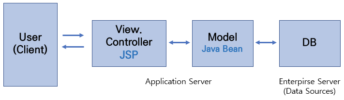
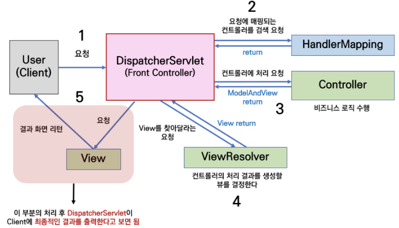

## MVC는 무엇인가요 ?

- Model , View, Controller 로 역할별로 분리하여, `각 역할별로 확장에 열려있고, 변화에 닫혀있게` 하기 위해 구현할 수 있습니다.
- Model : 뷰에 출력할 데이터를 담아두는 공간입니다. 그래서 뷰는 내부에 데이터들이 어떻게 구성되었는지 신경쓰지 않고, 화면 렌더링에 집중할 수 있게 됩니다.
- Controller : HTTP 요청을 받아, 비즈니스 로직을 실행합니다. 뷰에 전달할 데이터를 DB에서 조회하여 모델에 담습니다.
- View : 모델을 이용하여 화면을 그리며, 실제로 HTML 을 생성하는 역할을 합니다.

## MVC 1 란 ?

- 모든 클라이언트 요청과 응답을 JSP가 담당한다.
- JSP가 Controller 와 View 의 기능을 모두 담당하는 구조이다.
- 장점 : 단순해서 작은 프로젝트에서 사용될 수 있다.
- 단점 : 웹이 복잡해질수록 유지보수가 힘들어진다.

## MVC 2 란?

- 우리가 일반적으로 이야기하는 MVC 는 MVC2 모델을 의미한다.
- 장점 : 유지 보수 및 확장성이 뛰어나다.
- MVC 1 과의 차이점은 ?
    - 요청의 진입을 누가 처리하냐의 차이
        - MVC 1 에서는 JSP 에서 요청진입을 처리
        - MVC 2 에서는 Controller 역할을 하는 Servlet 이 요청의 진입을 처리함.
    - Controller 와 View 가 분리되었는지의 차이
        - MVC 1 에서는 Controller + View 통합
        - MVC 2 에서는 Controller , View 분리
- 구조

- 위의 그림에서 Java Beans 는 자바코드로 작성된 클래스(컴포넌트)들을 의미한다. 이런 클래스들 중에서 Java Beans Convention 에 맞게 작성된 클래스들은 JSP에서 사용이 가능하다. JSP 에서 데이터를 담기위해 사용하는 자바 클래스라고 생각하면 된다.

## 스프링에서 HTTP 요청이 들어왔을 때의 흐름

## Reference

- [https://docs.spring.io/spring-framework/docs/3.2.x/spring-framework-reference/html/mvc.html](https://docs.spring.io/spring-framework/docs/3.2.x/spring-framework-reference/html/mvc.html)
- [https://github.com/im-d-team/Dev-Docs/blob/master/Design_Pattern/MVC1, MVC2.md](https://github.com/im-d-team/Dev-Docs/blob/master/Design_Pattern/MVC1,%20MVC2.md)
- [https://chanhuiseok.github.io/posts/spring-3/](https://chanhuiseok.github.io/posts/spring-3/)