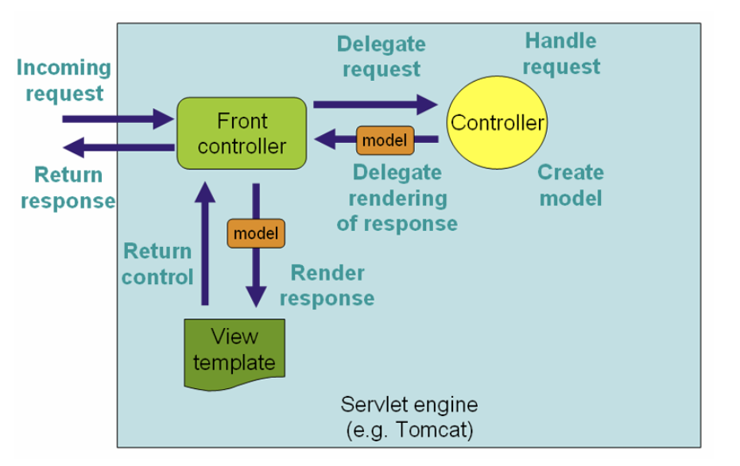
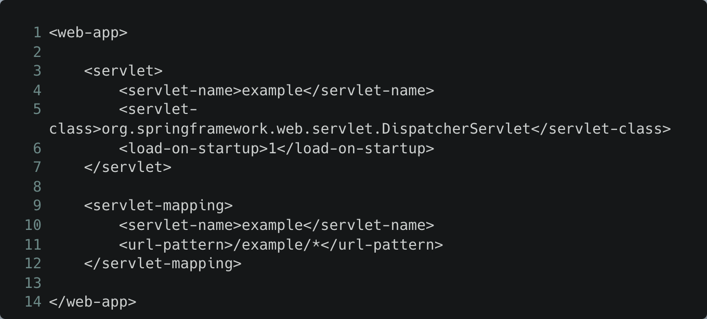
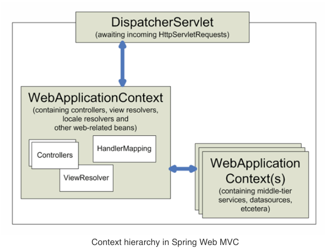

## 기본 지식
- MVC 를 알기전에 알아두면 도움이 되는 서블릿에 대한 개념부터 학습하자.

### WAS 에서 하는 업무들

- 서버 TCP , IP **연결** 대기, 소켓 연결
- HTTP 요청 메시지를 파싱해서 읽기
- POST 방식 , /save URL 등을 인지
- Content - Type 확인
- HTTP 메시지 바디 내용 파싱
- 저장 프로세스 실행
- **비즈니스 프로세스 실행**
    - **비즈니스 로직 실행 (중요)**
    - **DB에 저장 요청 (중요)**
- HTTP 응답 메시지 생성
    - HTTP 시작 라인, 헤더, 메시지 바디 등 생성
- TCP , IP 에 응답 전달, 소켓 종료

### 서블릿의 역할
- 서블릿은 컨트롤러에게 요청을 전달하고, 웹 개발에 필요한 부가 기능들을 제공한다.
- **비즈니스 프로세스**를 제외하고, WAS에서 하는 기본적인 요청,응답 제어에 관련한 처리를 해준다.

### 특징

- 서블릿 코드는 어떻게 실행되나요 ?
    - A : 특정 urlPatterns( 예 : “/hello” ) 의 URL 이 호출되면 서블릿 내에 작성해 놓은 코드가 실행된다.
- HttpServletRequest : HTTP 요청 정보를 편리하게 사용
- HttpServletResponse : HTTP 응답 정보를 편리하게 사용
- HTTP 요청이 들어오면, WAS는 Request, Response 객체를 새로 만들어서 → 서블릿 객체를 호출한다.
- 개발자는 HttpServletRequest , HttpServletResponse 를 사용해서 편리하게 개발이 가능해진다.
- 이후, HTTP 응답을 하기 위해서 , WAS가 Response 객체에 담겨있는 내용을 이용하여 HTTP 응답 정보를 생성한다.

### 서블릿 컨테이너

- 의미 : **톰캣처럼 서블릿을 지원하는 WAS** 를 서블릿 컨테이너라고 한다.
- 역할 : 서블릿 컨테이너는 서블릿 객체를 자동으로 생성 , 호출해준다. 그리고, WAS 가 종료될 때 서블릿 객체를 종료 시켜준다. 즉, 라이프 사이클을 관리해준다.
- 서블릿 객체는 **싱글톤**으로 관리가 된다.
    - 고객의 요청이 올 때 마다 계속 객체를 생성하는 것은 의미가 없고, 비효율적이다.
    - 단, request , response 객체는 유저의 요청마다 다 다르기 때문에, 항상 생성된다.
    - 하지만, 서블릿은 요청마다 새로 생성할 필요가 없음.
    - 최초 로딩 시점에 서블릿 객체를 미리 만들어두고 재활용 합니다.
    - 모든 고객 요청은 같은 서블릿 객체 인스턴스에 접근한다.
    - 이게 제일 주의해야 하는 것: **공유 변수, 상태**를 관리하지 않도록 주의해야 한다. 서블릿 , 스프링 빈은 주의해서 사용하자.
- 동시 요청을 위한 멀티 쓰레드 처리를 지원해준다.
- 그래서, 개발자는 멀티 쓰레드 관련 코드들을 신경쓰지 않아도 된다.

### 서블릿 객체를 호출하는 실체

- 실체는 바로 쓰레드이다.
- 쓰레드는 프로그램 안에서, 애플리케이션 코드를 하나하나 실행한다.
- 쓰레드는 한번에 하나의 코드 라인만 수행한다.
- 장점 : 동시 처리가 필요하면, 쓰레드를 추가로 생성하게 된다.
- 단점
    - 쓰레드 생성 비용이 비싸다고 한다.
    - 쓰레드를 생성하면, 응답 속도가 늦어진다. 쓰레드는 컨텍스트 스위칭 비용이 발생한다. (CPU 코어 수만큼 동시 수행이 가능한데, 그 이상은 쓰레드를 서로 전환해야 한다.)
    - 쓰레드 생성에 제한이 없다.
        - 고객 요청이 너무 많이 오면, CPU , 메모리 임계점을 넘어서 서버가 죽을 수 있다.
- 이러한 단점을 극복하기 위해, WAS 에서는 쓰레드 풀을 사용한다. 만약 쓰레드 풀의 한계보다 많은 요청이 들어오게 되면 → 나머지 요청들을 쓰레드 풀에 쓰레드가 없기 때문에 요청들은 대기 상태거나, 거절되기도 한다. 설정할 수 있다. (톰캣은 기본으로 200개 정도로 설정되어 있음.)
- 쓰레드 풀을 사용하게 되면 장점 : 쓰레드가 미리 생성되어서 비용 및 응답 시간이 개선된다. 생성 가능한 쓰레드 최대치가 있으므로 많은 요청이 들어오더라도 기존의 요청들은 안전하게 처리가 가능하다.

### DispatcherServlet
- Spring's DispatcherServlet does more than just Servlet. It is completely integrated with the Spring IoC container and as such allows you to use every other feature that Spring has.
- `DispatcherServlet`는 FrontController 디자인 패턴으로 구현되어 있다.
  - FrontController 패턴이 뭔가요 ?
    - 각 클라이언트들은 프론트 컨트롤러에게 요청을 한다.
    - 프론트 컨트롤러는 각각의 요청에 맞는 컨트롤러를 찾아서 호출하는 공통적인 역할을 한다.
    - 그래서, **프론트 컨트롤러 외에 다른 컨트롤러 들은 서블릿을 사용하지 않아도 된다.**
- 아래는, Spring Web MVC 의 request workflow 이다.
  - Spring MVC 에서는 FrontController 의 역할을 DispatcherServlet 이 담당한다고 생각하면 된다.
    
  
- DispatcherServlet 은 실제로 Servlet (HttpServlet 클래스) 를 상속받은 클래스이다. 이는 web.xml 에 선언되어 있다. 그리고, DispatcherServlet이 요청을 처리하기 위한 URL 매핑도 들어간다. 
- 아래는 web.xml 의 예시이다.
  
  - /example 로 시작하는 모든 요청은 DispatcherServlet이 처리하도록 하고,  이 때, DispatcherServlet의 이름은 example 이다.
  - Servlet 3.0 이후 버전에서는 위의 web.xml 과 동일하게 코드레벨에서 설정을 할 수 있다. 아래 코드와 같이 말이다.
    
- Web MVC 프레임워크에서는 DispatcherServlet는 자체적인 WebApplicationContext 를 가지고 있다.  WebApplicationContext 안에는 빈들이 들어있다. 이 빈들은 서블릿 범위 (지역) 내에서 재정의를 할 수 있고, 새로운 빈을 정의할 수도 있다. 추가로, WebApplicationContext 는 ApplicationContext 을 확장한 것이다.
    
  
